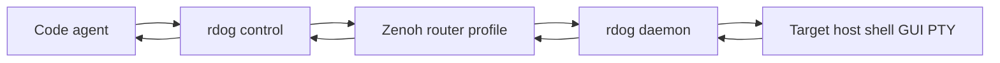

<div align="center">
      <h1>rustdog - remote control plane, PTY, and reverse shell</h1>
</div>


## What is Rustdog

Rustdog is a cross-platform remote control tool for Linux, macOS, and Windows.

It still supports the original port listener and reverse shell workflows, but the current project has grown into a line-based control plane for humans and code agents:

- traditional TCP listen / connect shell workflows
- long-running daemon mode with TOML + environment configuration
- `rdog control` for explicit line-control commands over TCP, WebSocket, or Zenoh
- Zenoh target-name discovery for LAN and reachable remote networks
- real remote PTY sessions for TUI programs such as `codex`, `vim`, shells, and REPLs
- GUI-oriented actions such as `@key`, `@paste`, `@screenshot`, `@click`, `@drag`, and `@wheel`
- structured responses that are easy for a code agent to parse


## Rename and compatibility

The primary package name is now `rustdog`, and the primary binary is now `rdog`.

For upgrade compatibility, `rdog` still accepts these legacy `rcat` inputs as fallback:

- `rcat.toml`
- `rcat_*.toml`
- `RCAT_` environment variables
- legacy Zenoh `rcat/...` keyexpr roots
- legacy `__rcat_session_*` session bootstrap payloads

New deployments should use `rdog_*` config files, `RDOG_` environment variables, and `rdog/...` Zenoh keyexprs.

## Modes

| Mode | Command | Use it when |
| --- | --- | --- |
| Listen shell | `rdog listen ...` | You want a simple inbound TCP shell listener. |
| Reverse shell | `rdog connect ...` | You want a local shell exposed back to a controller. |
| Daemon | `rdog daemon ...` | You want long-running config-driven behavior. |
| Hidden daemon | `rdog hidden-daemon ...` | You want a Windows-only hidden resident daemon process. |
| Control client | `rdog control ...` | You want line-control, PTY, screenshot, key/paste, or Zenoh target-name control. |

## Install

From the new GitHub repository:

```bash
cargo install --git https://github.com/raiscui/rustdog --locked
```

From AUR on Arch-based systems:

```bash
yay -S rustdog
```

Portable release binaries will be published under:

```text
https://github.com/raiscui/rustdog/releases
```

## Quick start

### Traditional listen / reverse shell

Listen on a port:

```bash
rdog listen -ib 55600
```

Expose a reverse shell back to a controller:

```bash
rdog connect -s bash the.0.0.ip 55600
```

Reverse shell from Windows:

```bash
rdog connect -s cmd.exe the.0.0.ip 55600
```

### Generate daemon configs

```bash
rdog config init
```

This creates platform-specific templates in the current directory:

- `rdog_win.toml`
- `rdog_macos.toml`
- `rdog_linux.toml`

Overwrite existing templates when needed:

```bash
rdog config init --force
```

Start the daemon with the platform default config:

```bash
rdog daemon
```

Or use an explicit config path:

```bash
rdog daemon --config ./rdog_macos.toml
```

### TCP control lane

A TCP control endpoint executes explicit line-control commands on the receiver host.

```toml
[inbound]
enabled = true
host = "127.0.0.1"
port = 5555
shell = "/bin/bash"
mode = "control"
transport = "tcp"
```

Connect to it:

```bash
rdog control 127.0.0.1 5555
```

Send commands from a script or another agent:

```bash
printf '@ping\n@cmd#1:"pwd"\n@cmd#2:"git status --short"\n' | rdog control 127.0.0.1 5555
```

### Zenoh target-name control

With a Zenoh daemon profile, a code agent does not need to remember host/port pairs for normal LAN use.
It can address the target daemon by name:

```bash
rdog daemon --config ./rdog_macos.toml
rdog control mac.lab
```

`rdog control mac.lab` is shorthand for a Zenoh control client using `--target-name mac.lab`.
If multicast scouting is unavailable or the target is across a reachable remote network, add an entry point:

```bash
rdog control mac.lab --entry-point tcp/192.168.1.20:17447
```

### Remote PTY / TUI

Use PTY when you need a real terminal session, terminal resize, `Ctrl-C`, `Ctrl-D`, shell state, or a TUI application:

```bash
rdog control mac.lab --pty -- codex
rdog control mac.lab --pty -- /bin/bash
rdog control mac.lab --pty -- vim README.md
```

Detach without killing the remote process:

```bash
rdog control mac.lab --pty-detach <SESSION_ID>
```

Reattach later:

```bash
rdog control mac.lab --pty-attach <SESSION_ID>
```

Force close a PTY session:

```bash
rdog control mac.lab --pty-close <SESSION_ID>
```

## Control plane at a glance



`rdog control` is not just a shell prompt.
It is a stdio-friendly bridge from an operator or code agent into a remote control lane.

The usual shape is:

1. The code agent writes line-control commands to `rdog control` stdin.
2. `rdog control` sends those commands over TCP, WebSocket, or Zenoh session channels.
3. The daemon executes the command on the target host.
4. The daemon returns protocol frames such as `@response`, `@savefile`, or `@pty-*`.
5. The code agent parses stdout and decides the next action.

## Control commands

| Capability | Example | Response shape | Use case |
| --- | --- | --- | --- |
| Ping | `@ping` | `@response "pong"` | Health check |
| Bootstrap | `@bootstrap#1:{mode:"gui",capability_policy:"fresh"}` | `rdog.bootstrap.v1` structured `@response` + optional observe `@savefile` frames | One read-only GUI preflight: liveness, capabilities, observation, lane errors, and trace |
| Capabilities | `@capabilities#1` | `rdog.capabilities.v1` structured `@response` | Choose a GUI / permission / platform lane before acting |
| One-shot command | `@cmd#1:"pwd"` | `@response {"id":1,"value":"..."}` | Scripted automation |
| Bare shell line | `pwd` | `@response "..."` | Human-friendly one-shot shell command |
| Observe | `@observe#2:{mode:"hybrid",include_screenshot:true,include_ax:true,include_windows:true}` | `rdog.observe.v1` bundle + optional `@savefile` frames | Read visual / AX / window state plus observation refs and selector hints |
| Screenshot | `@screenshot#7` | image `@savefile` + manifest `@savefile` + `@response ...screenshot-bundle...` | Remote visual evidence |
| Selector inspect / re-find | `@selector-get#20:{selector_id:"sel-v1-..."}` / `@selector-refind#21:{selector_id:"sel-v1-...",policy:"safe"}` | structured selector `@response` | Recover from stale refs without reviving old `@eN` refs |
| Save file | `@savefile:{...}` | local file in `./rdog_downloads/` | Transfer generated artifacts |
| Key input | `@key:"F11"` | `@response 0` or permission error | GUI shortcut / desktop control |
| Paste text | `@paste:"hello"` | `@response 0` or permission error | Text injection into focused UI |
| Mouse move | `@mouse-move#8:{target:{ref:"@e9",observation_id:"obs-..."}}` or `{x:1200,y:540}` | structured mouse `@response` or permission error | Move by latest observation ref; raw coordinates are fallback |
| Mouse button | `@mouse-button#9:{button:"left",mode:"press"}` | structured mouse `@response` or permission error | Press, release, or click a mouse button |
| Click / drag / wheel | `@click#10:{target:{ref:"@e4",observation_id:"obs-..."}}` or `{x:1200,y:540}` | structured mouse `@response` or permission error | Mouse fallback after semantic action/ref/selector workflow |
| PTY | `@pty:"codex"` | `@pty-ready`, `@pty-output`, `@pty-exit` | TUI / shell / REPL |
| PTY detach | `@pty-detach:{session_id:"..."}` | `@pty-detached ...` | Keep remote PTY running |
| PTY attach | `@pty-attach:{session_id:"..."}` | `@pty-attached ...` | Reclaim remote PTY |
| PTY close | `@pty-close:{session_id:"..."}` | `@pty-closed ...` | Terminate remote PTY |

Important behavior:

- Only a full line that starts with `@` is treated as a control command.
- `@@...` escapes to a literal shell line that begins with `@`.
- Explicit request ids are supported, for example `@cmd#42:"printf READY"`.
- Successful request-id responses are wrapped as `@response {"id":42,"value":...}`.
- Request-id errors are wrapped as `@response {"id":42,"code":64,"error":"..."}`.
- Bare shell lines and `@cmd` are one-shot command execution. Do not rely on `cd`, shell variables, or cwd changes persisting across requests.
- If you need shell state, use `rdog control TARGET --pty -- /bin/bash` or another PTY session.
- Bare `@screenshot` defaults to all active displays: `display:"all", layout:"composite", coordinate_space:"os-logical"`.
- `@screenshot:{display:"primary",layout:"single"}` is the explicit compatibility path for a single primary-display JPEG.
- Default screenshot results are a bundle: one virtual-desktop JPEG `@savefile`, one manifest JSON `@savefile`, then a final `@response` whose value has `kind:"screenshot-bundle"`.
- The manifest is the coordinate source of truth. For the default logical composite, `os_x = image_x + virtual_bounds.x` and `os_y = image_y + virtual_bounds.y`.
- `@observe` is read-only. It returns a `rdog.observe.v1` bundle with `visual`, `accessibility`, `windows`, `refs`, `selectors`, and `recovery` sections.
- `@observe mode:"hybrid"` does not merge all refs into one namespace. Use each `refs.sample[]` item with its own `section`, `observation_id`, and `ref`.
- Short refs such as `@e4` are observation-scoped. A stale or expired ref must be recovered by re-observing or by `@selector-get -> @selector-refind -> verify_hint`; never treat the old short ref as revived.
- Mouse is a fallback lane. Prefer semantic AX/window commands first, then observation refs such as `target:{ref:"@e4",observation_id:"obs-..."}`, then raw coordinates.
- Absolute coordinate mouse commands use that same `coordinate_space:"os-logical"` contract and report `target_resolution.source:"coordinate_fallback"`.
  Do not invent a second screen coordinate model for `@click`, `@drag`, or positioned `@wheel`.
- Selector mouse targets are gated. `auto_refind:false` returns no-action handoff; `auto_refind:true` can execute only after typed selector re-find rebounds and verifies a fresh rect.
- `@mouse-button mode:"press"` intentionally leaves the button pressed.
  Send a matching `@mouse-button:{button:"left",mode:"release"}` when recovering from interrupted raw press flows.
- `@screenshot` saves file-style results through `@savefile`; the CLI stores them under `./rdog_downloads/` instead of dumping base64 to the terminal.
- `@bootstrap` is read-only. Use `mode:"gui"` for the first GUI preflight on new daemons. It combines liveness, capabilities, and optional `@observe` output without pressing controls or moving the mouse.
- `@bootstrap capability_policy:"cached"` is reserved and currently returns `BOOTSTRAP_CAPABILITY_CACHE_UNIMPLEMENTED`; use `capability_policy:"fresh"`.
- If a daemon does not support `@bootstrap`, fall back to one session containing `@ping`, `@capabilities`, and `@observe`.
- In a real TTY, `rdog control` renders simple `@response` values for humans.
- In pipe/redirect mode, `rdog control` keeps raw protocol lines for programs.

For the formal protocol, see [`specs/control-line-protocol.md`](./specs/control-line-protocol.md).

For the PTY lifecycle, detach / attach, and resize rules, see [`specs/pty-control-plan.md`](./specs/pty-control-plan.md).

## Code agent workflow

For code agents, prefer this decision tree:

1. Need a quick deterministic command? Use `@cmd#id:"..."` or a bare shell line.
2. Need response correlation? Use request ids such as `@cmd#7:"..."`.
3. Starting a fresh GUI task? Prefer `@bootstrap#id:{mode:"gui",capability_policy:"fresh"}`. On older daemons, fall back to `@ping`, `@capabilities`, and `@observe` in one session.
4. Need visual evidence, refs, or coordinates after bootstrap? Prefer `@observe#id:{mode:"hybrid",include_screenshot:true,include_ax:true,include_windows:true}`; use `@screenshot#id` when you only need pixels and manifest.
5. Need GUI or desktop side effects? Prefer semantic AX/window commands, use mouse by observation ref when semantics are unavailable, and keep raw coordinate mouse as fallback.
6. Need real terminal behavior or persistent shell state? Use `--pty`.
7. Need multiple hosts? Address them by stable daemon names such as `mac.lab`, `win11.lab`, or `linux-build.lab`.
8. Need direct SDK integration? Use the Zenoh session channel model documented in [`specs/zenoh-sdk-integration-playbook.md`](./specs/zenoh-sdk-integration-playbook.md).

Minimal scriptable smoke:

```bash
rdog control mac.lab <<'RDOG'
@ping
@cmd#1:"pwd"
@cmd#2:"git status --short"
@screenshot#3
@mouse-move#4:{dx:0,dy:0,coordinate_space:"relative"}
RDOG
```

After a screenshot smoke, parse both saved files.
The JPEG is the visual evidence.
The manifest JSON tells a code agent how screenshot pixels map to OS mouse coordinates.

For a full agent-facing guide, see [`specs/code-agent-rdog-control-usage.md`](./specs/code-agent-rdog-control-usage.md).

## Daemon Mode

`daemon` mode is meant for long-running, unattended sessions.
It builds configuration from layered sources in this order:

1. Built-in defaults
2. A TOML file:
   - `rdog_win.toml` on Windows, if you do not pass `--config`
   - `rdog_macos.toml` on macOS, if you do not pass `--config`
   - `rdog_linux.toml` on Linux and other non-macOS Unix platforms, if you do not pass `--config`
   - the file passed through `--config <path>`, if you do
3. Environment variables prefixed with `RDOG_`
4. Legacy fallback providers prefixed with `RCAT_`, only when no newer `RDOG_` value is present

Example TCP daemon config:

```toml
[daemon]
retry_seconds = 5

[outbound]
enabled = true
host = "127.0.0.1"
port = 4444
shell = "/bin/bash"
mode = "interactive"

[inbound]
enabled = true
host = "0.0.0.0"
port = 5555
shell = "/bin/bash"
mode = "control"
transport = "tcp"
```

Choose the `shell` value for your platform:

- Linux: `/bin/bash` or `/bin/sh`
- macOS: `/bin/zsh` or `/bin/bash`
- Windows: `powershell.exe` or `cmd.exe`

Environment variables can override nested keys with `__`:

```bash
export RDOG_OUTBOUND__PORT=5555
export RDOG_DAEMON__RETRY_SECONDS=2
export RDOG_INBOUND__MODE=control
```

The bundled Windows template `rdog_win.toml` defaults inbound to:

- `enabled = true`
- `host = "0.0.0.0"`
- `mode = "control"`

That makes it immediately usable as a control receiver, but it also means you should review network exposure before starting the daemon.

Behavior summary:

- Outbound worker connects immediately on startup.
- If outbound connect or session handling fails, it waits `retry_seconds` and tries again.
- Inbound worker binds the configured local port and keeps accepting sessions.
- A single failed inbound session does not terminate the daemon process.

Endpoint mode summary:

- `interactive`: default shell session mode.
- `control`: explicit line-control receiver mode.

## WebSocket control endpoint

Phase 1 WebSocket control is available for control endpoints:

```toml
[inbound]
enabled = true
host = "127.0.0.1"
port = 5555
shell = "/bin/bash"
mode = "control"
transport = "websocket"
```

Connect with:

```bash
rdog control --url ws://127.0.0.1:5555/control
```

Notes:

- WebSocket control sessions accept text messages.
- The first non-empty text message locks the session mode:
  - starts with `{` -> JSON agent mode
  - otherwise -> line-control mode
- `transport = "websocket"` is supported together with `inbound.mode = "control"`.

## Windows hidden resident mode

`hidden-daemon` is an extra Windows-only entry.
It does not replace normal `daemon` behavior.

Use it when you want:

- manual start
- hidden background residency after startup
- no normal console window for the hidden child process
- no visible window for the Windows shell child process
- operations through log files, config files, and control-capable endpoints

```bash
rdog hidden-daemon
rdog hidden-daemon --config ./rdog_win.toml
```

Notes:

- This is not a Windows Service.
- Existing `daemon` remains available and unchanged.
- `hidden-daemon` reuses the daemon lifecycle model, but changes the startup shape on Windows.
- The hidden child writes logs to `[hidden].log_file` in `rdog_win.toml`.

## Zenoh Router / Serial Control Plane

Rustdog keeps the existing TCP control lane and adds a Zenoh router/client profile.

The current canonical profile is:

- `daemon = router`
- `control = client`
- `control` uses Zenoh scouting / autodiscovery by default
- `--entry-point` is a deterministic fallback when discovery is unavailable
- `daemon_name` is the stable human target name
- after the Zenoh session-open bootstrap, line-control requests and results flow through session channels
- line-control `@bootstrap` itself is also a session-channel command, not a legacy queryable request

Minimal config:

```toml
[zenoh]
enabled = true
mode = "router"
namespace = "lab"
daemon_name = "mini-a.lab"
listen_endpoints = [
  "tcp/0.0.0.0:7447",
  "serial//dev/ttyACM1#baudrate=112500"
]
request_timeout_ms = 3000
startup_guard_window_ms = 1000
```

Start daemon and control:

```bash
rdog daemon --config ./rdog_linux.toml
rdog control mini-a.lab
```

Fallback through a known router endpoint:

```bash
rdog control mini-a.lab --entry-point tcp/<your-lan-ip>:<free-high-port>
```

Supported over the current Zenoh profile:

- `@ping`
- `@cmd#id`
- bare shell lines
- `@key`
- `@paste`
- `@savefile`
- `@screenshot`
- `@mouse-move`
- `@mouse-button`
- `@click`
- `@drag`
- `@wheel`
- `@pty` / `@pty-close` / `@pty-detach` / `@pty-attach`
- explicit protocol errors
- session close / reopen
- daemon restart re-resolve and session bridge rebuild

Current non-goals:

- It is not built-in public Internet NAT traversal.
- It does not support traditional interactive shell over Zenoh without `@pty`.
- It does not make bare shell lines stateful. Use PTY for cwd/env/shell state.

Useful specs:

- [`specs/zenoh-control-plane-plan.md`](./specs/zenoh-control-plane-plan.md): canonical router/serial control-plane plan
- [`specs/zenoh-peer-peer-lan-profile.md`](./specs/zenoh-peer-peer-lan-profile.md): historical peer/peer profile, kept for migration reference
- [`specs/zenoh-sdk-integration-playbook.md`](./specs/zenoh-sdk-integration-playbook.md): direct Zenoh SDK integration guide
- [`specs/zenoh-sdk-agent-prompts.md`](./specs/zenoh-sdk-agent-prompts.md): prompt templates for programming agents

## Security notes

Rustdog can expose remote shell execution, GUI input simulation, file output, screenshots, and persistent PTY sessions.
Only run `daemon` or `hidden-daemon` in environments where you trust the network path and the controller.

Important boundaries:

- `mode = "control"` enables explicit remote command execution.
- `@key`, `@paste`, and mouse commands depend on OS permissions and target-window privilege boundaries.
- On macOS, the actual `rdog` binary may need Accessibility permission for input simulation and Screen Recording permission for screenshots.
- On Windows, `@key` / `@paste` / mouse commands may be blocked by UIPI when the target window runs at a higher integrity level than the daemon.
- `@screenshot` depends on platform screen-capture permissions.
  On macOS, Screen Recording permission failures are first-class errors.
  Rustdog must not treat a desktop-only fallback image as a successful window-capable screenshot.
- Review `0.0.0.0` bind endpoints before exposing them on untrusted networks.

## More documentation

- [`cmd.md`](./cmd.md): command guide and examples
- [`specs/control-line-protocol.md`](./specs/control-line-protocol.md): formal line-control protocol
- [`specs/pty-control-plan.md`](./specs/pty-control-plan.md): PTY lifecycle and frame contract
- [`specs/code-agent-rdog-control-usage.md`](./specs/code-agent-rdog-control-usage.md): code-agent remote coordination guide
- [`specs/zenoh-control-plane-plan.md`](./specs/zenoh-control-plane-plan.md): Zenoh router/client control-plane plan
- [`specs/zenoh-screenshot-control-plan.md`](./specs/zenoh-screenshot-control-plan.md): screenshot control plan
- [`specs/rdog-multi-display-screenshot-coordinate-plan.md`](./specs/rdog-multi-display-screenshot-coordinate-plan.md): multi-display screenshot bundle and coordinate manifest contract
- [`specs/rdog-mouse-control-coordinate-plan.md`](./specs/rdog-mouse-control-coordinate-plan.md): mouse control commands and screenshot-coordinate reuse contract

## Disclaimer

This tool may be used for educational purposes only.
Users take full responsibility for any actions performed using this tool.
The author accepts no liability for damage caused by this tool.
If these terms are not acceptable to you, then do not use this tool.
