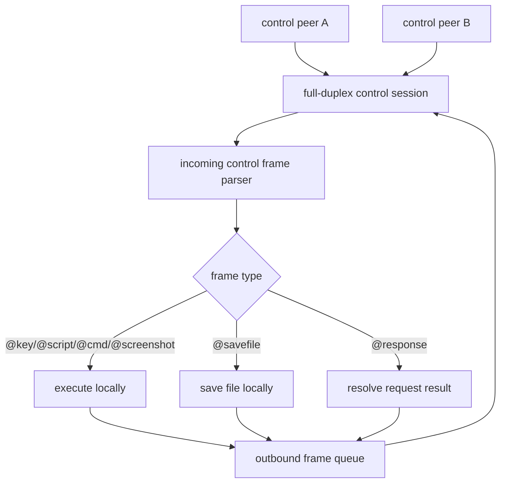
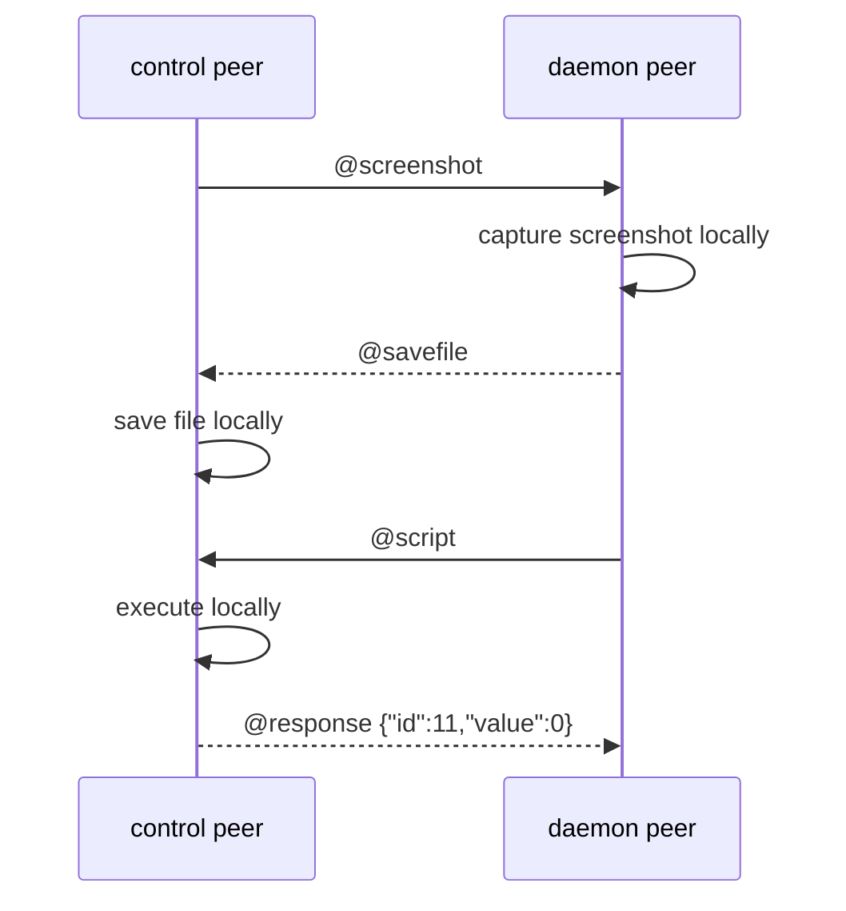

# 双向控制面规划

## 1. 背景

这份文档处理的不是 screenshot 单点能力。
它处理的是 `rustdog` 控制面的基础模型变化。

新的目标不是“单次请求可返回多帧”。
而是:

- control 端可以发送 `@key`、`@script`、`@cmd`、`@screenshot`
- daemon 端也可以主动发送 `@key`、`@script`、`@savefile` 等指令
- 双方都可以“请求被控制”

换句话说,控制面要从“请求方 -> 执行方”的单向模式,升级成真正的双向模式。

## 2. 当前实现的真实边界

### 2.1 TCP / WebSocket line-control 已经有一半是双向的

当前 `src/shell.rs` 里的 `run_control_receiver_with_executor()` 和
`run_control_receiver_messages()` 已经能:

- 持续读取对端发来的 line-control 指令
- 在本地执行
- 再把结果写回原连接

这说明:

- TCP / WebSocket 的 transport 天然支持全双工
- 现有 line-control parser 和 executor 可以复用

但它还不是真正双向。
因为当前写回的内容仍然被限定成“这次请求的响应”。
daemon 不能在没有先收到一条请求的情况下,主动发一条控制指令过去。

### 2.2 Zenoh path 现在是明显单向 RPC

当前 `src/zenoh_control.rs` 里:

- `run_router_daemon()` 暴露的是 queryable
- `run_client_control()` 做的是 stdin 逐行发送 query
- 收到的只是单条 reply

这条线的心智很清楚:

- `control` 是 sender
- `daemon` 是 executor + replier

因此只要目标变成“daemon 也能主动发控制指令”,当前 Zenoh query/reply 结构就不够了。

## 3. 新目标

### 3.1 功能目标

建立一个统一的双向控制面,满足:

1. 双方都能主动发送显式控制指令
2. 双方都能执行对端发来的显式控制指令
3. 截图文件这类结果不必再挤进 `@response`
4. `@savefile` 可以作为一种正式的 peer-to-peer 控制返回/控制指令

### 3.2 非目标

这轮不做:

- interactive shell data plane 双向流式改造
- 视频流
- 高频截图流
- 不受控的裸 shell 行在 Zenoh 上双向流动

## 4. 协议角色变化

### 4.1 旧模型

- `rdog control` = 主动发请求
- `daemon` = 执行并返回 `@response`

### 4.2 新模型

双方都拥有两种能力:

- **发起能力**
  - 主动发控制指令
- **执行能力**
  - 接收并执行对端控制指令

所以新的心智应该是:

- `control` 和 `daemon` 都是 **control peers**
- 不再是“一个是控制端,一个只是被控端”的硬编码关系

## 5. 线协议演进方向

### 5.1 保留显式 `@...` 语法

当前最值钱的资产不是 transport。
而是现有显式控制语法:

- `@ping`
- `@key`
- `@script`
- `@cmd`
- `@response`

这轮不应推翻它。

### 5.2 增加新的 peer 指令

建议新增:

- `@savefile`

它的语义不是“打印一段文本”。
而是“请接收端把这个 payload 直接落成文件”。

### 5.3 request id 的地位要提升

在旧模型里,request id 只是显式请求的可选能力。

到了双向模型里,只要是可能产生异步结果或需要关联的消息,都应该优先带 id。

建议规则:

- 兼容旧协议时,保留“无 id 也能用”
- 新的双向控制会话里,凡是会有结果的主动控制指令,默认都带 request id

例如:

```text
@screenshot#7:{target:"display"}
@savefile#7:{filename:"shot.jpg",mime:"image/jpeg",encoding:"base64",data:"..."}
@response#7:{code:64,error:"..."}
```

## 6. screenshot 在新模型里的位置

### 6.1 screenshot 不再是特殊返回技巧

之前把 screenshot 设计成:

- `@screenshot`
- `@savefile + @response(meta)`

本质上是在单向 RPC 模型里给大结果打补丁。

现在改成双向模型后,screenshot 应该重新理解为:

- `@screenshot` 是一条普通的双向控制指令
- `@savefile` 是一种普通的双向结果/控制指令

### 6.2 screenshot 成功的终态

在新的双向模型里,建议 screenshot 成功时直接由执行方发送:

```text
@savefile#7:{filename:"screenshot-20260502-100500.jpg",mime:"image/jpeg",encoding:"base64",quality:75,width:1728,height:1117,data:"..."}
```

也就是说:

- 终态可以是 `@savefile#7`
- 不必再强制补一条成功 `@response`

失败时仍然可以走:

```text
@response {"id":7,"code":77,"error":"screen capture permission denied"}
```

这样更自然。
因为 screenshot 的真正结果就是“文件”。
不是一个文本值。

## 7. 两个实施方向

### 7.1 方向 A: 不惜代价,做统一的全双工控制会话

这是推荐的长期方案。

#### 核心思路

抽象一个与 transport 无关的 `ControlPeerSession`:

- 能持续收消息
- 能主动发消息
- 能把“请求”“结果”“文件保存指令”都当作 session frame

TCP / WebSocket 天然复用 socket 全双工。

Zenoh 则不再把 query/reply 当最终控制模型。
而是改成:

- 会话建立 / target 解析仍可沿用 discovery
- 真正双向控制改走一对或两对稳定 keyexpr channel

例如:

- `.../session/<session_id>/to-daemon`
- `.../session/<session_id>/to-control`

#### 优点

- 三条 transport 最终心智统一
- screenshot、savefile、未来 clipboard/file-open/window-focus 都能共用同一返回模型
- 不再把大 payload 硬挤进 query reply

#### 代价

- Zenoh control-plane 要做真正的模型升级
- 现有 queryable 路径会变成 bootstrap/legacy,或需要兼容层
- 需要重写一部分 `rdog control` 的 runtime

### 7.2 方向 B: 先把 TCP / WebSocket 做成双向,Zenoh 暂时保留旧 RPC

这是过渡方案。

#### 核心思路

- TCP / WebSocket 先落双向控制
- `@savefile` 先在 socket-based path 生效
- Zenoh 仍保留 query/reply 的旧模式
- screenshot over Zenoh 先不做或只保留旧单向语义

#### 优点

- 实现快
- 风险集中在现有 socket path
- 能尽快验证 `@savefile` 和双向控制 UX

#### 缺点

- transport 心智分叉
- 文档和测试矩阵会复杂很多
- 很容易让临时方案拖成长期方案

## 8. 推荐结论

### 8.1 长期推荐

长期应选 **方向 A**。

因为你现在改的不是 screenshot 一条命令。
而是在改控制面的基本语义。

既然基本语义已经变了,继续把 Zenoh 保持成单向 RPC,很快就会变成第二套模型。

### 8.2 短期落地顺序

如果考虑实现节奏,可以这样分两阶段:

1. 先在设计上锁死“最终要到方向 A”
2. 实现时允许先做一个受控的 Phase 1:
   - TCP / WebSocket 先双向
   - Zenoh 同步完成 session/channel 设计文档
   - 不再继续扩旧 query/reply 能力

重点是:

- 允许 staged delivery
- 不允许战略方向继续停在单向 RPC

## 9. 模块级改动规划

### 9.1 `src/control_protocol.rs`

新增:

- `@savefile`
- 与之对应的 `SaveFileRequest` 或 `SaveFileFrame`

同时要明确:

- `@response` 仍是结果帧之一
- `@savefile` 也是结果帧之一
- 不能再假设“每个请求都只会得到一条文本 response”

### 9.2 `src/control_core.rs`

当前核心问题不是 parser。
而是返回抽象太窄。

需要把:

- `execute_explicit_control_request(...) -> String`

升级成更通用的:

- `execute_explicit_control_request(...) -> Vec<ControlOutboundFrame>`
  或
- `-> ControlExecutionOutcome`

建议最少支持:

- `ResponseLine(String)`
- `SaveFileFrame(SaveFileFrame)`
- 后续可扩的 `ControlCommandFrame(ControlRequest)`

### 9.3 `src/shell.rs`

这里是 TCP / WebSocket Phase 1 的主战场。

需要把当前“读一条 -> 执行 -> 回一条”的循环,改成真正的双向 session:

- reader loop: 接收对端控制指令并本地执行
- writer path: 本地也可以主动把控制指令发给对端

这通常意味着:

- stdin 不再只是唯一消息源
- 需要一个统一 outbound queue

### 9.4 `src/zenoh_control.rs`

这里不能继续只靠:

- client 发 query
- daemon reply 单条文本

需要升级成:

- 会话发现 / 建立
- 双向 channel
- 双向 frame dispatch

当前 query/reply 最多适合当:

- session bootstrap
- compatibility bridge

不再适合做最终双向控制面。

### 9.5 新模块建议

建议新增:

- `src/control_session.rs`
  - `ControlPeerSession`
  - outbound queue
  - frame dispatch

- `src/control_frames.rs`
  - `ControlOutboundFrame`
  - `SaveFileFrame`
  - 统一 frame 编解码

- `src/screenshot*.rs`
  - 继续承载 screenshot 具体平台实现
  - 但不再决定最终返回链路

## 10. 验证计划

### 10.1 单元测试

- `@savefile` parser
- screenshot 成功结果可以终结为 `@savefile#id`
- `@response` 与 `@savefile` 都能带 request id 关联
- 控制结果抽象支持多种终态,不再只是一条字符串

### 10.2 TCP / WebSocket 集成测试

- control 端发送 `@key`
- daemon 执行并回结果
- daemon 主动发送 `@savefile`
- control 端自动落盘
- daemon 主动发送 `@script`
- control 端执行并返回 `@response`

也就是说,测试矩阵里要真正证明:

- 双方都能发
- 双方都能执行

### 10.3 Zenoh 集成测试

最终目标测试不应再只验证:

- `query -> one reply`

而应验证:

- session 建立后双方都能发 frame
- daemon 主动下发 frame 给 control peer
- `@savefile` 能跨 Zenoh channel 送达并被落盘

## 11. 风险

### 风险1: 控制面从 RPC 变成会话后,复杂度陡增

这是事实。
但这个复杂度不是“加出来的”。
而是新需求本身带来的。

如果继续假装它还是单向 RPC,复杂度只会转移成补丁。

### 风险2: Zenoh 改造面会明显变大

是的。
因为 query/reply 天然不适合 daemon 主动发控制指令。

### 风险3: `rdog control` CLI 心智会变化

旧心智是:

- 我在 stdin 里输一行
- 远端回一行

新心智会变成:

- 我在一个双向控制会话里
- 对端也可能主动给我发控制帧

这需要更新 README、`cmd.md` 和协议规格。

## 12. 流程图



## 13. 时序图



## 14. 对 screenshot 规划的直接影响

昨天那份 `specs/zenoh-screenshot-control-plan.md` 里,
关于 `@savefile + @response(meta/ack)` 的返回链路,现在不再是长期真相源。

新的口径应改成:

- screenshot 依赖双向控制面
- `@savefile` 是正式的双向结果/控制帧
- screenshot 成功的终态可以直接是 `@savefile#id`

## 15. 下一步建议

最值得先做的不是 screenshot backend。
而是先写一个 **control return / outbound frame 抽象重构 plan**。

如果这一步不先做,后面无论是 screenshot、savefile,还是 daemon 主动下发 `@script`,
都会继续卡在“当前 core 只能回一条字符串”这个老边界上。
