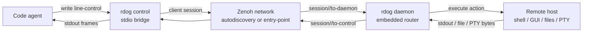
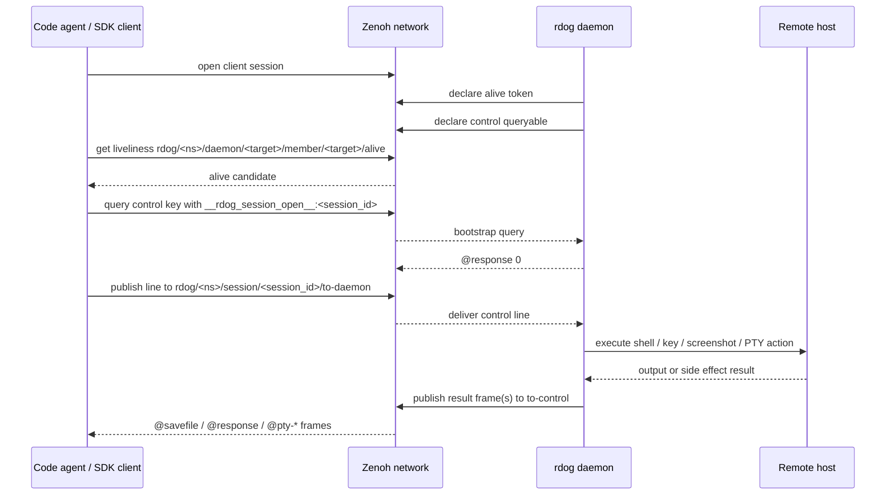

# Code Agent 使用 `rdog control` 协调远程主机指南

## 状态

当前文档是面向 code agent / 编程智能体的使用规格。

它不替代这些底层规格:

- `specs/control-line-protocol.md`: line-control 协议真相源
- `specs/zenoh-control-plane-plan.md`: Zenoh router / serial control-plane 真相源
- `specs/zenoh-sdk-integration-playbook.md`: 直接用 Zenoh SDK 对接 `rdog` daemon 的操作手册
- `specs/pty-control-plan.md`: `@pty` / detach / attach / resize 的终端会话规格

本文件只回答一个问题:

> code agent 应该怎样把 `rdog daemon` + `rdog control` 当成局域网 / 可达远程主机上的控制与协调底座。

## 最关键的 CLI 事实

当前仓库没有 `rdog zenoh daemon` 子命令。

正确启动入口是:

```bash
rdog daemon --transport zenoh --name mac.lab --namespace lab
```

更常见的是通过配置文件启动:

```bash
rdog daemon -c ./rdog_macos.toml
```

当配置文件里存在并启用下面的 profile 时,`daemon` 会走 Zenoh router profile:

```toml
[zenoh]
enabled = true
mode = "router"
namespace = "lab"
daemon_name = "mac.lab"
listen_endpoints = [
  "tcp/0.0.0.0:17447",
]
request_timeout_ms = 3000
startup_guard_window_ms = 1000
```

控制入口是:

```bash
rdog control mac.lab
```

这条短命令等价于显式写:

```bash
rdog control --transport zenoh --target-name mac.lab
```

当 autodiscovery 不可用时,再提供 router entry point:

```bash
rdog control mac.lab --entry-point tcp/192.168.1.20:17447
```

## code agent 心智模型

`rdog control` 不是 SSH 的同义词。

它更像一个可以被 stdio 驱动的远程控制面:

- agent 往 stdin 写一行 control text
- 远端 daemon 执行对应动作
- agent 从 stdout 读取 `@response`、`@savefile` 或 PTY frame
- Zenoh profile 负责目标发现、session bootstrap 和跨主机 transport

### 结构图



## 能力矩阵

| 能力 | 输入示例 | 返回形态 | 适合 agent 做什么 |
| --- | --- | --- | --- |
| one-shot CLI 入口 | `rdog control mac.lab @ping` / `rdog control mac.lab @ping @capabilities#1 @cmd#7:"..."` / `rdog control 127.0.0.1 5555 @capabilities#1` / `rdog control --url ws://... @ping` | line-control 协议原样响应(同下面各 `@<kind>` 行) | 不依赖 stdin / heredoc / `printf`,直接在命令尾部拼一行或多行 `@<line>` 就能发并等收口退出;N=1 和 N>1 统一复用 `send_control_lines_*` 管线,共享同一条 transport 与 frame 收口逻辑 |
| 活性检查 | `@ping` | `@response "pong"` | 判断目标是否在线 |
| Bootstrap | `@bootstrap#1:{mode:"gui",capability_policy:"fresh"}` | `rdog.bootstrap.v1` structured `@response` + optional observe `@savefile` frames | 新 GUI 任务的一次只读起手探测,同时拿 liveness / capabilities / observation / lane errors |
| 能力诊断 | `@capabilities#1` | `rdog.capabilities.v1` structured `@response` | 在 GUI / 权限 / 平台敏感动作前确定可用 lane |
| 观察 | `@observe#2:{mode:"hybrid",include_screenshot:true,include_ax:true,include_windows:true}` | `rdog.observe.v1` observation bundle + optional `@savefile` frames | 推荐的 GUI 观察入口,先读屏幕/AX/窗口/ref/selector 摘要 |
| one-shot shell | `printf READY` | `@response "READY"` | 跑简单命令,不保留 cwd |
| 带 id shell | `@cmd#42:"printf READY"` | `@response {"id":42,"value":"READY"}` | 并行或批处理时关联结果 |
| 显式脚本 | `@script:"git status --short"` | `@response ...` | 远端执行命令文本 |
| 按键 | `@key#7:{key:"F11",hold_ms:200,mode:"press_release"}` | `@response {"id":7,"value":0}` 或 structured key report | 用于快捷键、功能键、导航键和 app 功能触发,不是普通文本输入 |
| 粘贴 | `@paste` | structured paste report | 对远端当前焦点执行系统粘贴,需要焦点正确 |
| 截图 | `@screenshot#7` | image `@savefile` + manifest `@savefile` + `@response ...screenshot-bundle...` | 采集远端屏幕证据与坐标 manifest |
| 截图 + AX | `@screenshot#8:{include_ax:true,ax_required:false}` | screenshot bundle,manifest 可含 `accessibility` | 同时采集远端屏幕和 macOS UI 结构 |
| 窗口发现 | `@window-find#9:{app:"TextEdit",title_contains:"release-notes",limit:5}` | structured `@response` + `observation` | 先拿窗口 ref,再做 activate/close |
| 窗口激活/关闭 | `@window-activate#10:{target:{ref:"@e1",observation_id:"obs-..."}}` | structured `@response` | 对短期 window ref 做后续生命周期操作 |
| AX tree | `@ax-tree#9:{scope:"windows",depth:4,max_elements:1000}` | structured AX `@response` + `observation` | 不截图,只读取当前 macOS UI 结构 |
| AX find | `@ax-find#9:{role:"AXButton",name_contains:"Cancel",limit:20}` | structured AX `@response` + `observation` | 先拿短期 ref,再做后续语义动作 |
| AX get | `@ax-get#9:{target:{ref:"@e2",observation_id:"obs-..."},depth:2,include_values:false}` | structured AX `@response` + `observation` | 针对一个短期 ref drill down |
| AX action | `@ax-action#10:{target:{ref:"@e2",observation_id:"obs-..."},action:"AXPress"}` | structured AX `@response` | 对按钮/菜单项执行 allowlisted AX semantic action |
| AXPress | `@ax-press#10:{target:{ref:"@e2",observation_id:"obs-..."}}` | structured AX `@response` | 对按钮/菜单项等 AX 元素执行 `AXPress` |
| AX set value | `@ax-set-value#11:{target:{ref:"@e2",observation_id:"obs-..."},value:"hello",mode:"replace"}` | structured AX `@response` | 向 settable 文本字段直接写 `AXValue` |
| AX focus | `@ax-focus#12:{target:{ref:"@e2",observation_id:"obs-..."},activate:true}` | structured AX `@response` | 在不默认动鼠标的前提下聚焦元素或窗口 |
| AX scroll | `@ax-scroll#13:{target:{ref:"@e2",observation_id:"obs-..."},direction:"down",pages:2}` | structured AX `@response` | 用 AX locator + targeted scroll event 滚动 |
| type-text | `@type-text#14:{target:{ref:"@e2",observation_id:"obs-..."},text:"hello",mode:"ax-value"}` | structured AX `@response` | 普通文本输入入口,支持 AXValue / targeted keyboard / clipboard |
| Web find | `@web-find#15:{target:{browser:"active"},match:{text:"首页"}}` / `@web-find#16:{target:{window_id:"pid:96405/window:3"},match:{text:"首页"}}` / `@web-find#17:{target:{window_ref:"@e1",observation_id:"obs-..."},match:{text:"首页"}}` | `rdog.web-find.v1` structured `@response` | 只读定位浏览器页面内 AXWebArea 控件;多浏览器窗口时用 `window_id` 或 fresh `window_ref` 避免 active ambiguity |
| Web act | `@web-act#18:{target:{window_ref:"@e1",observation_id:"obs-..."},match:{text:"首页"},action:"press",verify:true}` | `rdog.web-act.v1` structured `@response` | 明确允许副作用时,对唯一 page-owned AXPress 目标执行语义点击 |
| selector get | `@selector-get#20:{selector_id:"sel-v1-..."}` | structured selector `@response` | 查看 stale hint 给出的 stable selector |
| selector resolve | `@selector-resolve#21:{selector_id:"sel-v1-...",dry_run:true}` | candidate set + fresh observation refs | 只读定位,不执行动作 |
| selector refind | `@selector-refind#22:{selector_id:"sel-v1-...",policy:"safe",include_explanations:true}` | `rebound` / `needs_disambiguation` / `not_found` / `blocked` decision | stale ref 后做可解释语义恢复,但仍不执行动作 |
| 鼠标移动 | `@mouse-move#10:{target:{ref:"@e9",observation_id:"obs-..."}}` 或 `{x:1200,y:540}` | structured mouse `@response` | 优先按 observation ref 移动;坐标是 fallback |
| 鼠标按钮 | `@mouse-button#11:{button:"left",mode:"press"}` | structured mouse `@response` | 原始 press / release / click |
| 点击 | `@click#12:{target:{ref:"@e4",observation_id:"obs-..."}}` 或 `{x:1200,y:540}` | structured mouse `@response` | ref 定位后点击;坐标点击是显式 fallback |
| 拖拽 | `@drag#13:{from:{ref:"@e1",observation_id:"obs-..."},to:{x:1200,y:540}}` | structured mouse `@response` | from/to 都可用 ref 或坐标 endpoint |
| 滚轮 | `@wheel#14:{target:{ref:"@e8",observation_id:"obs-..."},delta_y:-3}` 或 `{x:1200,y:540,delta_y:-3}` | structured mouse `@response` | ref 定位 scroll container 后滚动;坐标滚动是 fallback |
| PTY / TUI | `rdog control mac.lab --pty -- codex` | `@pty-*` frame 流 | 跑 `codex`、shell、vim、REPL |
| PTY detach | `--pty-detach SESSION_ID` | `@pty-detached ...` | 保留远端进程,解绑当前控制端 |
| PTY attach | `--pty-attach SESSION_ID` | `@pty-attached ...` 后继续输出 | 重新接管远端 PTY |
| PTY close | `--pty-close SESSION_ID` | `@pty-closed ...` | 终止远端 PTY session |

## 推荐使用方式

### 0. 单条请求优先用 one-shot CLI 入口

如果只是临时发一条或多条 line-control 请求(典型 agent 起步:`@ping` / `@capabilities` / `@bootstrap` / `@observe`),
不要再绕 `printf ... | rdog control ...`,直接拼接 target 和 `@<line>`:

```bash
# 单 line
rdog control mac.lab @ping
rdog control mac.lab @capabilities#1
rdog control 127.0.0.1 5555 @ping
rdog control --url ws://127.0.0.1:5555/control @ping
rdog control --target-name mac.lab '@observe#1:{mode:"hybrid",include_ax:true}'

# 多 line,共享同一条 transport,顺序串行
rdog control mac.lab @ping @capabilities#1 '@cmd#7:"printf READY"'
rdog control 127.0.0.1 5555 @ping @capabilities#1 @observe#3
```

特性:

- N=1 和 N>1 统一复用 `send_control_lines_*` 管线,共享同一条 transport,
  包含 Zenoh session bridge、savefile 收口。
- 走完整 frame 收口循环,能正确处理 `@screenshot` 等 `@savefile` 多 frame 场景;
  任一 line 失败整组退出。
- `send_single_control_line_*` 只保留给 `--pty-close` / `--pty-detach` 这类 PTY lifecycle sugar,不要和 one-shot CLI 入口混用。
- 与 `--pty` / `--pty-close` / `--pty-detach` / `--pty-attach` 互斥。
- 末尾 `@<line>` 必须是 1..N 个连续 token,以 `@` 开头;
  多个 `@` token 必须放在 host 末尾连续段,前面位置参数不能以 `@` 开头。
- 上限 `host: num_args = 0..=32`(2 target + 30 line),覆盖典型 GUI 任务。
- 不修改 line-control 协议;只是把 "先发 N 行,等收口,退出" 暴露成 CLI 显式入口。
- 现有 `printf ... | rdog control ...` 的 stdin streaming 形式完全不受影响。

只有"需要长期持续 stdin 桥接"才回到下面的 `1.` 路径。

### 1. 普通自动化优先用 line-control

如果任务不需要真实 TTY,用普通 control line 即可:

```bash
printf '@ping\n@cmd#1:"pwd"\n@cmd#2:"git status --short"\n' | rdog control mac.lab
```

只发单行时更推荐直接用 `0. one-shot CLI 入口`。

agent 应按下面的规则解析输出:

- `@response "..."`: 成功值
- `@response 0`: 成功且无输出
- `@response {"id":...,"value":...}`: 带 request id 的成功值
- `@response {"code":...,"error":"..."}`: 协议或执行错误
- `@savefile {...}`: 文件型结果,不应把 base64 原样展示给用户
- 同一个 request id 可能返回多个 `@savefile`。
  默认 `@screenshot#id` 至少返回一个 virtual-desktop JPEG 和一个 manifest JSON。

### 2. GUI agent 必须先读 bootstrap / 能力诊断

GUI / 截图 / AX / 鼠标 / 文本输入任务优先先发送:

```text
@bootstrap#1:{mode:"gui",capability_policy:"fresh",observe:{mode:"hybrid",include_screenshot:true,include_ax:true,include_windows:true,ax_required:false,ax_mode:"interactive"}}
```

返回值里的 `capabilities.*.status`、`observation.status`、`lanes.*.status` 和 `errors[]` 是 agent 选择控制 lane 的依据。
不要从平台名字猜 macOS Accessibility、Screen Recording、Windows UIPI 或 Linux display backend 是否可用。
`capability_policy:"cached"` 当前是保留字段,会返回 `BOOTSTRAP_CAPABILITY_CACHE_UNIMPLEMENTED`;第一版使用 `fresh`。

如果目标 daemon 不支持 `@bootstrap`,退回旧的三行只读 preflight:

```text
@ping#1
@capabilities#2
@observe#3:{mode:"hybrid",include_screenshot:true,include_ax:true,include_windows:true,ax_required:false,ax_mode:"interactive"}
```

固定 GUI workflow:

```text
@bootstrap -> locate -> activate_or_focus -> semantic_action -> verify -> fallback_recipe
```

执行口径:

- `permission_denied`: 停止该 lane,解释缺少的权限。它对应 code `77`。
- `unsupported`: 换另一条 lane,不要重复执行同一命令。它对应 code `78`。
- `unknown`: 可以做非破坏性 smoke,但必须准备处理结构化错误。
- `available`: 仍要在动作后用截图、AX tree、window state 或 command output 验证。

`@observe` 观察入口:

```text
@observe#6:{mode:"hybrid",include_screenshot:true,include_ax:true,include_windows:true,ax_required:false,ax_mode:"interactive"}
@observe#7:{mode:"window",target:{app:"System Settings"},limit:5}
@observe#8:{mode:"ax",target:{app:"System Settings"},ax_mode:"interactive",ax_required:false}
@observe#9:{mode:"visual",include_screenshot:true,include_manifest:true}
```

`@observe` 是当前推荐的只读 facade。
它把 visual screenshot、AX summary、window summary、refs、selectors 和 recovery hint 收束成 `rdog.observe.v1` bundle。
它不会 activate/focus/press/set value/type/scroll/click。
旧的 `@screenshot` / `@ax-tree` / `@ax-find` / `@ax-get` / `@window-find` 仍是稳定 lower-level lanes,不是 deprecated。
`ax_mode:"skeleton"` 是浅层 `windows` preset 的兼容别名。

首版 `target` 只过滤 window 和 AX summary。
visual section 仍是 virtual desktop screenshot,应返回 `target_applied:false`。
`mode:"hybrid"` 不创建合并 observation; top-level `observation` 只指向一个主 observation,每个 `refs.sample[]` 都必须带 `section`、`observation_id`、`ref`、`kind` 和可选 `name`。

默认截图请求:

```text
@screenshot#7
```

等价于:

```text
@screenshot#7:{target:"display",display:"all",layout:"composite",coordinate_space:"os-logical",format:"jpeg",quality:75}
```

显式主屏兼容入口:

```text
@screenshot#8:{target:"display",display:"primary",layout:"single",format:"jpeg",quality:75}
```

默认 screenshot bundle 的 final response 会包含:

- `kind:"screenshot-bundle"`
- `layout:"composite"`
- `coordinate_space:"os-logical"`
- `image`
- `manifest`
- `display_count`

如果返回 `kind:"screenshot-stale-frame"` / `error_code:"SCREENSHOT_STALE_FRAME"`,说明 freshness guard 在 `@savefile` 之前终止了请求。
这不是截图成功,不要复用旧截图文件继续做视觉判断。
保留响应里的 `guard_policy`、`displays[].pixel_hash`、`backend`、`os_rect` 等字段,下一步分析截图后端为什么返回可疑旧帧。

如果目标是 macOS GUI 自动化,可以显式请求 AX metadata:

```text
@screenshot#9:{include_ax:true,ax_required:false,ax_depth:4,ax_max_elements:1000}
```

AX metadata 会写入 manifest 的 `accessibility` 字段,使用 `rdog.ax.v1` schema。
它包含窗口,标题,rect,元素 role/name/description/actions 等结构信息。
AX rect 继续使用 `coordinate_space:"os-logical"`。
它也会带 observation header,让后续 `@ax-get` / `@ax-press` / `@ax-set-value` 可以复用短期 ref。

权限语义:

- `include_ax:false`: 默认行为,不读取 AX。
- `include_ax:true,ax_required:false`: Accessibility 权限不足时截图仍成功,manifest 标记 `capture_status:"permission_denied"`。
- `include_ax:true,ax_required:true`: Accessibility 权限不足时请求失败,返回 code 77。

`@ax-tree` 可独立读取当前 AX tree:

```text
@ax-tree#10:{scope:"windows",depth:4,max_elements:1000,include_values:true}
```

`@observe`、`@ax-tree`、`@ax-find`、`@ax-get`、`@window-find`、`@screenshot include_ax` 都会返回短期 `observation_id` 和 `ref`。
这些 ref 只在当前 observation 内有效。
如果 daemon 返回 `OBSERVATION_EXPIRED` 或 `STALE_REF`,不要猜测匹配结果,直接重新观察。
`observation.selector_count` 表示 daemon 已经为这次 observation 写入多少个 durable selector record。
如果错误 payload 里有 `durable.selector_hint_available:true`,先把 `durable.selector_id` 当成 stable selector 检查,不要把旧 `@eN` 当成复活。

推荐恢复顺序:

```text
@selector-get#20:{selector_id:"sel-v1-..."}
@selector-refind#21:{selector_id:"sel-v1-...",policy:"safe",min_confidence:0.9,include_explanations:true}
@ax-get#22:{target:{ref:"@e-new",observation_id:"obs-new"},depth:1,include_values:false}
```

`@selector-refind` 是 P3 semantic re-find。
它返回 `decision:"rebound"` 时,`fresh_target` 只表示 stable selector 已恢复成新的 observation ref。
这不表示按钮已经按下、窗口已经聚焦、文本已经写入或动作已经验证成功。
`decision:"rebound"` 必须带 `verify_hint`; 后续动作必须先执行该 verify hint,再显式发送 `@ax-action` / `@ax-set-value` / `@window-activate` 等 side-effect 命令。
`decision:"needs_disambiguation"`、`decision:"not_found"`、`decision:"blocked"` 都不能自动行动。
其中 `blocked` 是正常 selector response,用于表达权限、backend、capability 或 schema 阻断,并且不得带 `fresh_target`。
`@selector-resolve` 保持 P2 只读 dry-run 语义,适合查看 raw candidates,不是恢复决策层。
旧 `@eN` 仍然不能跨 daemon 重启复活。

durable observation state 当前由 daemon 写入这些文件:

- `meta.json`: `rdog.observation.state.v1`
- `index.json`: `rdog.observation.index.v1`
- `observations.jsonl`: `rdog.observation.record.v1`
- `selectors.jsonl`: `rdog.selector.record.v1`
- `ref_cache.jsonl`: `rdog.ref-cache.v1`,只作为 hint-only cache

`@ax-press` 可以使用 manifest/tree 中的短期 id 或 ref:

```text
@ax-press#11:{target:{id:"pid:123/window:0/path:3.2"}}
@ax-press#12:{target:{ref:"@e2",observation_id:"obs-..."}}
```

也可以使用语义 locator,但必须避免匹配到多个元素:

```text
@ax-press#13:{target:{process:"System Information",window_title:"关于本机",role:"AXButton",description:"关闭按钮"}}
```

建议优先使用刚刚从 manifest 或 `@ax-tree` 读到的 `id` / `ref`。
如果元素已经消失或 locator 歧义,daemon 会返回 code 64。

如果目标元素支持的并不只是 `AXPress`,可以显式走 `@ax-action`:

```text
@ax-action#14:{target:{id:"pid:123/window:0/path:3.2"},action:"AXShowMenu"}
```

当前只允许安全 allowlist:

- `AXPress`
- `AXOpen`
- `AXConfirm`
- `AXCancel`
- `AXShowMenu`
- `AXScrollToVisible`

文本字段如果是 settable `AXValue`,优先用:

```text
@ax-set-value#15:{target:{id:"pid:123/window:0/path:8.2"},value:"hello",mode:"replace"}
@type-text#16:{target:{id:"pid:123/window:0/path:8.2"},text:"hello",mode:"ax-value"}
```

如果需要非鼠标键盘投递,可以显式用:

```text
@key#17:{key:"Return",delivery:"pid-targeted",pid:556}
@key#18:{key:"Cmd+W",delivery:"window-targeted",window_id:"pid:556/window:0"}
@type-text#19:{target:{id:"pid:556/window:0/path:8.2"},text:"hello",mode:"targeted-keyboard"}
@type-text#20:{target:{id:"pid:556/window:0/path:8.2"},text:"hello",mode:"clipboard",allow_clipboard:true}
@ax-focus#21:{window_id:"pid:556/window:0",activate:true}
@ax-scroll#22:{target:{id:"pid:556/window:0/path:10.1"},direction:"down",pages:2}
```

当前阶段:

- `@key` 支持 `delivery:"global" | "pid-targeted" | "window-targeted"`。
- `@key` 主要用于快捷键、功能键、导航键和特定 app 功能触发。
  不要把它当作稳定的普通文本输入接口。
- 旧字符串 payload 和旧 object payload 继续兼容。
- 只要 object payload 显式带 `delivery` / `pid` / `window_id`,成功响应就会切到 structured key report。
- 普通文本输入优先用 `@ax-set-value` 或 `@type-text`。
- `@type-text mode:"auto"` 会按 `ax-value -> targeted-keyboard -> clipboard(opt-in)` 梯子尝试。
- `mode:"targeted-keyboard"` 仍可能受输入法和焦点状态影响。
  它是文本输入路径,不是热键路径。
- `mode:"clipboard"` 必须显式 `allow_clipboard:true`。
  它会临时写入远端系统剪贴板,然后按 `restore-if-unchanged` 策略恢复旧值。
  如果人类或其他进程在此期间改了剪贴板,rdog 会跳过恢复,并在 response 里返回 `clipboard_restored:false` 与 `clipboard_restore_skipped_reason:"clipboard-changed"`。
- `@paste` 不带参数时是当前焦点的系统粘贴热键。
  它不需要 target,但依赖焦点,返回里会标出 `used_hotkey:true` 和 `requires_focus:true`。
  旧 `@paste:"text"` 只保留为 legacy text injection,新 agent 不应把它作为稳定普通文本输入路径。
- `@ax-focus activate:true` 是唯一允许它主动调用 `@window-activate` 的情况。
- `@ax-scroll` 当前在 macOS 主路径真实返回 `delivered_via:"ax-scrollbar-value"`。
  它通过写入 AXScrollBar 的 AXValue 滚动,不要把它当成隐式全局 wheel。

鼠标命令直接复用这个 manifest 的坐标语义:

- 鼠标是 fallback lane,不是默认 GUI 路径。只有 semantic/ref/selector lane 不可用、目标是 canvas/free-space/复杂拖拽,或用户明确要求真实指针控制时才优先使用。
- `@observe` 返回 manifest 时用它;否则使用最新 `@screenshot` manifest。
- 优先使用 `target:{ref,observation_id}` / `from:{ref,observation_id}` / `to:{ref,observation_id}`。
  daemon 会在动作前重新解析当前 AX/window rect,不会复用陈旧截图 rect。
- `target:{selector_id:"...",auto_refind:false}` 是 no-action handoff,只返回 recovery `@selector-refind`。
  `auto_refind:true` 只有在 typed refind decision 为 `rebound` 且 fresh target 验证到当前 rect 后才会执行 mouse。
- `@click`、`@drag`、带 `x/y` 的 `@wheel` 使用 `coordinate_space:"os-logical"`,并在响应里标记 `target_resolution.source:"coordinate_fallback"`。
- 对默认 composite screenshot,图片点位换算为 `os_x = image_x + virtual_bounds.x`, `os_y = image_y + virtual_bounds.y`。
- 如果点位落在 display gap 或 manifest 范围外,agent 应该先拒绝,不要把猜出来的坐标发送给 daemon。
- `@mouse-move#id:{dx:0,dy:0,coordinate_space:"relative"}` 是安全 smoke,不会改变有效指针位置。
- `@mouse-button mode:"press"` 是原始按下,不会自动 release。
  发生中断时先发送 `@mouse-button:{button:"left",mode:"release"}` 做恢复。

### 2. 需要真实 TTY 时才用 PTY

下面这些场景应该使用 PTY:

- `codex` 这类要求 stdin 是 terminal 的程序
- shell / REPL / vim 等 TUI 程序
- 需要持续交互、终端尺寸、Ctrl-C / Ctrl-D 语义的任务

示例:

```bash
rdog control mac.lab --pty -- codex
rdog control mac.lab --pty -- /bin/bash
rdog control mac.lab --pty -- vim README.md
```

程序生成请求时,优先使用 canonical 对象写法:

```text
@pty:{cmd:"codex",args:["resume","019e..."],cols:120,rows:40}
```

不要把 `@key`、`@script`、`~.` 当作 PTY 本地 escape。
进入 PTY 后,这些字节都会进入远端 PTY stdin。

### 3. 多主机协调用稳定 daemon name

建议给每台可控机器分配稳定名字:

```text
mac.lab
win11.lab
linux-build.lab
mini-a.lab
```

code agent 维护一个目标表即可:

| target-name | 角色 | 常用能力 |
| --- | --- | --- |
| `mac.lab` | macOS 桌面 / GUI 操作 | `@observe`, `@window-find`, `@ax-*`, `@key`, `@paste`, `@screenshot`, `@mouse-move`, `@click`, `@drag`, `@wheel`, `--pty` |
| `win11.lab` | Windows 桌面 / 权限现场 | `@observe`, `@window-find`, `@key`, `@paste`, `@screenshot`, `@mouse-move`, `@click`, `@drag`, `@wheel` |
| `linux-build.lab` | 构建 / 测试机 | `@cmd#id`, `@script`, `--pty -- bash` |
| `mini-a.lab` | 设备桥 / 实验节点 | `@ping`, one-shot shell, SDK control |

## Zenoh session channel 模型

如果 code agent 只是通过 `rdog control` 子进程操作,不需要直接处理 Zenoh keyexpr。

如果 code agent 自己用 Zenoh SDK 对接,必须遵守当前模型:

1. 作为 client 加入 daemon 内嵌 router
2. 通过 liveliness 找到目标 daemon
3. 对 control key 发送 session open bootstrap
4. 订阅 `session/<id>/to-control`
5. 发布请求到 `session/<id>/to-daemon`
6. 一直收 frame,直到看到最终 `@response ...`

### SDK 对接时序



## 局域网与远程边界

### 局域网

局域网是当前最自然的部署场景。

推荐流程:

```bash
# 目标主机
rdog daemon -c ./rdog_macos.toml

# agent 主机
rdog control mac.lab
```

如果自动发现不稳定:

```bash
rdog control mac.lab --entry-point tcp/192.168.1.20:17447
```

### 可达远程网络

跨网段、VPN、专线或云端跳板场景里,只要 `--entry-point` 可达,control 仍可加入 router。

```bash
rdog control linux-build.lab --entry-point tcp/10.8.0.20:17447
```

### 当前不是内置 NAT 穿透系统

`rdog control` + Zenoh profile 当前不承诺自动打穿公网 NAT。

如果远端在 NAT 后面,需要先通过 VPN、端口转发、隧道或未来单独 relay 设计保证 entry point 可达。

## 安全与权限边界

`@script`、`@cmd` 和裸 shell 行都是远程代码执行。
只应该在可信主机、可信网络和可信 daemon 上启用。

`@key` / `@paste` / 鼠标命令受系统输入权限约束:

- macOS 需要给实际运行 daemon 的进程授予辅助功能权限
- Windows 可能受 UIPI 影响,低权限 daemon 不能控制高权限窗口

`@ax-tree` / `@ax-press` 也受 macOS Accessibility 权限约束:

- 权限主体是实际执行 AX 的 `rdog` 进程,通常是 daemon。
- `@observe` 是只读命令,但它的 visual / AX / window section 仍分别受 Screen Recording、Accessibility 和平台 backend 能力约束。它不能绕过权限。
- `@screenshot include_ax` 同时受 Screen Recording 和 Accessibility 两类权限影响。
- `ax_required:false` 只表示 AX 失败可降级,不表示 Screen Recording 可以降级。
- observation ref 是短期的,daemon 重启、TTL 到期、或再次观察后都不能把旧 `ref` 当成永久 selector 用。
- durable observation state 默认只保存 metadata、selector draft 和 hint-only ref cache,不持久化 AXValue 原文或截图图像。
- GUI 焦点窗口不对时,按键可能进入错误目标

`@screenshot` 受屏幕录制权限约束:

- macOS 需要屏幕录制权限
- Linux / Windows 也可能受桌面环境或权限限制
- 权限缺失应视为一等错误,不要把它当成网络失败
- macOS desktop-only 假成功不能接受。
  如果 backend 无法证明窗口内容可被捕获,应该返回可诊断错误,不要把只有桌面的图片当成功截图。

## 和 SSH 的差异

| 维度 | SSH | `rdog control` + Zenoh |
| --- | --- | --- |
| 目标寻址 | host / port / user | `namespace + daemon_name` |
| 自动发现 | 通常没有 | Zenoh autodiscovery + `--entry-point` fallback |
| 响应协议 | 终端字节流 | `@response`, `@savefile`, `@pty-*` |
| GUI 操作 | 需要额外工具 | `@key`, `@paste`, `@screenshot`, `@click`, `@drag`, `@wheel` 是同一 control plane |
| TUI | 原生 SSH PTY | 显式 `@pty` / session channel |
| 多主机 agent 协调 | 需要自己维护连接与解析 | 统一 target-name 和 line-control 语义 |
| 裸命令状态 | shell session 可保持状态 | 裸 shell 是 one-shot,状态保持请用 PTY |

所以它不是“更好的 SSH”。
更准确地说,它是给 code agent 用的远程控制面。

## 推荐 agent 决策规则

1. 先 `@ping`。
2. 不需要 TTY 时,用 `@cmd#id` 或 bare shell line。
3. 需要关联结果时,用 request id。
4. 需要 GUI 时,先用 `@observe` 读当前 visual / AX / window bundle。
   如果 `@observe` 不可用,降级到 `@screenshot include_ax`、`@ax-tree`、`@window-find`、`@ax-find` 或 `@ax-get`。
5. 需要 GUI 副作用时,先用 semantic action: `@ax-action` / `@ax-set-value` / `@type-text` / `@ax-scroll` / targeted `@key` / `@window-activate`。
   鼠标只作为 fallback lane。
   其中 `@paste` 是当前焦点粘贴,不是稳定文本输入。
6. 需要视觉证据时,用 `@observe` 或 `@screenshot#id`,并解析所有同 id 的 `@savefile`。
   默认截图要同时读取 JPEG 和 manifest。
   后续点击/拖拽坐标必须从 manifest 的 `virtual_bounds` 和 `display.image_rect` 换算,不要只凭图片猜。
7. 需要 TUI 或长期交互时,用 `--pty -- COMMAND`。
8. 需要保留远端进程时,用 `--pty-detach`。
9. 重新接管时,用 `--pty-attach`。
10. 网络 timeout 后,重新 resolve target,不要永久缓存旧 control key。
11. 不要假设裸 shell 行会保留 cwd 或 shell 状态。

## 最小 smoke 命令

本机或局域网 smoke:

```bash
rdog control mac.lab <<'RDOG'
@ping
@cmd#1:"printf READY"
printf PLAIN_OK
@mouse-move#2:{dx:0,dy:0,coordinate_space:"relative"}
RDOG
```

预期至少包含:

```text
@response "pong"
@response {"id":1,"value":"READY"}
@response "PLAIN_OK"
@response {"id":2,"value":{"kind":"mouse","action":"move",...}}
```

PTY smoke:

```bash
rdog control mac.lab --pty -- /bin/sh -c 'if [ -t 0 ]; then printf PTY_OK; else printf NOT_TTY; fi'
```

预期 stdout 中包含:

```text
PTY_OK
```

## 已知非目标

- 不把裸 shell 行升级成长久 cwd shell。
- 不支持不经 `@pty` 的传统 interactive shell over Zenoh。
- 不把截图请求拆成第二套独立 control topic。
- 不让同一个 `daemon_name` 在同一 namespace 下多实例并存。
- 不把 `@key` / `@paste` / 鼠标命令设计成绕过系统权限的后门。
