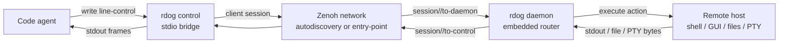
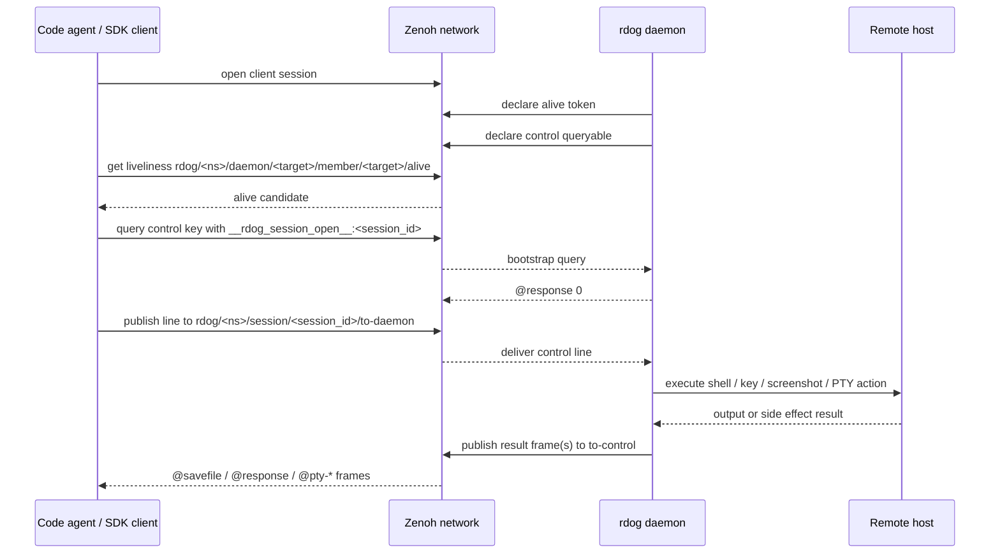

# Code Agent 使用 `rdog control` 协调远程主机指南

## 状态

当前文档是面向 code agent / 编程智能体的使用规格。

它不替代这些底层规格:

- `specs/control-line-protocol.md`: line-control 协议真相源
- `specs/zenoh-control-plane-plan.md`: Zenoh router / serial control-plane 真相源
- `specs/zenoh-sdk-integration-playbook.md`: 直接用 Zenoh SDK 对接 `rdog` daemon 的操作手册
- `specs/pty-control-plan.md`: `@pty` / detach / attach / resize 的终端会话规格

本文件只回答一个问题:

> code agent 应该怎样把 `rdog daemon` + `rdog control` 当成局域网 / 可达远程主机上的控制与协调底座。

## 最关键的 CLI 事实

当前仓库没有 `rdog zenoh daemon` 子命令。

正确启动入口是:

```bash
rdog daemon --transport zenoh --name mac.lab --namespace lab
```

更常见的是通过配置文件启动:

```bash
rdog daemon -c ./rdog_macos.toml
```

当配置文件里存在并启用下面的 profile 时,`daemon` 会走 Zenoh router profile:

```toml
[zenoh]
enabled = true
mode = "router"
namespace = "lab"
daemon_name = "mac.lab"
listen_endpoints = [
  "tcp/0.0.0.0:17447",
]
request_timeout_ms = 3000
startup_guard_window_ms = 1000
```

控制入口是:

```bash
rdog control mac.lab
```

这条短命令等价于显式写:

```bash
rdog control --transport zenoh --target-name mac.lab
```

当 autodiscovery 不可用时,再提供 router entry point:

```bash
rdog control mac.lab --entry-point tcp/192.168.1.20:17447
```

## code agent 心智模型

`rdog control` 不是 SSH 的同义词。

它更像一个可以被 stdio 驱动的远程控制面:

- agent 往 stdin 写一行 control text
- 远端 daemon 执行对应动作
- agent 从 stdout 读取 `@response`、`@savefile` 或 PTY frame
- Zenoh profile 负责目标发现、session bootstrap 和跨主机 transport

### 结构图



## 能力矩阵

| 能力 | 输入示例 | 返回形态 | 适合 agent 做什么 |
| --- | --- | --- | --- |
| 活性检查 | `@ping` | `@response "pong"` | 判断目标是否在线 |
| one-shot shell | `printf READY` | `@response "READY"` | 跑简单命令,不保留 cwd |
| 带 id shell | `@cmd#42:"printf READY"` | `@response {"id":42,"value":"READY"}` | 并行或批处理时关联结果 |
| 显式脚本 | `@script:"git status --short"` | `@response ...` | 远端执行命令文本 |
| 按键 | `@key#7:{key:"F11",hold_ms:200,mode:"press_release"}` | `@response {"id":7,"value":0}` 或 structured key report | 用于快捷键、功能键、导航键和 app 功能触发,不是普通文本输入 |
| 粘贴 | `@paste` | structured paste report | 对远端当前焦点执行系统粘贴,需要焦点正确 |
| 截图 | `@screenshot#7` | image `@savefile` + manifest `@savefile` + `@response ...screenshot-bundle...` | 采集远端屏幕证据与坐标 manifest |
| 截图 + AX | `@screenshot#8:{include_ax:true,ax_required:false}` | screenshot bundle,manifest 可含 `accessibility` | 同时采集远端屏幕和 macOS UI 结构 |
| AX tree | `@ax-tree#9:{scope:"windows",depth:4,max_elements:1000}` | structured AX `@response` | 不截图,只读取当前 macOS UI 结构 |
| AX action | `@ax-action#10:{target:{id:"pid:123/window:0/path:3.2"},action:"AXPress"}` | structured AX `@response` | 对按钮/菜单项执行 allowlisted AX semantic action |
| AXPress | `@ax-press#10:{target:{id:"pid:123/window:0/path:3.2"}}` | structured AX `@response` | 对按钮/菜单项等 AX 元素执行 `AXPress` |
| AX set value | `@ax-set-value#11:{target:{id:"pid:123/window:0/path:8.2"},value:"hello",mode:"replace"}` | structured AX `@response` | 向 settable 文本字段直接写 `AXValue` |
| AX focus | `@ax-focus#12:{window_id:"pid:123/window:0",activate:true}` | structured AX `@response` | 在不默认动鼠标的前提下聚焦元素或窗口 |
| AX scroll | `@ax-scroll#13:{target:{id:"pid:123/window:0/path:8.2"},direction:"down",pages:2}` | structured AX `@response` | 用 AX locator + targeted scroll event 滚动 |
| type-text | `@type-text#14:{target:{id:"pid:123/window:0/path:8.2"},text:"hello",mode:"ax-value"}` | structured AX `@response` | 普通文本输入入口,支持 AXValue / targeted keyboard / clipboard |
| 鼠标移动 | `@mouse-move#10:{x:1200,y:540,coordinate_space:"os-logical"}` | structured mouse `@response` | 按 manifest 坐标移动远端指针 |
| 鼠标按钮 | `@mouse-button#11:{button:"left",mode:"press"}` | structured mouse `@response` | 原始 press / release / click |
| 点击 | `@click#12:{x:1200,y:540}` | structured mouse `@response` | 根据截图坐标点击远端桌面 |
| 拖拽 | `@drag#13:{from:{x:900,y:420},to:{x:1200,y:540}}` | structured mouse `@response` | 按 os-logical 坐标拖拽 |
| 滚轮 | `@wheel#14:{x:1200,y:540,delta_y:-3}` | structured mouse `@response` | 移到目标点后滚动 |
| PTY / TUI | `rdog control mac.lab --pty -- codex` | `@pty-*` frame 流 | 跑 `codex`、shell、vim、REPL |
| PTY detach | `--pty-detach SESSION_ID` | `@pty-detached ...` | 保留远端进程,解绑当前控制端 |
| PTY attach | `--pty-attach SESSION_ID` | `@pty-attached ...` 后继续输出 | 重新接管远端 PTY |
| PTY close | `--pty-close SESSION_ID` | `@pty-closed ...` | 终止远端 PTY session |

## 推荐使用方式

### 1. 普通自动化优先用 line-control

如果任务不需要真实 TTY,用普通 control line 即可:

```bash
printf '@ping\n@cmd#1:"pwd"\n@cmd#2:"git status --short"\n' | rdog control mac.lab
```

agent 应按下面的规则解析输出:

- `@response "..."`: 成功值
- `@response 0`: 成功且无输出
- `@response {"id":...,"value":...}`: 带 request id 的成功值
- `@response {"code":...,"error":"..."}`: 协议或执行错误
- `@savefile {...}`: 文件型结果,不应把 base64 原样展示给用户
- 同一个 request id 可能返回多个 `@savefile`。
  默认 `@screenshot#id` 至少返回一个 virtual-desktop JPEG 和一个 manifest JSON。

默认截图请求:

```text
@screenshot#7
```

等价于:

```text
@screenshot#7:{target:"display",display:"all",layout:"composite",coordinate_space:"os-logical",format:"jpeg",quality:75}
```

显式主屏兼容入口:

```text
@screenshot#8:{target:"display",display:"primary",layout:"single",format:"jpeg",quality:75}
```

默认 screenshot bundle 的 final response 会包含:

- `kind:"screenshot-bundle"`
- `layout:"composite"`
- `coordinate_space:"os-logical"`
- `image`
- `manifest`
- `display_count`

如果目标是 macOS GUI 自动化,可以显式请求 AX metadata:

```text
@screenshot#9:{include_ax:true,ax_required:false,ax_depth:4,ax_max_elements:1000}
```

AX metadata 会写入 manifest 的 `accessibility` 字段,使用 `rdog.ax.v1` schema。
它包含窗口,标题,rect,元素 role/name/description/actions 等结构信息。
AX rect 继续使用 `coordinate_space:"os-logical"`。

权限语义:

- `include_ax:false`: 默认行为,不读取 AX。
- `include_ax:true,ax_required:false`: Accessibility 权限不足时截图仍成功,manifest 标记 `capture_status:"permission_denied"`。
- `include_ax:true,ax_required:true`: Accessibility 权限不足时请求失败,返回 code 77。

`@ax-tree` 可独立读取当前 AX tree:

```text
@ax-tree#10:{scope:"windows",depth:4,max_elements:1000,include_values:true}
```

`@ax-press` 可以使用 manifest/tree 中的短期 id:

```text
@ax-press#11:{target:{id:"pid:123/window:0/path:3.2"}}
```

也可以使用语义 locator,但必须避免匹配到多个元素:

```text
@ax-press#12:{target:{process:"System Information",window_title:"关于本机",role:"AXButton",description:"关闭按钮"}}
```

建议优先使用刚刚从 manifest 或 `@ax-tree` 读到的 `id`。
如果元素已经消失或 locator 歧义,daemon 会返回 code 64。

如果目标元素支持的并不只是 `AXPress`,可以显式走 `@ax-action`:

```text
@ax-action#13:{target:{id:"pid:123/window:0/path:3.2"},action:"AXShowMenu"}
```

当前只允许安全 allowlist:

- `AXPress`
- `AXOpen`
- `AXConfirm`
- `AXCancel`
- `AXShowMenu`
- `AXScrollToVisible`

文本字段如果是 settable `AXValue`,优先用:

```text
@ax-set-value#14:{target:{id:"pid:123/window:0/path:8.2"},value:"hello",mode:"replace"}
@type-text#15:{target:{id:"pid:123/window:0/path:8.2"},text:"hello",mode:"ax-value"}
```

如果需要非鼠标键盘投递,可以显式用:

```text
@key#16:{key:"Return",delivery:"pid-targeted",pid:556}
@key#17:{key:"Cmd+W",delivery:"window-targeted",window_id:"pid:556/window:0"}
@type-text#18:{target:{id:"pid:556/window:0/path:8.2"},text:"hello",mode:"targeted-keyboard"}
@type-text#19:{target:{id:"pid:556/window:0/path:8.2"},text:"hello",mode:"clipboard",allow_clipboard:true}
@ax-focus#20:{window_id:"pid:556/window:0",activate:true}
@ax-scroll#21:{target:{id:"pid:556/window:0/path:10.1"},direction:"down",pages:2}
```

当前阶段:

- `@key` 支持 `delivery:"global" | "pid-targeted" | "window-targeted"`。
- `@key` 主要用于快捷键、功能键、导航键和特定 app 功能触发。
  不要把它当作稳定的普通文本输入接口。
- 旧字符串 payload 和旧 object payload 继续兼容。
- 只要 object payload 显式带 `delivery` / `pid` / `window_id`,成功响应就会切到 structured key report。
- 普通文本输入优先用 `@ax-set-value` 或 `@type-text`。
- `@type-text mode:"auto"` 会按 `ax-value -> targeted-keyboard -> clipboard(opt-in)` 梯子尝试。
- `mode:"targeted-keyboard"` 仍可能受输入法和焦点状态影响。
  它是文本输入路径,不是热键路径。
- `mode:"clipboard"` 必须显式 `allow_clipboard:true`。
  它会临时写入远端系统剪贴板,然后按 `restore-if-unchanged` 策略恢复旧值。
  如果人类或其他进程在此期间改了剪贴板,rdog 会跳过恢复,并在 response 里返回 `clipboard_restored:false` 与 `clipboard_restore_skipped_reason:"clipboard-changed"`。
- `@paste` 不带参数时是当前焦点的系统粘贴热键。
  它不需要 target,但依赖焦点,返回里会标出 `used_hotkey:true` 和 `requires_focus:true`。
  旧 `@paste:"text"` 只保留为 legacy text injection,新 agent 不应把它作为稳定普通文本输入路径。
- `@ax-focus activate:true` 是唯一允许它主动调用 `@window-activate` 的情况。
- `@ax-scroll` 当前在 macOS 主路径真实返回 `delivered_via:"ax-scrollbar-value"`。
  它通过写入 AXScrollBar 的 AXValue 滚动,不要把它当成隐式全局 wheel。

鼠标命令直接复用这个 manifest 的坐标语义:

- `@click`、`@drag`、带 `x/y` 的 `@wheel` 使用 `coordinate_space:"os-logical"`。
- 对默认 composite screenshot,图片点位换算为 `os_x = image_x + virtual_bounds.x`, `os_y = image_y + virtual_bounds.y`。
- 如果点位落在 display gap 或 manifest 范围外,agent 应该先拒绝,不要把猜出来的坐标发送给 daemon。
- `@mouse-move#id:{dx:0,dy:0,coordinate_space:"relative"}` 是安全 smoke,不会改变有效指针位置。
- `@mouse-button mode:"press"` 是原始按下,不会自动 release。
  发生中断时先发送 `@mouse-button:{button:"left",mode:"release"}` 做恢复。

### 2. 需要真实 TTY 时才用 PTY

下面这些场景应该使用 PTY:

- `codex` 这类要求 stdin 是 terminal 的程序
- shell / REPL / vim 等 TUI 程序
- 需要持续交互、终端尺寸、Ctrl-C / Ctrl-D 语义的任务

示例:

```bash
rdog control mac.lab --pty -- codex
rdog control mac.lab --pty -- /bin/bash
rdog control mac.lab --pty -- vim README.md
```

程序生成请求时,优先使用 canonical 对象写法:

```text
@pty:{cmd:"codex",args:["resume","019e..."],cols:120,rows:40}
```

不要把 `@key`、`@script`、`~.` 当作 PTY 本地 escape。
进入 PTY 后,这些字节都会进入远端 PTY stdin。

### 3. 多主机协调用稳定 daemon name

建议给每台可控机器分配稳定名字:

```text
mac.lab
win11.lab
linux-build.lab
mini-a.lab
```

code agent 维护一个目标表即可:

| target-name | 角色 | 常用能力 |
| --- | --- | --- |
| `mac.lab` | macOS 桌面 / GUI 操作 | `@key`, `@paste`, `@screenshot`, `--pty` |
| `win11.lab` | Windows 桌面 / 权限现场 | `@key`, `@paste`, `@screenshot` |
| `linux-build.lab` | 构建 / 测试机 | `@cmd#id`, `@script`, `--pty -- bash` |
| `mini-a.lab` | 设备桥 / 实验节点 | `@ping`, one-shot shell, SDK control |

## Zenoh session channel 模型

如果 code agent 只是通过 `rdog control` 子进程操作,不需要直接处理 Zenoh keyexpr。

如果 code agent 自己用 Zenoh SDK 对接,必须遵守当前模型:

1. 作为 client 加入 daemon 内嵌 router
2. 通过 liveliness 找到目标 daemon
3. 对 control key 发送 session open bootstrap
4. 订阅 `session/<id>/to-control`
5. 发布请求到 `session/<id>/to-daemon`
6. 一直收 frame,直到看到最终 `@response ...`

### SDK 对接时序



## 局域网与远程边界

### 局域网

局域网是当前最自然的部署场景。

推荐流程:

```bash
# 目标主机
rdog daemon -c ./rdog_macos.toml

# agent 主机
rdog control mac.lab
```

如果自动发现不稳定:

```bash
rdog control mac.lab --entry-point tcp/192.168.1.20:17447
```

### 可达远程网络

跨网段、VPN、专线或云端跳板场景里,只要 `--entry-point` 可达,control 仍可加入 router。

```bash
rdog control linux-build.lab --entry-point tcp/10.8.0.20:17447
```

### 当前不是内置 NAT 穿透系统

`rdog control` + Zenoh profile 当前不承诺自动打穿公网 NAT。

如果远端在 NAT 后面,需要先通过 VPN、端口转发、隧道或未来单独 relay 设计保证 entry point 可达。

## 安全与权限边界

`@script`、`@cmd` 和裸 shell 行都是远程代码执行。
只应该在可信主机、可信网络和可信 daemon 上启用。

`@key` / `@paste` / 鼠标命令受系统输入权限约束:

- macOS 需要给实际运行 daemon 的进程授予辅助功能权限
- Windows 可能受 UIPI 影响,低权限 daemon 不能控制高权限窗口

`@ax-tree` / `@ax-press` 也受 macOS Accessibility 权限约束:

- 权限主体是实际执行 AX 的 `rdog` 进程,通常是 daemon。
- `@screenshot include_ax` 同时受 Screen Recording 和 Accessibility 两类权限影响。
- `ax_required:false` 只表示 AX 失败可降级,不表示 Screen Recording 可以降级。
- GUI 焦点窗口不对时,按键可能进入错误目标

`@screenshot` 受屏幕录制权限约束:

- macOS 需要屏幕录制权限
- Linux / Windows 也可能受桌面环境或权限限制
- 权限缺失应视为一等错误,不要把它当成网络失败
- macOS desktop-only 假成功不能接受。
  如果 backend 无法证明窗口内容可被捕获,应该返回可诊断错误,不要把只有桌面的图片当成功截图。

## 和 SSH 的差异

| 维度 | SSH | `rdog control` + Zenoh |
| --- | --- | --- |
| 目标寻址 | host / port / user | `namespace + daemon_name` |
| 自动发现 | 通常没有 | Zenoh autodiscovery + `--entry-point` fallback |
| 响应协议 | 终端字节流 | `@response`, `@savefile`, `@pty-*` |
| GUI 操作 | 需要额外工具 | `@key`, `@paste`, `@screenshot`, `@click`, `@drag`, `@wheel` 是同一 control plane |
| TUI | 原生 SSH PTY | 显式 `@pty` / session channel |
| 多主机 agent 协调 | 需要自己维护连接与解析 | 统一 target-name 和 line-control 语义 |
| 裸命令状态 | shell session 可保持状态 | 裸 shell 是 one-shot,状态保持请用 PTY |

所以它不是“更好的 SSH”。
更准确地说,它是给 code agent 用的远程控制面。

## 推荐 agent 决策规则

1. 先 `@ping`。
2. 不需要 TTY 时,用 `@cmd#id` 或 bare shell line。
3. 需要关联结果时,用 request id。
4. 需要 GUI 副作用时,用 `@key` / `@paste` / 鼠标命令,并先确认权限。
   其中 `@paste` 是当前焦点粘贴,不是稳定文本输入。
5. 需要视觉证据时,用 `@screenshot#id`,并解析所有同 id 的 `@savefile`。
   默认截图要同时读取 JPEG 和 manifest。
   后续点击/拖拽坐标必须从 manifest 的 `virtual_bounds` 和 `display.image_rect` 换算,不要只凭图片猜。
6. 需要 TUI 或长期交互时,用 `--pty -- COMMAND`。
7. 需要保留远端进程时,用 `--pty-detach`。
8. 重新接管时,用 `--pty-attach`。
9. 网络 timeout 后,重新 resolve target,不要永久缓存旧 control key。
10. 不要假设裸 shell 行会保留 cwd 或 shell 状态。

## 最小 smoke 命令

本机或局域网 smoke:

```bash
rdog control mac.lab <<'RDOG'
@ping
@cmd#1:"printf READY"
printf PLAIN_OK
@mouse-move#2:{dx:0,dy:0,coordinate_space:"relative"}
RDOG
```

预期至少包含:

```text
@response "pong"
@response {"id":1,"value":"READY"}
@response "PLAIN_OK"
@response {"id":2,"value":{"kind":"mouse","action":"move",...}}
```

PTY smoke:

```bash
rdog control mac.lab --pty -- /bin/sh -c 'if [ -t 0 ]; then printf PTY_OK; else printf NOT_TTY; fi'
```

预期 stdout 中包含:

```text
PTY_OK
```

## 已知非目标

- 不把裸 shell 行升级成长久 cwd shell。
- 不支持不经 `@pty` 的传统 interactive shell over Zenoh。
- 不把截图请求拆成第二套独立 control topic。
- 不让同一个 `daemon_name` 在同一 namespace 下多实例并存。
- 不把 `@key` / `@paste` / 鼠标命令设计成绕过系统权限的后门。
