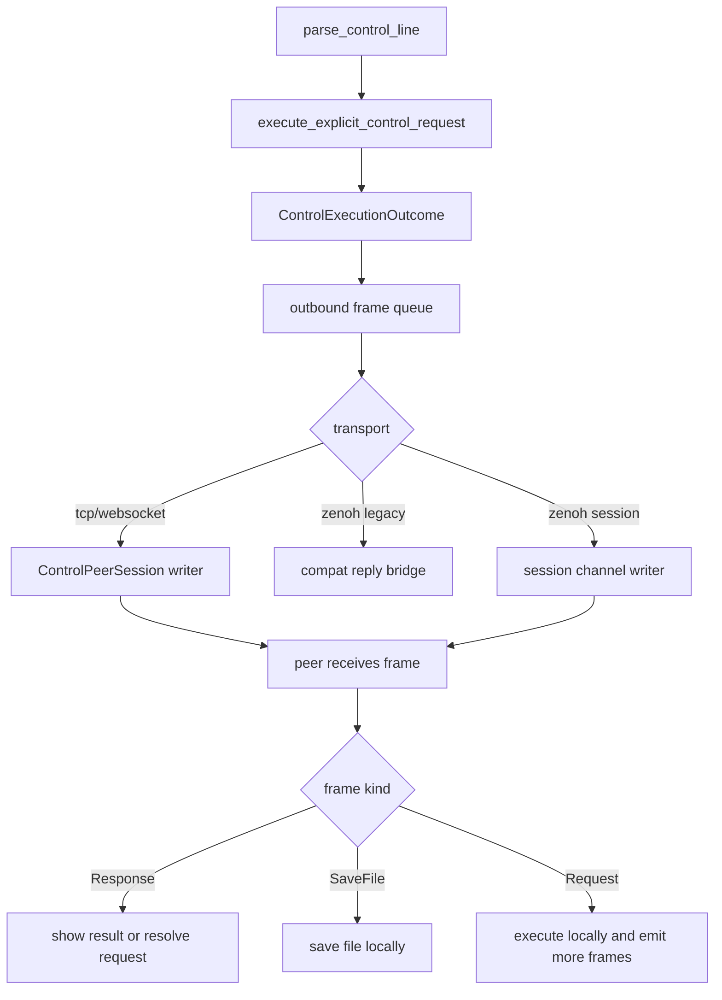
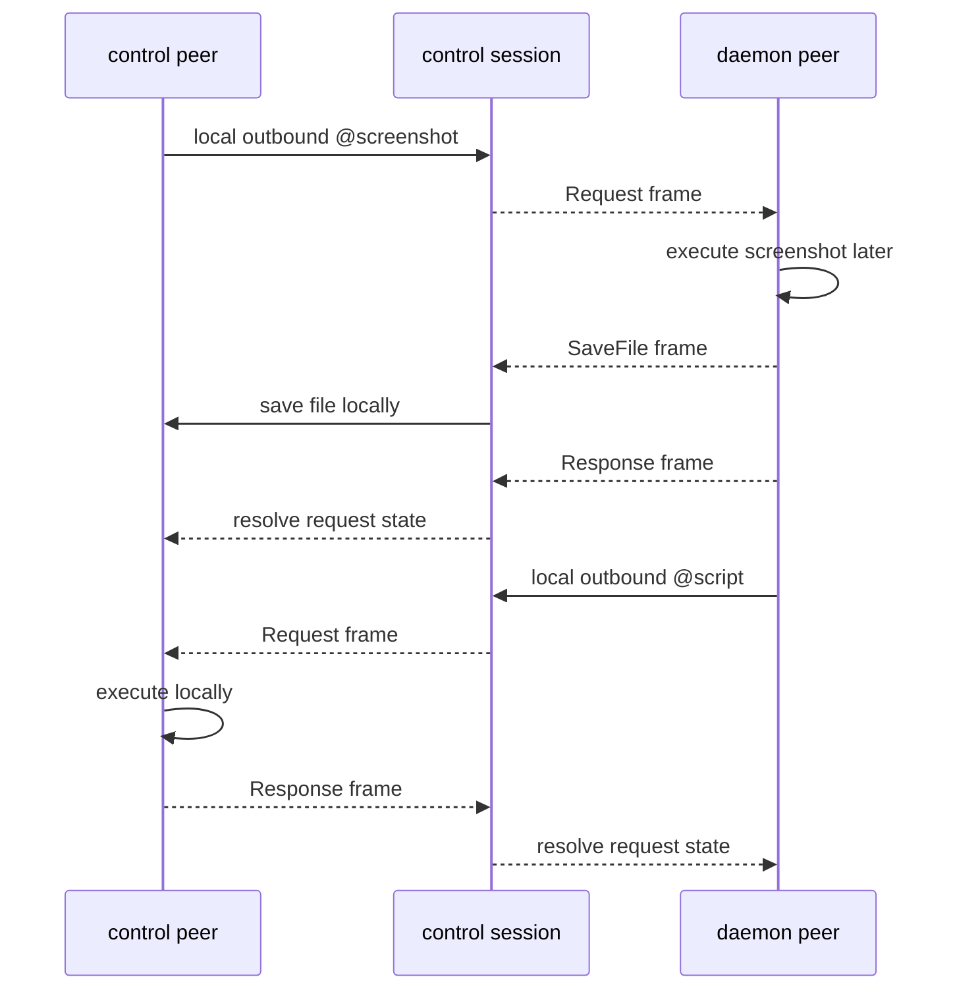

# Control Frame / Outbound 抽象重构计划

## 意图

这份计划承接 `specs/bidirectional-control-plane-plan.md`。
目标不是直接实现 screenshot。
而是先把当前“执行一条请求,回一条字符串”的控制核心,升级成能承载双向控制帧的基础设施。

如果这层不先改,后面无论是 `@savefile`、`@screenshot`、还是 daemon 主动下发 `@script`,
都会继续被旧的单向 `@response` 心智卡住。

## Scope

- In:
  - 重构 control core 的返回抽象
  - 定义统一的 control frame 模型
  - 规划 TCP / WebSocket 的双向 session 演进
  - 规划 Zenoh 从单向 query/reply 过渡到双向 session/channel
  - 规划 `@savefile` 的接收端落盘接入点
- Out:
  - 本轮不实现 screenshot backend
  - 本轮不实现 macOS `sck-rs` / `xcap`
  - 本轮不实现完整 Zenoh 双向 channel 代码
  - 本轮不落真实文件权限 / Screen Recording 细节

## 当前瓶颈

### 1. `control_core` 只会回一条字符串

`src/control_core.rs` 现在的关键边界是:

- `execute_explicit_control_request(...) -> String`
- `parse_and_execute_explicit_control_line(...) -> String`

这意味着:

- 执行结果必须被压扁成单条 `@response ...`
- transport 也默认“读一条,回一条”

这和新的双向控制目标冲突。

### 2. `ActionExecutionResult` 只表达 shell stdout/stderr

`src/control_actions.rs` 里的 `ActionExecutionResult` 当前只有:

- `exit_code`
- `stdout`
- `stderr`

它更像“shell 命令输出”。
不像“控制面结果帧”。

所以它不适合直接承载:

- `@savefile`
- 将来的结构化结果
- daemon 主动下发控制指令

### 3. transport loop 默认是同步 request/reply

`src/shell.rs` 里的几个 control loop 都有同一个形状:

1. 读一条输入
2. 本地执行
3. 写一条结果

这在 TCP / WebSocket 上勉强还能演进。
但在 Zenoh 上当前直接固化成:

- client 发 query
- daemon 回 single reply

这就是新的主阻塞点。

## 目标形态

### 1. 统一 frame 模型

先把“控制面到底在收发什么”说清楚。

建议新增统一 frame 抽象:

```rust
enum ControlFrame {
    Request(ControlRequestFrame),
    Response(ControlResponseFrame),
    SaveFile(SaveFileFrame),
}
```

其中:

- `Request` 表示显式控制指令,例如 `@key`、`@script`、`@screenshot`
- `Response` 表示请求失败或文本/数值结果
- `SaveFile` 表示“请接收端直接落文件”

### 2. 统一 outbound 抽象

执行结果不再直接是 `String`。

建议重构成:

```rust
struct ControlExecutionOutcome {
    outbound_frames: Vec<ControlFrame>,
}
```

这样一来:

- 普通 `@key` 成功可以只产出一个 `Response`
- screenshot 成功可以只产出一个 `SaveFile`
- 或产出 `SaveFile + Response(meta)` 的组合
- 后续 daemon 主动下发控制请求时,也复用同一 frame queue

### 3. 统一 session 抽象

建议增加 `ControlPeerSession` 概念,负责:

- 接收 inbound frame
- 将本地主动产生的 outbound frame 送出
- 维持 request id 关联
- 维持 transport 无关的消息队列

核心思想是:

- parser / executor 不直接写 socket 或 Zenoh reply
- 它们只产出 `ControlFrame`
- session 层负责把 frame 发出去

## 分阶段实施计划

## Phase 1: 先改 core 抽象,不改协议语法

### 目标

先把最深层的“结果抽象”改对。
不急着先让 daemon 主动发任何东西。

### 主要改动

- 新增 `src/control_frames.rs`
  - 定义 `ControlFrame`
  - 定义 `SaveFileFrame`
  - 定义 `ControlExecutionOutcome`

- 重构 `src/control_core.rs`
  - `execute_explicit_control_request(...) -> ControlExecutionOutcome`
  - `parse_and_execute_explicit_control_line(...) -> ControlExecutionOutcome`

- 重构 `src/control_actions.rs`
  - `ActionExecutionResult` 不再直接暴露 `stdout/stderr` 唯一语义
  - 改成更贴近 frame 的中间结果,或者由上层统一把旧结果包成 `ControlFrame::Response`

### 验收

- 现有 `@ping` / `@key` / `@script` 行为不变
- 只是内部从“返回 String”变成“返回 frame 集合”
- 所有现有 control 单元测试仍通过

## Phase 2: 在 TCP / WebSocket 上接入 outbound frame queue

### 目标

先用最容易做成真正双向的 transport 验证新模型。

### 主要改动

- 新增 `src/control_session.rs`
  - `ControlPeerSession`
  - outbound frame queue
  - frame writer

- 重构 `src/shell.rs`
  - `run_control_receiver_with_executor()`
  - `run_control_receiver_messages()`

让它们从:

- 读一条 -> 写一条字符串

变成:

- 读一条 -> 得到 `ControlExecutionOutcome`
- outcome 里的每个 frame 依次送进 outbound writer

### Phase 2 结束时应支持

- `@savefile` 被 transport 正常发送
- 接收端可以识别 `@savefile`
- 接收端把 `data` 自动落盘

### 验收

- TCP control path 能处理 `SaveFileFrame`
- WebSocket control path 能处理 `SaveFileFrame`
- 不在终端打印 `data` 本体
- 本地实际生成文件

## Phase 3: 让 socket-based control 真正双向

### 目标

不只是“执行对端请求并回结果”。
还要让本地 peer 自己能主动发 control frame。

### 主要改动

- 给 `ControlPeerSession` 加本地主动发送入口
- 明确本地输入源
  - CLI stdin
  - 本地业务逻辑
  - future hooks

### 最小成功标准

- control 发 `@script` 给 daemon,daemon 执行
- daemon 主动发 `@script` 给 control,control 执行
- control 发 `@screenshot`,daemon 回 `@savefile`
- daemon 主动发 `@savefile`,control 自动落盘

### 验收

- TCP / WebSocket 证明“双方都能发,双方都能执行”
- 这时 screenshot 才不再依赖特殊补丁

## Phase 4: 重新定义 Zenoh 的 transport 角色

### 目标

把 Zenoh 从单向 RPC 模式上提到真正双向控制 session。

### 关键决定

不要继续在旧 `query -> single reply` 路径上叠功能。

Zenoh 新模型建议拆两层:

1. **bootstrap / discovery**
   - 保留当前 target resolve、liveliness、namespace 推断
2. **session channel**
   - 建立双向 frame channel

建议 keyexpr 方向:

```text
rdog/<ns>/session/<session_id>/to-daemon
rdog/<ns>/session/<session_id>/to-control
```

### 为什么不继续硬用 query/reply

因为 query/reply 天然表达的是:

- 请求方固定
- 响应方固定
- 一次请求一个 reply

这和“daemon 也能主动发控制指令”天然冲突。

### 验收

- session 建立后双方都能主动发 frame
- `@savefile` 可跨 Zenoh channel 送达
- 不再把 screenshot 结果硬塞进 reply

## 推荐实施顺序

1. **Add** `src/control_frames.rs`,先定义统一 frame 模型
2. **Refactor** `src/control_core.rs` 返回 `ControlExecutionOutcome`
3. **Refactor** `src/control_actions.rs`,收口旧的 `ActionExecutionResult`
4. **Add** `src/control_session.rs`,先做 TCP/WebSocket outbound frame queue
5. **Refactor** `src/shell.rs`,让 socket path 支持 `SaveFileFrame`
6. **Implement** `@savefile` 接收端落盘,但暂不实现 screenshot backend
7. **Verify** TCP / WebSocket 的双向 control smoke
8. **Design** Zenoh 双向 session keyexpr 和 bootstrap 边界
9. **Implement** Zenoh 从 query/reply 到 session/channel 的迁移
10. **Re-enable** screenshot 作为双向 control 的一个普通 capability

## 文件落点

- `src/control_frames.rs`
  - 新增
- `src/control_session.rs`
  - 新增
- `src/control_core.rs`
  - 核心返回抽象改造
- `src/control_actions.rs`
  - 执行结果抽象改造
- `src/control_protocol.rs`
  - 后续补 `@savefile`
- `src/shell.rs`
  - TCP / WebSocket session loop 改造
- `src/control_transport.rs`
  - 落盘前后的 frame write/read 适配
- `src/zenoh_control.rs`
  - 从 query/reply 迁移到双向 session/channel
- `tests/control_lanes.rs`
  - frame 级测试
- `tests/control_mode.rs`
  - session 行为测试
- `tests/zenoh_router_client.rs`
  - Zenoh 迁移测试

## 风险与缓解

### 风险 1: 一次动太多 transport

#### 缓解

- 先做 Phase 1 和 Phase 2
- 先让 TCP / WebSocket 跑通新 frame 模型
- Zenoh 单独作为下一阶段

### 风险 2: 旧测试大量失效但没有抓手

#### 缓解

- 在 Phase 1 明确保住旧行为
- 先改内部抽象,不改对外协议
- 每一阶段都有稳定的 smoke 命令和集成测试

### 风险 3: screenshot 需求继续绑架 core

#### 缓解

- 计划里明确禁止先写 screenshot backend
- 先把 `@savefile` 作为通用能力落地
- screenshot 只作为第一个消费方

## 验证计划

### 单元测试

- `ControlExecutionOutcome` 能承载 0/1/N 个 outbound frame
- 旧 `@ping` / `@key` / `@script` 仍正确映射成 `Response`
- `SaveFileFrame` JSON 编解码稳定

### 集成测试

- TCP control path:
  - `@script` 请求仍可执行
  - `@savefile` 能被接收并落盘
- WebSocket control path:
  - 与 TCP 行为一致
- 双向 smoke:
  - 双方都能主动下发 `@script`

### Zenoh 测试

- bootstrap/discovery 不回退
- session/channel 建立后双向发 frame

## Open questions

- `@response#id:{...}` 是否要在语法层正式支持 header-style id,还是继续只保留 JSON object 中的 `id`
- `@savefile` 的文件名冲突策略,是强制覆盖、自动改名,还是由接收端策略决定
- Zenoh session channel 的 session_id 应由谁生成: control 发起方、daemon,还是 bootstrap 协商

## 流程图



## 时序图



## 下一步建议

如果你确认这份计划方向没问题,下一步最适合直接开始的不是 `@screenshot`。
而是先写 Phase 1 的代码改造:

- 新增 `src/control_frames.rs`
- 把 `execute_explicit_control_request()` 从 `String` 升级成 `ControlExecutionOutcome`

这是后面所有具体能力的共同地基。
