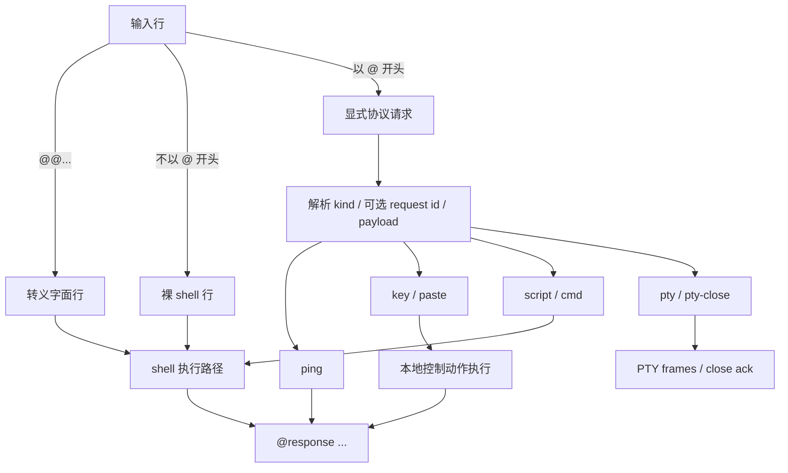
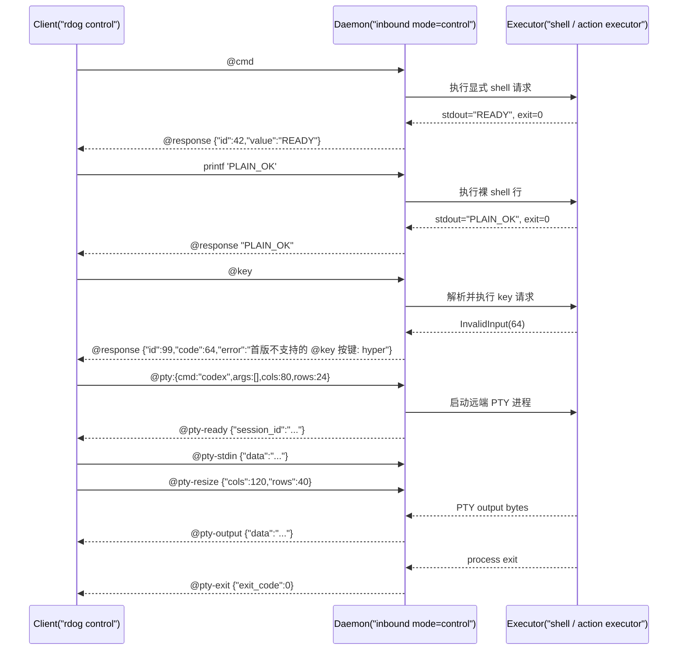

# Line Control Protocol 规格

## 目标

这份文档定义 `rustdog` 当前 line-control 协议的正式行为。

它覆盖 5 个核心问题:

1. 哪些输入会被当成显式协议请求
2. 哪些输入仍然保留为普通 shell 行
3. `@response` 的响应格式是什么
4. 可选 request id 如何和长期控制连接共存
5. `@pty` 这种长会话 frame 如何和普通 line-control 共存

这份文档是当前 line-control 协议的单一规格入口。
后续修改 `src/control_protocol.rs`、`src/shell.rs`、`tests/control_lanes.rs`、`tests/control_mode.rs` 时,都应先回读这里。

---

## 术语

- **line-control**: `daemon inbound mode=control` 或 `connect --mode control` 下的按行协议模式
- **显式协议请求**: 以 `@` 开头、符合 line-control 语法的请求
- **裸 shell 行**: 不以 `@` 开头的普通 shell 文本
- **request id**: 只绑定显式协议请求的可选无符号整数标识
- **PTY session**: 由 `@pty` 打开的远端伪终端会话,输出不塞进 `@response`

---

## 输入分类

line-control 会把每一行输入分成 3 类:

### 1. 转义字面行

以 `@@` 开头时,去掉一个 `@`,然后把结果当作普通 shell 行执行。

示例:

```text
@@echo hi
```

等价于把这行 shell 文本发给执行层:

```text
@echo hi
```

### 2. 显式协议请求

以 `@` 开头且满足协议语法时,进入 line-control 协议解析层。

当前显式协议请求包括:

```text
@ping
@ping#1
@capabilities
@capabilities#2
@bootstrap
@bootstrap#3:{mode:"gui",capability_policy:"fresh",observe:{mode:"hybrid",include_screenshot:true,include_ax:true,include_windows:true,ax_required:false,ax_mode:"interactive"}}
@key:"right-option"
@key#7:"right-option"
@key#7:{key:"right-option",hold_ms:200,mode:"press_release"}
@paste
@paste#8
@paste:"hello"
@observe#9
@observe#10:{mode:"hybrid",include_screenshot:true,include_ax:true,include_windows:true,ax_required:false,ax_mode:"interactive"}
@observe#11:{mode:"window",target:{app:"System Settings"},limit:5}
@mouse-move#10:{x:1200,y:540,coordinate_space:"os-logical"}
@mouse-move#11:{dx:10,dy:-5,coordinate_space:"relative"}
@mouse-button#12:{button:"left",mode:"press"}
@mouse-button#13:{button:"left",mode:"release"}
@click#14:{x:1200,y:540,button:"left",count:1}
@click#15:{target:{ref:"@e4",observation_id:"obs-123"},button:"left",count:1}
@click#16:{target:{selector_id:"sel-v1-...",auto_refind:false},button:"left"}
@drag#15:{from:{x:900,y:420},to:{x:1200,y:540},button:"left"}
@wheel#16:{x:1200,y:540,delta_y:-3}
@screenshot#17:{include_ax:true,ax_required:false}
@ax-tree#18:{scope:"windows",depth:4,max_elements:1000}
@ax-press#19:{target:{id:"pid:123/window:0/path:3.2"}}
@selector-get#20:{selector_id:"sel-v1-...",include_history:true}
@selector-resolve#21:{selector_id:"sel-v1-...",dry_run:true,include_explanations:true}
@selector-refind#22:{selector_id:"sel-v1-...",policy:"safe",min_confidence:0.9,include_explanations:true}
@script:"printf READY"
@script#42:"printf READY"
@cmd:"printf READY"
@cmd#42:"printf READY"
@pty:"codex"
@pty:"codex resume 019e02de-8814-72a2-ab0c-b06263cc0fba"
@pty:{cmd:"codex",args:[],cols:80,rows:24}
@pty-close:{session_id:"..."}
@pty-detach:{session_id:"..."}
@pty-attach:{session_id:"..."}
```

### 3. 裸 shell 行

不以 `@` 开头时,继续按普通 shell 行执行。

示例:

```text
printf 'PLAIN_OK'
```

这条路径必须一直保留。
它不会因为新增了 `@cmd#id` 就被移除或并入 request-id 协议。

---

## 显式协议请求语法

### 基本语法

```text
@<kind>
@<kind>#<request_id>
@<kind>:"<payload>"
@<kind>#<request_id>:"<payload>"
@pty:"codex"
@key:{key:"...",hold_ms:200,mode:"press_release"}
@key#<request_id>:{key:"...",hold_ms:200,mode:"press_release"}
```

### 当前支持的 kind

#### 无 payload

- `ping`
- `capabilities`
- `bootstrap`
- `observe`
- `paste`
- `screenshot`

#### 需要 payload

- `key`
- `paste`
- `script`
- `cmd`
- `pty`
- `pty-close`
- `screenshot`
- `mouse-move`
- `mouse-button`
- `click`
- `drag`
- `wheel`
- `ax-tree`
- `ax-find`
- `ax-get`
- `ax-focus`
- `ax-scroll`
- `ax-action`
- `ax-press`
- `ax-set-value`
- `type-text`
- `window-find`
- `window-activate`
- `window-close`
- `web-find`
- `web-act`
- `gui-bench`
- `bootstrap`
- `observe`
- `selector-get`
- `selector-resolve`
- `selector-refind`
- `savefile`
- `pty-detach`
- `pty-attach`

### request id 规则

- request id 是可选的
- 只允许无符号整数
- 只绑定显式协议请求
- 普通 shell 行不支持 request id

合法示例:

```text
@ping#1
@capabilities#2
@cmd#42:"printf READY"
@key#7:"right-option"
```

非法示例:

```text
@ping#
@ping#abc
@ping#42:"x"
```

---

## 显式协议请求语义

`@pty` 是少数同时接受字符串和对象两种 payload 的请求之一:

- `@pty:"codex"`
  - 语义等价于 `cmd="codex"` 且 `args=[]`
- `@pty:"codex resume 019e02de-8814-72a2-ab0c-b06263cc0fba"`
  - 语义等价于 `cmd="codex"` 且 `args=["resume","019e02de-8814-72a2-ab0c-b06263cc0fba"]`
- `@pty:{cmd:"codex",args:["--profile","fast"],cols:120,rows:40}`
  - 用于显式传 args 和终端尺寸

字符串简写会做常见 shell-style 参数切分。
它适合人类临时手输。
对象写法仍是 canonical 入口,适合程序和智能体生成,也适合指定 `cols/rows`。

### `@ping`

用于最小活性检查。

示例:

```text
@ping
@ping#1
```

### `@capabilities`

用于读取当前 daemon 的结构化能力诊断。
这个请求不接受 payload。

示例:

```text
@capabilities
@capabilities#2
```

返回值使用 `rdog.capabilities.v1`:

```json
{"kind":"capabilities","schema":"rdog.capabilities.v1","status":"complete","capabilities":{"screenshot":{"status":"available"},"accessibility":{"status":"permission_denied","error_code":77}}}
```

语义要求:

- `permission_denied` 对应 code `77`,表示能力存在但当前进程缺权限。
- `unsupported` 对应 code `78`,表示当前平台或 backend 不支持该能力。
- macOS Accessibility、macOS Screen Recording、Windows UIPI 和 Linux display backend 状态必须以结构化字段暴露,不能让 agent 按 OS 名字猜。
- `gui_agent_recipe` 固定为 `@capabilities -> observe -> locate -> activate_or_focus -> semantic_action -> verify -> fallback_recipe`。

### `@bootstrap`

用于一次性读取只读 preflight 状态。
它组合 liveness、capabilities 和可选 observe bundle,不执行点击、输入、滚动、focus、activate 或鼠标移动。

示例:

```text
@bootstrap
@bootstrap#3:{mode:"basic",capability_policy:"fresh"}
@bootstrap#4:{mode:"gui",capability_policy:"fresh",observe:{mode:"hybrid",include_screenshot:true,include_ax:true,include_windows:true,ax_required:false,ax_mode:"interactive"}}
```

请求字段:

- `mode`: `basic` 或 `gui`,默认是 `basic`。
- `capability_policy`: 第一版只允许 `fresh`,默认是 `fresh`。
- `observe`: 只在 `mode:"gui"` 下允许。省略时使用默认 `@observe` hybrid 请求。
- `include_trace`: 是否返回 trace,默认是 true。

拒绝字段:

- `action`
- `click`
- `press`
- `type`
- `key`
- `allow_side_effects`

返回值使用 `rdog.bootstrap.v1`:

```json
{"kind":"bootstrap","schema":"rdog.bootstrap.v1","status":"degraded","mode":"gui","liveness":{"status":"complete","reply":"pong"},"capability_policy":{"requested":"fresh","effective":"fresh","cache_ttl_ms":0},"capabilities":{"kind":"capabilities","schema":"rdog.capabilities.v1"},"observation":{"kind":"observe","schema":"rdog.observe.v1"},"lanes":{"visual":{"status":"permission_denied"},"accessibility":{"status":"complete"},"windows":{"status":"complete"}},"errors":[{"lane":"visual","status":"permission_denied","code":77}],"frames":{"savefile_count":0,"final_response_order":"savefiles-before-response"}}
```

`capability_policy:"cached"` 是保留字段,当前必须返回结构化错误:

```json
{"kind":"bootstrap","schema":"rdog.bootstrap.v1","status":"blocked","error_code":"BOOTSTRAP_CAPABILITY_CACHE_UNIMPLEMENTED","message":"capability_policy:\"cached\" is reserved for a future TTL cache; use capability_policy:\"fresh\""}
```

Zenoh 下所有 `@bootstrap` 都必须走 session channel,包括 `mode:"basic"`。
旧 daemon 可用 fallback:在同一个 `rdog control` session 里发送 `@ping#1`、`@capabilities#2`、`@observe#3:{mode:"hybrid",include_screenshot:true,include_ax:true,include_windows:true,ax_required:false,ax_mode:"interactive"}`。

### `@observe`

用于一次性读取 GUI 观察状态。
它是只读 facade,不会激活窗口、聚焦元素、按按钮、写文本、滚动或移动鼠标。

示例:

```text
@observe
@observe#9:{mode:"hybrid",include_screenshot:true,include_ax:true,include_windows:true,ax_required:false,ax_mode:"interactive"}
@observe#10:{mode:"window",target:{app:"System Settings"},limit:5}
@observe#11:{mode:"ax",target:{app:"System Settings"},ax_mode:"interactive",ax_required:false}
@observe#12:{mode:"visual",include_screenshot:true,include_manifest:true}
```

请求字段:

- `mode`: `hybrid`、`visual`、`ax`、`window`,默认是 `hybrid`。
- `target`: 可选对象,支持 `app` / `process` / `process_name`、`bundle_id`、`window_title` / `title`、`window_title_contains` / `title_contains`。
- `include_screenshot`: 是否采集 visual section。
- `include_ax`: 是否采集 accessibility section。
- `ax_required`: 为 true 时,AX 权限或 backend 失败会让请求失败。
- `include_windows`: 是否采集 window section。
- `include_manifest`: visual section 是否返回 manifest `@savefile`。
- `include_refs`: 是否返回 `refs` 摘要。
- `include_selectors`: 是否返回 `selectors` 摘要。
- `limit`: 限制 window/ref sample 数量,必须大于 0。
- `ax_mode`、`ax_depth`、`ax_max_elements`、`ax_include_values`: 复用 AX tree 预算模型。

返回值使用 `rdog.observe.v1`:

```json
{"kind":"observe","schema":"rdog.observe.v1","status":"complete","mode":"hybrid","primary_observation_source":"accessibility","observation":{"observation_id":"obs-..."},"refs":{"count":3,"sample":[{"section":"accessibility","observation_id":"obs-...","ref":"@e1","kind":"ax-element","name":"OK"}]},"selectors":{"count":3,"sample":[]},"recovery":{"selector_refind_available":true,"scoring_version":"rdog.selector.score.v1"}}
```

语义要求:

- `status` 可以是 `complete`、`partial`、`permission_denied` 或 `unsupported`。
- visual 截图仍通过 `@savefile` 返回 image / manifest,再由最终 `@response` 收口。
- `target` 当前只过滤 window 和 AX summary;visual section 仍是 virtual desktop screenshot,并应标记 `target_applied:false`。
- `mode:"hybrid"` 不创建一个合并 ref 命名空间。`refs.sample[]` 里的每个条目都必须带 `section` 和自己的 `observation_id`。
- 旧的 `@screenshot include_ax`、`@ax-tree`、`@ax-find`、`@ax-get`、`@window-find` 仍是稳定 lower-level lanes。

### `@key`

用于本地输入模拟。
成功时通常没有 stdout,因此成功响应通常是数值 `0`。

当前支持两种 payload 形态:

1. 旧字符串写法
2. 新对象写法

#### 旧字符串写法

```text
@key:"F11"
@key#7:"right-control"
```

旧字符串写法默认等价于:

```text
key = "right-control"
hold_ms = 200
mode = "press_release"
```

#### 新对象写法

```text
@key:{key:"right-control"}
@key#7:{key:"right-control",hold_ms:200,mode:"press_release"}
```

对象字段规则:

- `key`: 必填
- `hold_ms`: 可选,默认 `200`
- `mode`: 可选,默认 `press_release`

`mode` 当前支持:

- `press_release`
- `press`
- `release`

行为定义:

- `press_release`
  - 按下 modifiers
  - 按下主键
  - 等待 `hold_ms`
  - 松开主键
  - 逆序松开 modifiers
- `press`
  - 按下 modifiers
  - 按下主键
  - 不自动松开
- `release`
  - 先松开主键
  - 再逆序松开 modifiers
  - 不消费 `hold_ms`

示例:

```text
@key:"F11"
@key#7:"right-control"
@key#9:"right-control+right"
@key#7:{key:"right-control",hold_ms:200,mode:"press_release"}
```

平台说明:

- `left-control` / `right-control`
- `left-shift` / `right-shift`
  - 这些 side-specific 名称是跨平台可用的当前公共子集
- `right-option` / `right-command`
  - 当前只在 macOS 暴露

### `@paste`

用于当前远端前台焦点的系统粘贴。

```text
@paste
@paste#8
```

语义:

- 不带 payload。
- 不需要 target。
- 依赖远端当前焦点。
- macOS 发送 `Cmd+V`。
- Windows / Linux 发送 `Ctrl+V`。
- 这是热键粘贴,不是无热键文本写入。

成功响应会说真话:

```json
{"kind":"paste","delivery":"global-hotkey","delivered_via":"cmd-v","used_hotkey":true,"used_keyboard":true,"requires_focus":true,"performed":true,"status":"ok"}
```

兼容入口:

```text
@paste:"hello"
```

这是 legacy text injection,保留给旧客户端。
新 agent 不应把它当作稳定普通文本输入接口。
普通文本输入优先使用:

```text
@type-text#30:{target:{id:"pid:123/window:0/path:8.2"},text:"hello",mode:"ax-value"}
@ax-set-value#31:{target:{id:"pid:123/window:0/path:8.2"},value:"hello",mode:"replace"}
```

### 鼠标控制

鼠标控制复用截图 manifest 的 `coordinate_space:"os-logical"`。
默认 `@screenshot#id` 返回的 manifest 是坐标真相源。

常用命令:

```text
@mouse-move#10:{x:1200,y:540,coordinate_space:"os-logical"}
@mouse-move#11:{dx:10,dy:-5,coordinate_space:"relative"}
@mouse-button#12:{button:"left",mode:"press"}
@mouse-button#13:{button:"left",mode:"release"}
@click#14:{x:1200,y:540,button:"left",count:1,hold_ms:80}
@click#17:{target:{ref:"@e4",observation_id:"obs-123"},button:"left",count:1}
@click#18:{target:{selector_id:"sel-v1-...",auto_refind:false},button:"left"}
@click#19:{target:{selector_id:"sel-v1-...",auto_refind:true,policy:"safe",min_confidence:0.9},button:"left"}
@drag#15:{from:{x:900,y:420},to:{x:1200,y:540},button:"left",duration_ms:450,steps:24}
@drag#20:{from:{ref:"@e1",observation_id:"obs-123"},to:{x:1200,y:540},button:"left"}
@wheel#16:{x:1200,y:540,delta_y:-3}
@wheel#21:{target:{ref:"@e8",observation_id:"obs-123"},delta_y:-3}
@mouse-move#22:{target:{ref:"@e9",observation_id:"obs-123"}}
```

行为边界:

- 鼠标是 fallback lane。能用 `@ax-action`、`@ax-set-value`、`@type-text`、`@ax-scroll`、`@window-activate` 时,不要默认改走鼠标。
- 优先使用最新 observation 的 `target:{ref,observation_id}` / `from:{ref,observation_id}` / `to:{ref,observation_id}`。
  daemon 会在动作前重新解析当前 AX/window rect,不会把 observation 里的旧 rect 当执行真相源。
- 坐标 payload 继续兼容,成功响应会带 `target_resolution.source:"coordinate_fallback"`。
- selector target 默认 no-action。`auto_refind:false` 返回 `performed:false`、`gate_decision:"handoff_required"` 和 recovery `@selector-refind`。
- `auto_refind:true` 是显式 opt-in。只有 typed selector-refind 返回 `decision:"rebound"` 且 fresh target 验证到当前 rect 后才执行 mouse。
  `blocked`、`not_found`、`needs_disambiguation`、低置信度、rect 缺失都必须保持 no-action。
- `@click`、`@drag` 和带 `x/y` 的 `@wheel` 只接受 `coordinate_space:"os-logical"`。
- `@mouse-move` 可以使用 `coordinate_space:"relative"` 和 `dx/dy` 做安全的相对移动。
- `@mouse-button mode:"press"` 不会自动松开。
  需要恢复时发送对应的 `mode:"release"`。
- 组合动作如果在按下按钮后失败,daemon 会尽量释放按钮,并把恢复结果写入错误文本。

成功响应是结构化 mouse value:

```text
@response {"id":10,"value":{"kind":"mouse","action":"move","backend":"enigo","status":"ok","coordinate_space":"os-logical","x":1200,"y":540}}
```

### AX 结构读取与 AXPress

AX 能力是 macOS UI 结构层。
它和鼠标点击不是一回事。
鼠标命令控制指针坐标,AX 命令控制可访问性元素。

截图可以可选携带 AX snapshot:

```text
@screenshot#17:{include_ax:true,ax_required:false,ax_depth:4,ax_max_elements:1000,ax_include_values:true}
@screenshot#18:{include_ax:true,ax_required:true}
```

字段语义:

- `include_ax`: 默认 `false`。为 `false` 时不调用 AX provider。
- `ax_required`: 默认 `false`。为 `false` 时,AX 权限不足不会让截图失败,manifest 会写入 `accessibility.capture_status:"permission_denied"`。
- `ax_required:true`: AX 权限不足时整个请求返回 code 77。
- `ax_depth`: 默认 `4`,必须大于 0。
- `ax_max_elements`: 默认 `1000`,必须大于 0。
- `ax_include_values`: 默认 `true`,但 secure text 仍必须 redacted。

manifest 中的 `accessibility` 字段使用 `rdog.ax.v1` schema。
AX rect 坐标继续使用 screenshot manifest 的 `coordinate_space:"os-logical"`。

独立读取 AX tree:

```text
@ax-tree#30:{scope:"windows",depth:4,max_elements:1000,include_values:true}
```

Phase 1 返回 structured `@response`,不走 `@savefile`:

```text
@response {"id":30,"value":{"kind":"ax-tree","schema":"rdog.ax.v1","platform":"macos","capture_status":"complete",...}}
```

执行 AXPress:

```text
@ax-press#31:{target:{id:"pid:123/window:0/path:3.2"}}
@ax-press#32:{target:{process:"System Information",window_title:"关于本机",role:"AXButton",description:"关闭按钮"}}
```

成功响应:

```text
@response {"id":31,"value":{"kind":"ax","action":"press","backend":"macos-accessibility","target_id":"pid:123/window:0/path:3.2","performed":true,"status":"ok"}}
```

错误边界:

- ambiguous 或 stale target 返回 code 64。
- Accessibility 权限不足返回 code 77。
- 非 macOS 或 backend 不支持返回 code 78。

### `@script`

表示显式远端代码执行。
其语义是“在接收端主机本地执行命令文本”。

### `@cmd`

表示显式 shell 请求别名。
它的执行语义和现有 shell 请求路径保持一致。

它存在的意义不是新开第二套执行器,而是给 shell 请求提供一个**显式协议入口**,从而支持 request id。

换句话说:

- 你要保留终端式输入时,继续写裸 shell 行
- 你要把 shell 请求纳入 request-id 协议时,写 `@cmd#id:"..."`

### `@pty`

打开一个真实远端 PTY session。
它面向 `codex`、shell、vim、REPL 这类要求 stdin 是 terminal 的程序。

示例:

```text
@pty:"codex"
@pty:"codex resume 019e02de-8814-72a2-ab0c-b06263cc0fba"
@pty:{cmd:"codex",args:["--profile","fast"],cols:120,rows:40}
```

字段:

- `cmd`: 实际启动的程序路径或名称
- `args`: 传给远端程序的其余参数,不再重复包含 `cmd` 本身
- `cols` / `rows`: 初始终端尺寸

兼容性说明:

- 当前 parser 仍兼容 legacy `argv:["codex","--profile","fast"]`
- 但 canonical wire 口径已经收敛为 `cmd + args`
- `rdog control --pty -- ...` 生成的 payload 也使用 `args`

`rdog control TARGET --pty -- COMMAND ...` 是这个协议请求的人类 CLI sugar。

进入 PTY streaming 后:

- 客户端输入会转成 `@pty-stdin {"encoding":"base64","data":"..."}`
- 客户端窗口尺寸变化会转成 `@pty-resize {"cols":...,"rows":...}`
- 服务端输出会转成 `@pty-output {"encoding":"base64","data":"..."}`
- 远端进程退出时返回 `@pty-exit {"exit_code":...}`
- 控制端 detach 时返回 `@pty-detached {"session_id":"..."}`
- 新控制端 attach 成功时返回 `@pty-attached {"session_id":"..."}`
- `@key` / `@script` / `~.` / `Ctrl-C` / `Ctrl-D` 都只是远端 PTY 程序输入

### `@pty-close`

按 session id 关闭一个活动 PTY session。
这是 out-of-band 控制请求,不是 PTY stdin 里的 escape。
`session_id` 来自对应会话的 `@pty-ready` frame。

示例:

```text
@pty-close:{session_id:"..."}
```

CLI sugar:

```bash
rdog control TARGET --pty-close SESSION_ID
```

### `@pty-detach`

从当前 attached 控制端解绑一个活动 PTY session,但不结束远端进程。
这是 out-of-band 控制请求,不是 PTY stdin 里的 escape。

示例:

```text
@pty-detach:{session_id:"..."}
```

CLI sugar:

```bash
rdog control TARGET --pty-detach SESSION_ID
```

### `@pty-attach`

重新接管一个 detached PTY session。
这是 out-of-band 控制请求,不是 PTY stdin 里的 escape。

示例:

```text
@pty-attach:{session_id:"..."}
```

CLI sugar:

```bash
rdog control TARGET --pty-attach SESSION_ID
```

---

## 响应语义

大多数 line-control 请求最终返回一条 `@response ...`。

它表达的是**本次请求的结果**。
它不是客户端退出信号。

有两个例外:

- 文件型结果可以先返回一个或多个 `@savefile ...`,再返回最终 `@response ...`
  例如默认 `@screenshot#id` 会先返回 virtual-desktop JPEG,再返回 manifest JSON,最后返回 `@response ...screenshot-bundle...`
- 如果 composite `@screenshot` / `@observe include_screenshot` 触发 freshness / stale guard,请求必须在输出 `@savefile` 之前终止,并返回结构化错误:
  `@response {"id":7,"code":70,"kind":"screenshot-stale-frame","error_code":"SCREENSHOT_STALE_FRAME","guard_policy":"reject-consecutive-identical-composite-fingerprint",...}`
  这表示连续捕获到完全相同的显示器布局和像素指纹,疑似截图后端返回旧帧。客户端应停止使用本次视觉证据,保留错误 payload 供后续分析。
- `@pty` 会切入 PTY frame 流,返回 `@pty-ready` / `@pty-output` / `@pty-exit` / `@pty-closed` / `@pty-detached` / `@pty-attached`

### 无 request id 的响应

#### 成功且无输出

```text
@response 0
```

适用场景:

- legacy `@key` 成功且没有结构化 report
- legacy `@paste:"text"`

鼠标控制成功时不是 `0`,而是结构化 mouse value。
这样 code agent 可以直接确认执行动作、坐标语义和 backend。
AX control 成功时也不是 `0`,而是结构化 AX value。
裸 `@paste` 成功时也不是 `0`,而是结构化 paste value。
这样 agent 可以看到它使用了热键、依赖焦点,并知道实际投递路径是 `cmd-v` 还是 `ctrl-v`。

#### 成功且只有字符串输出

```text
@response "READY"
@response "pong"
```

适用场景:

- `@ping`
- `@script`
- `@cmd`
- 裸 shell 行

#### 成功但包含复杂 shell 结果

当请求产生非零退出码或 stderr 时,返回对象:

```text
@response {"exit_code":1,"stdout":"","stderr":"..."}
```

#### 协议或动作错误

```text
@response {"code":64,"error":"首版不支持的 @key 按键: hyper"}
```

### `rdog control` 的本地显示

wire protocol 仍然是上面的 `@response ...`。
`rdog control` 只在本地显示层做一层人类可读优化。

当本地 stdin 和 stdout 都是 TTY 时:

- `@response "AGENTS.md\nCargo.toml\n"` 会显示成真实多行文本
- `@response 0` 会显示成 `0`
- 错误对象、复杂 shell 结果对象、带 request id 的对象保持原始 `@response {...}`

当 stdin 或 stdout 不是 TTY 时,例如 pipe、redirect、程序 stdio:

- 输出保持原始协议行
- 这样自动化调用方仍然可以按 `@response ...` 做稳定解析

### 带 request id 的响应

#### 成功

统一包成:

```text
@response {"id":42,"value":"READY"}
@response {"id":7,"value":0}
@response {"id":1,"value":"pong"}
```

#### 错误

统一包成:

```text
@response {"id":99,"code":64,"error":"首版不支持的 @key 按键: hyper"}
```

### 错误码约定

当前 line-control 里常见错误码:

- `64`: 请求本身不合法,例如非法 payload 或不支持的 key 名
- `77`: 权限不满足
- `78`: 当前平台或 backend 不支持
- `70`: 其他服务端执行失败

---

## request id 与裸 shell 行的共存规则

这是当前协议最重要的边界之一。

### 显式协议请求

- 支持 request id
- 可以稳定做请求-响应关联

示例:

```text
@cmd#42:"printf READY"
=> @response {"id":42,"value":"READY"}
```

### 裸 shell 行

- 不支持 request id
- 继续走顺序流语义

示例:

```text
printf 'PLAIN_OK'
=> @response "PLAIN_OK"
```

### 为什么不强行给裸 shell 行也加 id

因为裸 shell 行的价值就在于保留终端式输入体验。
如果把它也强行拉进 request-id 协议,会把“显式协议请求”和“传统终端式 shell 文本”搅成一团。

所以当前设计刻意保留双轨:

- **显式协议请求**: `@cmd#id` / `@key#id` / `@paste#id` / `@ping#id`
- **传统 shell 输入**: 裸 shell 行

---

## 行为流程图



---

## 典型时序图



---

## 推荐使用方式

### 想要长期持续的控制通道

直接运行:

```bash
rdog control 127.0.0.1 5555
```

然后持续输入请求。

### 想要稳定请求-响应关联

优先使用显式协议请求:

```text
@cmd#42:"printf READY"
@key#7:"right-option"
@ping#1
```

### 想保留终端式 shell 体验

继续直接输入裸 shell 行:

```text
printf 'PLAIN_OK'
ls
pwd
```

---

## 修改协议前必须先确认的事情

后续如果要继续演化协议,修改前应先回答:

1. 这次改动会不会破坏裸 shell 行的历史心智?
2. 这次改动会不会让显式协议请求和传统 shell 文本再次混淆?
3. 带 id 的响应还能不能稳定关联回请求?
4. README、`cmd.md`、协议规格和测试是不是已经同步更新?
