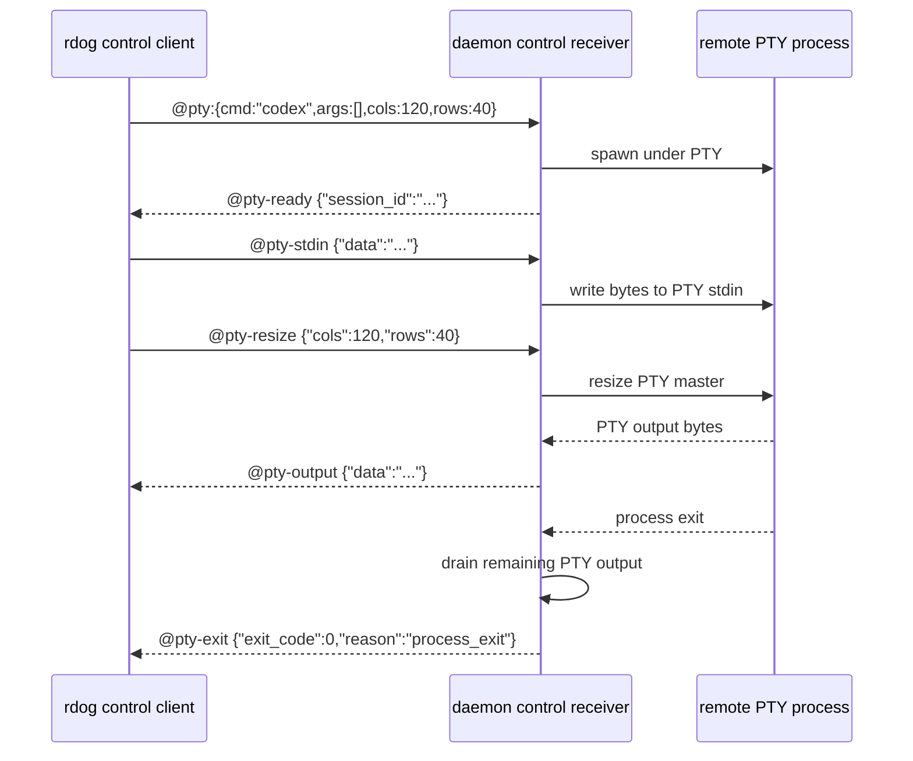

# PTY Control Plan

## 目标

让 `rdog control` 支持远程 PTY 会话,使 `codex`、shell、vim、REPL 这类要求真实 TTY 的程序可以远程运行。

## 非目标

- 不把裸 shell 行升级成 interactive shell。
- 不在 PTY 输入流里保留 `~.`、`~?`、`@key`、`@script` 等本地 escape。
- 不把 PTY 输出塞进 `@response` 字符串。

## 设计原则

- `@pty` 是协议层单一真相源。
- `rdog control TARGET --pty -- COMMAND ...` 是人类 CLI 入口。
- PTY 会话期间,用户输入字节全部进入远端 PTY stdin。
- `@key` / `@script` / `~.` / `Ctrl-C` / `Ctrl-D` 都只是远端程序输入。
- 强制关闭走 out-of-band control plane,例如 `@pty-close:{session_id:"..."}`。
- 常规退出方式是远端程序自己退出、`Ctrl-D` 被远端程序消费后退出,或关闭本地 control 连接。
- 非交互大模型任务优先使用 `codex exec ...`,只有完整 TUI 才使用 PTY。
- PTY terminal completion 必须由显式 lifecycle frame 宣告,不能靠 channel / subscriber 关闭来推断成功。
- direct PTY mode 只有收到 terminal lifecycle frame 才允许本地 CLI 返回成功或失败。

## CLI 入口

```sh
rdog control mac.lab --pty -- codex
rdog control mac.lab --pty -- codex --profile fast
rdog control mac.lab --pty-close <SESSION_ID>
rdog control mac.lab --pty-detach <SESSION_ID>
rdog control mac.lab --pty-attach <SESSION_ID>
```

`--` 后的内容仍按本地 CLI argv 接收。
CLI 负责把它渲染为 canonical `@pty:{cmd:"...",args:[...]}` payload。
detach / attach / close 这些生命周期动作使用独立 CLI sugar,不进入 PTY stdin。

## 协议帧

### 打开 PTY

```text
@pty:"codex"
@pty:"codex resume 019e02de-8814-72a2-ab0c-b06263cc0fba"
@pty:{cmd:"codex",args:[],cols:120,rows:40}
```

`@pty:"..."` 是人类手输简写。
它会做 shell-style 参数切分,再归一化成 canonical `cmd + args`。
例如:

```text
@pty:{cmd:"codex",args:[],cols:80,rows:24}
@pty:{cmd:"codex",args:["resume","019e02de-8814-72a2-ab0c-b06263cc0fba"],cols:80,rows:24}
```

注意:

- 字符串简写只负责把常见命令行切成 `cmd + args`。
- 支持常见空格、单引号、双引号和反斜杠转义。
- 如果要指定 `cols/rows`,继续使用对象写法。
- 对象写法仍是无歧义 canonical 入口,尤其适合程序和智能体生成。

字段:

- `cmd`: 实际启动的程序路径或名称。
- `args`: 传给远端程序的其余参数,不再重复包含 `cmd` 本身。
- `cols` / `rows`: 初始终端尺寸。

### PTY ready

```text
@pty-ready {"session_id":"...","cols":120,"rows":40}
```

### PTY 输入

```text
@pty-stdin {"session_id":"...","encoding":"base64","data":"..."}
```

### PTY resize

```text
@pty-resize {"session_id":"...","cols":120,"rows":40}
```

语义:

- resize 是 out-of-band frame,不进入 PTY stdin 字节流。
- client 在打开或 attach PTY 时带初始 `cols/rows`。
- 当本地 stdin/stdout 是真实 TTY 时,client 会读取当前 winsize,进入 raw TTY 后先发送一次真实尺寸,后续尺寸变化继续发送 `@pty-resize`。
- daemon 收到后调用 PTY master resize,让远端程序通过 kernel winsize / SIGWINCH 看到新尺寸。

### PTY 输出

```text
@pty-output {"session_id":"...","encoding":"base64","data":"..."}
```

PTY 是终端流,stdout / stderr 在 PTY 内天然合并。
因此 v1 只需要 `@pty-output`。

### PTY 退出

```text
@pty-exit {"session_id":"...","exit_code":0,"reason":"process_exit","ended_at":"2026-05-06T12:00:00Z"}
```

语义:

- 只表示“远端 PTY 进程自然退出”。
- `exit_code` 是远端进程真实退出码。
- client 只有收到这个 frame,才能把“正常结束 / 非零退出”与 transport 断链严格区分。

字段:

- `session_id`: PTY session 标识。
- `exit_code`: 远端进程退出码。
- `reason`: 当前固定为 `process_exit`。
- `ended_at`: daemon 侧记录的 UTC 结束时间。

### PTY 强制关闭

```text
@pty-closed {"session_id":"...","reason":"force_close","ended_at":"2026-05-06T12:00:01Z"}
```

语义:

- 表示 PTY session 被控制面或 daemon 策略结束,不是远端程序自然退出。
- 这类 terminal frame 与 `@pty-exit` 平级,也是正式完成信号。

v1 推荐 reason:

- `force_close`: 收到 `@pty-close`
- `control_disconnect`: attached PTY 的 owner control session 断开后按策略回收
- `transport_lost`: daemon 发现 session bridge 异常中断后被动回收
- `daemon_shutdown`: daemon 自身准备退出

注意:

- `@pty-closed` 默认不承诺提供 `exit_code`。
- 如果未来要记录 signal / killer / policy source,继续往这个 frame 增字段。

### PTY detach / attach

```text
@pty-detached {"session_id":"...","reason":"owner_detach","detached_at":"2026-05-06T12:00:02Z"}
@pty-attached {"session_id":"...","control_session_id":"...","attached_at":"2026-05-06T12:00:05Z"}
```

这两类 frame 是正式 lifecycle frame。
它们不表示进程结束,只表示当前控制端所有权变化。

语义:

- `@pty-detached`: PTY 进程仍然活着,只是当前控制端解绑。它不是 terminal frame。
- `@pty-attached`: 新控制端成功接管一个已存在的 detached PTY。
- detach / reattach 不应复用 `@pty-exit` 或 `@pty-closed` 假装完成。

### 强制关闭

```text
@pty-close:{session_id:"..."}
@pty-detach:{session_id:"..."}
@pty-attach:{session_id:"..."}
```

`session_id` 来自 `@pty-ready`。
人类 CLI 默认不在 PTY 输入流里提供 escape。
因此 `--pty-close` / `--pty-detach` / `--pty-attach` 主要给另一个控制端或自动化程序使用。

## 状态机

```mermaid
flowchart TD
    A[Line control session] -->|@pty| B[PTY opening]
    B -->|@pty-ready| C[PTY streaming]
    C -->|@pty-stdin| C
    C -->|@pty-output| C
    C -->|remote process exits| D[Output drain]
    D --> E[@pty-exit]
    C -->|@pty-close or policy cleanup| F[@pty-closed]
    C -->|@pty-detach| G[@pty-detached]
    E --> H[Terminal complete]
    F --> H
    G --> I[Detached live session]
    I -->|@pty-attach| C
```

## 时序



## PTY 输入透明规则

进入 PTY streaming 后:

- `@key` 不会被解析成 control action。
- `@script` 不会被解析成 control action。
- `~.` 不会被截获。
- `Ctrl-C` 默认传给远端 PTY 程序。
- `Ctrl-D` 默认传给远端 PTY 程序。

如果需要关闭 session,使用另一个 control 请求或连接断开触发清理。

## Zenoh 映射

Zenoh 使用现有 session channel:

- `to-daemon`: `@pty`、`@pty-stdin`、`@pty-resize`、`@pty-close`、`@pty-detach`、`@pty-attach`
- `to-control`: `@pty-ready`、`@pty-output`、`@pty-exit`、`@pty-closed`、`@pty-detached`、`@pty-attached`

PTY frame 使用文本 payload + base64 承载字节。
这样保持 Zenoh / TCP / WebSocket 三条 control lane 的帧语义一致。

## 实现约束

- daemon 的 `inbound.mode = "control"` 必须允许并发 control 连接。
  - 这样一个 PTY session 占住长连接时,另一个 `rdog control TARGET --pty-close SESSION_ID` 仍能进入 daemon。
- 服务端必须先 drain PTY output,再发送 `@pty-exit`。
  - 否则快速退出的命令可能出现 `@pty-exit` 抢在 `@pty-output` 前面到达,导致 client 提前返回并丢输出。
- `@pty-close` 关闭的是活动 PTY session,而不是关闭整个 daemon。
- transport / subscriber 关闭不是 terminal success 证据。
  - 如果 client 没收到 `@pty-exit` 或 `@pty-closed`,应视为协议异常或链路异常。
- detach / reattach 必须依赖显式 lifecycle frame 和 session registry。
  - 不能再用“连接断了但进程可能还活着”的隐式状态去猜。

## attached vs detached 策略

- attached PTY:
  - 默认行为
  - owner control session 保持绑定时,输入和输出都走当前控制端
  - `@pty-close` 会结束远端进程并发送 `@pty-closed`
- detachable PTY:
  - `@pty-detach` 会解绑当前控制端,发送 `@pty-detached`,保留 PTY 进程等待 reattach
  - `@pty-attach` 会重新绑定 detached session,发送 `@pty-attached`,然后继续转发 `@pty-output`

attached 和 detached 都必须遵守 strict terminal semantics。
只有 `@pty-exit` / `@pty-closed` 是 terminal completion。
`@pty-detached` / `@pty-attached` 只描述所有权变化,不能被当成 session 完成。
