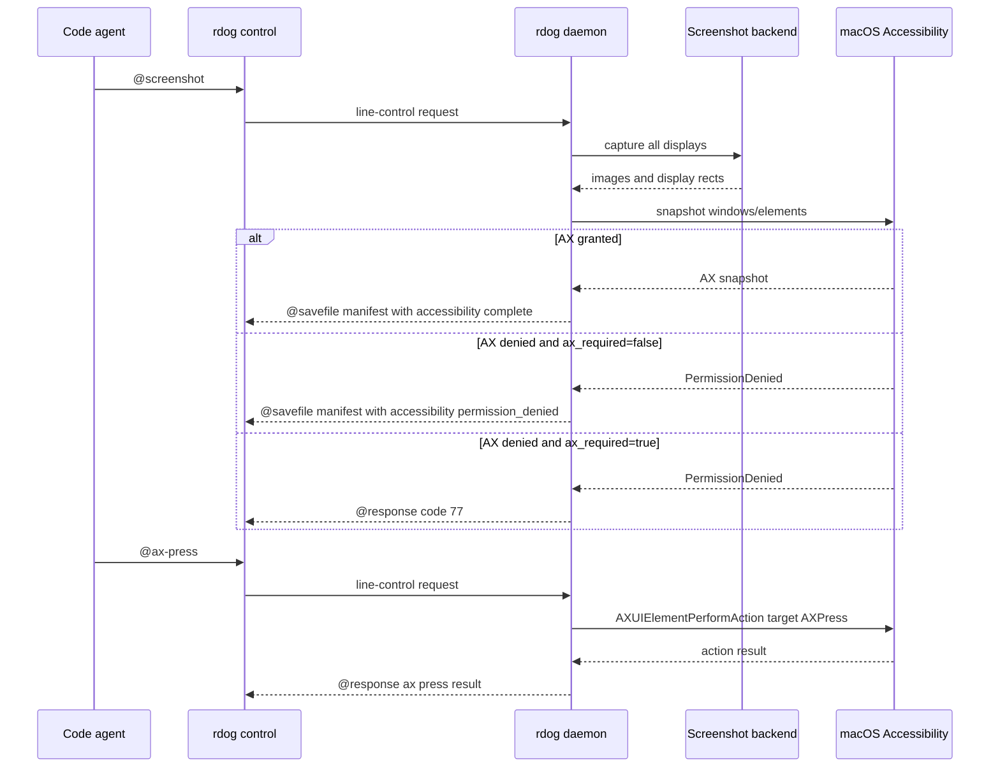

# `rdog` AX screenshot manifest 与 AX control 方案

## 1. 结论先行

Phase 1 采用可选 AX snapshot 方案:

- `@screenshot:{include_ax:true,ax_required:false}` 在 manifest 中附带 macOS AX 窗口和 UI 元素结构.
- `@screenshot:{include_ax:true,ax_required:true}` 把 AX 作为硬依赖,权限不足时返回 code 77.
- `ax_mode:"windows" | "interactive" | "full"` 提供窗口摘要,交互元素摘要和完整树三档默认值,避免智能体默认读取超大 manifest.
- `@ax-tree` 独立读取当前 AX tree 的 structured summary.
- `@ax-find` 在当前 AX tree 中返回紧凑 match list.
- `@ax-get` 按 target id 或 semantic target 钻取单个窗口/元素局部树.
- `@ax-press` 对 manifest/tree 中定位到的元素执行 `AXPress`.

Phase 1 不做:

- `@ax-set-value`
- `@ax-focus`
- `@ax-menu`
- 默认开启 `include_ax`
- 非 macOS AX 实现
- 大型 AX tree 的 `@savefile` 返回

这条线的核心约束是: AX 结构和鼠标控制都复用 screenshot manifest 的 `os-logical` 坐标语义,不要引入第二套坐标解释.

## 2. 目标

让 code agent 在 `@screenshot` 后获得可机器读取的 UI 结构:

- 当前有哪些窗口.
- 窗口标题是什么.
- 窗口位置和大小是什么.
- 按钮,文本,菜单项的名字是什么.
- UI 元素的位置和大小是什么.
- 元素支持哪些 AX action.

同时,让 agent 可以通过 `rdog control` 直接执行最小 AX 动作 `AXPress`,而不是把所有交互都退化成鼠标坐标点击.

## 3. 设计原则

1. `os-logical` 是唯一坐标语义.
2. Screenshot 是视觉 observation,AX 是 UI structure/action layer. 二者可以组合,但不能互相替代.
3. AX action 必须 typed,可审计,可定位. 协议不能依赖 AppleScript 局部变量名.
4. 权限失败必须显式表达,不能伪装成空 tree.
5. Phase 1 只读结构和执行 press,不写文本值.

## 4. 协议设计

### 4.1 `@screenshot` request 扩展

新增字段:

```text
include_ax: bool = false
ax_required: bool = false
ax_mode: "windows" | "interactive" | "full" = "full"
ax_depth: u8 = 4
ax_max_elements: u16 = 1000
ax_include_values: bool = true
```

语义:

- `include_ax:false`: 不调用 AX provider,保持现有截图行为.
- `include_ax:true,ax_required:false`: best-effort 附带 AX. 如果 AX 权限失败,截图仍成功,manifest 写入失败状态.
- `include_ax:true,ax_required:true`: AX 是 hard requirement. 如果 AX 权限失败,整个 `@screenshot` 返回 code 77.
- `ax_mode:"windows"`: 窗口/浅层摘要,等价默认 `ax_depth:1,ax_max_elements:80,ax_include_values:false`.
- `ax_mode:"interactive"`: 面向按钮,菜单项,文本输入等交互控件的轻量摘要,等价默认 `ax_depth:2,ax_max_elements:200,ax_include_values:false`.
- `ax_mode:"full"`: 完整树倾向,保留原 Phase 1 默认 `ax_depth:4,ax_max_elements:1000,ax_include_values:true`.
- `ax_depth`: 限制每个窗口下递归读取元素的深度.
- `ax_max_elements`: 限制单次 snapshot 的最大元素数量.
- `ax_include_values`: 是否读取普通文本值. 安全文本字段仍必须 redacted.
- 显式 `ax_depth` / `ax_max_elements` / `ax_include_values` 会覆盖 `ax_mode` 默认值.

示例:

```text
@screenshot#90:{include_ax:true,ax_required:false,ax_mode:"windows"}
@screenshot#91:{include_ax:true,ax_required:false,ax_mode:"interactive"}
@screenshot#92:{include_ax:true,ax_required:false,ax_depth:2,ax_max_elements:200,ax_include_values:false}
@screenshot#93:{include_ax:true,ax_required:false,ax_depth:1,ax_max_elements:80,ax_include_values:false}
@screenshot#94:{include_ax:true,ax_required:false,ax_mode:"full"}
@screenshot#95:{include_ax:true,ax_required:true,ax_include_values:false}
```

### 4.2 manifest `accessibility` 字段

成功:

```json
{
  "accessibility": {
    "schema": "rdog.ax.v1",
    "platform": "macos",
    "capture_status": "complete",
    "permission_status": "granted",
    "coordinate_space": "os-logical",
    "window_count": 1,
    "element_count": 120,
    "truncated": false,
    "windows": []
  }
}
```

best-effort 权限失败:

```json
{
  "accessibility": {
    "schema": "rdog.ax.v1",
    "platform": "macos",
    "capture_status": "permission_denied",
    "permission_status": "denied",
    "coordinate_space": "os-logical",
    "window_count": 0,
    "element_count": 0,
    "truncated": false,
    "windows": []
  }
}
```

非 macOS 或平台不支持时:

```json
{
  "accessibility": {
    "schema": "rdog.ax.v1",
    "platform": "unsupported",
    "capture_status": "unsupported",
    "permission_status": "unknown",
    "coordinate_space": "os-logical",
    "window_count": 0,
    "element_count": 0,
    "truncated": false,
    "windows": []
  }
}
```

每个 window 至少包含:

- `id`
- `pid`
- `process_name`
- `title`
- `role`
- `subrole`
- `rect`
- `focused`
- `elements`

每个 element 至少包含:

- `id`
- `role`
- `subrole`
- `name`
- `value` 或 `value_redacted`
- `description`
- `rect`
- `enabled`
- `actions`
- `ax_path`

### 4.3 `@ax-tree`

Phase 1 返回 structured `@response` summary,不走 `@savefile`.

```text
@ax-tree#30:{scope:"windows",depth:4,max_elements:1000,include_values:true}
@ax-tree#31:{mode:"interactive"}
```

返回:

```json
@response {"id":30,"value":{"kind":"ax-tree","schema":"rdog.ax.v1","platform":"macos","capture_status":"complete","windows":[]}}
```

错误映射:

- Accessibility 权限不足: code 77.
- 当前平台不支持: code 78.
- 参数无效: code 64.

### 4.4 `@ax-find`

`@ax-find` 用于让智能体先拿紧凑 match list,不要直接读取完整 AX tree.

```text
@ax-find#40:{role:"AXButton",name_contains:"取消",limit:20}
@ax-find#41:{action:"AXPress",mode:"interactive",limit:30}
@ax-find#42:{process:"Terminal",window_title_contains:"rdog",role:"AXButton",limit:10}
```

返回:

```json
@response {"id":40,"value":{"kind":"ax-find","schema":"rdog.ax.v1","match_count":1,"returned_count":1,"matches":[{"id":"pid:1234/window:0/path:7.3","role":"AXButton","name":"取消","actions":["AXPress"]}]}}
```

查询字段:

- `process` / `process_contains`
- `window_title` / `window_title_contains`
- `role`
- `subrole`
- `name` / `name_contains`
- `description` / `description_contains`
- `value` / `value_contains`
- `action`
- `mode`, `depth`, `max_elements`, `include_values`, `limit`

### 4.5 `@ax-get`

`@ax-get` 用于在拿到窗口/元素 id 后钻取局部结构.

```text
@ax-get#50:{target:{id:"pid:1234/window:0"},mode:"windows"}
@ax-get#51:{target:{id:"pid:1234/window:0/path:7"},depth:2,include_values:false}
```

返回:

```json
@response {"id":51,"value":{"kind":"ax-get","schema":"rdog.ax.v1","target_type":"element","target_id":"pid:1234/window:0/path:7","element":{}}}
```

语义:

- `target.id` 可以是 window id 或 element id.
- semantic target 复用 `@ax-press` 的 locator 字段.
- `depth` 表示返回目标节点以下的局部深度;实现会自动捕获足够深度以找到该 target path.
- stale 或 ambiguous target 返回 code 64.

### 4.6 `@ax-press`

按短期 id 定位:

```text
@ax-press#31:{target:{id:"pid:1234/window:0/path:3.2"}}
```

按语义 locator 定位:

```text
@ax-press#32:{target:{process:"System Information",window_title:"关于本机",role:"AXButton",description:"关闭按钮"}}
```

返回:

```json
@response {"id":31,"value":{"kind":"ax","action":"press","backend":"macos-accessibility","target_id":"pid:1234/window:0/path:3.2","performed":true}}
```

定位规则:

- `id` 是 snapshot 内的短期 locator. 它适合紧跟一次 `@screenshot include_ax` 或 `@ax-tree` 后使用.
- semantic locator 必须防 ambiguous match.
- ambiguous 或 stale target 返回 InvalidInput/code 64.
- Accessibility 权限不足返回 code 77.
- 当前平台不支持返回 code 78.

## 5. 架构

```mermaid
flowchart LR
    A[Line control request] --> B{Command}
    B -->|@screenshot| C[control_core direct screenshot producer]
    C --> D[Capture displays]
    D --> E[Build image and display manifest]
    E --> F{include_ax?}
    F -->|false| G[Emit existing bundle]
    F -->|true| H[AxBackend snapshot]
    H --> I{AX result}
    I -->|ok| J[Attach accessibility complete]
    I -->|permission denied and ax_required false| K[Attach accessibility permission_denied]
    I -->|permission denied and ax_required true| L[Return code 77]
    J --> G
    K --> G
    B -->|@ax-tree ax-find ax-get ax-press| M[SystemControlActionExecutor]
    M --> N[AxBackend tree find get or press]
    N --> O[Structured @response]
```



## 6. 实现步骤

### 6.1 Protocol parser

- 扩展 `ScreenshotRequest`:
  - `include_ax`
  - `ax_required`
  - `ax_depth`
  - `ax_max_elements`
  - `ax_include_values`
- 新增 `ControlCommand::AxTree`.
- 新增 `ControlCommand::AxFind`.
- 新增 `ControlCommand::AxGet`.
- 新增 `ControlCommand::AxPress`.
- 为新字段和新命令补 parser tests.

### 6.2 AX model/backend

新增 `src/control_ax.rs`,定义:

- `AxSnapshot`
- `AxWindow`
- `AxElement`
- `AxTarget`
- `AxTreeRequest`
- `AxFindRequest`
- `AxGetRequest`
- `AxPressRequest`
- `AxActionReport`
- `AxBackend` trait

后端 trait 需要支持 fake tests 和真实 macOS backend.

### 6.3 macOS backend

新增 macOS 平台实现,读取:

- window/process 属性.
- title/name/value/description.
- role/subrole.
- position/size.
- enabled/focused.
- supported actions.

执行:

- `AXPress`

错误语义:

- Accessibility 权限不足映射为 `io::ErrorKind::PermissionDenied`.
- 非 macOS 平台映射为 `io::ErrorKind::Unsupported`.
- ambiguous/stale locator 映射为 `io::ErrorKind::InvalidInput`.

### 6.4 Screenshot integration

- screenshot builder 接受 AX provider 注入,以便单测证明 `include_ax:false` 不调用 provider.
- `include_ax:false` 不改变现有 manifest.
- `include_ax:true,ax_required:false` 在 permission denied 时写入 degraded `accessibility`.
- `include_ax:true,ax_required:true` 在 permission denied 时返回 PermissionDenied.

### 6.5 Action dispatch

- 在 `SystemControlActionExecutor` 中分发 `@ax-tree`,`@ax-find`,`@ax-get` 和 `@ax-press`.
- 成功时使用现有 structured JSON response.
- 错误继续复用 `control_core` 的 code mapping:
  - 64: InvalidInput.
  - 77: PermissionDenied.
  - 78: Unsupported.

## 7. 验收标准

1. `include_ax` 缺省或为 false 时,现有 `@screenshot` 行为兼容.
2. fake-provider test 证明 `include_ax:false` 不调用 AX provider.
3. `include_ax:true,ax_required:false` 权限失败仍返回截图 bundle,manifest 包含 `capture_status:"permission_denied"`.
4. `include_ax:true,ax_required:true` 权限失败返回 code 77.
5. macOS granted path 产出 `accessibility.schema:"rdog.ax.v1"` 和 `coordinate_space:"os-logical"`.
6. AX windows 包含 process/title/role/rect.
7. AX elements 包含 role/name/value-or-redaction/description/rect/enabled/actions.
8. secure fields 不暴露 value.
9. `@ax-tree` 返回 structured `@response`.
10. `@ax-find` 返回紧凑 match list,支持 role/name/action 等常用筛选.
11. `@ax-get` 能按 window/element id 返回局部树.
12. `@ax-press` 能 press manifest/tree/find/get target id.
13. ambiguous 或 stale locator 返回 code 64.
14. 非 macOS AX commands 返回 code 78.

## 8. 验证命令

```bash
cargo fmt -- --check
cargo test --package rustdog --bin rdog -- control_protocol::tests::parse_should_support_screenshot_ax_fields --exact
cargo test --package rustdog --bin rdog -- control_protocol::tests::parse_should_support_ax_tree_and_ax_press --exact
cargo test --package rustdog --bin rdog -- control_ax::tests --nocapture
cargo test --package rustdog --bin rdog -- screenshot::tests --nocapture
cargo test --package rustdog --bin rdog -- control_core::tests --nocapture
cargo test --package rustdog --test control_ax_e2e --no-run
cargo test --tests --no-run
git diff --check
```

macOS ignored smoke:

```bash
RDOG_LIVE_AX_E2E=1 cargo test --package rustdog --test control_ax_e2e -- daemon_control_lane_should_read_real_terminal_window_and_press_real_button --exact --ignored --nocapture
RDOG_LIVE_AX_E2E=1 RDOG_LIVE_AX_E2E_VIA_TERMINAL=1 RDOG_LIVE_AX_E2E_BINARY=/Users/cuiluming/.cargo/bin/rdog cargo test --package rustdog --test control_ax_e2e -- daemon_control_lane_should_read_real_terminal_window_and_press_real_button --exact --ignored --nocapture
```

真实 smoke 流程:

1. 测试在随机本地端口启动临时 `rdog daemon`;当 `RDOG_LIVE_AX_E2E_VIA_TERMINAL=1` 时,由 Terminal.app 启动 daemon,复用 Terminal 宿主的 Accessibility 授权路径.
2. 通过真实 `rdog control` 发送 `@ax-tree`.
3. 断言 `capture_status:"complete"`,`permission_status:"granted"`,且 tree 中包含测试 daemon 对应的 Terminal 窗口和带 `AXPress` action 的 close button.
4. 对 tree 中返回的 close button id 执行 `@ax-press`.
5. 再次 `@ax-tree`,断言 Terminal 弹出运行进程确认 sheet,且 sheet 中包含 `取消` / `终止` 按钮.
6. 对 `取消` 按钮执行 `@ax-press`,恢复测试窗口状态并关闭临时 daemon.

## 9. ADR

### Decision

采用 optional `include_ax` AX snapshot in screenshot manifest,并新增 typed `@ax-tree` / `@ax-press` commands.

### Drivers

- Code agent 需要截图后的 UI 结构.
- AXPress 应该是 `rdog` 的一等控制动作.
- 现有 screenshot/mouse 坐标契约必须保持 `os-logical`.

### Alternatives

- 只做独立 `@ax-tree`: 更轻,但 screenshot 和 AX tree 容易时间错位.
- 只做 semantic `@ax-press`: 太不透明,agent 无法知道当前有什么可按.
- `@AXPress:"b"`: 拒绝. `b` 是 AppleScript 局部变量,不是稳定协议 target.

### Consequences

- 需要 AX backend abstraction 和 macOS platform module.
- 需要通过 `ax_required` 明确权限语义.
- 文档需要说明 Accessibility 权限主体是实际执行 AX 的 `rdog daemon` 进程身份.

## 10. 后续阶段

- Phase 2: `@ax-focus`,更多 AX action 白名单.
- Phase 3: 谨慎加入 `@ax-set-value`.
- Later: 当 `@ax-tree` payload 变大时,通过 `@savefile` 返回完整 tree.
