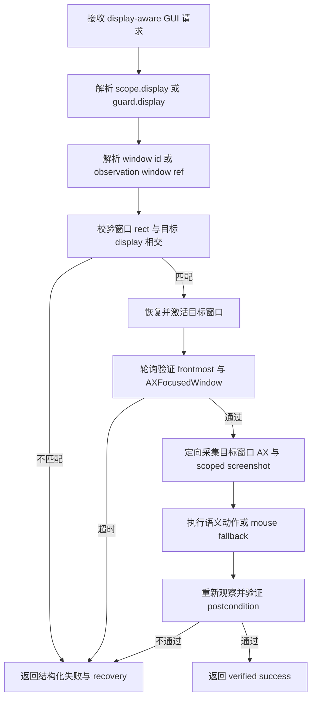
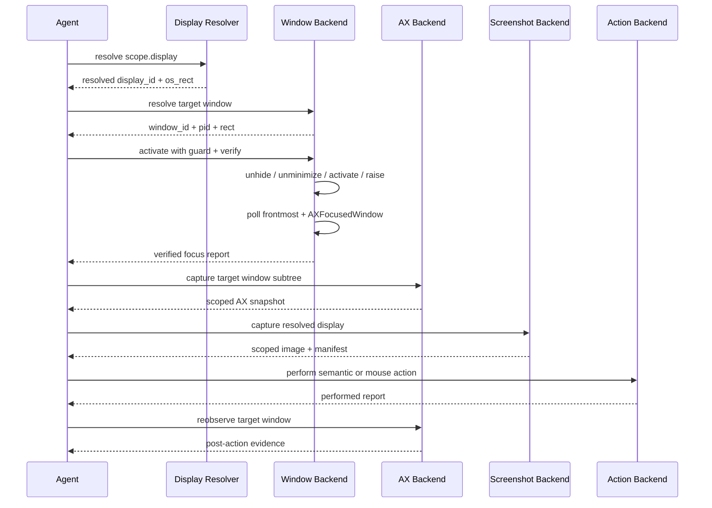

# rdog display-aware 完整控制链实施计划

## 1. 目标

建立一条单一、可验证的多显示器 GUI 控制链:

```text
display scope -> window identity -> focus precondition -> targeted observation -> action -> verification
```

本计划不新增顶层 `display_id` 请求字段。请求侧继续复用:

- 读路径: `scope:{display:{...}}`
- 写路径: `guard:{display:{...}}`
- 响应路径: resolved `display_id`

## 2. 当前基线

已经具备:

- `src/control_display_scope.rs` 是 display selector/resolver 的单一真相源。
- `@window-find`、`@ax-find`、`@observe`、`@web-find`、`@web-act` 已接入 `scope.display`。
- mouse action 已接入 `guard.display`。
- `@window-resize` 已有 display guard、结构化 verify report 和失败码。
- screenshot manifest 已有 `display_id`、`os_rect`、`image_rect` 和全局 `os-logical` 坐标契约。

仍然缺少:

- `@window-activate` 没有 display guard,也没有验证 `frontmost` / `AXFocusedWindow`。
- `@ax-find` 仍先采集全桌面 AX tree,然后按 display/window rect 过滤。
- `@observe` 的 visual scope 仍是 `metadata_only`。
- action 的成功口径仍可能停在 backend accepted,缺少统一 post-action evidence。
- 缺少确定性的双显示器 fixture 和完整 live E2E。

## 3. 架构原则

1. display 只表示范围和安全约束,不表示窗口身份。
2. window id/ref 是跨 observation/action 的目标身份。
3. focus 是动作前置条件,必须通过 fresh state 验证。
4. AX 采集应在解析 window identity 后缩小到目标窗口。
5. screenshot 裁剪只改变 image space,鼠标继续使用全局 `os-logical`。
6. `status:"ok"` 只表示动作提交成功;完整成功还需要 verification。
7. display catalog、window state、AX snapshot 和 action evidence 必须能独立报告失败。

## 4. 目标流程图



## 5. 目标时序图



## 6. 协议设计

### 6.1 Window activate guard 与 verify

请求:

```text
@window-activate:{
  target:{window_id:"pid:123/window:0"},
  guard:{display:{id:"d2"}},
  verify:{focused:true,timeout_ms:2000,poll_interval_ms:50}
}
```

默认值:

- `focused:true`
- `timeout_ms:2000`
- `poll_interval_ms:50`

成功响应的 `verify`:

```json
{
  "status": "passed",
  "focused": true,
  "frontmost": true,
  "hidden": false,
  "minimized": false,
  "timeout_ms": 2000,
  "elapsed_ms": 85
}
```

失败码:

- `WINDOW_ACTIVATE_GUARD_FAILED`
- `WINDOW_FOCUS_NOT_ACQUIRED`
- `WINDOW_ACTIVATE_STATE_UNREADABLE`

guard 必须在 side effect 前检查。验证失败时返回 `performed:true,verified:false` 的等价结构化信息,不能返回完整 `status:"ok"`。

### 6.2 Target-window-first AX

`@ax-find` 新增可选 `window` 字段:

```text
@ax-find:{
  window:{window_id:"pid:123/window:0"},
  role:"AXButton",
  name_contains:"确定",
  scope:{display:{id:"d2"}}
}
```

也支持 observation window ref:

```text
@ax-find:{
  window:{ref:"@e4",observation_id:"obs-..."},
  role:"AXButton",
  name_contains:"确定"
}
```

执行顺序:

1. 解析 window id/ref。
2. 从 window id 得到 pid + window index。
3. 只创建该 application AX element。
4. 只展开目标 `AXWindow` subtree。
5. 校验 window rect 与 `scope.display` 相交。
6. 在 scoped snapshot 中执行 AX query。

不传 `window` 时保留旧的全桌面兼容路径。

### 6.3 Scoped screenshot

`@observe` 带 `scope.display` 且包含 screenshot 时:

- 从同一次 display capture 中解析目标 display。
- 输出单 display image。
- manifest `layout` 为 `single-display`。
- manifest 仍保留目标 display 的全局 `os_rect`。
- scoped image 的 `image_rect` 为 `{x:0,y:0,width,height}`。
- transforms 明确 image local 坐标如何映射回全局 `os-logical`。
- visual response 返回 `scope_applied:true`。

禁止重新定义 display-local mouse coordinate space。

### 6.4 Post-action verification

第一阶段把通用 verification contract 落在已有可验证动作上:

- `@window-activate`: focus/frontmost verification。
- `@window-resize`: 保留 rect verification,统一 report shape。
- fixture action: 通过 AX value/state 或 deterministic label 变化验证。

mouse click 本身继续返回 performed report。完整业务成功由 control chain 在动作后重新采集目标窗口 AX/visual evidence 后判定。

## 7. 测试 fixture

新增 macOS Swift/AppKit fixture:

```text
tests/fixtures/macos_display_aware_fixture.swift
```

fixture 行为:

- 创建两个带唯一 title 的窗口。
- 每个窗口包含唯一 AXButton、AXTextField、AXStaticText。
- 按钮点击后把 label 从 `count:0` 改为 `count:1`。
- fixture自动把两个窗口放入前两块display的可见区域,ready JSON返回AppKit frame供fixture契约审计。
- stdout 输出 ready JSON,包含 pid、window titles 和 bounds。
- 收到 SIGTERM 后干净退出。

测试层级:

1. parser/resolver 单测: 所有平台可跑。
2. fake backend contract tests: 所有平台可跑。
3. macOS single-display live test: ignored + env gate。
4. macOS dual-display live test: ignored + env gate,少于两块 display 时明确失败,不能 skip 成通过。

## 8. TDD 实施任务

### Task 1: Window activate contract

修改:

- `src/control_window.rs`
- `src/control_window/macos.rs`

测试:

- parser 接受 `guard` / `verify`。
- parser 拒绝顶层 `display_id`。
- guard mismatch 在动作前失败。
- focus verification passed / timeout / unreadable 三类报告。

### Task 2: Targeted AX capture

修改:

- `src/control_ax.rs`
- `src/control_ax/query.rs`
- `src/control_ax/macos.rs`
- `src/control_actions.rs`

测试:

- parser 接受 window id/ref。
- window ref 缺 observation id 时拒绝。
- targeted snapshot 只含目标窗口。
- display scope mismatch 不执行 query。
- 无 window 字段保持旧行为。

### Task 3: Scoped screenshot

修改:

- `src/screenshot.rs`
- `src/screenshot/tests.rs`
- `src/control_observation/observe/producer.rs`
- `src/control_observation/observe/response.rs`

测试:

- 两块 fake display 中选择一块后只输出一块图。
- scoped manifest 保留全局 `os_rect`。
- image rect 从零开始。
- visual `scope_applied:true`。
- display 不存在返回结构化 resolver 错误。

### Task 4: Fixture 与 E2E

新增:

- `tests/fixtures/macos_display_aware_fixture.swift`
- `tests/control_display_aware_e2e.rs`

验证链:

1. 启动 fixture。
2. 获取 displays summary。
3. scoped window-find。
4. guarded window-activate。
5. targeted ax-find。
6. scoped observe。
7. AXPress 或 guarded click。
8. targeted reobserve 确认 `count:1`。

### Task 5: 文档与 skill

同步:

- `specs/rdog-display-scope-control-plan.md`
- `specs/rdog-window-control-plan.md`
- `.codex/skills/rdog-control/SKILL.md`
- `.codex/skills/rdog-control/references/control-workflow.md`
- `AGENTS.md`

## 9. 验收门槛

- `cargo fmt -- --check`
- `cargo check --package rustdog --all-targets`
- display/window/AX/screenshot focused nextest 全绿。
- `cargo nextest run --package rustdog --bin rdog` 全绿。
- macOS single-display live E2E 通过。
- macOS dual-display live E2E 在真实双屏机器通过。
- display-aware agent workflow中的每个side effect都有显式fresh post-action evidence步骤。
- `@ax-action`等底层命令仍只报告performed;post-action evidence由调用方recipe执行,不是单条命令的原子事务保证。
- Mermaid flowchart 和 sequenceDiagram 通过 `beautiful-mermaid-rs --ascii`。
- 不修改主工作区用户未提交内容。

## 10. 非目标

- 不提升 `display_id_stability` 到 device stable。
- 不实现跨 display drag。
- 不用 display scope 绕过 macOS TCC。
- 不保证自绘应用一定暴露完整 AX tree。
- 不新增 display-local mouse coordinate space。

## 11. 实施结果

截至 2026-07-12,本计划已完成实现:

- `@window-activate` 支持 side-effect 前 `guard.display`,并轮询验证 app frontmost、目标 `AXFocusedWindow`、hidden 与 minimized。
- direct window id / observation ref不再触发global window scan。
- `@ax-find.window` 支持 direct id与observation ref,macOS只构建目标 AXWindow subtree。
- scoped visual `@observe`从同一次capture选择resolved display,输出 `single-display` JPEG与manifest。
- scoped manifest保留全局 `os_rect`,目标图像 `image_rect`从 `(0,0)` 开始。
- fresh targeted AX ref可以直接执行语义动作,动作后用fresh targeted snapshot验证结果。
- scoped hybrid observe即使没有target或只带bundle target,AX lane也按同一resolved display fail-closed过滤。
- `@ax-focus activate:true`只有在nested window activation verification通过后才执行AX focus,响应保留activation证据。

真实双屏fixture覆盖:

1. guard mismatch在activation side effect前失败。
2. activate成功后 `focused=true` 与 `frontmost=true`。
3. targeted AX direct id/ref只返回第二屏窗口元素。
4. scoped observe真实保存单display JPEG/manifest。
5. AXPress后fresh evidence从 `count:0` 变为 `count:1`。
