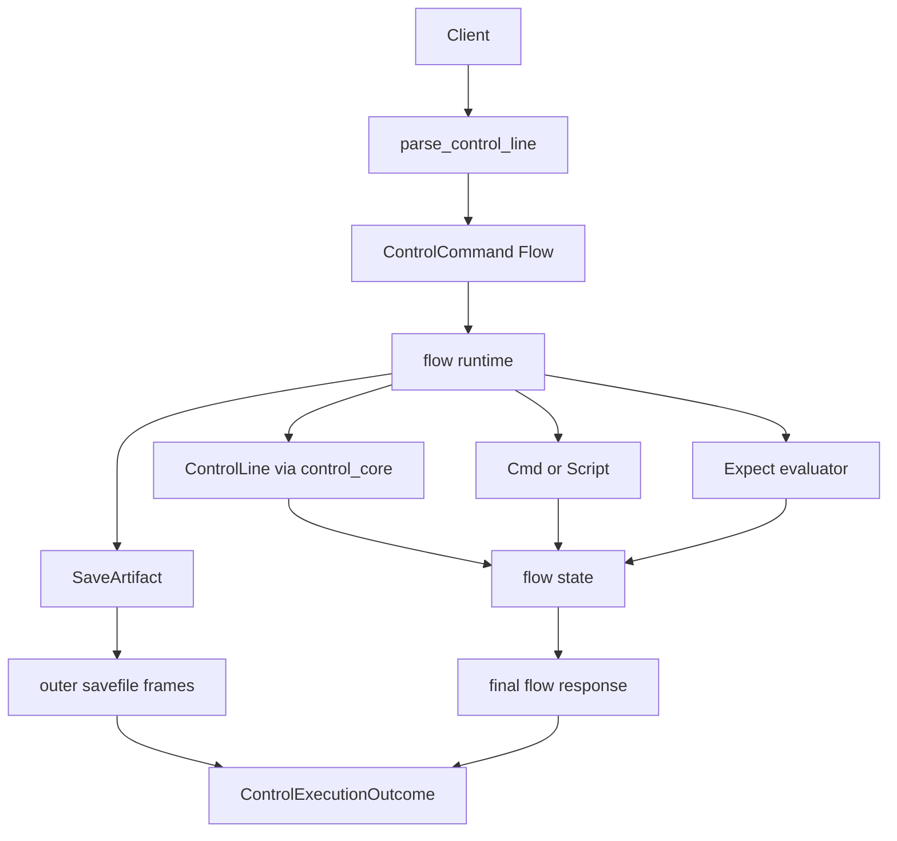
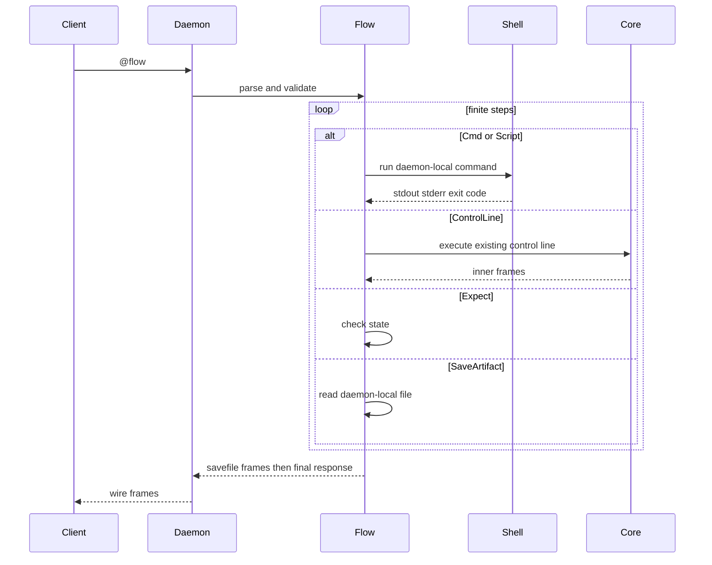

# rdog daemon-side @flow control plan

## Status

Implemented minimum daemon-side full script runtime on 2026-06-29.

Current v1 supports:

- `Cmd`
- `Script`
- `ControlLine`
- `SleepMs`
- `Expect`
- `SaveArtifact`
- `Exit`
- `options.trace:"savefile"`

`@flow` is not `@ui-flow`.
`@flow` is the daemon-side full script runtime.
`@ui-flow`, if added later, should be a GUI-only safe profile or alias.

## Goal

`@flow` lets a controller send one finite script to the target daemon.
The daemon runs the script on the daemon machine, consumes intermediate responses into flow state, returns artifact frames, and ends with one final flow summary response.

This reduces round trips without inventing a second transport.

## Request Shape

```text
@flow#9:{"schema":"rdog.flow.v1","policy":{"allow_shell":true},"steps":[{"Cmd":{"run":"echo flow-ok","capture":"cmd1"}},{"Expect":{"kind":"cmd_stdout_contains","capture":"cmd1","contains":"flow-ok"}},{"ControlLine":"@ping"},{"Expect":{"kind":"response_contains","contains":"pong"}},{"Exit":null}]}
```

Core fields:

- `schema`: must be `"rdog.flow.v1"`.
- `policy.allow_shell`: defaults to `false`; `Cmd` and `Script` require explicit `true`.
- `policy.allow_file_read`: defaults to `false`; `SaveArtifact` requires explicit `true`.
- `policy.timeout_ms`: whole-flow timeout.
- `policy.max_steps`: maximum finite step count.
- `policy.max_output_bytes`: per-stream stdout/stderr capture limit.
- `options.trace`: `summary` by default; `savefile` returns `flow-trace-<id>.jsonl`.

## Semantics

- All `cwd`, `env`, command execution, file reads, and artifact paths are daemon-local.
- `SaveArtifact` can exfiltrate daemon-local files, so it requires `policy.allow_file_read:true`.
- Controller-local files must be inlined or uploaded before the daemon can use them.
- `ControlLine` executes through the existing line-control parser and core executor.
- Inner `ResponseLine` is consumed into flow state and is not forwarded directly.
- Inner `SaveFile` and `SaveArtifact` become outer `@savefile` frames.
- Final response is always one `@flow` summary.
- `response_status` and `control_status` are v1 aliases; both require `code` and check the latest inner `@response` code.
- v1 rejects nested `@flow` and `@pty` through `ControlLine`.
- v1 rejects `ControlLine:"@cmd..."` and `ControlLine:"@script..."`; use `Cmd` / `Script` so shell policy remains auditable.

## Flow





## Implementation Notes

- Parser/schema: `src/control_flow.rs`, `ControlCommand::Flow`, `src/control_protocol/tests/flow.rs`.
- Runtime: `execute_flow_request` in `src/control_flow.rs`.
- Core integration: `src/control_core.rs::execute_explicit_control_request`.
- Shell execution reuses `control_actions::build_shell_command`.
- Result framing reuses `ControlExecutionOutcome`, `ControlFrame`, and `SaveFileFrame`.

## Verification

Focused tests:

```bash
rtk cargo test --package rustdog --bin rdog control_flow::tests --quiet
rtk cargo test --package rustdog --bin rdog control_core::tests --quiet
rtk cargo test --package rustdog --bin rdog control_protocol::tests --quiet
rtk cargo test --package rustdog --bin rdog ui_script --quiet
```

Non-destructive smoke:

```bash
rdog control '@flow#9:{"schema":"rdog.flow.v1","policy":{"allow_shell":true},"steps":[{"Cmd":{"run":"echo flow-ok","capture":"cmd1"}},{"Expect":{"kind":"cmd_exit_code","capture":"cmd1","code":0}},{"Expect":{"kind":"cmd_stdout_contains","capture":"cmd1","contains":"flow-ok"}},{"ControlLine":"@ping"},{"Expect":{"kind":"response_contains","contains":"pong"}},{"Exit":null}]}'
```

Expected final response contains:

- `"schema":"rdog.flow.v1"`
- `"status":"ok"`
- captured stdout containing `flow-ok`
- `response_count` at least `1`
