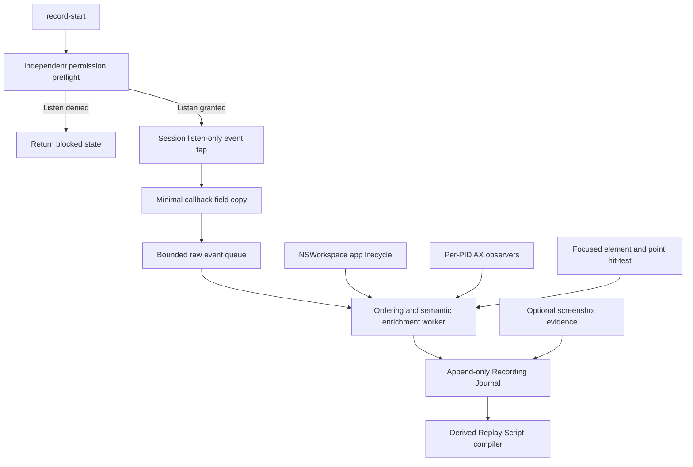
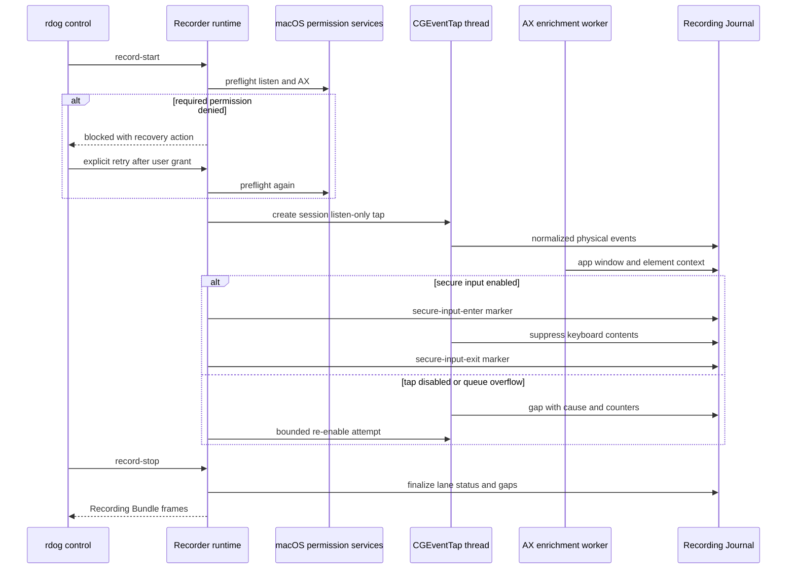

# rdog macOS operation capture research

## 1. 研究范围

本文回答 Wayfinder ticket [调研 macOS 全局操作捕获与权限生命周期](https://github.com/raiscui/rustdog/issues/12)。

目标是确定 macOS Recorder 首版应使用哪些系统 API,如何组合物理输入、应用/窗口和 AX 语义上下文,以及权限、Secure Input、事件丢失和 App Sandbox 应如何进入架构。

本文只形成研究结论,不定义完整 `rdog.recording.v1` schema,也不实现 Recorder 生产代码。

结论分为三类:

- **Apple API 事实**: 已由公开 SDK header 或 Apple Developer 文档直接证明。
- **rustdog 架构推论**: 基于 API 事实、现有代码和已确认产品边界得出的实施约束。
- **prototype 未知项**: 只靠静态资料不能确认,必须由后续签名程序或真实应用 smoke 验证。

## 2. 结论

macOS Recorder 首版应在 rdog daemon 内运行一个专用 capture runtime:

1. 用 `kCGSessionEventTap + kCGEventTapOptionListenOnly` 捕获当前登录 session 的键盘、鼠标和滚轮事件。
2. 把 tap 的 `CFMachPort` 放到专用线程的 `CFRunLoop`,callback 只提取轻量字段并写入 bounded queue。
3. 在 callback 外组合 `NSWorkspace` 应用生命周期、按 PID 创建的 `AXObserver`、focused element 和 point hit-test。
4. 把 capture、Accessibility、Screen Recording、event posting、Secure Input 和 tap health 建模为独立状态。
5. Secure Input 活跃时不保存键值或 Unicode 文本,只记录 redacted 时间段和状态变化。
6. `kCGEventTapDisabledByTimeout`、`kCGEventTapDisabledByUserInput`、队列溢出和权限撤销都必须写入 Recording Journal 的 gap/status 事件。
7. Screen Recording 只服务显式截图 evidence,不是键鼠 journal 的启动条件。
8. Recorder 过滤 rdog 自己注入的事件。Enigo 已写 `kCGEventSourceUserData`,rustdog 自有 `CGEventPostToPid` 路径还需补齐同一 marker。
9. Recorder 留在现有非 sandboxed daemon。未来 sandboxed GUI 只通过 control protocol 管理录制,不直接持有全局输入权限。

这不是 raw HID 录制方案。公开 header 明确指出非 root 进程不能在 `kCGHIDEventTap` 放置 tap。首版记录的是当前用户 session 内经过 Quartz 处理的事件流。

## 3. Apple API 事实

### 3.1 CGEventTap

公开 `CGEvent.h` 和 `CGEventTypes.h` 证明:

- `CGEventTapCreate` 可以建立 passive listener 或 active filter。
- tap callback 在添加该 `CFMachPort` source 的 `CFRunLoop` 上执行。
- 非 root 进程在 `kCGHIDEventTap` 创建 tap 会得到 `NULL`。
- `kCGSessionEventTap` 位于 HID 和 remote-control 事件进入当前 session 的位置。
- `kCGEventTapOptionListenOnly` 是 passive listener,不能修改或丢弃事件。
- tap 无响应或被用户禁用时,callback 收到 `kCGEventTapDisabledByTimeout` 或 `kCGEventTapDisabledByUserInput`。
- `CGEventTapEnable` 可以重新启用 tap,`CGEventTapIsEnabled` 可以读取当前 enabled 状态。
- `CGPreflightListenEventAccess` 与 `CGRequestListenEventAccess` 检查和请求监听权限。
- `CGPreflightPostEventAccess` 与 `CGRequestPostEventAccess` 单独检查和请求事件注入权限。

可读取的事件信息包括:

- 单调 event timestamp。
- 全局 display location 和 flags。
- virtual keycode、keyboard type、autorepeat 和可选 Unicode string。
- mouse button、click state、delta 和 pressure。
- line-based、fixed-point 和 point scroll delta。
- source PID、target PID 和最多 64 bit 的 source user data。

`CGEventKeyboardSetUnicodeString` 的 header 还明确说明,应用 framework 可能忽略 event 中的 Unicode string,自行按 virtual keycode 和状态翻译。因此 keycode/Unicode 不能单独承诺 IME、dead key 或 composed text 的语义还原。

### 3.2 Accessibility

公开 `AXUIElement.h` 证明:

- `AXIsProcessTrusted` 只返回当前进程是否是 trusted accessibility client。
- `AXIsProcessTrustedWithOptions` 可以异步提示用户,但提示不会改变本次调用的返回值。
- `AXUIElementCreateSystemWide` 可读取跨应用 focused accessibility object。
- `AXUIElementCopyElementAtPosition` 可按全局坐标查找 UI element。
- `AXObserverCreate` 按应用 PID 创建 observer。
- `AXObserverAddNotification` 注册 element notification。
- `AXObserverGetRunLoopSource` 返回必须加入 run loop 的 source。
- system-wide accessibility object 不支持 notification。
- 应用可能返回 notification unsupported、cannot complete 或 invalid element。

公开 `AXNotificationConstants.h` 证明:

- 可以观察 focused window、focused UI element、application activate/deactivate、window create、value change 和 element destroy。
- `kAXWindowMovedNotification` 与 `kAXWindowResizedNotification` 只在 move/resize 结束时发出,不是连续更新。
- destroyed notification 返回的 element 已失效,不能继续传给 AX API。

### 3.3 应用生命周期

公开 `NSWorkspace.h` 证明:

- 应用通知必须在 `NSWorkspace.notificationCenter` 注册。
- launch、terminate、activate、deactivate、hide 和 unhide 通知携带对应 `NSRunningApplication`。

这些通知适合维护当前 frontmost app 和 per-PID AX observer 集合,但不提供 element 或窗口级语义。

### 3.4 Secure Event Input

公开 `CarbonEventsCore.h` 证明:

- Secure Event Input 开启后,键盘输入只进入拥有 keyboard focus 的应用,不会回显给监视键盘输入的其他应用。
- password control 会自动进入 secure input mode。
- `IsSecureEventInputEnabled` 返回任意进程是否启用了 secure input,不限于当前进程。
- enable、disable 和 query API 都声明为 not thread safe。

Recorder 只能可靠检测 secure period,不能假设能观察该期间的每个键盘事件或精确键数。

### 3.5 Screen Recording

公开 `CGWindow.h` 证明:

- `CGPreflightScreenCaptureAccess` 检查当前进程是否已有 screen capture access。
- `CGRequestScreenCaptureAccess` 请求该权限并可能弹窗。

该权限属于屏幕像素 capture,不是 `CGEventTap` 或 AX trust 的替代品。

### 3.6 App Sandbox

Apple 的 App Sandbox 文档说明,App Sandbox 通过 entitlements 限制 app 对系统资源和用户数据的访问;通过 Mac App Store 分发 macOS app 时必须启用 App Sandbox。

本轮没有找到足以证明 sandboxed process 能稳定承担全局 event tap 的 Apple 一手契约,也没有找到一个可直接授予 global keyboard/mouse monitoring 的公开 App Sandbox entitlement。因此不能把 TCC 的 Input Monitoring 或 Accessibility 授权误写成“它会覆盖 App Sandbox 限制”。

当前开发态 `target/debug/rdog` 是 ad-hoc、linker-signed CLI,没有 App Sandbox entitlement。这只是当前运行事实,不证明未来签名 helper 的可行性。

## 4. rustdog 架构推论

### 4.1 Capture pipeline



Capture callback 不能做以下工作:

- 磁盘 IO 或 JSON serialization。
- AX tree walk、window resolver 或 screenshot capture。
- 等待锁、等待 worker 或调用 control protocol。
- 复杂 mouse move coalescing 或 script compilation。

callback 应只构造固定大小或有严格上限的 raw event,赋予 recorder sequence,然后尝试写入 bounded queue。队列满时不阻塞 callback,而是增加 dropped counter,由 worker 立即生成可见 gap。

### 4.2 Raw event 最小字段

首版 capture backend 至少需要提取:

- `capture_seq`: Recorder 单调递增 sequence。
- `event_timestamp_ns`: `CGEventGetTimestamp` 原值。
- `received_monotonic_ns`: callback 接收时间,用于跨 source 合并。
- `event_type`、flags 和 location。
- keycode、keyboard type、autorepeat、可选 Unicode。
- mouse button、click state、mouse delta。
- scroll line/fixed/point delta。
- source PID、target PID 和 source user data。
- 当前 tap health generation。

wall-clock 只属于 session metadata。事件排序使用 monotonic timestamp + `capture_seq`,避免系统时间调整破坏 journal 顺序。

### 4.3 语义富化

物理事件和语义候选必须分层保存:

- key event: 关联当时 frontmost app、focused window 和 focused element。
- mouse down/up/click: 用 event location 做 AX point hit-test,再确认 element 所属 window 和 app。
- scroll: 记录 pointer location 与 focused element 两组候选,后续 prototype 决定优先级。
- application lifecycle: 由 `NSWorkspace.notificationCenter` 更新。
- window move/resize: 接收结束通知后 fresh-read `AXPosition`、`AXSize`、display 和 window state。
- AX notification unsupported: 写入 semantic-status,在动作边界按需 query,不能假装 observer 完整。

AX 查询和物理 callback 不在同一线程执行。富化结果必须带“事件发生时采样”“通知接收时采样”或“异步补齐”的 provenance,避免把稍后的 UI 状态伪装成事件瞬间状态。

### 4.4 Window Geometry Precondition

首版不新增 `@window-move`。现有 `@window-resize` 已支持:

- 唯一 window target。
- `size:{width,height,unit:"os-logical",box:"outer"}`。
- `origin:{x,y}` 同时恢复位置。
- display guard。
- fresh rect post-action verify。

Recorder 对首次参与的窗口保存 locator、outer rect、display 和 state。收到 window moved/resized 结束通知后重新读取 rect,形成有序 geometry transition。Replay Script compiler 再把这些状态编译为现有 `@window-resize` step。

### 4.5 自身注入过滤

当前 `enigo 0.6.1` 的 macOS backend 会把 `EVENT_MARKER=100` 写入 `EVENT_SOURCE_USER_DATA`,覆盖键盘、文本、鼠标和滚轮事件。

当前 `src/control_ax/macos.rs` 的 targeted keyboard 路径直接调用 `CGEventPostToPid`,尚未写 source user data。

后续实现应:

1. 在 rustdog 内定义单一共享 marker 常量,不要让 Recorder 和各注入 backend 分别硬编码。
2. 用 `Settings.event_source_user_data` 显式配置 Enigo,不依赖上游 crate 默认值永远不变。
3. targeted keyboard 创建 event 后也写相同 marker。
4. Recorder 结合 marker 和 source PID 过滤自身事件。
5. 被过滤事件只增加 metrics,不进入 canonical journal。

仅按 daemon PID 过滤不够稳。系统或 helper 可能改变 source attribution,而 Recorder 与 replay 并发时也需要明确区分人工输入和 rdog 注入。

### 4.6 权限和健康状态

Recorder 至少维护以下独立 lane:

| Lane | 启动要求 | 运行时变化 | 默认影响 |
|---|---|---|---|
| `event_listen` | 物理录制必需 | 可被撤销或 tap 失效 | 生成 gap 并停止完整录制 |
| `accessibility` | 默认语义 profile 必需 | 可被撤销,AX 调用也可失败 | 物理 lane 可继续,semantic lane 显式 degraded |
| `screen_recording` | 仅 screenshot evidence 需要 | 可被撤销 | journal 继续,evidence 请求失败 |
| `event_post` | 录制不需要,回放需要 | 回放前重新 preflight | 不影响 capture |
| `secure_input` | 不是授权 | 可由任意进程切换 | 键盘内容进入 redacted period |
| `tap_health` | tap 创建后应 enabled | timeout/user-input disable | 生成 gap,执行受限恢复 |

建议状态机:



权限请求只在用户显式启动录制或显式执行 doctor/recovery 时触发。后台 daemon 启动不能主动连续弹窗。

`AXIsProcessTrustedWithOptions` 的 prompt 是异步的,所以 start 不能“调用 prompt 后立即视为 granted”。协议需要返回 blocked/pending 和可执行恢复步骤,由用户授权后显式 retry 或重启实际 daemon。

运行时不能仅用“暂时没有事件”推断权限撤销。应组合:

- tap disabled 特殊事件。
- `CGEventTapIsEnabled`。
- 有限频率的 permission preflight。
- AX API 的 permission/cannot-complete 错误。
- queue overflow 和 worker lag metrics。

timeout disable 后可以先写 gap,再做一次或有限次数 `CGEventTapEnable`。如果 tap 仍未恢复,停止 session 或把最终产物标为 incomplete,不能静默继续并输出 complete journal。

### 4.7 Secure Input 与隐私

`IsSecureEventInputEnabled` 是进程全局状态探针,且 not thread safe。Recorder 应只在单一串行执行上下文调用它,不要从 tap callback 和多个 worker 并发调用。

Secure Input 活跃时:

- 不保存 keycode、Unicode、modifier sequence 或剪贴板内容。
- 不尝试根据前后 UI 文本推回用户输入。
- 记录 `secure-input-enter` / `secure-input-exit` 和 redacted duration。
- mouse/window/app lifecycle 可以继续记录。
- Replay Script 只生成显式参数占位符,不得包含录制期敏感值。

AX secure field 或 secure 属性无法可靠判断时,执行同样的 redaction。隐私保护优先于键值保真。

### 4.8 App Sandbox 进程边界

首版 Recorder 属于 target-side rdog daemon,沿用 daemon 作为权限主体。未来如果增加 sandboxed GUI:

- GUI 保持 App Sandbox,只显示状态并发送 `@record-*` control request。
- GUI 不建立全局 event tap,不直接查询其他应用 AX tree。
- daemon 返回分 lane permission 状态和恢复路径。
- 是否拆分为签名 helper/XPC service,留给单独 prototype 和分发设计。

这使 sandboxed UI 保持最小权限,同时不会假设 App Sandbox entitlement 能授权全局输入监听。

## 5. 现有代码复用边界

| 现有位置 | 可复用内容 | 不能直接复用的部分 |
|---|---|---|
| `src/control_capabilities.rs` | structured permission status 和 recovery notes 形状 | 缺少 listen-event、secure-input 和 tap-health lane |
| `src/control_ax/macos.rs` | AX trust、focused/target element、attribute query、targeted keyboard | 没有 AXObserver runtime;targeted keyboard 未写共享 marker |
| `src/control_window/macos.rs` | window locator、outer rect、state 和 `@window-resize` backend | 现有重复 AX FFI 不应再复制到 Recorder |
| `src/screenshot.rs` | Screen Recording preflight、screenshot bundle 和 optional AX degradation | screenshot 不能成为物理 capture 的依赖 |
| `enigo 0.6.1` | macOS input event marker 支持 | 默认 marker 值属于上游实现细节,rdog 应显式配置 |

实现时应先把跨 `control_ax`、`control_window` 和 Recorder 共用的 AX trust/CF ownership/基础 attribute helper 收敛为共享 macOS backend 基础层。继续复制一套 FFI 和 `ensure_trusted` 会扩大权限真相源,增加释放规则不一致的风险。

现有 `core-foundation 0.10.1` 与 `core-graphics 0.25.0` 已在 lockfile 中,但 `core-graphics` 当前源码没有覆盖本轮需要的 event tap/listen preflight API。实现可以沿用项目现有小范围 raw FFI 风格,同时用 `core-foundation` 管理 run loop 和 CF ownership;具体依赖选择在 implementation plan 中固定。

## 6. 已知限制

1. Session tap 不是 raw HID。系统可能合并 mouse move,也可能包含 remote-control 来源。
2. Secure Input 期间 Recorder 不能保证收到键盘事件,不能承诺精确 redacted key count。
3. keycode、event Unicode 和 AXValue 都不能单独证明 IME/dead-key/composed-text 语义。
4. AX notification 支持由目标应用决定,observer 不能替代按需 query。
5. window move/resize 通知只在操作结束时发出,不能重建连续拖动轨迹。
6. trackpad gesture、touch 和设备级 pressure 不属于首版键鼠/滚轮契约。
7. fast user switching、session lock、sleep/wake 和 display topology change 可能中断 tap 或让窗口上下文失效。
8. TCC 授权绑定实际执行主体和签名身份。更换二进制路径、签名或 daemon 启动方式后需要重新验证。
9. 外部程序可以伪造 source user data。marker 用于防止正常自回录,不是安全认证机制。
10. capture callback 的最大安全耗时、queue 大小和 mouse-move coalescing 参数需要基准数据。

## 7. prototype 未知项

后续 prototype ticket 必须动态验证:

- session tap 在真实键盘、鼠标、滚轮和多显示器负坐标下的字段与顺序。
- TCC listen permission 撤销、再次授权和 daemon 重启后的实际行为。
- timeout disable、user-input disable、sleep/wake、锁屏和 fast user switching 的恢复行为。
- Secure Input 切换时可观察的事件边界和 redacted period 精度。
- Chrome/WebKit/Electron/原生 App 对 AXObserver notification 的支持差异。
- IME、dead key、emoji、候选词和 composed text 的 semantic enrichment。
- Enigo 与 targeted `CGEventPostToPid` 统一 marker 后的 self-filter smoke。
- 签名且 sandboxed GUI + 非 sandboxed helper/daemon 的分发、TCC identity 和 App Review 边界。
- 高速 mouse move/scroll 下 callback latency、queue overflow 和 journal writer throughput。

## 8. 验证证据

本轮在 macOS 26.2 SDK 和当前工作树执行了只读验证。

### 8.1 无弹窗 permission preflight

```text
listen=true
post=true
screen=true
ax=true
secure=false
```

该输出证明当前机器具备后续 prototype 条件。它不代表其他安装环境默认已授权。

### 8.2 当前 daemon capabilities

命令:

```bash
rdog control '@capabilities'
```

当前运行中的 daemon 通过 unixpipe fast path 返回 complete report,Accessibility、keyboard、mouse、window control 和 screenshot 都是 `available`。

该 report 没有 listen-event 或 secure-input 字段,证明 capability schema 需要在 Recorder 实现阶段扩展。

### 8.3 当前签名状态

`target/debug/rdog` 的 `codesign -dvvv --entitlements -` 输出表明它是 `adhoc,linker-signed`,没有 Info.plist、TeamIdentifier 或 App Sandbox entitlement。

## 9. Apple 一手来源

本机公开 SDK:

- `CoreGraphics.framework/Headers/CGEvent.h`: event fields、tap callback/run loop、tap enable、listen/post preflight 和 request。
- `CoreGraphics.framework/Headers/CGEventTypes.h`: event types、disabled events、source PID/user data、tap location 和 listen-only option。
- `CoreGraphics.framework/Headers/CGWindow.h`: screen capture preflight/request。
- `ApplicationServices.framework/.../AXUIElement.h`: trust、system-wide element、point hit-test 和 AXObserver。
- `ApplicationServices.framework/.../AXNotificationConstants.h`: app/window/element notifications。
- `AppKit.framework/Headers/NSWorkspace.h`: workspace notification center 和 application lifecycle。
- `Carbon.framework/.../HIToolbox.framework/Headers/CarbonEventsCore.h`: Secure Event Input。

Apple Developer:

- [App Sandbox](https://developer.apple.com/documentation/security/app-sandbox)
- [Core Graphics events](https://developer.apple.com/documentation/coregraphics/cgevent)
- [AXUIElement](https://developer.apple.com/documentation/applicationservices/axuielement)
- [NSWorkspace](https://developer.apple.com/documentation/appkit/nsworkspace)

## 10. 对后续 tickets 的输入

- Recording Session lifecycle protocol 必须暴露独立 permission/tap-health lane 和 blocked recovery。
- `rdog.recording.v1` 必须有 raw event、semantic candidate、status/gap、secure period 和 provenance 记录。
- semantic enrichment prototype 必须覆盖 AX observer unsupported、IME 和 async state drift。
- geometry precondition compiler 直接生成现有 `@window-resize`,不新增重叠窗口命令。
- Recording Bundle manifest 必须声明 lane completeness、gap count、redacted periods 和 evidence availability。
- replay preflight 必须单独检查 event-post、Accessibility、Participating Window 和 display/geometry guard。
