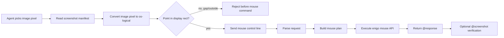
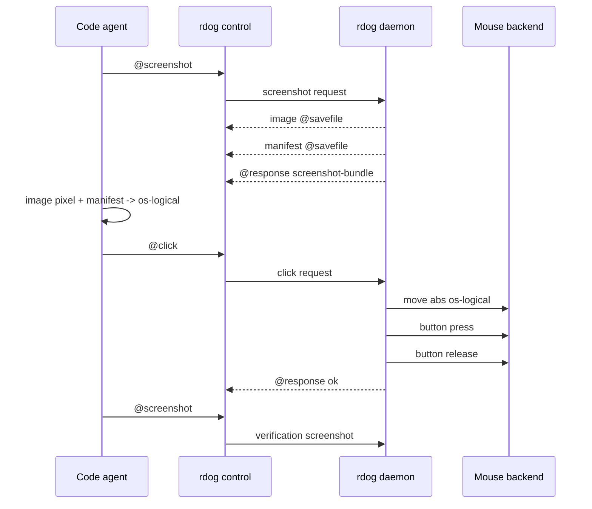

# `rdog` 鼠标控制与截图坐标契约方案

## 1. 结论先行

鼠标控制必须直接复用 `@screenshot` manifest 的 `os-logical` 坐标语义。
不要为 `@click` / `@drag` 再发明一套屏幕坐标。

默认控制入口分成五类:

```text
@mouse-move#10:{x:1200,y:540,coordinate_space:"os-logical"}
@mouse-button#11:{button:"left",mode:"press"}
@mouse-button#12:{button:"left",mode:"release"}
@click#13:{x:1200,y:540,button:"left",count:1,hold_ms:80,coordinate_space:"os-logical"}
@drag#14:{from:{x:900,y:420},to:{x:1200,y:540},button:"left",duration_ms:450,steps:24,coordinate_space:"os-logical"}
@wheel#15:{x:1200,y:540,delta_y:-3,coordinate_space:"os-logical"}
```

推荐实现顺序:

1. `@mouse-move`
2. `@mouse-button`
3. `@click`
4. `@drag`
5. `@wheel`

这样可以先把原子能力做稳,再用组合命令构建高层动作。

## 2. 坐标模型

### 2.1 单一真相源

`@screenshot` manifest 已经定义:

```text
os_x = image_x + virtual_bounds.x
os_y = image_y + virtual_bounds.y
image_x = os_x - virtual_bounds.x
image_y = os_y - virtual_bounds.y
```

鼠标控制接受的绝对坐标就是 manifest 的 `os-logical` 坐标。
如果 agent 从截图图片上选中像素点 `(image_x, image_y)`,必须先用 manifest 换算成 `(os_x, os_y)`,再发送鼠标指令。

### 2.2 命中校验

daemon 收到绝对 `os-logical` 坐标后,应该用最近一次 manifest 或请求自带 manifest 摘要做可选校验。
第一版建议先在 agent / client 侧做校验,daemon 侧只做基础整数范围和平台后端错误处理。

必须拒绝的坐标:

- 命中 manifest `gaps`。
- 不落在任何 `displays[].os_rect` 内。
- 来自 `rotation != 0` 的截图 manifest。
- coordinate_space 不是 `os-logical`。

### 2.3 后端坐标适配

对外协议不暴露 backend 坐标。
实现层可以把 `os-logical` 转成 enigo 需要的参数。

- macOS: `enigo::Coordinate::Abs` 基本可直接使用全局桌面坐标,但必须用真实多屏环境 smoke 校验负坐标和副屏位置。
- Linux X11: 部分 backend 不接受负坐标。若 manifest `virtual_bounds.x < 0` 或 `virtual_bounds.y < 0`,需要先做平台验证。不能静默把坐标 clamp 到 0。
- Windows: enigo 当前 absolute path 可能按 main display 映射,源码里还有 `MOUSEEVENTF_VIRTUALDESK` TODO。多显示器绝对坐标在 Windows 上必须单独验证,必要时补 Windows 专用 backend,不要假装已支持。

因此第一版实现应把平台能力写进 response metadata 或错误文本:

```text
@response {"id":10,"value":{"kind":"mouse","action":"move","coordinate_space":"os-logical","x":1200,"y":540,"backend":"enigo","status":"ok"}}
```

如果平台不支持当前坐标:

```text
@response {"id":10,"code":78,"error":"当前平台 backend 暂不支持该 os-logical 多显示器坐标"}
```

## 3. 协议设计

### 3.1 `@mouse-move`

用途: 只移动鼠标,不按键。

```text
@mouse-move#10:{x:1200,y:540,coordinate_space:"os-logical"}
@mouse-move#11:{dx:10,dy:-5,coordinate_space:"relative"}
```

字段:

- `x`, `y`: 绝对 `os-logical` 坐标。
- `dx`, `dy`: 相对移动量。
- `coordinate_space`: `os-logical` 或 `relative`。
- `duration_ms`: 可选。第一版可以不做平滑移动,保留字段但拒绝非 0,或直接不开放。

约束:

- `os-logical` 模式必须有 `x` / `y`。
- `relative` 模式必须有 `dx` / `dy`。
- 不能同时给 `x/y` 和 `dx/dy`。

### 3.2 `@mouse-button`

用途: 按下、释放或单次点击鼠标按钮。

```text
@mouse-button#20:{button:"left",mode:"press"}
@mouse-button#21:{button:"left",mode:"release"}
@mouse-button#22:{button:"right",mode:"click",hold_ms:80}
```

字段:

- `button`: `left`、`right`、`middle`、`back`、`forward`。
- `mode`: `press`、`release`、`click`。
- `hold_ms`: click 时 press 和 release 之间的等待时间,默认 80。

约束:

- `press` 后如果请求失败,daemon 不应该自动 release,否则会隐藏真实状态。
- 需要提供一个安全恢复命令: `@mouse-button:{button:"left",mode:"release"}`。
- 对 `press` / `release` 的成功响应要明确 button 和 mode。

### 3.3 `@click`

用途: 原子点击。它是 `move -> press -> hold -> release` 的安全组合。

```text
@click#30:{x:1200,y:540,button:"left",count:1,hold_ms:80,coordinate_space:"os-logical"}
@click#31:{x:1200,y:540,button:"right",count:1,coordinate_space:"os-logical"}
@click#32:{x:1200,y:540,button:"left",count:2,interval_ms:120,coordinate_space:"os-logical"}
```

字段:

- `x`, `y`: 绝对 `os-logical` 坐标。
- `button`: 默认 `left`。
- `count`: 默认 1,允许 1..=3。
- `hold_ms`: 默认 80。
- `interval_ms`: 多击之间的间隔,默认 120。
- `coordinate_space`: 只接受 `os-logical`。

约束:

- 坐标必须来自当前截图 manifest 换算。
- 如果 move 成功但 press 失败,返回错误,不要假装 click 成功。
- 如果 press 成功但 release 失败,返回 `code=77` 或 `code=70`,并在错误文本提示用户可发送 release 恢复。

### 3.4 `@drag`

用途: 从一点拖到另一点。它是 `move(from) -> press -> sampled move -> release` 的组合。

```text
@drag#40:{from:{x:900,y:420},to:{x:1200,y:540},button:"left",duration_ms:450,steps:24,coordinate_space:"os-logical"}
```

字段:

- `from`: 起点 `os-logical` 坐标。
- `to`: 终点 `os-logical` 坐标。
- `button`: 默认 `left`。
- `duration_ms`: 默认 450。
- `steps`: 默认根据距离和 duration 自动计算,建议范围 2..=120。
- `coordinate_space`: 只接受 `os-logical`。

约束:

- 起点和终点都必须命中显示器区域,不能在 gap。
- 中间采样点如果穿过 gap,第一版可以允许,因为真实鼠标跨屏移动可能经过无屏区域的逻辑路径。
  但最终点必须有效。
- 若 press 成功后中途 move 失败,必须尝试 release,然后返回错误并说明 release 是否成功。
- `@drag` 是组合命令,但响应必须说明每个阶段的最终状态。

建议响应:

```text
@response {"id":40,"value":{"kind":"mouse","action":"drag","coordinate_space":"os-logical","button":"left","from":{"x":900,"y":420},"to":{"x":1200,"y":540},"released":true}}
```

### 3.5 `@wheel`

用途: 滚轮滚动。

```text
@wheel#50:{x:1200,y:540,delta_y:-3,coordinate_space:"os-logical"}
@wheel#51:{x:1200,y:540,delta_x:2,coordinate_space:"os-logical"}
@wheel#52:{delta_y:-3}
```

字段:

- `x`, `y`: 可选。如果提供,先移动到该 `os-logical` 坐标再滚动。
- `delta_y`: 垂直滚动单位。沿用 enigo 语义: 正数向下,负数向上。
- `delta_x`: 水平滚动单位。正数向右,负数向左。
- `coordinate_space`: 提供 x/y 时只接受 `os-logical`。

约束:

- `delta_x` 和 `delta_y` 至少有一个非 0。
- 允许同一请求同时滚动 x/y,但执行顺序固定为 horizontal 后 vertical,或者明确选择 vertical 后 horizontal。建议第一版固定 vertical 后 horizontal,并写进测试。
- wheel 没有 button 状态,不应复用 `@mouse-button`。

## 4. 解析模型

新增结构建议:

```rust
pub enum ControlCommand {
    MouseMove(MouseMoveRequest),
    MouseButton(MouseButtonRequest),
    Click(ClickRequest),
    Drag(DragRequest),
    Wheel(WheelRequest),
}
```

也可以采用一个统一的 `MouseRequest`:

```rust
pub enum MouseRequest {
    Move(MouseMoveRequest),
    Button(MouseButtonRequest),
    Click(ClickRequest),
    Drag(DragRequest),
    Wheel(WheelRequest),
}
```

推荐采用独立 `ControlCommand` 变体。
原因是 line-control 命令本身已经是独立入口,测试和错误文案会更直接。

字段解析继续沿用当前对象 payload parser。
不要引入 JSON5 / serde_json 作为协议 parser 主路径,除非先整体重构 line-control 对象解析。

## 5. 执行模型

执行层新增 `MouseActionExecutor` 或直接扩展 `SystemControlActionExecutor`。
第一版建议扩展现有 executor,但把鼠标计划构建拆成纯函数。

核心纯函数:

- `parse_mouse_button(token) -> enigo::Button`
- `parse_mouse_coordinate_space(token) -> MouseCoordinateSpace`
- `build_mouse_move_plan(request) -> Vec<MousePlanStep>`
- `build_click_plan(request) -> Vec<MousePlanStep>`
- `build_drag_plan(request) -> Vec<MousePlanStep>`
- `build_wheel_plan(request) -> Vec<MousePlanStep>`

执行步骤:

```rust
enigo.move_mouse(x, y, Coordinate::Abs)?;
enigo.button(Button::Left, Direction::Press)?;
thread::sleep(Duration::from_millis(hold_ms));
enigo.button(Button::Left, Direction::Release)?;
enigo.scroll(delta_y, Axis::Vertical)?;
```

错误映射复用 `to_io_error`,但文案要从 `@key` / `@paste` 扩展成输入模拟通用说明:

```text
macOS 需要为实际执行 `@key` / `@paste` / `@click` / `@drag` / `@wheel` 的进程授予辅助功能权限。
```

## 6. 流程图



## 7. 时序图



## 8. 测试计划

### 8.1 Parser tests

- `@mouse-move#1:{x:1,y:2,coordinate_space:"os-logical"}` parses。
- `@mouse-move#1:{dx:1,dy:-2,coordinate_space:"relative"}` parses。
- `@mouse-move` 拒绝同时传 `x/y` 和 `dx/dy`。
- `@mouse-button#2:{button:"left",mode:"press"}` parses。
- `@click#3:{x:1,y:2}` 默认 `left/count=1/hold_ms=80`。
- `@drag#4:{from:{x:1,y:2},to:{x:3,y:4}}` parses。
- `@wheel#5:{delta_y:-3}` parses。
- 非法 button、count=0、steps=0、coordinate_space="native" 都拒绝。

### 8.2 Plan builder tests

- click plan 顺序必须是 move, press, hold, release。
- button press/release 不自动补相反动作。
- drag plan 中 press 成功后 move 失败时,执行层必须尝试 release。
- wheel 同时有 `delta_x` / `delta_y` 时顺序固定。

### 8.3 Permission tests

- enigo permission denied 映射为 `io::ErrorKind::PermissionDenied`。
- control response code 仍为 77。
- 错误文本同时覆盖 macOS Accessibility 和 Windows UIPI。

### 8.4 Real smoke tests

Ignored tests 即可:

```bash
cargo test --package rustdog --test zenoh_router_client -- control_should_execute_click_in_zenoh_profile --exact --ignored --nocapture
cargo test --package rustdog --test control_lanes -- daemon_control_lane_should_execute_mouse_button_press_release --exact --ignored --nocapture
cargo test --package rustdog --test control_websocket -- control_cli_should_execute_wheel_over_websocket --exact --ignored --nocapture
```

真实 smoke 不应点击破坏性位置。
建议先移动到空白安全点,做 middle click 或 no-op wheel,再截图验证鼠标位置/界面没有异常。

## 9. 分阶段实施

### 阶段 1: 协议和纯函数

- 新增请求类型和 parser。
- 新增 plan builder 纯函数。
- 不碰真实 enigo 执行。
- 完成 parser / plan builder 单测。

### 阶段 2: 原子动作

- 实现 `@mouse-move`。
- 实现 `@mouse-button`。
- 实现 `@wheel`。
- 扩展 permission 文案。

### 阶段 3: 组合动作

- 实现 `@click`。
- 实现 `@drag`。
- drag 中途失败必须 release。

### 阶段 4: 文档和 skill

- 更新 `specs/control-line-protocol.md`。
- 更新 `specs/code-agent-rdog-control-usage.md`。
- 更新 README。
- 更新全局 `rdog-control` skill。

### 阶段 5: 真实验证

- macOS Accessibility 权限边界验证。
- Windows UIPI 错误验证。
- 至少一条 Zenoh ignored smoke。
- 若 Windows 多显示器 absolute 坐标不可靠,明确返回 Unsupported,不要默默移动到主屏错误位置。

## 10. 风险和取舍

### 10.1 多显示器 backend 坐标风险

截图 manifest 的 `os-logical` 是产品协议真相源。
但 enigo 在不同平台对 absolute 坐标的解释不完全等价。
尤其 Windows 当前源码存在 virtual desktop TODO。
因此实现阶段必须用真实多显示器 smoke 证明,或者对不可靠平台返回 Unsupported。

### 10.2 button 状态风险

`@mouse-button mode:"press"` 会留下真实按下状态。
这是必要能力,因为用户明确需要 press/release。
但它必须配套清晰的 release 恢复命令和测试。
不要在失败时静默自动 release,除非是 `@drag` 这种组合命令内部的失败恢复。

### 10.3 wheel 语义风险

enigo wheel length 是滚轮刻度,不是像素。
协议字段应叫 `delta_x` / `delta_y`,不要叫 pixel。
后续如果要像素级 smooth scroll,另开 `scroll_unit:"pixel"` 或 macOS-only 扩展。
