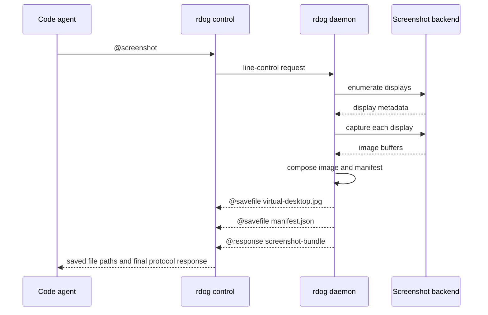

# `rdog @screenshot` 多显示器截图与坐标契约

## 1. 当前实现结论

`@screenshot` 的默认目标是用户所有 active displays。
默认返回一张完整虚拟桌面 JPEG,再返回一个 manifest JSON。
manifest 是截图坐标和后续鼠标坐标之间的单一真相源。

裸请求:

```text
@screenshot#7
```

等价于:

```text
@screenshot#7:{target:"display",display:"all",layout:"composite",coordinate_space:"os-logical",format:"jpeg",quality:75}
```

macOS 可选 AX metadata 入口:

```text
@screenshot#9:{include_ax:true,ax_required:false,ax_depth:4,ax_max_elements:1000}
```

这不会改变 screenshot 的坐标真相源。
manifest 中的 `accessibility` 字段仍使用 `coordinate_space:"os-logical"`。
详细 AX schema 和控制命令见 `specs/rdog-ax-screenshot-manifest-control-plan.md`。

显式主屏兼容入口:

```text
@screenshot#8:{target:"display",display:"primary",layout:"single",format:"jpeg",quality:75}
```

## 2. 返回帧顺序

默认 composite 请求返回三帧:

```text
@savefile {"id":7,"filename":"screenshot-...-virtual-desktop.jpg","mime":"image/jpeg","encoding":"base64",...}
@savefile {"id":7,"filename":"screenshot-...-manifest.json","mime":"application/json","encoding":"base64",...}
@response {"id":7,"value":{"kind":"screenshot-bundle","layout":"composite","coordinate_space":"os-logical","image":"screenshot-...-virtual-desktop.jpg","manifest":"screenshot-...-manifest.json","display_count":2}}
```

如果 freshness / stale guard 在 cache TTL(30 秒)内发现两次连续 composite 捕获到完全相同的显示器布局和像素指纹,请求会在输出任何 `@savefile` 前终止:

```text
@response {"id":7,"code":70,"kind":"screenshot-stale-frame","error_code":"SCREENSHOT_STALE_FRAME","guard_policy":"reject-consecutive-identical-composite-fingerprint","error":"...","display_count":2,"displays":[...]}
```

**TTL 早退(2026-06-25 加)**:daemon 长跑(N 小时~N 天)场景下,`LAST_COMPOSITE_FINGERPRINT` 里存的是 N 小时前的旧 fingerprint。SCK 抓帧 + WindowServer 没标 dirty 时 composite hash 可能跨请求不变,如果严格比对,会把"用户视角的第一次请求"误判成 stale 而拒掉。带 `captured_at` 之后,两次请求的 `Instant` gap ≥ 30s 就视为缓存陈旧直接放行,只对短间隔(用户连拍 observe)撞 hash 的真可疑场景保留拒绝。

```text
用户视角"第一次"请求(daemon 长跑后)        → 直接放行,30s TTL 早退
短间隔(≤30s)+ 同 hash(连拍 observe 真没动)  → 拒,SCREENSHOT_STALE_FRAME
短间隔(≤30s)+ 不同 hash(屏确实动了)         → 放行
长间隔(>30s)+ 同 hash                       → 放行(屏真没动 or 缓存陈旧,无法区分,默认信任)
```

撞 stale 后,调用方应停止使用本次视觉证据,把错误 payload 留给后续分析截图后端状态。长间隔早退场景的"误放行"代价是 SCK 真 stale 抓不到 — 这是用户接受的 trade-off(避免 daemon 长跑后误拒的更大代价)。

显式 `display:"primary",layout:"single"` 仍是旧兼容形态:

- 一个 JPEG `@savefile`
- 一个最终 `@response 0` 或 `@response {"id":...,"value":0}`

## 3. Manifest 坐标不变量

manifest schema 固定为 `rdog.screenshot.v1`。
字段命名统一使用 `snake_case`。

关键字段:

- `layout = "composite"`
- `coordinate_space = "os-logical"`
- `image_coordinate_space = "virtual-logical-pixels"`
- `virtual_bounds`
- `image_size`
- `display_count`
- `gaps`
- `displays[].os_rect`
- `displays[].image_rect`
- `displays[].native_capture_size`
- `displays[].scale_factor`
- `displays[].resize_applied`
- `displays[].rotation`
- `accessibility` 可选字段,仅在 `include_ax:true` 时出现

默认 logical composite 下,换算公式固定为:

```text
os_x = image_x + virtual_bounds.x
os_y = image_y + virtual_bounds.y
image_x = os_x - virtual_bounds.x
image_y = os_y - virtual_bounds.y
```

必须满足:

- `virtual_bounds` 是所有 display `os_rect` 的 union。
- `image_rect.x = os_rect.x - virtual_bounds.x`。
- `image_rect.y = os_rect.y - virtual_bounds.y`。
- `image_size.width = virtual_bounds.width`。
- `image_size.height = virtual_bounds.height`。
- `display_count == displays.len()`。

## 4. Gap 和 rotation

gap 区域不属于任何显示器。
manifest 必须提供 `gaps` 字段。
命中所有 `display.image_rect` 之外的点,不能直接转成鼠标点击。

第一版不支持旋转显示器。
任一 display `rotation != 0` 时,daemon 应返回 unsupported error,不要生成看似可点击的截图。

## 5. macOS 权限契约

macOS 截图需要实际运行 `rdog` 的进程拥有 Screen Recording 权限。
权限不足时返回 `PermissionDenied`,控制面映射为 `code = 77`。

实现上优先执行 Screen Recording preflight。
如果 preflight 不通过,不能继续 fallback 到可能产生 desktop-only 假成功的截图后端。

`include_ax:true` 还需要 Accessibility 权限。
当 `ax_required:false` 时,Accessibility 权限不足只让 `accessibility.capture_status` 变成 `permission_denied`,截图 bundle 仍返回。
当 `ax_required:true` 时,Accessibility 权限不足返回 `PermissionDenied`,控制面映射为 `code = 77`。

## 6. 处理流程

```mermaid
flowchart LR
    A[Control line @screenshot] --> B[Parse ScreenshotRequest]
    B --> C{display selector}
    C -->|primary| D[Capture primary display]
    D --> E[Emit one JPEG @savefile]
    E --> F[Emit compatibility @response 0]
    C -->|all| G[Enumerate all displays]
    G --> H[Capture each display with metadata]
    H --> I[Build virtual bounds]
    I --> J[Resize native captures to logical rects]
    J --> K[Composite virtual desktop JPEG]
    K --> L[Build manifest JSON]
    L --> M[Emit image @savefile]
    M --> N[Emit manifest @savefile]
    N --> O[Emit @response screenshot-bundle]
```



## 7. 时序



## 8. 验证入口

核心 focused tests:

```bash
cargo test --package rustdog --bin rdog -- control_protocol::tests::parse_should_support_screenshot_display_layout_and_coordinate_space --exact
cargo test --package rustdog --bin rdog -- screenshot::tests
cargo test --package rustdog --bin rdog -- shell::tests::receive_control_result_frames_should_save_multiple_savefiles_before_final_response --exact
```

完整 bin 单测:

```bash
cargo test --package rustdog --bin rdog
```

真实 Zenoh / TCP / WebSocket screenshot smoke 是 ignored 测试。
它们需要本机真实屏幕和截图权限。
