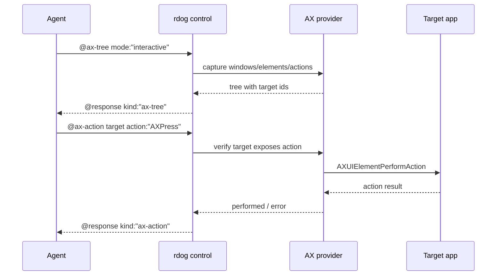

# rdog 非鼠标控制调研: open-codex-computer-use 对照

## 目标

基于 `https://github.com/iFurySt/open-codex-computer-use` 的实现,为 `rdog` 后续补齐“完整能力的非鼠标控制”提供设计依据。

本方案的核心约束是:

- 默认不移动用户真实鼠标。
- 默认不做全局 pointer fallback。
- 默认不隐式激活窗口或切换桌面。
- 让 agent 能明确知道当前动作是语义 AX 动作、定向键盘事件、窗口生命周期动作,还是显式全局 fallback。

## 调研结论

`open-codex-computer-use` 的公开工具面是 9 个 Computer Use tools:

- `list_apps`
- `get_app_state`
- `click`
- `perform_secondary_action`
- `scroll`
- `drag`
- `type_text`
- `press_key`
- `set_value`

这些工具名看起来包含鼠标,但 macOS 实现并不等价于“真实鼠标自动化”。
它的关键价值在于 action ladder:

1. 先观察 app/window/AX tree.
2. 优先按 `element_index` 找 AX element.
3. 优先执行 AX semantic action.
4. 文本优先写 settable `AXValue`.
5. 键盘事件优先 `postToPid`.
6. 坐标事件优先定向到目标 pid.
7. 全局 pointer fallback 需要显式环境变量开启。

## 对 rdog 的设计启发

`rdog` 已经有更适合远程控制的显式 window / AX 协议:

- `@ax-tree`
- `@ax-find`
- `@ax-get`
- `@ax-press`
- `@window-find`
- `@window-activate`
- `@window-close`
- `@mouse-move`
- `@mouse-button`
- `@click`
- `@drag`
- `@wheel`

因此 `rdog` 不应照搬 `open-computer-use` 的 9-tool surface。
更合适的方向是把它的内部 action ladder 抽成 `rdog` 的非鼠标控制 profile。

## 建议协议扩展

### 1. `@ax-action`

泛化 `@ax-press`,对目标元素执行其已暴露的 AX action。

示例:

```text
@ax-action#10:{target:"pid:123/window:0/path:7.3",action:"AXPress"}
@ax-action#11:{target:"pid:123/window:0/path:9.1",action:"AXOpen"}
@ax-action#12:{target:"pid:123/window:0/path:2.4",action:"AXShowMenu"}
```

策略:

- 只允许执行 `@ax-tree` / `@ax-find` / `@ax-get` 已暴露的 action.
- 默认允许安全动作: `AXPress`, `AXOpen`, `AXConfirm`, `AXCancel`, `AXShowMenu`, `AXScrollToVisible`.
- `AXRaise`, `AXMain`, `AXFocused` 归入窗口/焦点类动作,默认要求显式字段。
- 返回值必须包含 `target`, `action`, `performed`, `before_snapshot_id` 可选字段。

### 2. `@ax-set-value`

对 settable `AXValue` 写值。

示例:

```text
@ax-set-value#20:{target:"pid:123/window:0/path:8.2",value:"hello"}
```

策略:

- 写前必须检测 `AXUIElementIsAttributeSettable(AXValue)`.
- 不 settable 时返回结构化错误,不要 fallback 到键盘或剪贴板。
- 可选支持 `mode:"replace" | "append"`,默认 `replace`.

### 3. `@ax-focus`

对元素或窗口设置 focus/main,用于后续 `@key` / `@type-text`。

示例:

```text
@ax-focus#30:{target:"pid:123/window:0/path:8.2"}
@ax-focus#31:{window_id:"pid:123/window:0",activate:false}
```

策略:

- 默认只对目标 app/window 内部设置 `AXFocused`.
- `activate:true` 才允许 unhide / unminimize / raise / switch space。
- action report 复用 `@window-activate` step report 语义。

### 4. `@type-text`

提供非鼠标文本输入。

示例:

```text
@type-text#40:{target:"pid:123/window:0/path:8.2",text:"hello",mode:"set-value"}
@type-text#41:{app:"TextEdit",text:"hello",mode:"targeted-keyboard"}
```

策略:

- 优先 `AXValue` replace/append.
- 其次对 pid/window 定向投递 Unicode keyboard event.
- 默认不使用剪贴板,避免覆盖用户剪贴板。
- 如果未来需要 paste fallback,必须 `allow_clipboard:true`,并返回保存/恢复剪贴板是否成功。

### 5. `@key`

保留现有键盘命令,但新增非干扰策略。

建议字段:

```text
@key#50:{app:"TextEdit",key:"Return",delivery:"pid-targeted"}
@key#51:{window_id:"pid:123/window:0",key:"Cmd+W",delivery:"window-targeted"}
```

策略:

- 默认 `delivery:"pid-targeted"` 或当前平台最接近的后台投递能力。
- `delivery:"global"` 必须显式指定。
- 返回中必须标明 `delivery`.

### 6. `@ax-scroll`

优先执行 AX scroll action。

示例:

```text
@ax-scroll#60:{target:"pid:123/window:0/path:10.1",direction:"down",pages:1}
```

策略:

- 整数页优先 `AXScrollDownByPage` / `AXScrollUpByPage`.
- 失败后可选 pid-targeted scroll event.
- 不自动退到全局 wheel。

## Agent 决策流程

```mermaid
flowchart TD
    Start[需要操作远程桌面] --> Observe[@screenshot 或 @ax-tree]
    Observe --> Find[@ax-find 或 @window-find]
    Find --> IsWindowReady{窗口可交互?}
    IsWindowReady -->|否| ExplicitActivate[@window-activate activate:true]
    ExplicitActivate --> ObserveAgain[@ax-tree 或 @window-find]
    IsWindowReady -->|是| Choose{目标能力}
    ObserveAgain --> Choose
    Choose -->|按钮/菜单| AxAction[@ax-action]
    Choose -->|文本写入| SetValue[@ax-set-value 或 @type-text]
    Choose -->|快捷键| Key[@key delivery:pid-targeted]
    Choose -->|滚动| AxScroll[@ax-scroll]
    Choose -->|无法语义化| Fallback{是否允许干扰?}
    Fallback -->|否| Report[返回 limited 和原因]
    Fallback -->|是| Mouse[@click/@drag/@wheel explicit global]
```



## 能力矩阵

| 能力 | open-codex-computer-use 做法 | rdog 建议 |
| --- | --- | --- |
| 观察 app/window/UI | `get_app_state` 返回截图和 AX tree | 保持 `@screenshot include_ax` + `@ax-tree/@ax-find/@ax-get` |
| 按钮/菜单动作 | `click` 内部优先 AXPress/AXOpen/AXShowMenu | 新增显式 `@ax-action`,不要把所有语义动作藏进 `@click` |
| 文本写入 | `set_value` 写 settable AXValue,`type_text` 先写 focused AXValue | 新增 `@ax-set-value`,再扩展 `@type-text` |
| 键盘 | `press_key` / `type_text` 使用 `postToPid` | `@key` 增加 `delivery:"pid-targeted"` |
| 滚动 | 优先 AXScrollByPage,否则 targeted scroll event | 新增 `@ax-scroll`,全局 wheel 显式 opt-in |
| 窗口恢复 | `get_app_state` 内部尝试 unhide/activate/raise | 保持 `@window-activate` 显式调用 |
| 窗口关闭 | 没有专门 tool | 保持 `@window-close`,默认 graceful |
| 剪贴板 | MCP server 指令提醒不要覆盖剪贴板,无专门 tool | 不默认使用剪贴板,paste fallback 必须显式 |
| 鼠标 fallback | 默认 targeted event,全局 pointer fallback 需 env | `@mouse-*` 保留,但 agent skill 默认非鼠标优先 |

## 推荐实施顺序

1. Phase A: `@ax-action`
   - 把 `@ax-press` 后端泛化为 action executor.
   - `@ax-press` 保留为 `@ax-action action:"AXPress"` 的兼容入口.

2. Phase B: `@ax-set-value`
   - 支持 settable `AXValue` replace/append.
   - 增加 focused text fixture 或 live ignored E2E.

3. Phase C: `@type-text` / `@key` targeted delivery
   - macOS 先支持 pid-targeted keyboard event.
   - 返回明确 `delivery` 字段.

4. Phase D: `@ax-scroll`
   - 先实现 AXScroll page actions.
   - targeted scroll event 作为可选 fallback.

5. Phase E: skill 更新
   - `rdog-control` skill 明确写入非鼠标优先流程。
   - mouse 命令标记为最后 fallback,并提示会干扰用户当前操作。

## 当前不建议立即做

- 不建议把 `@click` 改成自动 AX-first 大杂烩。
  - 原因: `rdog` 是远程控制协议,显式命令更利于审计和调试。
- 不建议默认使用剪贴板 paste。
  - 原因: 会覆盖用户真实剪贴板,和“避免干扰人类操作”目标冲突。
- 不建议在 observation 阶段隐式激活窗口。
  - 原因: 这会抢前台或切换 Space,应由 agent 显式决定。

## 验证策略

本轮调研没有运行真实鼠标测试。
后续实现时建议分三类验证:

1. 静态和单元测试
   - parser / protocol / error mapping.
   - AX action allowlist.
   - settable value 判断.

2. fake executor 集成测试
   - `src/shell.rs` fake executor 覆盖新增 command arms.
   - line-control response schema.

3. live ignored E2E
   - 只在用户允许时运行。
   - 优先用 TextEdit / Notes 这类低风险 app。
   - E2E 必须证明没有使用 `@mouse-*`,且最终状态通过 AX/text 或截图 crop 证实。
