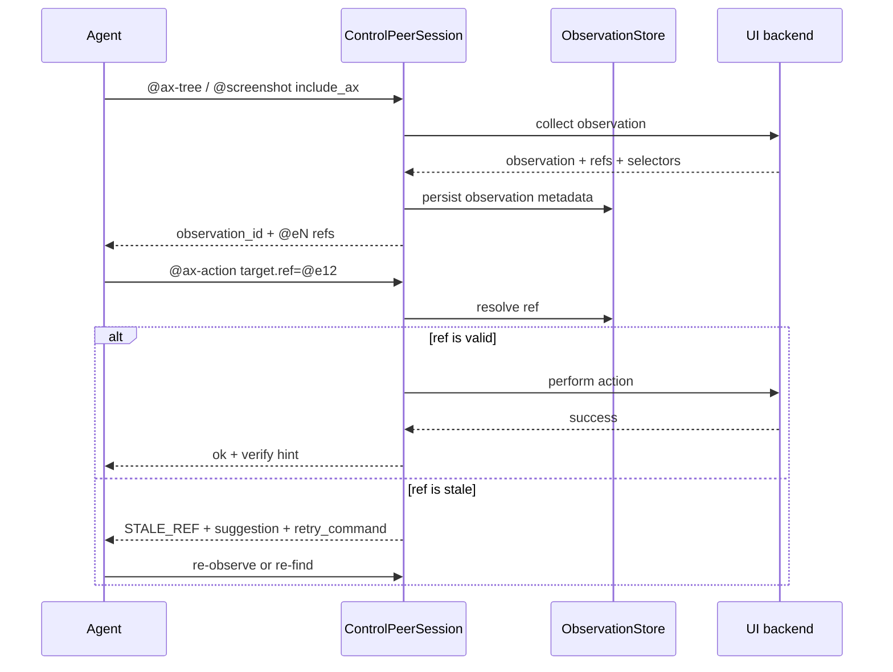

# `rdog` observation-scoped refmap and locator roadmap

## 1. 目标

把 `rdog` 的 GUI observation 变成一等对象.

这份方案不是只解决“当前这次能点到按钮”.
它要把下面几件事放进同一条演进线里:

- observation-scoped refmap
- 跨 daemon 重启的 durable observation state
- 永久 selector
- 自动语义 re-find
- 新增 `@observe`
- mouse command ref 化

核心原则只有一个:
**短期 ref 负责快,永久 selector 负责稳,语义 re-find 负责恢复,鼠标只是最后兜底.**

## 2. 设计原则

1. 单一真相源.
   - observation 内的 ref 只对这次 observation 负责.
   - durable selector 只负责跨 observation 的恢复.
2. 明确边界.
   - `@eN` 是短期 locator.
   - selector 是持久定位描述.
   - mouse 坐标是物理 fallback,不是默认主路径.
3. 失败要可恢复.
   - stale 不能静默猜.
   - ambiguous 不能静默选.
   - permission denied 要直说.
4. 先兼容,再增强.
   - 现有 `@screenshot` / `@ax-tree` / `@ax-find` / `@ax-get` 继续可用.
   - 新能力先扩展 payload,再考虑新增命令名.
5. 控制面优先.
   - 这些能力必须落在 `ControlPeerSession` 和 control frame 语义里.
   - 不要把 UI 状态散落到 transport 细节里.

## 3. 术语

### 3.1 Observation

一次 UI 观察结果.

可能来自:

- `@screenshot include_ax:true`
- `@ax-tree`
- `@window-find`
- 未来的 `@observe`

Observation 应该有:

- `observation_id`
- `session_id`
- `created_at_unix_ms`
- `ttl_ms`
- `scope`
- `source_command`
- `root`
- `ref_count`
- `selector_count`

### 3.2 Ref

Observation 内的短期引用.

例子:

```json
{
  "ref": "@e12",
  "id": "pid:123/window:0/path:7.3",
  "role": "AXButton",
  "name": "储存空间"
}
```

它只保证:

- 在当前 observation 内可解析
- 在 UI 未变时可重用
- UI 变了以后必须明确 stale

### 3.3 Selector

跨 observation 的持久定位描述.

Selector 不是单个字符串,而是结构化约束,比如:

- app / bundle_id
- window title / role
- role / subrole
- name / name_contains
- path anchor
- sibling anchor
- parent anchor
- stable backend id

Selector 的职责:

- 支持 daemon 重启后的恢复
- 支持 stale ref 的 semantic re-find
- 支持 future `@observe` / `@resolve` / `@locate`

### 3.4 Re-find

ref 失效后,用 selector 或结构约束重新找到目标.

它必须:

- 返回候选集合
- 提供置信度和理由
- 保持可审计
- 不在低置信度时偷偷代替用户做决定

## 4. 当前 baseline

rustdog 已经有一些底座,这份方案要沿这些底座长出来,不是另起炉灶:

- `@capabilities` 是能力单一真相源.
- `@screenshot include_ax` 已经有 AX manifest 的方向.
- `@ax-tree`, `@ax-find`, `@ax-get`, `@ax-action`, `@ax-set-value`, `@type-text`, `@ax-scroll` 已经有语义控制面.
- `@window-find` 已经有 `snapshot_id`.
- `@savefile` 已经说明 control frame 可以携带 out-of-band 结果.
- `ControlPeerSession` 已经是 session 层的抽象起点.

所以这份方案不是要“发明观察系统”.
它是要把已有命令统一成一条清晰的 observation / ref / selector 演进线.

## 5. 总体架构

```mermaid
flowchart TD
    Start[Launch or observe] --> Obs[@screenshot / @ax-tree / @window-find]
    Obs --> Store[ObservationStore]
    Store --> Refs[short refs @eN]
    Store --> Sel[durable selectors]
    Refs --> Act[@ax-action / @ax-set-value / @type-text / mouse]
    Sel --> Refind[semantic re-find]
    Refind --> Act
    Act --> Verify[re-observe / wait / verify]
    Verify -->|stale| Obs
    Verify -->|ok| Done[continue loop]
```



## 6. 方案分层

### 6.1 短期 refmap

第一层只解决当前 observation 内的定位.

规则:

- `ref` 在当前 observation 内唯一.
- `ref` 可以指向 interactive element.
- skeleton 模式下,容器也可以有 ref,用于 drill-down.
- ref 更新只影响被重新观察的局部区域.
- UI 改变后旧 ref 不要硬复用.

这层已经足够支撑:

- dense UI 的骨架观察
- 局部钻取
- 一次动作后的局部验证

### 6.2 durable observation state

第二层解决 daemon 重启后的恢复.

它不等于把所有 ref 永久保存下来.
更合理的是保存:

- observation 元数据
- selector 索引
- 最近一次成功 resolve 的候选路径
- TTL / eviction 状态

采用 daemon-owned state dir,而不是 CLI scratch file.
当前 P1 实现使用 JSON / JSONL 文件,并由 daemon 启动时初始化:

- `meta.json`: `rdog.observation.state.v1`,记录 daemon identity、privacy 和 retention。
- `index.json`: `rdog.observation.index.v1`,保存可快速查询的 observation / selector 索引。
- `observations.jsonl`: `rdog.observation.record.v1`,追加 observation metadata。
- `selectors.jsonl`: `rdog.selector.record.v1`,追加 stable selector record。
- `ref_cache.jsonl`: `rdog.ref-cache.v1`,只保存 hint-only ref cache。

默认路径由平台决定:

- macOS: `~/Library/Application Support/rdog/observations/<daemon_name>/`
- Windows: `%LOCALAPPDATA%/rdog/observations/<daemon_name>/`
- Linux: `${XDG_STATE_HOME:-~/.local/state}/rdog/observations/<daemon_name>/`

如果配置了 `[observation].state_dir`,则以配置值为准。

关键是语义先定死:

- daemon 重启后,旧 ref 默认不可直接信任
- selector 可尝试恢复
- 无法恢复就 stale,不要伪装成仍然有效

### 6.3 permanent selector

第三层解决跨 observation 的持久定位.

它应该是结构化的,不是一个神秘字符串.

例子:

```json
{
  "app": "System Settings",
  "window_title_contains": "储存空间",
  "role": "AXButton",
  "name": "储存空间",
  "anchors": [
    {"role":"AXGroup","name":"侧边栏"},
    {"role":"AXToolbar","name":"导航"}
  ]
}
```

selector 的要求:

- 可解释
- 可比较
- 可排序
- 可序列化
- 可在不同 observation 之间复用

它不是一定要被用户直接看见,但它必须能被错误和 debug 命中.

### 6.4 semantic re-find

第四层解决 stale 后的恢复路径.

规则:

1. 先查当前 observation 的 ref.
2. 不存在则看 selector.
3. selector 命中多个候选时,返回候选集.
4. 只有单候选且置信度足够高时,才允许自动 re-find.
5. 低置信度时,必须把候选列给 agent,不能暗改目标.

这层尤其适合:

- app 重新渲染
- 列表虚拟滚动
- 面板折叠/展开后重建
- window 重开后 path 变化

### 6.5 `@observe`

第五层是统一观察入口.

它不是马上替换当前所有命令.
它是未来的总入口,让 agent 少记几个命令名.

建议语义:

- `@observe` 返回一个 observation bundle.
- bundle 可按 mode 选择:
  - `visual`
  - `ax`
  - `window`
  - `hybrid`
- bundle 内包含:
  - observation header
  - windows summary
  - refs
  - selectors
  - optional manifest / screenshot

这样 `@observe` 后面可以慢慢收拢:

- `@screenshot include_ax`
- `@ax-tree`
- `@window-find`
- `@list-surfaces`

但它的前提是:

- 现有命令先已经稳定
- 统一的 observation 头部字段先定义好

### 6.6 mouse ref 化

最后一层才是 mouse.

原则:

- 只要能语义 action,先语义 action.
- 只要能 ref 定位,就尽量别直接写屏幕坐标.
- 只有 free space、canvas、复杂拖拽路径才回到坐标.

建议演进方向:

- `@click` 接受 `target:{ref,observation_id}` 或显式 selector target
- `@drag` 接受 `from:{ref,observation_id}` / `to:{ref,observation_id}`
- hover-by-ref 不新增独立 `@hover`,由 `@mouse-move:{target:{ref,observation_id}}` 表达
- `@wheel` 接受 scroll container 的 `target:{ref,observation_id}`

坐标仍然保留,但它是 fallback.

当前 P5 wire shape:

```text
@click#10:{target:{ref:"@e4",observation_id:"obs-..."},button:"left",count:1}
@drag#11:{from:{ref:"@e1",observation_id:"obs-..."},to:{x:900,y:520},duration_ms:450}
@wheel#12:{target:{ref:"@e8",observation_id:"obs-..."},delta_y:-3}
@mouse-move#13:{target:{ref:"@e9",observation_id:"obs-..."}}
```

selector target 的默认行为是 no-action handoff:

```text
@click#20:{target:{selector_id:"sel-v1-...",auto_refind:false},button:"left"}
```

它只返回 `performed:false`、`gate_decision:"handoff_required"` 和 `recovery_command:"@selector-refind:..."`。
只有显式 `auto_refind:true` 且 typed refind decision 为 `rebound`、fresh target 能重新解析到当前 rect 时,才允许继续执行 mouse fallback。
`needs_disambiguation`、`blocked`、`not_found`、低置信度或 rect 缺失都必须保持 no-action。

## 7. 错误契约

错误必须能指导恢复.

建议统一扩展这些字段:

- `code`
- `error_code`
- `message`
- `suggestion`
- `retry_command`
- `observation_id`
- `selector`
- `candidates`

常见错误:

- `STALE_REF`
- `AMBIGUOUS_SELECTOR`
- `OBSERVATION_EXPIRED`
- `PERM_DENIED`
- `WINDOW_NOT_FOUND`
- `ACTION_NOT_SUPPORTED`
- `TARGET_HIDDEN`

禁止:

- 用普通 invalid args 掩盖 stale
- 用 silent fallback 偷换候选
- 用鼠标坐标假装语义成功

## 8. 路线图

### P0: observation-scoped refmap

已落地.

目标:

- observation 内生成 `@eN`
- 支持局部 drill-down
- 支持 stale ref
- 支持 observation header

### P1: durable observation state

已落地.

目标:

- daemon 重启后还保留 selector 线索
- observation metadata 可审计
- refmap 只作为 ephemeral cache

### P2: permanent selector

已落地.

目标:

- 允许跨 observation 重新找到目标
- 用结构化 selector 表达语义锚点
- 不用 opaque AI string

### P3: semantic re-find

已落地.

目标:

- stale 时可尝试自动恢复
- 低置信度必须返回候选集
- 结果可解释

### P4: `@observe`

已落地为统一只读观察入口.

目标:

- 把观察操作收束成一个总入口
- 减少 agent 需要记的命令面
- 让 bundle 成为主要 observation 载体

### P5: mouse ref 化

已落地.

目标:

- mouse 也能尽量复用 observation ref / selector
- 坐标只保留为显式 fallback
- 鼠标不再是无语义主路径

当前实现要点:

- ref target 在动作前重新解析 AX/window 当前 rect,不会把旧截图 rect 当执行真相源。
- 坐标 payload 保持兼容,但响应必须标记 `target_resolution.source:"coordinate_fallback"`。
- selector target 默认 no-action handoff。
- 只有显式 `auto_refind:true`、`@selector-refind` 返回 `decision:"rebound"`、fresh target 又能解析到当前 rect 时,mouse fallback 才能继续执行。

## 9. 迁移策略

### 第一阶段

先在现有命令上加字段,不改用户心智:

- `@ax-tree`
- `@ax-find`
- `@ax-get`
- `@screenshot include_ax`

### 第二阶段

再把 action 命令接上 ref / selector:

- `@ax-action`
- `@ax-set-value`
- `@type-text`
- `@ax-scroll`

### 第三阶段

再做 durable store 和 selector recovery:

- daemon restart recover
- semantic re-find
- stale diagnostics

### 第四阶段

最后统一 `@observe` 和 mouse ref 化.

## 10. 风险和约束

1. 不要把 durable selector 做成黑盒。
2. 不要把 semantic re-find 做成默认静默猜测。
3. 不要让 `@observe` 取代现有命令之前就过早上马。
4. 不要把 mouse 变成隐藏主路径。
5. 不要把观测状态塞进 transport 私货里。
6. 不要把短期 ref 和永久 selector 混成一个字段。

## 11. 结论

这份路线图的关键不是“先做最小版”.
关键是把最小版放进一条明确的长期演进线里.

P0 先把 observation-scoped refmap 做对.
但文档里必须始终保留后面四条线:

- durable observation state
- permanent selector
- semantic re-find
- `@observe`
- mouse ref 化

这样后面不管先做哪一段,都不会把整体方向做散.
