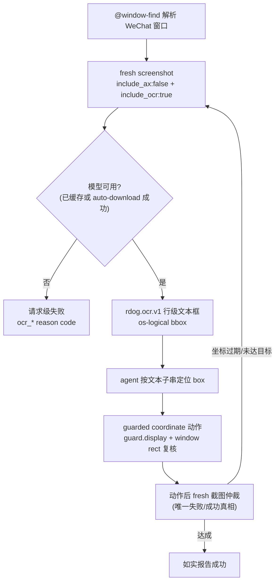

# `rdog` OCR 内容层方案 (no-AX app 通用内容识别)

Status: in-progress (Wayfinder map #95 产出; 2026-09-02 rev2 引擎修订; 第一阶段已实现: ocr-oar feature / include_ocr 协议 / rdog.ocr.v1 层 / fail-closed reason code, 单测 948 绿 + 真机冒烟通过; live 三件套 e2e 已实现 (tests/control_ocr_e2e.rs, RDOG_OCR_LIVE_E2E 门控 + VIA_TERMINAL 模式), 待 Terminal 获得"屏幕录制"授权后验收)
Date: 2026-09-02

> **修订记录**
> - v1 (2026-09-02): 初版, 第一引擎 Apple Vision (依据 #96: 当时唯一有动态中文证据的候选)。
> - v1.1 (2026-09-02): 用户反馈 Vision accurate 热路径 ~1s 偏慢, 补横向实测后**主引擎换 oar-ocr
>   (PP-OCRv6 tiny), Vision 完全移除**。依据 #96 追加横评: oar-ocr 推理 ~0.35s (Vision 的 1/2.6),
>   三档召回 89%/93%/83% 全面 >= Vision accurate (87%/91%/63%), 35% 缩放悬崖消失,
>   置信度连续分布。Vision fast 档对简体中文不可用 (17%/2%/0%), 一并排除。
>   政策、schema、坐标动作链路、验收框架不变; 失败语义与分发随引擎更新。

## 1. 结论先行

OCR 是 AX 缺失/受限 app 的通用内容识别层, WeChat (`com.tencent.xinWeChat`) 是首个验收场景。
第一引擎锁定 **oar-ocr** (PaddleOCR PP-OCRv6 tiny ONNX, 经 ONNX Runtime): 推理 ~0.35s 且对输入
分辨率不敏感, 中英开箱即用, 模型 6MB 首跑自动下载 (sha256 锁定)。

入口复用 `@screenshot`, 不新增协议原语:

```text
@screenshot#21:{scope:{...}, include_ax:false, include_ocr:true}
```

OCR 文本框以行级 box 进入 screenshot manifest 的 `rdog.ocr.v1` 层; agent 按文本子串定位
os-logical 坐标, 动作仍走既有 guarded coordinate 门禁。OCR 文本永远不是 AX ref。

```text
读内容:   @window-find → fresh screenshot include_ocr → 文本 + bbox
做动作:   按 bbox 坐标 → guarded coordinate 动作 (guard.display + window rect 复核)
做验证:   动作后 fresh 截图仲裁 (唯一真相)
```

## 2. 引擎结论 (#96 初选 + 2026-09-02 横评修订)

| 候选 | 结论 | 一句话理由 |
|---|---|---|
| oar-ocr (PP-OCRv6 tiny) | **采用** | 实测 ~0.35s + 召回 89%/93%/83% 全面领先; 置信度连续分布; 跨平台潜力 |
| Apple Vision | 移除 (v1.1) | accurate 档慢 2.6x; fast 档中文不可用 (17%/2%/0%); 35% 缩放悬崖 |
| rusto-rs | 观察名单 | 12 stars / v0.2.5 / 构建 拉 MNN 预编译有供应链风险 |
| paddle-ocr-rs | 淘汰 | 一年未发版, 能力被 oar-ocr 覆盖 |
| ocrs | 淘汰 | 官方明确仅拉丁字母, 中文一票否决 |

## 3. oar-ocr 运行时契约

- **模型**: `pp-ocrv6_tiny_det.onnx` + `pp-ocrv6_tiny_rec.onnx` + `ppocrv6_tiny_dict.txt`,
  共 6MB。`auto-download` feature 下 builder 传裸名自动从 ModelScope 下载,
  按内嵌 sha256/size 校验, 缓存 `$OAR_HOME` (默认 `~/.oar`; e2e 必须显式注入, 见 §8)。
- **启动探测 (fail-closed)**: 模型文件缺失且 auto-download 关闭/失败 → OCR 能力标记不可用,
  带 `include_ocr:true` 的请求直接失败 (§5)。oar-ocr 失败是显式报错, **无 Vision 那类静默降级问题**;
  语言探测不再需要 (v6 tiny 字典中英覆盖 WeChat 场景)。
- **进程内常驻**: OCR 实例 daemon 生命周期内复用, 模型热加载 77ms 仅发生在启动。
- **延迟实测基线** (#96 追加横评): 三档分辨率 (2940x1726 / 1470x863 / 1024x601) 全部
  ~0.31-0.37s, 对输入尺度不敏感; 无需预缩放, 也无缩放悬崖 (35% 档召回仍 83%)。

## 4. manifest ocr 层 schema (`rdog.ocr.v1`)

请求: `include_ax` 与 `include_ocr` 是两个独立 flag, 可同开 (WeChat chrome 有 AX、内容区没有, 两层互补)。

```json
"ocr": {
  "version": "rdog.ocr.v1",
  "engine": "oar",
  "language": "zh-Hans",
  "boxes": [
    {"index": 0, "text": "文件传输助手", "bbox": [407, 88, 176, 30], "confidence": 0.98}
  ]
}
```

- **粒度**: 行级/块级 (oar det 输出即文本行区域, 实测同屏 ~90+ 框, 比 Vision 更细, 利于子串匹配)。
- **bbox**: `os-logical` 逻辑坐标 `[x, y, w, h]`, 左上原点, 与 screenshot manifest 坐标契约一致
  (实现时由像素坐标按 scale factor 换算)。
- **顺序**: 引擎原序 + `index`, 不做 daemon 几何重排 (错误重排比乱序更误导); 空间推理靠 bbox。
- **confidence**: 原样透传。实测连续分布 (中位 0.93, 噪声框出现 0.00 低值), 比 Vision 离散桶
  更适合 agent 侧软过滤; 不得作为 daemon 侧硬过滤。
- **匹配语义**: agent 按 "标点/大小写不敏感子串 + 相邻框续行拼接" 找文本, 不做全等匹配
  (卡片正文会被拆行, 行间可能夹 logo 框)。

## 5. 失败语义 (请求级失败, fail-closed)

`include_ocr:true` 但 OCR 不可用时, 整个 `@screenshot` 请求失败, 不降级返回缺层 manifest:

| reason code | 触发 |
|---|---|
| `ocr_engine_unavailable` | 模型缺失 / auto-download 失败 / ONNX Runtime 初始化失败 |
| `ocr_timeout` | 单次识别超过预算 (§7) |

依据: 仓库 fail-closed 纪律 — **缺层绝不可被误读为"没文字"**。
(v1 的 `ocr_language_unsupported` 随 Vision 移除而删除; 若未来引入多语言模型再恢复。)
Screen Recording 权限缺失走既有 screenshot 错误路径 (OCR 层只在截图成功后存在)。

## 6. 坐标与动作链路 (政策 v2)



- OCR 坐标就是 coordinate fallback, 风险由既有 rect 复核 + display guard + 动作后 fresh 截图承担。
- OCR 观察与动作之间的内容滚动/变化**不受保护**; 动作后 fresh 截图是唯一仲裁。
- OCR 文本框不是 ref, 不进 observation/refmap/epoch 体系。
- 验收必须含**识别错误负例**: OCR 文本匹配错 → 坐标偏差 → fresh 截图必须能发现未达目标并如实报失败。

## 7. 性能预算 (#96 追加横评实测推导)

| 项 | 预算 | 实测 |
|---|---|---|
| 推理热路径 (单窗口) | p95 ≤ 0.5s | 0.31-0.37s, 尺度不敏感 |
| 冷启动 (模型加载, 已缓存) | ≤ 1s | ~0.43s (77ms 载入 + 首推理) |
| 首次部署 (含模型下载) | ≤ 30s | 7.4s |
| 行级召回参考 (深色模式, >=50% 缩放) | ≥ 85% | 89-93% |

输入分辨率: 推荐原始截图尺度或 >=50%; 35% 档召回 83% 仍可用 (无悬崖), 但不作为设计工作点。

## 8. 分发与 feature gating

- **feature**: `ocr-oar` **默认开** (含 `auto-download`); 二进制增量实测:
  release 二进制 19M (无 oar) -> 46M (含 oar), **+27MB** (初估 +10-20MB 偏低,
  2026-09-02 实测回填)。注意确认 ort 是静态链接还是伴随 dylib, 影响 CI/部署
  产物清单 (待实现期核实)。
- **模型分发**: 首跑自动下载 (ModelScope, sha256 校验) → `$OAR_HOME` 缓存;
  离线/airgap 部署 = 预先布置 `$OAR_HOME` (预置 6MB 模型即可, 无网络依赖)。
- **e2e 纪律**: spawn 点 checklist 必须显式注入 `OAR_HOME` (oar-ocr 在 home 解析失败时会
  静默退到 cwd, 破坏 HOME 隔离契约, 见 `docs/solutions/conventions/e2e-isolated-home-credentials.md`);
  CI 用 actions/cache 预装 6MB fixture 模型, 缺失即红 (不是 skip)。

## 9. 验收矩阵

1. **读**: `@screenshot include_ocr` 返回 `rdog.ocr.v1` 层, 行级召回 ≥ 85% (深色模式, >=50% 缩放)。
2. **定位+动作**: 按文本定位 box 坐标 → guarded coordinate 点击 → 动作后 fresh 截图确认状态变化。
3. **验证**: fresh 截图仲裁通过; 失败时如实报告, 不得静默。
4. **负例**: 注入识别错误 (错误文本匹配 → 偏差坐标), fresh 截图必须发现未达目标。
5. **失败路径**: 模型缺失 (OAR_HOME 指向空目录且关 auto-download) / 下载失败 / 超时 →
   请求级失败各一例, reason code 正确。
6. **e2e**: CI 必跑模型可用性 probe step (缺失即红); WeChat live 三件套走 `RDOG_LIVE_*` opt-in;
   oar 模型 fixture 走 actions/cache 预装 + 显式 `OAR_HOME`。

## 10. 文档更新清单

- [x] 本 spec: `specs/rdog-ocr-content-layer-plan.md` (v1.1) + `AGENTS.md` 长期文件索引登记
- [x] 政策 v2: `docs/solutions/best-practices/gui-target-owner-evidence-gate.md` Guidance 增补 OCR 内容层条款 (引擎无关, 修订不需改动)
- [x] skill 一句更新: `.codex/skills/rdog-control/SKILL.md` WeChat 政策段指向 OCR 链路 (引擎无关)
- [x] 术语: `CONTEXT.md` 新增 **OCR 内容层** (仅坐标辅助, 非 AX 语义身份)
- [ ] `references/cookbook-wechat-ocr.md`: 实现期交付 (依赖真实协议行为, 现在写会失真)

## 11. Fog 预留 (map #95 Not yet specified, 本 spec 不实现)

跨平台后端 (oar-ocr 本身跨平台, 该 fog 距离大幅缩短, Linux 支持只需验证 ONNX RT 目标);
OCR ref 化 (接入 refmap/epoch); 独立 `@ocr` 便捷原语; OCR 文本独立脱敏体系
(已决策跟随截图生命周期, 翻案需新 effort)。
