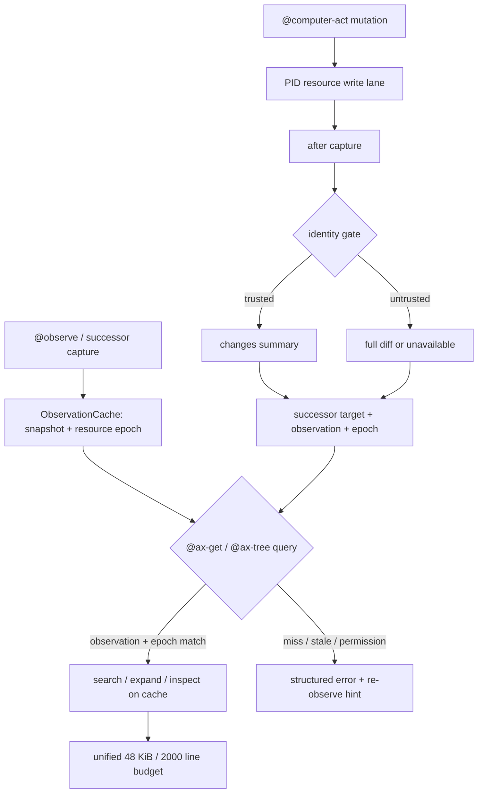
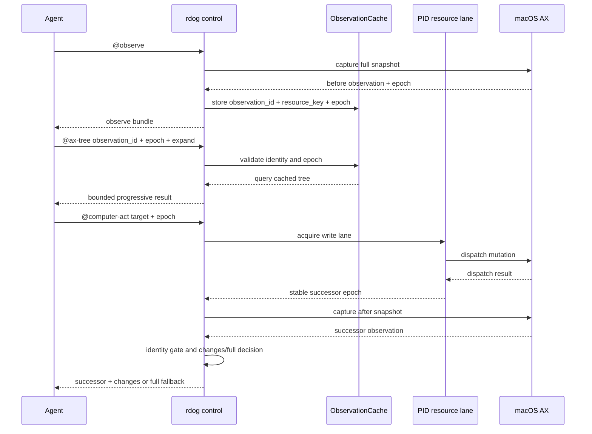

# rdog 借鉴 pi-computer-use 的三项增强方案

## 1. 结论

当前最值得借鉴的不是 Pi 的 11 个工具,而是三条运行时不变量:

1. 从已保存的完整 observation 做受限渐进查询,避免重复 live capture。
2. 在 successor response 中返回可信的 changes-first 摘要,不可信时退回完整结果。
3. 用对抗式测试验证 resource lane、缓存失效和输出边界,把并发与预算契约变成持续门禁。

三项能力都复用 rustdog 现有入口:

- 查询复用 `@ax-get`、`@ax-tree` 和已有 observation/ref 绑定。
- changes 复用 `@computer-act` 的 `successor_observation`、`verification` 和 `@savefile`。
- 验证复用 Rust 单元/集成测试、已有 control frame budget 测试和 macOS ops interaction ledger。

不新增 Pi 同名工具,不复制 session-local continuation,不建立第二套 selector 或 resource state。

## 2. 现状映射

| 借鉴点 | 当前 rustdog 状态 | 方案动作 |
| --- | --- | --- |
| cached progressive query | 已有完整 observe bundle、`@ax-get`、`@ax-tree`,但查询通常重新走 backend | 增加 observation-cache 只读查询路径,保持原命令入口 |
| changes-first | 已有 fixture 的 `full | changes` 判定,尚未进入 mutation wire response | 将可信 changes 作为 successor 的可选摘要,失败时返回 full 或 unavailable |
| adversarial invariants | 已有 PID lane、stale epoch、48 KiB/2000 行预算测试 | 补齐缓存失效、UTF-8 边界、并发交错和跨入口组合矩阵 |

## 3. 不变量

### 3.1 Observation cache

缓存条目必须由以下组合唯一标识:

```text
(observation_id, resource_key, capture_epoch, ax_schema, content_hash)
```

约束:

- observation id 是外部 ref 的唯一归属,不能用独立 `stateId` 取代。
- `resource_key` 必须对应 PID-backed resource。无法解析资源归属时,查询只能走现有 live path。
- `capture_epoch` 必须是 capture 开始时取得的 resource token,不能使用 wall-clock 代替。
- mutation 完成后,旧 cache 只能返回 `stale_observation_cache`,不能继续服务结果。
- cache query 是只读操作,不刷新 epoch,不改变 ref TTL,不触发 AX action。
- 权限、窗口消失、root 替换和 observation 过期必须 fail closed。

### 3.2 Changes-first

只有以下条件全部满足时,才允许返回 `changes`:

1. before/after 属于相同 backend resource 和相同 window identity。
2. AX schema version 相同,root identity 未替换。
3. stable-id 配对唯一,配对率至少为 75%。
4. 没有重复 stable id、窗口集合漂移或大范围未知节点。
5. before/after snapshot 均不是 permission denied、unsupported 或截断到无法判断身份的状态。

不满足时的结果:

- 可以生成完整 `DiffReport`,但不得标成可信 `changes`。
- response 返回 `changes.status:"full"` 并附 `fallback_reason`,或在没有完整结果时返回 `changes.status:"unavailable"`。
- 不允许用低置信度 patch 替代完整 observation,也不允许静默丢弃 diff。

### 3.3 验证门禁

每一个新路径都必须证明:

- 同 PID 并发 mutation 至多一条进入 write lane。
- mutation 前、期间、后的 capture 交错不会让旧 epoch 继续生效。
- cache 命中不等于 fresh verification,动作后的任务验收仍使用 successor/fresh evidence。
- 输出在 48 KiB 或 2000 wire lines 处稳定截断,且不会切坏 UTF-8 或 JSON envelope。
- 失败原因可区分 stale、permission、unsupported、identity ambiguity 和 budget exceeded。

## 4. 方案 A: 完整借鉴路径

这是推荐方案,分三层交付。

### Phase 0: 冻结最小契约

新增内部类型,不新增平行 control command:

```text
ObservationCacheEntry
  observation_id
  resource_key
  capture_epoch
  ax_schema
  content_hash
  snapshot
  captured_at
  truncation

ProgressiveQuery
  source: cache | live
  operation: search | expand | inspect
  root_ref / node_ref
  depth / limit
  expected_observation_id
  expected_epoch

ChangesSummary
  status: changes | full | unavailable
  base_observation_id
  successor_observation_id
  identity_version
  pairing_ratio
  added / updated / removed
  fallback_reason
```

`ProgressiveQuery` 先作为内部执行计划,由现有 `@ax-get` / `@ax-tree` parser 提供输入。只有当现有 payload 无法表达 observation 绑定时,才增加同一命令的可选字段。

### Phase 1: Cached progressive query

1. `@observe` 完成 AX capture 后,把完整 snapshot 按 resource 写入 cache。
2. `@ax-get` / `@ax-tree` 先检查 `observation_id + epoch` 是否命中。
3. 命中时只在 cache 上执行 `search/expand/inspect`,不访问 macOS AX backend。
4. 未命中、过期或 epoch 不匹配时,返回结构化 stale/unavailable response 和已有 re-observe hint。
5. response 继续经过统一 output budget;大结果走已有 `@savefile`。

首版只支持单 observation 内的 read-only query,不支持跨 observation merge、模糊自动重绑和后台刷新。

### Phase 2: Live changes-first

1. `@computer-act` dispatch 前保存 before snapshot identity。
2. mutation 完成并通过 resource lane 后执行一次 after capture。
3. 先运行 identity gate,再选择 `changes` 或 `full`。
4. 将 `ChangesSummary` 放入现有 successor response,完整 diff 仍可通过 `@savefile` 获取。
5. 下一次 mutation 继续只消费 successor target、observation id 和 epoch,不能只消费 changes patch。

推荐 response 形态:

```json
{
  "successor_observation": {"observation_id": "obs-2", "epoch": 42},
  "successor_target": {"ref": "@e2", "observation_id": "obs-2", "epoch": 42},
  "changes": {
    "status": "changes",
    "base_observation_id": "obs-1",
    "successor_observation_id": "obs-2",
    "identity_version": "rdog.ax.identity.v1",
    "pairing_ratio": 1.0,
    "added": [],
    "updated": [{"ref": "@e2", "fields": ["AXValue"]}],
    "removed": [],
    "fallback_reason": null
  }
}
```

### Phase 3: 对抗式验证门禁

保留最小、可复跑的 fixture 和动态脚本,不引入测试框架:

| 组别 | 场景 | 必须证明 |
| --- | --- | --- |
| cache | 命中、过期、错误 observation、错误 epoch | 命中只读,错误状态 fail closed |
| identity | stable-id 100%、75%、74%、重复 id、root 替换 | 75% 以下稳定回退 full |
| concurrency | capture-before、capture-during、capture-after mutation | 旧 cache 和旧 epoch 不可写入 |
| resource | 同 PID 并发、不同 PID 并发、dispatch failure | 同资源串行,不同资源不互相阻塞 |
| output | 48 KiB、2000 行、UTF-8 多字节、错误 envelope | 截断合法,不伪造 continuation |
| recovery | stale、permission、unsupported、unavailable | 每种错误给出唯一 reason 和恢复边界 |

动态验收分两层:

- Rust control tests: 覆盖 parser、cache、identity、budget 和真实 executor seam。
- macOS ops ledger: 先跑固定 2-case、5 远程模型 canary,再决定是否进入完整 5 x 8 gate。

## 5. 方案 B: 先能用的收敛路径

如果暂时不想扩展 wire response,可以分两步降低风险:

1. 只实现内部 observation cache,让现有 `@ax-get` / `@ax-tree` 在显式 observation id + epoch 下读取缓存。
2. 只在测试 artifact 中生成 `ChangesSummary`,继续让 production response 返回完整 diff。
3. 先完成 Phase 3 对抗式测试,用动态证据决定是否把 changes 放进 wire。

方案 B 的优点是协议影响小,缺点是 agent 仍不能在一次 `@computer-act` response 中直接消费 changes-first 摘要,请求密度收益有限。

推荐采用方案 A,但按 Phase 1 -> Phase 2 -> Phase 3 顺序逐阶段合入。Phase 2 的 wire 改动必须等待 Phase 1 的 stale cache 和 Phase 3 的 identity fixture 通过。

## 6. 失败与回退

| 失败 | 行为 | 禁止行为 |
| --- | --- | --- |
| cache stale | `stale_observation_cache` + re-observe hint | 继续返回旧节点 |
| identity 不可信 | `changes.status:"full"` | 输出猜测 patch |
| after capture 不可用 | successor 不伪造,返回 unavailable | 把 dispatch success 当 postcondition success |
| 输出超预算 | preview + digest + `@savefile` hint | session-local offset |
| 查询节点不存在 | `target_not_found` | 自动跨 observation 重绑 |
| 权限缺失 | 权威 `permission_denied` | 降级成空树并报告成功 |

## 7. 流程图



## 8. 时序图



## 9. 验收标准

方案完成必须同时满足:

- cache query 不调用 AX backend,但 stale/permission 状态不会被隐藏。
- 同一 mutation response 的 successor target、observation id、epoch 和 changes base/successor 完整对应。
- stable-id 配对率 74% 返回 full,75% 且无其他身份风险才允许 changes。
- 同 PID 并发和 capture 交错测试稳定复现 stale reject。
- 48 KiB、2000 行和多字节 UTF-8 测试全部通过。
- 2-case、5 远程模型 canary 中,请求数和 post-action evidence 不劣于当前 baseline。
- 未引入新的 Pi tool 名称、session-local continuation 或 durable selector 第二真相源。

## 10. 暂不做

- 不做跨 observation 的自动 merge 或隐式 selector rebound。
- 不把完整 AX diff 压缩成不可解释的低置信度 patch。
- 不为验证脚本增加新的 production command。
- 不在没有完整 5 x 8 live evidence 前宣称产品级收益。

## 11. 关联文档

- `docs/pi-computer-use-comparison.md`
- `specs/rdog-computer-act-spec.md`
- `specs/rdog-observation-scoped-refmap-plan.md`
- `specs/rdog-flow-control-plan.md`
- `specs/control-frame-refactor-plan.md`
- `specs/rdog-computer-use-density-plan.md`
