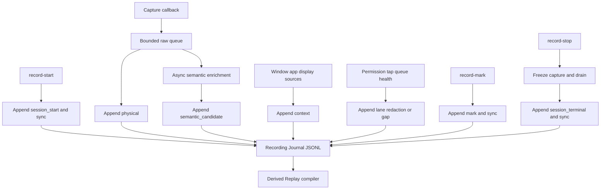
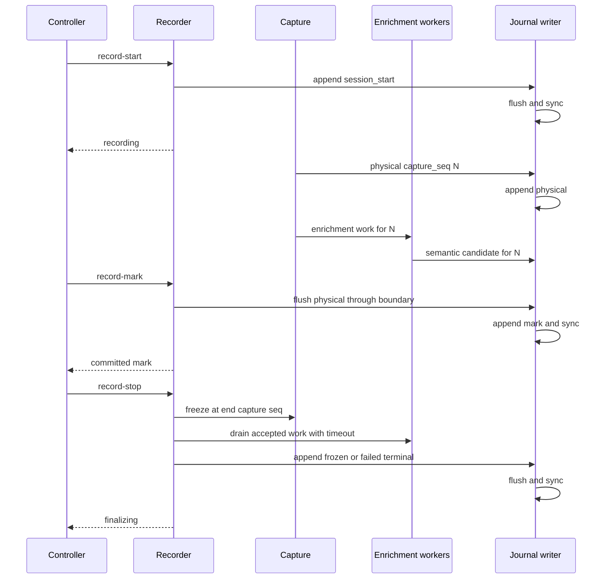

# `rdog.recording.v1` Recording Journal model

## Status

本文定义 `rdog.recording.v1` 的正式 Journal 模型。

它是 Wayfinder ticket `定义 rdog.recording.v1 Recording Journal 模型` 的 resolution asset。
本文只固定 canonical record、ordering、durability 和 reader contract,不实现 Recorder runtime。

## Scope

本文定义:

- UTF-8 JSON Lines encoding 和公共 envelope。
- physical input、semantic candidate、context、lane、redaction、gap、mark 与 terminal entry。
- monotonic time、wall-clock anchor、`journal_seq` 和 `capture_seq`。
- Participating Window、app 与 display topology 的 recording-scoped identity。
- durability barrier、crash tail validation 和 orphan 判定。
- v1 additive evolution 与 unknown-event reader policy。

本文不定义:

- Replay Script 的动作选择、合并或优化策略。
- Recording Bundle manifest、checksum、compression container 或 retention policy。
- Recorder backend 的线程、queue 和文件 API 具体实现。
- active Session 跨连接或跨 daemon restart 恢复。

## Invariants

1. Recording Journal 是 append-only canonical source。
2. Replay Script、在线预览、Bundle manifest 和 evidence index 都是派生产物。
3. `journal_seq` 是所有 entry 的唯一 canonical order。
4. `capture_seq` 只描述物理 capture provenance,不是第二排序源。
5. wall-clock 不参与排序。
6. physical entry 一经追加不得修改或替换。
7. semantic enrichment 只能追加 candidate,不得回写 physical entry。
8. redaction 优先于输入保真,不得写入敏感键值、文本或剪贴板内容。
9. required gap 不可恢复时不得产生 `session_terminal:frozen`。
10. Journal validity 不等于 Recording Bundle 已提交。

## Encoding

Canonical on-disk encoding 是 UTF-8 JSON Lines:

- 每行一个完整 JSON object。
- 行结束符是 LF (`\n`)。
- 不写 UTF-8 BOM。
- live Journal 不使用压缩流。
- JSON object key order 没有语义。
- Bundle 可以在 stop 后压缩整个 JSONL 文件,但不得改变解压后的 entry 内容。

第一行也是普通 entry:

```json
{"schema":"rdog.recording.v1","recording_id":"rec-opaque","journal_seq":0,"kind":"session_start","monotonic_ns":8192000000,"payload":{"type":"start","profile":"semantic","started_at_unix_ms":1784678400000,"monotonic_origin_ns":8192000000}}
```

不增加独立 file header、sidecar index 或第二套 metadata encoding。

## Common envelope

```json
{
  "schema": "rdog.recording.v1",
  "recording_id": "rec-opaque",
  "journal_seq": 17,
  "kind": "physical",
  "monotonic_ns": 8192456123,
  "capture_seq": 9,
  "payload": {
    "type": "mouse_down"
  }
}
```

公共字段:

| Field | Required | Meaning |
| --- | --- | --- |
| `schema` | yes | 必须为 `rdog.recording.v1` |
| `recording_id` | yes | daemon 生成的 Recording Session identity |
| `journal_seq` | yes | 从 `0` 开始、严格连续递增的 append order |
| `kind` | yes | 本文定义的 9 个稳定顶层事件族之一 |
| `monotonic_ns` | yes | writer 接受该 entry 时的 daemon monotonic clock 值 |
| `capture_seq` | conditional | physical event 或与其相关的 provenance/capture boundary |
| `payload` | yes | object,且必须包含 string `type` |

同一 Journal 内 `schema` 和 `recording_id` 必须保持一致。

`monotonic_ns` 由单一 writer 记录,应随 `journal_seq` 非递减。reader 不得按 timestamp 重排 entry。

## Ordering and time

### `journal_seq`

- 单一 Journal writer 在成功追加时分配。
- 第一条 `session_start` 使用 `journal_seq:0`。
- 每个后续 entry 增加 `1`。
- duplicate、gap 或回退都表示 Journal corrupt。

### `capture_seq`

- physical callback 在 event 进入 bounded queue 前分配。
- 第一条物理事件使用 `capture_seq:0`。
- 用于 queue gap 检测、semantic candidate 关联和 mark/terminal capture boundary。
- `capture_seq` 缺失不等于损坏;是否缺失由显式 `gap` 或 `redaction` interval 解释。

### Wall-clock anchor

wall-clock 只写入 `session_start.payload.started_at_unix_ms`。
同一 entry 同时写入 `session_start.payload.monotonic_origin_ns`。

展示用 wall-clock 可以按以下方式推导:

```text
derived_unix_ms = started_at_unix_ms
                + (entry.monotonic_ns - monotonic_origin_ns) / 1_000_000
```

推导值只用于显示和日志关联,不能成为 ordering 或 dedupe key。

backend 原始时间放在对应 payload,例如 macOS `CGEventGetTimestamp` 写入 `backend_timestamp_ns`。

## Event families

v1 顶层 `kind` 固定为:

1. `session_start`
2. `physical`
3. `semantic_candidate`
4. `context`
5. `lane_status`
6. `redaction`
7. `gap`
8. `mark`
9. `session_terminal`

平台或动作差异放入 `payload.type`,不增加新的 v1 顶层 kind。

## `session_start`

`session_start` 必须是 `journal_seq:0`,且只允许出现一次。

payload 最少包含:

```json
{
  "type": "start",
  "profile": "semantic",
  "started_at_unix_ms": 1784678400000,
  "monotonic_origin_ns": 8192000000,
  "platform": {"os":"macos","capture_backend":"cgeventtap"},
  "lanes": {
    "event_listen": {"state":"available","generation":1},
    "accessibility": {"state":"available","generation":1},
    "tap_health": {"state":"available","generation":1}
  },
  "display_topology": {
    "topology_key": "topology-1",
    "coordinate_space": "os-logical",
    "displays": []
  }
}
```

`profile`、required lanes 和权限语义来自 `rdog Recording Session lifecycle control protocol`。

display topology 是完整 snapshot。display 使用 recording-scoped key,同时可以保留 `display_id`、name、stable key、rect、scale 和 rotation 等 observed hints。
`display_id` 当前只有 session stability,不能充当跨录制永久 identity。

## `physical`

`physical` 保存 capture backend 已交付的输入事实。
Journal writer 不做语义合并或 Replay-oriented coalescing。

共同 payload 字段:

- `type`: `key_down`、`key_up`、`flags_changed`、`mouse_move`、`mouse_down`、`mouse_up`、`scroll` 或 backend 已规范化的其他 v1 subtype。
- `backend`: capture backend name。
- `backend_timestamp_ns`: backend 原始 event timestamp。
- `tap_generation`: 当前 tap health generation。
- `source`: 可用时保存 source PID、target PID 和 source user data。
- `input`: type-specific normalized input object。

键盘 input 可以包含:

- keycode、keyboard type、autorepeat 和 modifiers。
- 非敏感场景下可选 Unicode。

鼠标 input 可以包含:

- `position:{x,y,unit:"os-logical"}`。
- button、click count 和 mouse delta。

scroll input 保存 backend 能提供的 line、fixed 和 point delta。不得把 wheel tick 伪装成 pixel。

Recorder 自身注入事件通过共享 source marker 过滤。过滤必须发生在 canonical `capture_seq` 分配前,避免制造没有 `gap` 或 `redaction` 解释的假缺号。被过滤事件只增加 metrics,不进入 canonical Journal。

redaction 活跃时,敏感 keyboard/text physical entry 不写入 Journal。mouse、window 和 app lifecycle 可以继续记录。

## `semantic_candidate`

semantic enrichment 不阻塞或重写 physical entry。

```json
{
  "type": "ax_target",
  "candidate": {
    "app_key": "app-1",
    "window_key": "window-1",
    "selector": {"role":"AXButton","name":"Save"}
  },
  "provenance": {
    "source": "ax_point_hit_test",
    "sampling": "async_enrichment",
    "observed_monotonic_ns": 8192459000,
    "limitations": []
  }
}
```

规则:

- 必须通过 envelope `capture_seq` 引用对应 physical event。
- 同一 `capture_seq` 允许 0 到多个 candidate。
- `sampling` 只允许 `event_time`、`notification_time`、`async_enrichment`。
- candidate 保存事实型 provenance,不保存无证据的浮点 confidence。
- candidate 可以保存 durable selector,不能保存 observation ref。
- candidate 不表示 Replay compiler 已选择该动作。

## `context`

`context` 使用少量完整 snapshot,不建立通用 entity database。

v1 `payload.type`:

- `app_snapshot`
- `window_snapshot`
- `display_topology`

Identity 使用 recording-scoped key:

- app: `app-1`
- window: `window-1`
- display: `display-1`
- topology: `topology-1`

PID、`pid:<pid>/window:<index>` 和 `d2` 只作为 observed locator/hint。

Participating Window 首次出现时,`window_snapshot` 保存:

- `window_key` 和 `app_key`。
- runtime locator hints。
- durable selector 或 selector 构造事实。
- outer rect,单位 `os-logical`。
- display key、window state 和 observation provenance。
- participating reason,例如 target、move 或 resize。

窗口 move/resize/state 变化时追加新的完整 `window_snapshot`,不写字段级 patch。

display topology 变化时追加完整的新 `display_topology`,不写 patch。

Replay compiler 只能把这些 snapshot 编译为现有 `@window-resize` geometry precondition,不能把 runtime window id 当永久 target。

## `lane_status`

`lane_status` 只记录 transition,不写周期 heartbeat。

payload 最少包含:

- `type:"transition"`
- `lane`
- 完整新 `state`
- `reason`
- `recoverable`
- `generation`

初始 lane states 在 `session_start`,最终 lane states 在 `session_terminal`。

权限撤销、tap disable/re-enable、AX unavailable 和 queue health 变化必须显式记录。

## `redaction`

`redaction` 使用 enter/exit interval:

```json
{"type":"enter","redaction_id":"redaction-1","cause":"secure_input","scope":["keyboard","text"],"capture_boundary":41}
```

```json
{"type":"exit","redaction_id":"redaction-1","cause":"secure_input_cleared","scope":["keyboard","text"],"capture_boundary":52}
```

规则:

- cause 至少覆盖 `secure_input`、`secure_field` 和 `security_unknown`。
- 不保存 keycode、Unicode、modifier sequence、clipboard content、逐键 marker 或 suppressed count。
- Session 结束时仍活跃的 interval 必须在 terminal 前以 `cause:"session_terminal"` 收口。
- 不允许根据前后 UI 文本推回 redacted 内容。

## `gap`

`gap` 是 completeness 证据,不能埋入通用 status。

payload 最少包含:

- `type:"event_loss"`
- `capture_seq_range:{first,last}`;无法确定时为 `null`
- `dropped_count`;无法确定时为 `null`
- `cause`
- `recoverable`
- `recovery_status`

cause 至少覆盖 queue overflow、tap disabled、permission revoked、worker timeout 和 backend failure。

无法恢复的 required gap 必须导致 `session_terminal.payload.type:"failed"`。
optional lane gap 可以记录 degraded 后继续。

## `mark`

`mark` 是 durability barrier,不是 best-effort annotation。

payload 最少包含:

- `type:"barrier"`
- daemon-generated `mark_id`
- optional `label`
- optional `dedupe_key`
- `capture_seq_boundary`
- `evidence[]` status/ref summary

截图或 AX snapshot 等大对象不内嵌到 JSONL。Journal 只保存 artifact reference、status 和必要错误摘要;实际 artifact 归 Recording Bundle ticket 定义。

mark success 保证 physical entries 已提交到 `capture_seq_boundary`,但不等待 optional semantic enrichment。后续 candidate 可以引用 mark 之前的 `capture_seq`。

## `session_terminal`

`session_terminal` 必须是 Journal 最后一条 entry。

payload `type` 只允许:

- `frozen`: capture boundary 完整冻结,可进入 Replay compile/Bundle staging。
- `failed`: required lane、gap、drain 或 storage barrier 失败。

payload 最少包含:

- `end_capture_seq`;没有物理事件时为 `null`
- `final_lanes`
- `gap_summary`
- `redaction_summary`
- optional `reason`

`frozen` 不表示 Recording Bundle 已提交。Bundle atomic commit 后的 `completed` 属于 lifecycle state,不得回写 Journal。

cancel 删除未提交 Journal,不生成可保留的 terminal Journal。

## Append flow



## Barrier sequence



## Durability

普通 entry 可以 userspace buffering,不要求 per-entry fsync。

v1 只有三个 durability barrier:

1. `session_start`
2. committed `mark`
3. `session_terminal`

barrier success 返回前必须:

1. 写入完整 JSONL line 和 LF。
2. flush userspace buffer。
3. 使用平台支持的文件同步语义提交该 barrier 之前的 bytes。

`session_start` barrier 还必须保证新 Journal 文件已经 durable-created。

clean stop 顺序:

1. freeze new capture 并确定 `end_capture_seq`。
2. 排空 physical queue。
3. 在有界 timeout 内排空已接受的 semantic/context work。
4. required work 超时或缺失时追加 gap/failed terminal。
5. optional work 超时时记录 degraded,可以追加 frozen terminal。
6. sync terminal barrier。

## Validation and crash handling

Reader 按以下顺序验证:

1. 逐行读取完整 LF-terminated JSON object。
2. 第一行必须是 `journal_seq:0` 的 `session_start`。
3. 所有 entry 的 schema 和 recording id 必须一致。
4. `journal_seq` 必须严格连续。
5. `capture_seq` reference 必须指向已有 physical event、明确 redaction boundary 或 gap boundary。
6. valid frozen Journal 必须以唯一 `session_terminal:frozen` 结束。
7. required unrecoverable gap 与 frozen terminal 同时存在时判 corrupt。

physical `capture_seq` 中任何不可见区间都必须由 redaction boundary 或 gap entry 解释,不得静默缺号。

Crash 只允许忽略最后一个没有 LF 的 incomplete JSON fragment。
中间 parse error、duplicate sequence 或 sequence gap 一律 corrupt,不得猜测修复。

没有 valid terminal 的 Journal 是 crash orphan。
daemon restart 不恢复、不续写 active Journal,也不从 orphan 自动编译 Replay Script。
orphan 按 lifecycle privacy-first cleanup 删除;cleanup 失败时 Recorder fail closed。

即使 Journal 具有 valid frozen terminal,只要 Bundle atomic commit 尚未完成,它仍属于 staging/orphan,不能据此宣称 Session completed。

## Schema evolution and compatibility

schema string 固定为 `rdog.recording.v1`。
不增加 `v1.1` 或重复 `schema_version` 字段。

v1 additive changes 只允许:

- 新增 optional field。
- 在现有 kind 下新增 `payload.type`。

v1 禁止:

- 删除或重命名既有字段。
- 改变既有字段、kind 或 payload subtype 的语义。
- 改变 ordering、time、coordinate、privacy 或 completeness contract。
- 新增顶层 kind。

上述不兼容变化必须升级为 `rdog.recording.v2`。
同一 Journal 禁止 mixed-major schema。

Reader policy:

- validator/archiver 可以保留未知 optional field 或未知 payload subtype 的原始 JSONL line。
- Replay compiler 遇到未知 kind 或未知 payload subtype 必须 fail closed 为 unsupported。
- compiler 不能静默跳过未知 entry 后生成看似完整的 Replay Script。

v1 不增加 per-entry `critical` / `advisory` 标志。顶层 kind 固定和 compiler fail-closed 已足够表达安全边界。

## Relationship to existing contracts

- Session ownership、start/mark/stop/cancel、required lanes 和 Bundle commit: `specs/rdog-recording-session-lifecycle.md`。
- macOS capture fields、CGEventTap、AX enrichment、Secure Input 和 gap source: `specs/rdog-macos-operation-capture-research.md`。
- Replay Script schema: `specs/rdog-flow-control-plan.md`。
- durable selector 与 observation ref 边界: `specs/rdog-observation-scoped-refmap-plan.md`。
- Participating Window geometry: `specs/rdog-window-control-plan.md`。
- semantic action boundary: `specs/rdog-non-mouse-semantic-control-plan.md`。
- coordinate fallback: `specs/rdog-mouse-control-coordinate-plan.md` 和 `specs/rdog-multi-display-screenshot-coordinate-plan.md`。
- Recording Journal到Replay Script的Semantic Promotion与Guarded Coordinate Fallback选择: `specs/rdog-recording-semantic-promotion-policy.md`。

## Non-goals

- 上述Semantic Promotion policy之外的Replay compiler合并、等待或retry policy。
- mouse move、typing 或 scroll 的 Replay-oriented coalescing。
- Binary journal、WAL、hash chain、chunk index 或 random-access database。
- Partial Bundle 或 failed Journal export。
- active Journal 跨 daemon restart resume。
- 密码、token、Secure Input、secure field 或默认 clipboard content capture。

## Acceptance criteria

- JSONL 每个完整 line 都能独立 parse 为 common envelope。
- `journal_seq` 是唯一 canonical order,且 validator 拒绝 duplicate/gap/backward sequence。
- physical 与 semantic candidate 保持 append-only correlation,不发生回写。
- wall-clock 只在 start anchor 中出现,reader 不按 wall-clock 重排。
- Participating Window 和 display topology 使用 recording-scoped identity 与完整 snapshot。
- lane、redaction、gap、mark 和 terminal 都有显式 transition entry。
- required unrecoverable gap 无法与 frozen terminal 共存。
- start、mark 和 terminal barrier 都有明确 sync 语义。
- crash orphan 不恢复、不编译并按 privacy-first cleanup 处理。
- v1 unknown event 不会被 Replay compiler 静默忽略。
- Replay Script 始终从 frozen Journal 派生,不能反向成为 Recording source。

## Planned Replay Parameter extension

`specs/rdog-recording-redaction-parameter-model.md` 已固定 planned parameter extension:

- 不增加 `rdog.recording.v1` 顶层 event family。
- Sensitive、unknown 和 paste segment 在既有 `redaction` enter payload 中创建 canonical descriptor。
- Ordinary input 的最终 committed text 无法确认时,由既有 `semantic_candidate` 的 `parameter_required` payload 创建 descriptor。
- Journal 是 descriptor 的唯一创建者;manifest 和 Replay Script 只能复制。

这些 payload subtype 与字段尚未实现。Journal writer、reader 和 validator 在实施完成前不能宣称支持 Replay Parameter。
