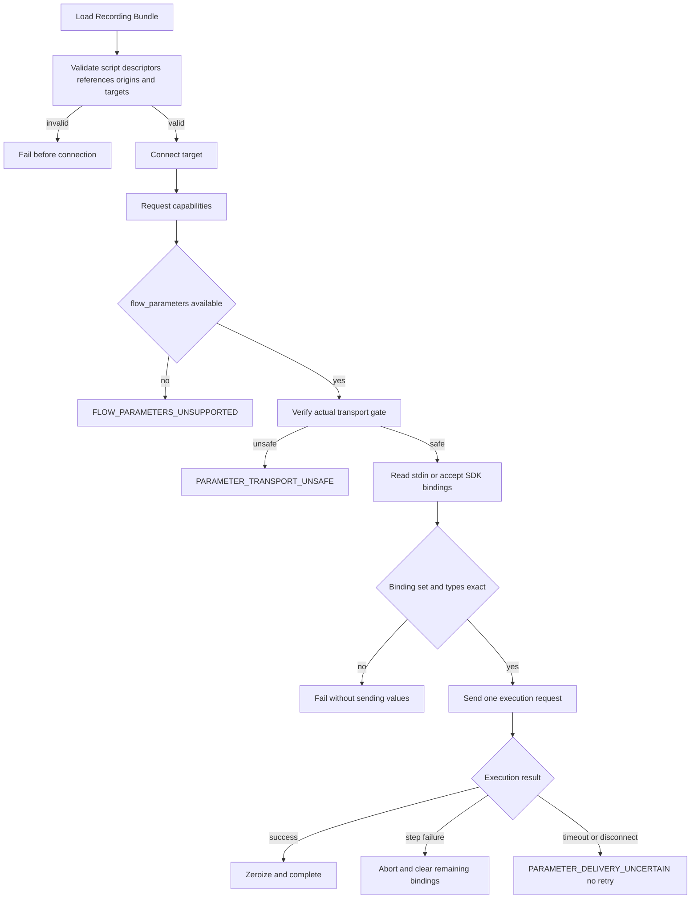
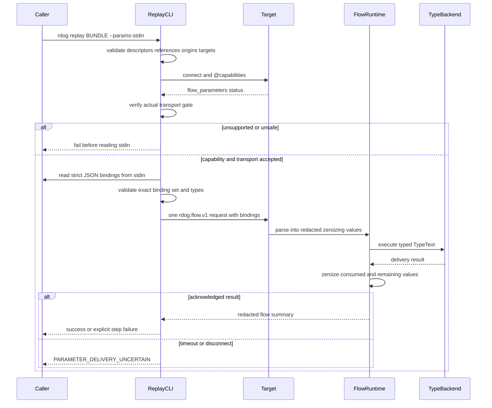

# Recording redaction and Replay Parameter model

## Status

本文定义 Recorder 输入脱敏与 Replay Parameter 的正式规格。

它是 Wayfinder ticket `定义敏感输入脱敏与 Replay 参数模型` 的 resolution asset。
本文只固定 Journal、Bundle manifest、Replay Script 和单次 execution request 的参数契约,不实现生产代码。

本文是以下现有模型的 planned extension:

- `rdog.recording.v1` 继续使用既有 9 个顶层 event family。
- `rdog.flow.v1` 保持 schema 名称不变,新增 `parameters`、`bindings` 和 typed `TypeText` step。
- 参数化 Flow 由 `flow_parameters` capability 显式门禁。当前 daemon 未声明该 capability 时,必须视为不支持。

## Scope

本文定义:

- ordinary、sensitive、unknown 三态输入安全分类。
- Secure Input、secure field、paste、快捷键、IME 与语义不确定文本的持久化边界。
- redaction segment 到 Replay Parameter 的确定性映射。
- canonical parameter descriptor 及其 Journal ownership。
- Bundle manifest 和 `rdog.flow.v1` 的参数投影。
- `TypeText` step、runtime-only bindings、capability preflight 和 transport gate。
- 值的审计边界、一次性生命周期、断线失败和稳定错误码。
- 实施阶段必须满足的验收矩阵。

## Non-goals

本文不定义:

- Recorder capture backend、queue、Journal writer 或 Replay runtime 的代码结构。
- 通用模板语言、字符串插值、变量表达式或参数默认值。
- secret vault、credential provider、参数文件或交互式 prompt DSL。
- 非文本 clipboard payload。
- 当前 TCP、WebSocket 或 Zenoh transport 的认证、加密升级方案。
- Recording Bundle 其余 manifest 字段、checksum 或 container schema。
- 窗口几何编译规则。Participating Window 继续使用现有 `@window-resize` 规格。

## Terms

本文使用根级 `CONTEXT.md` 中的以下 canonical term:

- **Ordinary Input**: Recorder 拥有完整、明确的非安全输入证据。
- **Sensitive Input**: 由 Secure Input、secure field 或显式 secret 声明确认需要保密的输入。
- **Unknown-Safety Input**: Recorder 缺少足够证据判断是否安全的输入。
- **Replay Parameter**: Replay 开始前由调用方显式提供,用于补全录制期未保存或无法可靠重建的输入值。

下文简写为 `ordinary`、`sensitive` 和 `unknown`。

## Invariants

1. Recording Journal 是 parameter descriptor 的唯一创建者。
2. Sensitive 和 unknown input 使用相同的 fail-closed 持久化规则。
3. 参数真实值不得进入 Journal、Bundle manifest、保存的 Replay Script、日志、trace、response、error、metrics 或 artifact。
4. 值的长度、hash、prefix、suffix、字符类别和其他可关联派生特征同样不得持久化或输出。
5. Recorder 不读取 clipboard content。Recorded paste 只保存意图、目标上下文和 required parameter descriptor。
6. Replay 只重放已确认的最终 committed text,不重放 IME、dead key 或候选选择过程。
7. 参数只能进入 typed `TypeText` step,不能进入 `ControlLine`、`Cmd`、`Script`、`env`、`Expect` 或 artifact path。
8. 保存的 Replay Script 永远不包含 `bindings`。`bindings` 只属于一次 execution request。
9. Parameterized Replay 不做兼容降级。旧 daemon 必须明确失败。
10. binding 一旦可能送达 target,timeout 或断线就是本次 Replay 失败,不得自动重试或恢复。

## Input classification

### Classification table

| Classification | Required evidence | Persistent text rule | Replay result |
| --- | --- | --- | --- |
| `ordinary` | 完整输入区间内 Secure Input inactive;target 与 focus 明确;平台分类明确非 secure;相关 provenance 完整 | 最终 committed text 已确认时可作为 literal 保存;无法确认时不猜测文本 | literal `TypeText`,或 reason 为 `semantic_commit_unverified` 的 required parameter |
| `sensitive` | Secure Input active、明确 secure field 或显式 secret 声明 | 不保存 value、keycode、Unicode、modifier sequence、逐键 marker、键数或 clipboard content | required parameter |
| `unknown` | 权限不足、target/focus 歧义、分类不完整、相关 gap 或任何安全证据缺失 | 与 `sensitive` 完全相同 | required parameter |

`ordinary` 是需要完整正向证据的状态,不是默认分支。任一必需信号缺失都进入 `unknown`。

安全分类和语义可信度是两条独立轴。一个输入可以安全地归为 `ordinary`,但因最终 committed text 无法确认而仍需 Replay Parameter。此时 classification 保持 `ordinary`,不能改写成 `unknown`。

### Paste

- Recorder 只记录 paste intent 和 target context,不读取或保存 clipboard content。
- 每次 paste 生成一个 required text parameter,reason 为 `paste`。
- Replay 使用 `TypeText.mode:"clipboard"` 和 `allow_clipboard:true`,不生成依赖回放环境当前 clipboard 的裸 `@paste`。
- Bundle manifest 必须声明 `runtime_clipboard_exposure:true`。
- v1 不支持图片、文件列表、富文本或其他非文本 clipboard payload。

### Shortcut and non-text keys

- Redaction interval 外,目标和焦点明确的快捷键、功能键、导航键可以编译为现有 `@key` 动作。
- `Return`、`Escape`、`Tab` 和方向键按非文本动作处理。
- `Shift+字符`、`Option+字符` 和输入法相关按键进入文本/组合输入判定,不能直接当快捷键。
- `Cmd+V` 或 `Ctrl+V` 使用 paste 参数规则。
- Redaction interval 内不保存 keycode、shortcut 或 modifier sequence。mouse、window、app 与独立 AX 事件仍可记录。
- 无法区分快捷键与文本输入时 fail closed,不得猜测生成 `@key`。

### IME, dead key and composed text

- IME、dead key、emoji 选择和 composed text 的中间过程不是 Replay action。
- 只有 target-bound semantic lane 已确认的最终 committed text 可以成为 literal。
- Raw keycode、event Unicode、单一 AXValue、候选词选择或输入法状态都不能独立证明最终文本。
- Intermediate marked text 和候选内容不得生成 Replay step。
- Ordinary committed text 无法确认时生成 required parameter,不得退回 raw key replay。

## Redaction segmentation

一个 parameter segment 由 `cause + target identity` 唯一界定。

切分规则:

1. Secure Input 持续 active 但 focused target 改变时,关闭旧 segment并开启新 segment。
2. cause 在 `secure_input`、`secure_field`、`security_unknown`、`paste` 或 `semantic_commit_unverified` 间变化时切分。
3. 每次 paste 单独形成一个 segment。
4. Ordinary unverified text 按一个 target-bound semantic input span 形成一个 segment。
5. 不按时间间隔、推测键数、suppressed count 或 value 相等性合并或切分。
6. Secure Input 期间即使无法证明实际输入数量,segment 仍生成 parameter。Empty string binding 是合法值。
7. Target unresolved 时仍保存 descriptor,但 compiler 返回 `PARAMETER_TARGET_UNRESOLVED`,不得生成无目标 `TypeText`。

每个 segment 恰好生成一个 Replay Parameter。若同一运行时值需要输入两次,必须生成两个 parameter ID,不能让一个 parameter 被两个 step 复用。

## Canonical parameter descriptor

v1 descriptor 固定为 5 个字段:

```json
{
  "parameter_id": "param-1",
  "value_type": "text",
  "classification": "sensitive",
  "reason": "secure_field",
  "origin_journal_seq": 42
}
```

字段规则:

| Field | Rule |
| --- | --- |
| `parameter_id` | Recording Bundle 内唯一,格式为 `param-N` |
| `value_type` | v1 只允许 `text` |
| `classification` | `ordinary`、`sensitive` 或 `unknown` |
| `reason` | `secure_input`、`secure_field`、`security_unknown`、`paste` 或 `semantic_commit_unverified` |
| `origin_journal_seq` | 指向首次创建该 descriptor 的 canonical Journal entry |

所有参数隐式 required。Descriptor 禁止增加:

- `value` 或 `default`。
- regex、长度约束或 prompt template。
- vault reference、environment name 或参数文件路径。
- target locator 的重复副本。

### ID allocation

- Journal writer 在 descriptor 首次追加时分配 ID。
- ID 从 `param-1` 开始,顺序严格跟随 descriptor entry 的 `journal_seq`。
- 已分配 ID 不复用、不重排。
- ID 只在当前 Recording Bundle 内稳定,不承诺跨录制稳定。
- ID 不编码 value、target、classification、reason 或 hash。
- Manifest、Replay Script 和离线重编译只能复制 canonical Journal ID。

## Journal representation

本文不增加 `rdog.recording.v1` 顶层 event family。Parameter descriptor 只扩展既有 payload。

### Sensitive or unknown segment

Sensitive、unknown 和 paste segment 在对应 `redaction` enter entry 中创建 descriptor。Exit entry 不重复 descriptor。

```json
{
  "schema": "rdog.recording.v1",
  "recording_id": "rec-opaque",
  "journal_seq": 42,
  "kind": "redaction",
  "monotonic_ns": 8192456123,
  "capture_seq": 41,
  "payload": {
    "type": "enter",
    "redaction_id": "redaction-1",
    "cause": "secure_field",
    "classification": "sensitive",
    "scope": ["keyboard", "text"],
    "capture_boundary": 41,
    "target_identity": {
      "app_key": "app-1",
      "window_key": "window-1",
      "semantic_candidate_journal_seq": 40
    },
    "parameter": {
      "parameter_id": "param-1",
      "value_type": "text",
      "classification": "sensitive",
      "reason": "secure_field",
      "origin_journal_seq": 42
    }
  }
}
```

`target_identity` 只关联 Journal 中既有 context/semantic evidence。它不是持久化到 descriptor 的第二 target locator。

### Ordinary but semantically unverified text

Ordinary input 的安全证据完整、但最终 committed text 无法确认时,由 `semantic_candidate` 的 `parameter_required` payload 创建 descriptor。

```json
{
  "schema": "rdog.recording.v1",
  "recording_id": "rec-opaque",
  "journal_seq": 57,
  "kind": "semantic_candidate",
  "monotonic_ns": 8192556123,
  "capture_seq": 55,
  "payload": {
    "type": "parameter_required",
    "target_identity": {
      "app_key": "app-1",
      "window_key": "window-1",
      "semantic_candidate_journal_seq": 56
    },
    "parameter": {
      "parameter_id": "param-2",
      "value_type": "text",
      "classification": "ordinary",
      "reason": "semantic_commit_unverified",
      "origin_journal_seq": 57
    }
  }
}
```

Compiler 需要参数但找不到 canonical descriptor 时返回 `PARAMETER_ORIGIN_MISSING`,不得临时创建 descriptor。

## Bundle manifest projection

Recording Bundle manifest 的完整 schema 由后续 Bundle ticket 定义。无论其他字段如何组织,参数相关 projection 必须是:

```json
{
  "requires": ["flow_parameters"],
  "parameters": [
    {
      "parameter_id": "param-1",
      "value_type": "text",
      "classification": "sensitive",
      "reason": "secure_field",
      "origin_journal_seq": 42
    }
  ],
  "runtime_clipboard_exposure": false
}
```

规则:

- `parameters[]` 只按 canonical Journal descriptor 顺序复制。
- 只要 Replay Script 包含 parameter,`requires` 必须包含 `flow_parameters`。
- 任一 paste step 存在时,`runtime_clipboard_exposure` 必须为 `true`。
- Manifest serializer 不接受也不输出 `bindings`。

## Replay Script extension

### Saved `rdog.flow.v1`

保存的 Replay Script 在根级增加 `parameters[]`,并使用 typed `TypeText` step:

```json
{
  "schema": "rdog.flow.v1",
  "policy": {
    "allow_shell": false,
    "allow_file_read": false
  },
  "parameters": [
    {
      "parameter_id": "param-1",
      "value_type": "text",
      "classification": "sensitive",
      "reason": "secure_field",
      "origin_journal_seq": 42
    }
  ],
  "steps": [
    {
      "TypeText": {
        "target": {"selector_id": "selector-1"},
        "text": {"parameter": "param-1"},
        "mode": "auto",
        "allow_clipboard": false
      }
    },
    {"Exit": null}
  ],
  "options": {"trace": "summary"}
}
```

Literal text 使用相同 step,但不创建 descriptor:

```json
{
  "TypeText": {
    "target": {"selector_id": "selector-1"},
    "text": {"literal": "hello"},
    "mode": "auto",
    "allow_clipboard": false
  }
}
```

Paste 参数使用:

```json
{
  "TypeText": {
    "target": {"selector_id": "selector-2"},
    "text": {"parameter": "param-2"},
    "mode": "clipboard",
    "allow_clipboard": true
  }
}
```

`text` 必须恰好包含 `literal` 或 `parameter` 之一。Parameterized `TypeText` 继续复用现有 `@type-text` control core/backend,不能通过字符串拼接生成 control line。

以下位置禁止 parameter reference 或插值:

- `ControlLine`
- `Cmd.run`
- `Script.text`
- `env`
- `Expect`
- `SaveArtifact` path
- `cwd` 和任何 artifact reference

### Runtime-only execution request

CLI 或 SDK 只在单次内存 execution request 中临时附加根级 `bindings`:

```json
{
  "schema": "rdog.flow.v1",
  "policy": {
    "allow_shell": false,
    "allow_file_read": false
  },
  "parameters": [
    {
      "parameter_id": "param-1",
      "value_type": "text",
      "classification": "sensitive",
      "reason": "secure_field",
      "origin_journal_seq": 42
    }
  ],
  "bindings": {
    "param-1": "runtime value"
  },
  "steps": [
    {
      "TypeText": {
        "target": {"selector_id": "selector-1"},
        "text": {"parameter": "param-1"},
        "mode": "auto",
        "allow_clipboard": false
      }
    },
    {"Exit": null}
  ],
  "options": {"trace": "summary"}
}
```

该示例只说明 wire shape。实现、测试 fixture、日志和文档生成器都不得把真实 secret 写入持久化文件。

## Binding sources

### CLI

CLI 只提供:

```text
rdog replay BUNDLE --params-stdin
```

`stdin` 是严格 JSON object,每个 key 是 `parameter_id`,每个 value 是 string。Parser 必须检测 duplicate key,不能依赖会静默覆盖重复 key 的普通 map parser。

### SDK

SDK 只接受调用方直接传入的 in-memory map。

### Forbidden sources

v1 禁止:

- argv `--param id=value`。
- environment 或 `.envrc`。
- 持久化 params file。
- 把 bindings 写回 Bundle、manifest 或 Replay Script。
- `@bind`、secret session 或多帧 binding protocol。

## Capability preflight

`@capabilities` 在 `rdog.capabilities.v1.capabilities` 下新增:

```json
{
  "schema": "rdog.capabilities.v1",
  "capabilities": {
    "flow_parameters": {
      "status": "available",
      "flow_schema": "rdog.flow.v1",
      "value_types": ["text"]
    }
  }
}
```

Parameterized Replay 的固定顺序:

1. 本地读取 Bundle 和 Replay Script,验证 schema、descriptor 和 step reference。
2. 连接 target,执行 `@capabilities`。
3. 要求 `flow_parameters.status == "available"`。
4. 根据 descriptor classification 验证实际 transport gate。
5. Capability 与 transport gate 均通过后,才读取 stdin bindings。
6. 校验 binding exact set 和 value type。
7. 序列化单次 execution request并发送。
8. Daemon parse 后立即把 value 移入 redacted、best-effort-zeroizing wrapper。
9. 执行 typed `TypeText`,返回不含 value 的结果。

旧 daemon、缺少 capability 或 status 非 `available` 时返回 `FLOW_PARAMETERS_UNSUPPORTED`。不得降级成 literal、字符串插值或旧 `ControlLine`。

## Transport confidentiality gate

Transport gate 检查实际选中的 endpoint,不能只检查配置中的候选 transport。

| Parameter classification | Allowed transport |
| --- | --- |
| 仅 `ordinary` | 现有 trusted host/network/daemon 边界内的 control transport |
| 任一 `sensitive` 或 `unknown` | 运行时已验证 `confidential:true` 的实际 transport |

Local unixpipe 只有同时满足以下条件时才视为 confidential:

- actual endpoint 确认为 unixpipe。
- FIFO/lease identity 与目标 daemon 匹配。
- endpoint owner 是当前 UID。
- endpoint mode 是 `0600`。

存在 sensitive/unknown binding 时,unixpipe 失败不得透明 fallback 到 UDP/TCP。每次 transport 切换都必须重新过 gate。当前其他 transport 未明确提供认证和加密保证,因此默认不能承载 sensitive/unknown binding。

Gate 失败返回 `PARAMETER_TRANSPORT_UNSAFE`,且必须发生在读取 stdin、发送 binding 或执行任何 step 之前。

## Exact-set validation

令:

- `D` 为 `parameters[]` 中 descriptor ID 集合。
- `R` 为 parameterized `TypeText` 的 reference ID 集合。
- `B` 为 runtime binding key 集合。

执行要求:

```text
D = R = B
```

并同时满足:

- 每个 descriptor ID 只声明一次。
- 每个 descriptor 恰好被一个 `TypeText` step 引用。
- 每个 binding value 是 string。
- Empty string 是合法 text value。
- v1 不增加长度约束。

校验分两段执行:

1. 读取 stdin 前完成 `D = R`、origin 和 target 验证。
2. 读取 stdin 后完成 `B = D` 和 value type 验证。

## Audit boundary

| Surface | Allowed | Forbidden |
| --- | --- | --- |
| Journal / manifest / saved Replay Script | parameter ID、classification、reason、origin、required capability | value、default、binding map、value 派生特征 |
| Runtime trace | source kind、parameter ID、`value_redacted:true`、delivery mode、status | parameter value;ordinary literal text 也不得回显 |
| Log / response / error | error code、相关 parameter ID、validation status、clipboard restored status | value、serialized request、stdin payload、length/hash/prefix/suffix |
| Metrics | aggregate parameter count、failure count、delivery mode count | value;parameter ID 不能作为 label |
| Artifact / `SaveArtifact` | 与参数无关的既有 artifact | binding map、clipboard content、任何 value 派生数据 |
| `Debug` | 固定 redacted placeholder | inner string、length 或内容摘要 |

Paste 使用 `restore-if-unchanged` clipboard cleanup。Manifest 和 preflight 必须诚实披露 `runtime_clipboard_exposure:true`,但 rdog 不承诺删除第三方 clipboard history。

允许的运行时暴露面只有:

- controller 和 daemon 进程内存。
- 已通过 gate 的实际 transport。
- 最终接收文本的 target application。
- paste 模式下的系统 clipboard。

目标应用日志、第三方 clipboard manager 和系统 crash dump 不属于 rdog 的持久化保证。

## Value lifecycle and no-retry

1. Binding 只属于一次 Replay invocation,不得缓存或跨连接恢复。
2. Daemon 在 `TypeText` 开始时从 binding map 取出对应 value。
3. Step 成功或失败后立即 best-effort zeroize 已消费 value。
4. 任一步失败都终止 Replay,并清理所有未使用 bindings。
5. Paste 失败仍执行 `restore-if-unchanged` cleanup。
6. Parameterized `TypeText` 不做 step-level 自动重试。
7. Binding 发送后发生 timeout 或 disconnect,返回 `PARAMETER_DELIVERY_UNCERTAIN`。
8. Uncertain 表示输入可能已经发生。Runtime 不得假设未送达,也不得自动重发。
9. 调用方只能显式启动全新 Replay invocation,重新提供全部 bindings。新 invocation 不继承旧 step position 或 binding map。

## Error codes

| Code | Phase | Meaning |
| --- | --- | --- |
| `PARAMETER_REFERENCE_UNDECLARED` | local script validation | `TypeText` 引用了未声明 parameter |
| `PARAMETER_UNUSED` | local script validation | descriptor 没有且仅有一个 `TypeText` reference |
| `PARAMETER_MISSING` | binding validation | required binding 缺失 |
| `PARAMETER_UNDECLARED` | binding validation | binding key 未在 descriptor 中声明 |
| `PARAMETER_DUPLICATE` | descriptor/stdin parse | descriptor ID 或 stdin key 重复 |
| `PARAMETER_TYPE_MISMATCH` | binding validation | v1 text parameter 收到非 string value |
| `PARAMETER_TARGET_UNRESOLVED` | compile/local validation | segment 没有可持久解析的 target |
| `PARAMETER_ORIGIN_MISSING` | compile/local validation | compiler 需要参数但 Journal 没有 canonical descriptor |
| `PARAMETER_TRANSPORT_UNSAFE` | transport preflight | actual transport 不满足 descriptor classification |
| `PARAMETER_DELIVERY_UNCERTAIN` | execution | binding 可能送达后发生 timeout/disconnect |
| `FLOW_PARAMETERS_UNSUPPORTED` | capability preflight | target daemon 未声明可用 `flow_parameters` |

所有错误只允许包含 code、parameter ID 和非敏感阶段状态。不得附带 raw stdin、request payload、value 或 value 派生特征。

## Preflight flow



## Runtime sequence



## Acceptance matrix

| Area | Required test |
| --- | --- |
| Classification | 缺少任一 ordinary 证据时得到 `unknown`,且不写 raw keyboard/text entry |
| Secure Input | interval 内不出现 keycode、Unicode、modifier、逐键 marker、count 或推回文本 |
| Paste | Recorder 不读取 clipboard;每次 paste 生成独立 parameter;非文本 paste 被拒绝 |
| Shortcut | redaction 外明确快捷键生成 `@key`;redaction 内同一输入不保留 shortcut 结构 |
| IME | 只用已确认 committed text;中间组合过程不生成 step;无法确认时参数化 |
| Journal ownership | Online 与 offline compile 复制相同 descriptor 和 `param-N` 顺序 |
| Segment | target 或 cause 改变时切分;时间和推测键数不影响 cardinality |
| Target | unresolved segment 保留 descriptor,compiler 返回 `PARAMETER_TARGET_UNRESOLVED` |
| Flow schema | `TypeText.text` 只接受 literal/parameter 二选一;所有通用字符串位置拒绝插值 |
| Saved artifacts | Bundle、manifest 和 saved flow 均不含 `bindings` |
| Capability | 缺少 `flow_parameters` 时在读取 stdin 前返回 `FLOW_PARAMETERS_UNSUPPORTED` |
| Transport | sensitive/unknown 在 unsafe transport 上读取 stdin 前失败;unixpipe 验证 identity、UID 和 `0600` |
| Fallback | sensitive/unknown 的 unixpipe 失败时不 fallback 到 UDP/TCP |
| Exact set | descriptor/reference/binding 三集合必须完全相等;duplicate key 被检测 |
| Audit | 日志、trace、response、error、metrics、artifact 和 `Debug` 均不含 value 或派生特征 |
| Literal trace | ordinary literal text 也只输出 `value_redacted:true` |
| Clipboard | paste 声明 runtime exposure并执行 `restore-if-unchanged` cleanup |
| Lifecycle | 每个 value 单次消费;任一步失败清理全部剩余 bindings |
| Disconnect | binding 发送后的 timeout/disconnect 返回 uncertain,且没有自动重发 |
| Compatibility | 旧 daemon 明确失败,不降级为 literal、插值或 `ControlLine` |
| JSON fixtures | 本文所有完整 JSON 示例均由 `python3` parser 验证 |

## Implementation handoff

后续实施计划至少需要覆盖:

- Journal writer 对 `redaction.parameter` 与 `semantic_candidate.parameter_required` 的 schema/validator 支持。
- Bundle compiler 对 descriptor projection、target resolution 和 deterministic ID preservation 的支持。
- `FlowRequest` 的 `parameters`/runtime-only `bindings`、typed `TypeText` 和 deny-unknown validation。
- `@capabilities.flow_parameters` 与 old-daemon error mapping。
- Controller preflight 的 exact-set parser、actual transport gate 和 stdin ordering。
- Daemon redacted/zeroizing value wrapper及禁止 payload logging 的审计测试。
- Timeout/disconnect uncertain outcome和全链路 no-retry 测试。

在上述能力实现并通过验收前,本文所有 `flow_parameters` 行为都保持 planned,不能在用户文档中宣称可用。
