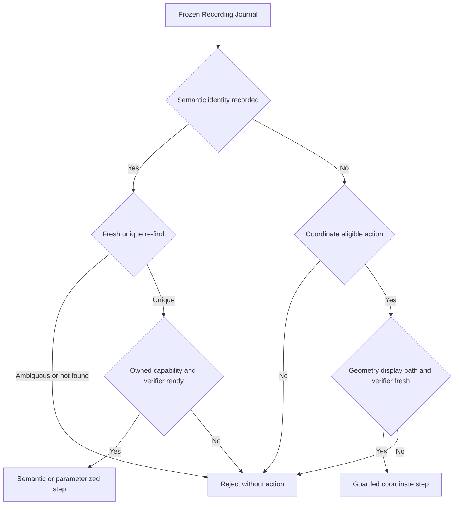
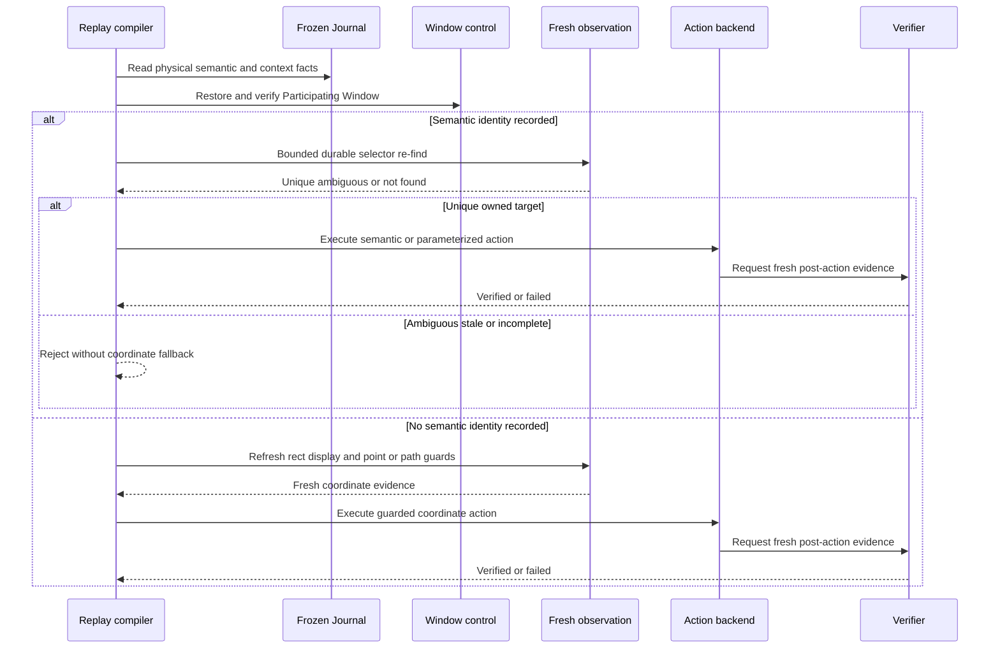

# Recording Semantic Promotion and Guarded Coordinate Fallback policy

## Status

本文是 Recorder 将 frozen Recording Journal 编译为 Replay Script 时,选择动作 lane 的正式规格。

它是 Wayfinder ticket [验证语义提升与坐标 fallback 的可行性](https://github.com/raiscui/rustdog/issues/6) 的 resolution asset。Human 已确认本文的 fail-closed policy。

决策前的 throwaway prototype 保存在:

- Branch: `prototype/recording-semantic-promotion`。
- Commit: [`c0d2e0158df2d8bac4d37ce34dcdc7a66276b994`](https://github.com/raiscui/rustdog/commit/c0d2e0158df2d8bac4d37ce34dcdc7a66276b994)。

本文只固定编译选择规则,不实现 Recorder、Replay compiler或control backend。

## Scope

本文定义:

- physical evidence、semantic candidate和context snapshot如何进入动作选择。
- Semantic Promotion的正向门禁。
- Guarded Coordinate Fallback的允许范围和完整门禁。
- ambiguous、无法恢复的stale target和证据缺失时的fail-closed结果。
- click、text、shortcut、scroll和drag五类动作的首版lane映射。
- Window Geometry Precondition与target freshness之间的边界。
- action之后必须满足的verification边界。

## Non-goals

本文不定义:

- CGEventTap与AX/Web candidate在录制期的时间关联算法或时间窗口。
- Replay-oriented coalescing、Composite提升、step排序、等待或retry。
- Participating Window的匹配、显示器映射或`@window-resize`数值算法。
- 最终`rdog.flow.v1` compiler schema、trace schema或错误码编号。
- Replay全局preflight、best-effort模式或Bundle schema。
- 生产实现、跨平台capture backend或live性能预算。

这些内容分别由后续Wayfinder tickets继续定义。

## Terms

本文使用根级`CONTEXT.md`中的canonical terms:

- **Recording Journal**: 编译输入的唯一真相源。
- **Replay Script**: 从frozen Journal派生的有限步骤序列。
- **Semantic Promotion**: 使用录制事实把physical operation编译为可重新定位的语义动作。
- **Guarded Coordinate Fallback**: 在没有录制语义身份时,经过完整环境和verification门禁后生成的`os-logical`坐标动作。
- **Participating Window**: 当前动作允许恢复和验证的窗口范围。
- **Window Geometry Precondition**: 动作执行前必须满足的位置、大小、display和状态约束。

### Semantic identity

Semantic identity表示Journal已经把一次physical operation关联到某个可解释目标。它至少由以下一种事实表示:

- semantic candidate。
- durable selector。
- target-bound Participating Window selector,适用于shortcut或targeted keyboard。

Observation ref是录制期的临时定位凭据,不能进入frozen Recording Journal或Replay Script。Recorder如果通过ref确认了目标,必须在freeze前把结果表达为canonical semantic candidate、durable selector和target provenance。

### Fresh target

Capture-time observation不可用是正常情况,不等于动作必须失败。

当durable selector在执行前的一次bounded re-find中得到唯一、owned、capability-compatible target时,该目标成为fresh target。以下结果表示目标没有恢复:

- `ambiguous`或多个候选。
- `not_found`。
- ownership不匹配。
- selector、rect或action capability缺失。
- 目标证据超过对应TTL且没有fresh replacement。

没有恢复的目标属于本文所说的stale semantic target。

## Result categories

编译器对每个候选Replay action只能输出以下一类决策:

| Category | Meaning |
| --- | --- |
| `semantic` | 生成可fresh定位的AX、Web、text、keyboard或scroll语义动作 |
| `parameterized-semantic` | target可fresh定位,但text value必须由canonical Replay Parameter提供 |
| `guarded-coordinate` | 没有录制语义身份,且完整coordinate gates通过后生成坐标动作 |
| `reject` | 不生成可执行step,并保留可解释的拒绝原因 |

这些名称是policy category,不是本轮新增的wire schema。

## Invariants

1. Frozen Recording Journal是编译输入的唯一真相源。Replay Script不能反向修改Journal。
2. Physical evidence保持不可变;semantic candidate只追加事实,不能覆盖physical entry。
3. Capture-time observation ref永不持久化到frozen Recording Journal或Replay Script。
4. Semantic candidate是证据,不是已选择的Replay action。
5. 编译只使用candidate count、ownership、selector、capability、freshness、guard和verifier等可复核事实,不使用无来源的浮点confidence。
6. 只要存在录制语义身份,编译器必须先尝试一次bounded fresh re-find。
7. Ambiguous或无法恢复的stale semantic target必须`reject`,不得自动回退旧坐标。
8. Guarded Coordinate Fallback只允许semantic candidate为0,且Journal中不存在已丢失的selector或其他recorded semantic target identity。
9. Window Geometry Precondition只恢复动作环境,不能证明旧坐标仍指向原语义target。
10. 每个可执行step都必须有fresh post-action verifier。`performed:true`或`status:"ok"`只证明动作已提交。
11. Text target不可靠时不得退回raw key replay。值不可靠时使用Replay Parameter,target不可靠时`reject`。
12. 在线与离线编译必须使用相同的frozen Journal和相同policy,不得维护第二套隐式promotion规则。

## Decision flow

决策顺序不能调换。特别是semantic re-find失败不能跳到coordinate gate。

## Semantic Promotion gate

Semantic Promotion要求以下条件全部成立:

1. 目标候选唯一。
2. Candidate属于目标Participating Window和预期app。
3. 存在durable selector,或存在同等可序列化、可解释的window selector。
4. Action capability与动作匹配,例如`AXPress`、settable `AXValue`、targeted key delivery或AX scroll。
5. 执行前的bounded re-find得到fresh unique target。
6. Focus和window ownership已fresh验证。
7. 存在与预期效果对应的post-action verifier。

任一条件缺失都不能把target视为semantic-ready。

### Action mapping

| Captured operation | Semantic result | Additional rule |
| --- | --- | --- |
| button、link、menu click | `@web-act`或`@ax-action` | 必须有唯一`AXPress`-compatible target |
| ordinary committed text | typed `TypeText` literal | target和最终committed text都必须确认 |
| sensitive、unknown或ordinary-unverified text | parameterized typed `TypeText` | 使用canonical Replay Parameter,不得保存value |
| shortcut、function或navigation key | window-targeted或pid-targeted `@key` | 必须明确为非文本、位于redaction外并验证target window |
| scroll container | `@ax-scroll` | 必须有唯一AX scroll capability |
| generic complex drag | 无通用semantic result | 只有满足coordinate policy时才可进入fallback |

Dynamic Web target最多做一次bounded fresh re-find。唯一结果可继续semantic action;多个或零个结果直接`reject`。

## Guarded Coordinate Fallback gate

Coordinate不是"semantic失败后的备用分支"。它是一条只服务原本没有语义身份的独立lane。

### Eligible operations

首版只允许:

- no-AX或free-space click。
- 没有semantic scroll container的wheel。
- canvas、free-space或其他没有通用semantic action的complex drag。

Text和shortcut永不使用coordinate fallback。

### Required gates

以下条件必须全部成立:

1. Semantic candidate count为0。
2. Journal中没有durable selector或其他已丢失的recorded semantic target identity。
3. 动作属于上述coordinate-eligible operation。
4. Participating Window identity和ownership已解析并fresh验证。
5. Window focus已fresh验证。
6. 对应Window Geometry Precondition已经应用并验证。
7. Window rect仍fresh,未超过evidence TTL。
8. Display topology与录制要求兼容。
9. 请求携带明确display guard。
10. Click point或drag path完全位于有效display和目标窗口范围内。
11. 存在fresh AX或visual post-action verifier。

任一gate失败都输出`reject`。没有"尽量点一下"或无guard raw coordinate模式。

## Window geometry boundary

`@window-resize`继续负责恢复Participating Window的位置、大小、display和窗口状态。

正确顺序是:

1. 解析Participating Window。
2. 应用Window Geometry Precondition。
3. Fresh验证window identity、focus、rect和display。
4. 重新解析semantic target,或确认该动作从未存在semantic identity。
5. 选择semantic或guarded coordinate lane。
6. 执行动作并采集fresh verification。

窗口几何相同不代表content layout、scroll position、virtualized list或Web DOM/AX tree相同。因此geometry恢复不能把stale semantic target转换成coordinate-eligible target。

## Execution sequence

如果动作在到达backend前已经`reject`,sequence在该点结束,不得请求或伪造verification success。

## Verification policy

Verifier必须与动作预期效果绑定:

- AX/Web action优先使用fresh target state或结构化AX diff。
- Text使用target value/state,但不得把sensitive parameter value写入trace或artifact。
- Shortcut使用window、document或application state。
- Coordinate click、wheel和drag使用限定在Participating Window内的fresh AX或visual region evidence。

Verifier缺失、过期或无法归属目标窗口时,动作不能成为可执行Replay step。

## Prototype evidence

Prototype使用13个常驻scenario覆盖click、text、shortcut、scroll和drag:

| Result | Count |
| --- | ---: |
| `semantic` | 5 |
| `parameterized-semantic` | 1 |
| `guarded-coordinate` | 3 |
| `reject` | 4 |

Edge coverage:

- ambiguity: 1。
- dynamic page: 3。
- no-AX: 4。
- stale target: 4。
- 可执行且有verifier: 9。
- 持久化observation ref: 0。
- 阻止unsafe fallback: 3。

最小反例先证明旧policy会在semantic re-find为`not_found`、geometry/display仍fresh时错误输出coordinate action。修复后,该反例和unowned text、缺window selector shortcut、缺parameter id共4个负向fixture全部`reject`。

Prototype是decision evidence,不是生产compiler或长期测试套件。

## Relationship to existing contracts

- Journal facts和candidate provenance: `specs/rdog-recording-journal-model.md`。
- 输入脱敏与Replay Parameter: `specs/rdog-recording-redaction-parameter-model.md`。
- Participating Window和`@window-resize`: `specs/rdog-window-control-plan.md`。
- Observation ref、durable selector和semantic re-find: `specs/rdog-observation-scoped-refmap-plan.md`。
- AX、Web、text、keyboard和scroll语义动作: `specs/rdog-non-mouse-semantic-control-plan.md`。
- `os-logical` mouse contract: `specs/rdog-mouse-control-coordinate-plan.md`。
- Display guard: `specs/rdog-display-scope-control-plan.md`。
- Fresh post-action evidence: `specs/rdog-display-aware-control-chain-plan.md`。

## Acceptance criteria

- Observation ref不进入frozen Recording Journal或Replay Script。
- Unique、owned、capability-compatible且fresh re-find成功的target选择semantic action。
- Sensitive、unknown和ordinary-unverified text只选择parameterized semantic action。
- Ambiguous或无法恢复的stale semantic target输出`reject`,不进入coordinate gate。
- Semantic candidate为0时,只有完整window geometry、display、point/path和verifier gates通过才选择coordinate action。
- Geometry恢复不能替代semantic re-find。
- Text和shortcut永不退回raw coordinate或raw key replay。
- 每个可执行action都有fresh verifier;delivery response不单独构成成功。
- 在线和离线编译对相同frozen Journal产生相同policy category和step内容。
