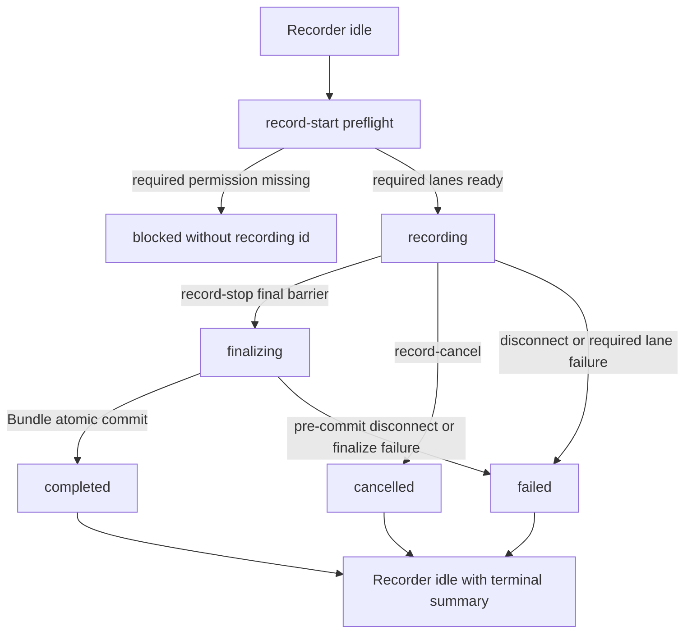
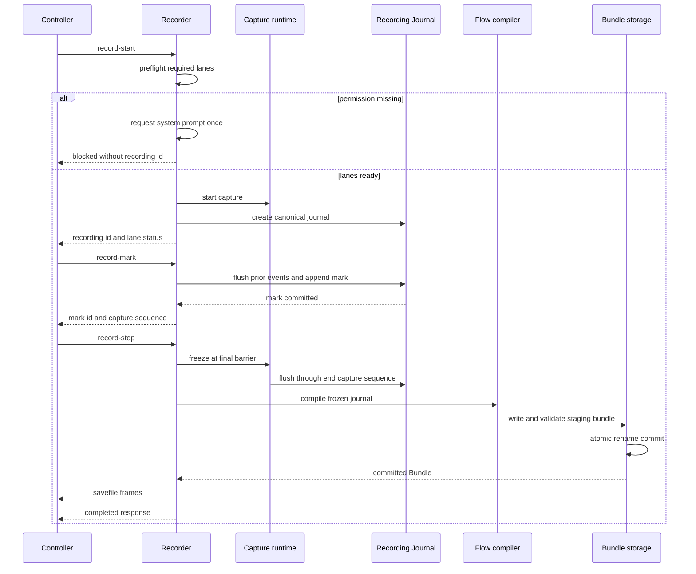

# rdog Recording Session lifecycle control protocol

## Status

本规格是 Wayfinder ticket [定义 Recording Session lifecycle control protocol](https://github.com/raiscui/rustdog/issues/5) 的 resolution asset。

它定义 Recording Session 的控制面、状态机和失败边界,不实现 Recorder production code。
当前 line-control parser 尚未支持这些 recording kind。本文件是实施输入,不是当前能力清单。

## Scope

本规格只定义:

- `@record-start`
- `@record-status`
- `@record-mark`
- `@record-stop`
- `@record-cancel`
- `rdog record` CLI wrapper 的最小行为

以下内容由其他规格负责:

- Recording Journal event schema: `rdog.recording.v1`
- Recording Bundle 的内部文件和 manifest schema
- Journal 到 `rdog.flow.v1` 的确定性编译规则
- replay preflight、guard 和 post-action verification
- Participating Window 与 geometry precondition 编译

Replay Script 必须复用 `specs/rdog-flow-control-plan.md` 中的 `rdog.flow.v1`。窗口位置和大小恢复必须复用 `specs/rdog-window-control-plan.md` 中的显式 `@window-resize`,不新增录制专用 resize 命令。

## Terms

- **Recorder**: daemon 内持有 capture runtime 和 single-active slot 的组件。
- **Recording Session**: 一次由 controller connection 持有的录制生命周期。
- **Recording Journal**: append-only canonical source。Replay Script 不是第二真相源。
- **Replay Script**: 从 frozen Journal 派生的 `rdog.flow.v1` 脚本。
- **Recording Bundle**: stop 成功后原子提交的正式资产。
- **Participating Window**: 录制过程中参与操作,并需要 replay geometry precondition 的窗口。
- **Window Geometry Precondition**: replay 前通过 `@window-resize` 和 fresh verification 恢复的窗口位置、大小、display 与状态约束。

## Invariants

1. 每个 daemon 同时最多一个 active Recording Session。
2. Session 归成功执行 start 的 controller connection 所有。
3. Controller 在 Bundle commit 前断线,Session 必须失败。
4. `recording_id` 由 daemon 生成,是 Session identity。
5. `#request_id` 只做请求与响应关联,不承担幂等。
6. start 成功表示 required lanes 已就绪且 capture 已提交。
7. required lane 出现不可恢复缺口时,Session 必须失败。
8. `completed` 只表示 Recording Bundle 已原子提交。
9. `@record-stop` 不自动 replay。

## State model

Session 主状态:

| State | Meaning |
| --- | --- |
| `recording` | Capture 已提交,Journal 正在追加 |
| `finalizing` | 输入已冻结,正在编译和提交 Bundle |
| `completed` | Bundle 已原子提交,状态不可逆 |
| `failed` | 连接、required lane 或 finalize 失败 |
| `cancelled` | Owner 主动放弃并清理未提交内容 |

`idle` 是 Recorder 状态,不是 Session 状态。`blocked` 是没有创建 Session 的 start 结果。`degraded` 只描述 optional lane health。



## Wire contract

五个命令都使用现有 line-control 语法,并支持可选 request id:

```text
@record-start#1:{...}
@record-status#2
@record-mark#3:{...}
@record-stop#4:{...}
@record-cancel#5:{...}
```

响应沿用 `@response`。文件型结果沿用 `@savefile* -> @response` 多 frame 收口。Recording control response 的 `schema` 固定为 `rdog.record-control.v1`。

### `@record-start`

无 payload 时等价于:

```json
{"profile":"semantic","request_permissions":true,"default_mark_evidence":[]}
```

字段:

- `profile`: `semantic` 或 `physical`,默认 `semantic`。
- `request_permissions`: 默认 `true`。缺少 required permission 时主动请求系统弹窗。
- `default_mark_evidence`: 默认空数组。可选值为 `screenshot`、`ax_snapshot`。

Required lanes:

- `semantic`: `event_listen`、`accessibility`、`tap_health`、required queue health。
- `physical`: `event_listen`、`tap_health`、required queue health。

Screen Recording 只在显式请求 screenshot evidence 时需要。Event posting 是 replay 权限,不阻塞 recording start。

Start 按以下顺序执行:

1. 检查 Recorder availability 和 single-active slot。
2. 对 profile required permissions 做无弹窗 preflight。
3. 缺权限且 `request_permissions:true` 时,每项权限最多请求一次系统 prompt。
4. 权限不足时返回 `blocked`,不创建 `recording_id`。
5. 创建 Journal 和 capture runtime。
6. required lanes 全部 ready 后生成 `recording_id`,提交为 `recording`。

成功响应最少包含:

```json
{"kind":"record-start","schema":"rdog.record-control.v1","status":"recording","recording_id":"rec-opaque","profile":"semantic","started_at_unix_ms":0,"lanes":{}}
```

active Session 已存在时不创建第二个 Session,返回 `RECORDING_ALREADY_ACTIVE`,并附带 active `recording_id`。

### `@record-status`

`@record-status` 不接受 payload。任何连接到同一 daemon control plane 的 controller 都可只读调用。

active 时至少返回:

- `recording_id`
- `profile`
- `state`
- `started_at_unix_ms`
- `duration_ms`
- `owner_present`
- `event_count`
- `mark_count`
- `gap_count`
- `lanes`
- `delivery_status`

status 不返回按键、文本、截图或 Journal payload。

Recorder 回到 idle 后,内存中保留一条易失 `last_session` summary。它包含 terminal state、结束时间、failure reason、counters、lane health 和 Bundle commit/delivery 状态。新 Session 启动或 daemon restart 后覆盖或丢失该摘要。它不能用于恢复 Session。

### `@record-mark`

请求:

```json
{"recording_id":"rec-opaque","label":"step-ready","evidence":["screenshot"],"dedupe_key":"client-step-7"}
```

规则:

- 只允许 owner 在 `recording` 状态调用。
- `label`、`evidence` 和 `dedupe_key` 均可选。
- 未传 `evidence` 时继承 start 的 `default_mark_evidence`。
- Mark 是持久化 Journal barrier,不是 best-effort annotation。
- daemon 先提交所有已取得 sequence 的前序 events,再追加 mark entry。
- mark commit 成功后分配 daemon-generated `mark_id` 和确定的 `capture_seq` 边界。
- evidence 在 barrier 之后采集,不能阻塞 event tap callback。
- optional evidence 失败不回滚 mark,响应分别报告 mark 和 evidence 结果。

`dedupe_key` 只在当前 `recording_id` 内有效。相同 key 与相同 canonical payload 返回原 `mark_id`;相同 key 与不同 payload 返回 `RECORD_MARK_DEDUPE_CONFLICT`;未提供 key 时每次调用都创建新 mark。

### `@record-stop`

请求:

```json
{"recording_id":"rec-opaque"}
```

active stop 是 owner-only mutation:

1. 建立最终 barrier,冻结新输入并确定 `end_capture_seq`。
2. 排空已取得 sequence 的 events。
3. 写入最终 lane health、gap counters 和 terminal marker。
4. 进入 `finalizing`,继续占用 single-active slot。
5. 从 frozen Journal 编译 Replay Script。
6. 在 staging 路径组装并验证 Bundle。
7. 通过同文件系统 atomic rename 提交 Bundle。
8. commit 成功后进入不可逆的 `completed`。

任一步骤在 commit 前失败,Session 进入 `failed`,不得暴露 partial Bundle。

commit 后 daemon 通过一个或多个 `@savefile` frames 交付 Bundle,再用最终 `@response` 收口。Delivery 失败不回滚 `completed`;`delivery_status` 独立记录为 `partial` 或 `failed`。

指定 `recording_id` 已 completed 时,重复 stop 是只读 delivery retry。它重放已提交 Bundle,不重新编译。新 controller 可执行该 readback,响应必须携带同一 Bundle checksum。Bundle 已删除时返回 `RECORD_BUNDLE_NOT_FOUND`。

### `@record-cancel`

请求:

```json
{"recording_id":"rec-opaque"}
```

规则:

- 只允许 owner 在 `recording` 状态调用。
- 立即停止捕获,不编译 Replay Script,不提交 Bundle。
- 删除未提交 Journal、evidence 和 staging artifacts。
- 只保留易失、无录制内容的 cancelled summary。
- `finalizing` 时返回 `RECORD_FINALIZING`,不能中断 commit transaction。
- 重复 cancel 返回原 terminal summary,不重复清理。

文件清理只承诺正常 unlink 和目录清理,不宣称 SSD/APFS 物理安全擦除。

## Ownership and disconnects

- Mutation commands `mark`、active `stop`、`cancel` 只允许 owner connection。
- `status` 对其他 controller 只读开放。
- completed Bundle readback 不是 mutation,可由新 controller 使用精确 `recording_id` 请求。
- 连接在 `recording` 或 pre-commit `finalizing` 阶段断开时,Session 进入 `failed`。
- Bundle commit 后断线只影响 delivery status。
- 断线后的新 connection 不能恢复或接管 active Session。

## Permission and lane health

| Lane | Required by | Runtime failure |
| --- | --- | --- |
| `event_listen` | semantic, physical | 有界恢复失败后 Session failed |
| `accessibility` | semantic | 权限撤销或 runtime 不可恢复时 failed |
| `tap_health` | semantic, physical | 有界 re-enable 失败后 failed |
| `queue_health` | semantic, physical | 不可恢复 event gap 时 failed |
| `screen_recording` | 显式 screenshot evidence | evidence failed,Session 继续 |
| `secure_input` | 非授权 lane | 写 redacted period,不保存键值或文本 |
| `event_post` | replay | 不影响 recording |

Required lane failure 必须先写 failure/gap marker,再停止 capture。`degraded` 只用于 optional lane。

权限 prompt 是显式 start 的默认行为。Prompt 是异步的,所以本次 start 仍返回 `blocked`,并包含 `prompt_requested`、permission states、recovery actions 和 `restart_required`。

## Finalization sequence



## Crash, cleanup and retention

daemon restart 不恢复 active Session。

Startup scan:

- Atomic rename 已完成且 manifest/checksum 验证通过: completed Bundle。
- Active Journal、staging、temporary manifest 或 incomplete checksum: crash orphan。
- Crash orphan 不继续录制,也不自动编译。
- Daemon 提取非敏感 metadata 到结构化日志后删除 orphan raw artifacts。
- 清理失败时 Recorder availability 为 `cleanup_required`,`@record-start` 返回 `RECORD_ORPHAN_CLEANUP_FAILED`。
- 显式 doctor/recovery 清理成功后才允许新 start。

Completed Bundle 默认持久保留到显式删除。`config.toml` 可选配置 `max_age_days`、`max_bundles` 和 `max_total_bytes`。未配置时不自动清理。自动清理只选择最旧的 completed Bundle,排除 active、finalizing、staging 和 in-flight delivery assets。

## Capabilities

`@capabilities` 在 `rdog.capabilities.v1.capabilities.recording` 下返回:

```json
{"status":"available","schema":"rdog.record-control.v1","platform":"macos","profiles":["semantic","physical"],"commands":["record-start","record-status","record-mark","record-stop","record-cancel"],"availability":"ready","permissions":{"event_listen":"granted","accessibility":"granted","screen_recording":"not_requested"}}
```

`availability` 至少支持 `ready` 和 `cleanup_required`。平台不支持使用既有 `status:"unsupported"`;权限状态按 lane 返回,不能把多个权限压成一个布尔值。Active Session 状态只从 `@record-status` 读取。

## Error contract

数字 code 沿用 line-control 约定:

- `64`: 请求或 payload 不合法。
- `70`: 服务端执行或状态转换失败。
- `77`: 权限不足。
- `78`: 平台或 backend 不支持。

| error_code | code | Meaning |
| --- | ---: | --- |
| `RECORD_INVALID_REQUEST` | 64 | Payload、profile、evidence 或 recording id 不合法 |
| `RECORD_MARK_DEDUPE_CONFLICT` | 64 | 相同 dedupe key 对应不同 canonical payload |
| `RECORDING_ALREADY_ACTIVE` | 70 | Daemon 已有 active Session |
| `RECORD_NOT_ACTIVE` | 70 | 当前没有可执行 mutation 的 active Session |
| `RECORD_NOT_OWNER` | 70 | 当前 connection 不是 Session owner |
| `RECORD_FINALIZING` | 70 | Session 已越过 final barrier |
| `RECORD_REQUIRED_LANE_FAILED` | 70 | Required capture lane 不可恢复 |
| `RECORD_FINALIZE_FAILED` | 70 | Freeze、compile、validate 或 commit 失败 |
| `RECORD_DELIVERY_FAILED` | 70 | Bundle 已 commit,但本次远程 delivery 未完成 |
| `RECORD_BUNDLE_NOT_FOUND` | 70 | Completed Bundle 已删除或不存在 |
| `RECORD_ORPHAN_CLEANUP_FAILED` | 70 | Crash orphan raw artifacts 未清理干净 |
| `RECORD_PERMISSION_BLOCKED` | 77 | Required permission 未授权 |
| `RECORD_UNSUPPORTED` | 78 | 当前平台没有 Recorder backend |

错误响应必须包含 `kind`、`schema`、`error_code`、`error` 和可用的 `recording_id`。权限错误还要包含 permission states 和 recovery actions。

## CLI wrapper

最小入口:

```text
rdog record [TARGET] --profile semantic --output <directory>
```

CLI 行为:

- 保持 owner control connection,直到 stop、cancel 或 failure。
- 默认主动请求缺失权限;`--no-request-permissions` 只做 preflight。
- 第一次 Ctrl-C 发送 `@record-stop`,显示 `finalizing`,等待 Bundle commit 和 delivery。
- `finalizing` 期间再次 Ctrl-C 不切换为 cancel。
- Stop 与本地落盘成功后退出码为 `0`。
- 强杀、网络断开或 connection 异常关闭按 failure 处理。
- 显式 cancel 才发送 `@record-cancel`;普通 Ctrl-C 不丢弃录制。

首版 CLI 不设计可视化时间线、pause/resume 或跨连接 attach。`@record-mark` 是 control protocol 能力,CLI 的交互式 mark UX 留给后续实现规划。

## Recording and replay consistency

Lifecycle 只负责冻结一致的输入边界。Replay 的具体动作由后续 compiler ticket 决定,但必须遵守现有控制契约:

- AX/value/semantic action 优先,mouse 是显式 fallback。
- Observation ref 不能跨 observation 持久化;Replay Script 使用 durable selector。
- 坐标 fallback 统一使用 screenshot manifest 的 `os-logical`。
- Participating Window 的 geometry precondition 使用显式 `@window-resize`,包含 origin、outer size、display guard 和 fresh verification。
- App clamp 或 geometry verify failure 必须显式失败,不能假装窗口已恢复。

## Non-goals

- Pause、resume 或 active Session attach。
- 跨 controller 或跨 daemon restart 恢复录制。
- Partial Bundle。
- 自动 replay。
- 连续视频录制。
- 同一 daemon 并发多个 active Sessions。

## Acceptance criteria

- 所有命令都有 request/response、ownership、合法 state 和重复请求语义。
- Start blocked 时没有 `recording_id` 或半初始化 Session。
- Required lane gap 无法产生 completed Bundle。
- Stop 只有一次 final barrier 和一次 atomic Bundle commit。
- Cancel 不留下 Replay Script 或 partial Bundle。
- Post-commit delivery retry 返回同一 checksum。
- Daemon restart 不恢复 crash orphan。
- Window geometry 恢复只引用现有 `@window-resize`。
