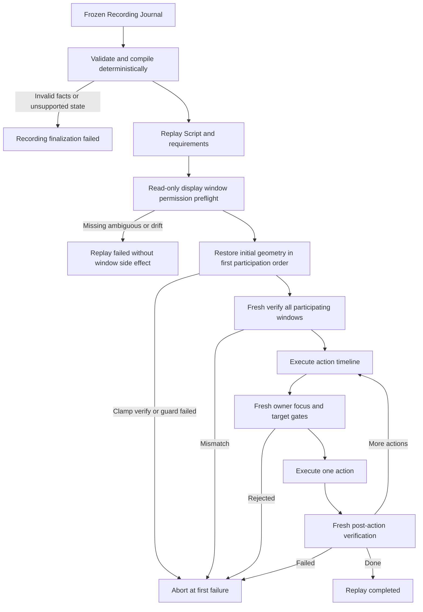
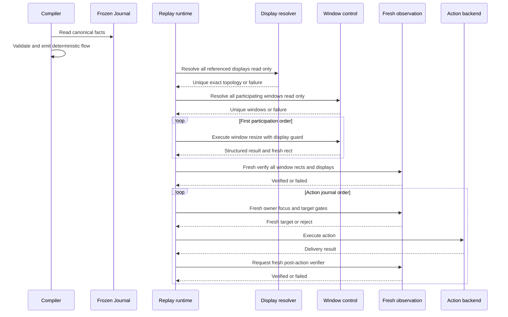

# Recording Participating Window and Geometry Compilation policy

## Status

本文是 Wayfinder ticket [定义 Participating Window 与 geometry precondition 编译](https://github.com/raiscui/rustdog/issues/11) 的 resolution asset。

本文只固定 Recorder 从 frozen Recording Journal 编译 Participating Window 和 Window Geometry Precondition 的规则,不实现 Recorder、Replay compiler 或新的 window control backend。

窗口控制必须复用现有 `@window-find`、`@window-activate` 和 `@window-resize`。本文不新增录制专用 resize 或 window-state 命令。

## Scope

本文定义:

- 哪些 top-level window 成为 Participating Window。
- 首次 `window_snapshot` 的冻结时点和必需事实。
- initial geometry precondition 与录制中 intentional move/resize 的分界。
- transient child surface 的 owner 归属。
- durable window/display 解析和歧义边界。
- normal windowed、hidden、minimized、Space、fullscreen 和 clamp 的支持范围。
- Replay 的只读 preflight、geometry mutation、fresh verification 和失败顺序。

本文不定义:

- 恢复整个 desktop、无关窗口、窗口 z-order 或遮挡关系。
- 跨 display topology 的比例缩放、相对迁移或 nearest-display fallback。
- hidden、minimized 或 fullscreen 作为录制起始状态的完整 state replay。
- document URL、workspace restore 或新的持久 window fingerprint 协议。
- Recorder production code、Recording Bundle manifest schema 或可视化时间线。

## Terms

- **Participating Window**: Recording Session 中成为操作目标,被显式 activate/focus,或被 human 主动移动、缩放的 top-level window。只有这类窗口属于 Replay geometry 恢复范围。
- **Initial Window Snapshot**: 窗口首次参与动作之前最后一份满足 freshness 要求的完整 `window_snapshot`。
- **Window Geometry Precondition**: Replay 内容动作前必须恢复并验证的 window outer rect、display 和 normal windowed state。
- **Intentional Geometry Action**: Recording timeline 中由 human 主动完成的一次 move/resize。它是 Replay action,不是 initial precondition 的修正。
- **Referenced Display**: 被 Participating Window snapshot 或 guarded coordinate action 引用的 display。
- **Transient Child Surface**: attached sheet、popover、menu、tooltip 等依附于 owner window、没有独立稳定 geometry 生命周期的 UI surface。

## Invariants

1. Frozen Recording Journal 是 Participating Window 和 geometry 编译的唯一真相源。
2. 仅被观察到、可见、frontmost、遮挡其他窗口或属于同一 app,都不会让窗口成为 Participating Window。
3. Initial Window Snapshot 必须早于首个参与动作。动作后的 rect 或 state 不能回填 initial precondition。
4. PID、runtime `window_id`、session `display_id` 和 observation ref 都不能成为持久 Replay identity。
5. Window 和 display resolver 都必须唯一命中。Missing 或 ambiguous 一律 fail closed。
6. Geometry restoration 不能替代 semantic target 的 bounded fresh re-find。
7. 只有 `@window-resize` 的 `ok` 或显式容差内 `ok_with_delta` 可以通过 geometry gate。
8. 第一个失败立即终止 Replay。不 retry、不降级旧坐标、不继续后续 step,也不自动回滚 desktop。

## Participating Window membership

### Inclusion triggers

Window 在以下事件首次发生时加入 recording-scoped Participating Window 集合:

- click、text、shortcut、scroll 或 drag 已明确归属于该 window。
- 显式 activate/focus 已明确归属于该 window。
- Human 主动 move 或 resize 该 window。

首次加入时分配 recording-scoped `window_key`,并引用对应 `app_key` 和动作前的 Initial Window Snapshot。

### Exclusions

以下事实单独存在时不触发 participation:

- Window 仅可见或 frontmost。
- Window 仅出现在 screenshot、AX tree 或其他 snapshot 中。
- Window 仅遮挡 Participating Window。
- Window 仅与 Participating Window 属于同一个 app。

Recorder 可以为未参与窗口维护短期 observation cache。该 cache 只用于在首次参与时取得 pre-action snapshot,不能扩大 Participating Window 集合。

## Initial Window Snapshot

Initial Window Snapshot 必须保存或引用以下完整事实:

- recording-scoped `window_key` 和 `app_key`。
- runtime locator hints,仅用于录制期关联和诊断。
- durable selector或构造该 selector 的事实。
- outer rect,单位为 `os-logical`。
- recording-scoped display key。
- normal windowed state和observation provenance。
- participation reason及首个参与动作的 `journal_seq`。
- snapshot observation time或等价 freshness provenance,且必须早于首个参与动作。

如果没有可证明属于动作前且足够 fresh 的完整 snapshot,compiler 必须拒绝该 Recording。不得使用动作后的 snapshot 猜测 initial precondition。根据 Recording Session lifecycle,stop finalization 中的 compiler failure 会使 Session 进入 `failed`,不会提交 partial Bundle。

## Intentional move and resize

每个 Participating Window 只有一份 Initial Window Snapshot。录制期间的 human move/resize 必须保留在 action timeline 中。

规则:

1. 如果 move/resize 是首次 participation trigger,动作开始前的 snapshot 成为 Initial Window Snapshot。
2. 动作稳定结束后的完整 snapshot 成为 Intentional Geometry Action 的结果和 verification target。
3. 一次连续拖动或缩放产生的高频 geometry notification 收敛为一个 action。
4. 中间 rect 可以留作诊断 evidence,但不逐条编译为 `@window-resize`。
5. Intentional Geometry Action 按原始 `journal_seq` 编译,不得折叠进最终 precondition。

## Transient child surfaces

Attached sheet、popover、menu 和 tooltip 并入 owner Participating Window:

- 不分配独立 Participating Window identity。
- 不生成独立 geometry precondition 或 `@window-resize`。
- 对 surface 的动作仍归属于 owner window。
- Journal 保存 surface role、owner relationship 和 semantic locator evidence。
- Replay 必须 fresh 验证 surface 在正确 owner 下重新出现,再解析具体 target。

只有可脱离 owner、具备稳定 top-level identity,并且可由 human 独立移动或缩放的 window 才单独参与。

## Durable window resolution

Replay 使用现有 window query,不使用自动相似度评分。

解析层级:

1. macOS 优先 exact `bundle_id`;其他平台使用可用的 exact app identity。
2. Title 被录制事实证明稳定时,叠加 exact `title`。
3. 只有 Journal 保存 title pattern 构造事实,并且 fresh preflight 唯一命中时,才允许 `title_contains`。
4. Title 不稳定时可以仅使用 exact app identity,但 eligible top-level window 仍必须唯一。

结果契约:

| Result | Outcome |
| --- | --- |
| 1 unique eligible window | 继续 preflight |
| 0 window | Missing,Replay preflight失败 |
| 多个 window | `WINDOW_AMBIGUOUS`,Replay preflight失败 |

禁止回退到 frontmost window、同 app 第一个 window、runtime `window_id` 或旧坐标。

## Supported window states

### Recorded initial state

首版只接受 normal windowed Initial Window Snapshot。

如果录制要求窗口初始处于 hidden、minimized 或 fullscreen state,compiler 返回 unsupported。现有 `@window-resize` 会规范化这些状态,不能忠实重建它们作为录制前置条件。

### Replay environment recovery

录制初始状态为 normal windowed,但 Replay 现场窗口被 hidden、minimized 或位于其他普通 Space 时,允许 `@window-resize` 使用现有显式步骤:

- `unhide_app`
- `unminimize_window`
- `activate_app`
- `raise_window`
- 必要的 `switch_to_window_space`

所有实际步骤必须进入 `steps[]`。恢复后必须 fresh 证明窗口未 hidden、未 minimized、位于当前 Space,且 rect 和 display guard 均满足要求。

普通跨 Space 恢复只有 `ok` 才算成功。`limited`、无法切换或无法证明都使 Replay 失败。Fullscreen Space 首版不做隐式进入、退出或迁移。

## Display topology contract

Recorded `display_id` 只有 session stability。Replay 不得把 `d1`、`d2` 等值当作持久 identity。

Replay preflight 按以下规则处理每个 Referenced Display:

1. 优先使用 device-stable key 匹配。
2. Stable key 不可用时,只允许用唯一 name/primary candidate 继续核验。
3. 当前 display 的全局 `os_rect`、scale factor 和 rotation 必须与 recording snapshot 精确一致。
4. 未被任何 Participating Window 或 coordinate action 引用的 display 发生变化,不阻断 Replay。
5. 匹配成功后,Replay runtime 使用当前 session fresh resolved display identity 绑定 display guard。

静态 ControlLine 无法持久保存 session display id 时,runner必须在同一 Replay session 内完成解析与绑定。也可以在精确 topology 已通过 preflight 后,使用位于预期 display `os_rect` 内的唯一 `contains_point` selector。两条路径都必须调用现有 display resolver,不能新增第二套解析逻辑。

首版不做比例缩放、相对坐标迁移、主副屏替换或 nearest-display fallback。Missing、ambiguous、rect/scale/rotation drift 都在任何 window side effect 前失败。

录制期间如果 Referenced Display topology 发生变化,compiler 不尝试重放硬件变化,Recording finalization 失败。

## Geometry request compilation

Initial Window Snapshot 编译为现有 `@window-resize`:

```text
@window-resize:{target:{query:{bundle_id:"com.example.App",title:"Document"}},size:{width:1200,height:800,unit:"os-logical",box:"outer"},origin:{x:100,y:80},guard:{display:{contains_point:{x:500,y:400}}},verify:{tolerance_px:2}}
```

硬约束:

- `target.query` 必须来自 durable selector facts,且在 preflight 唯一命中。
- `size` 使用 recorded outer width/height。
- `origin` 使用 recorded global `os-logical` x/y,不能使用 `"keep"`。
- `guard.display` 必填,并绑定 fresh resolved Referenced Display。
- `verify.tolerance_px` 首版固定为 `2` logical px。

`ok`和容差内`ok_with_delta`通过。以下结果终止 Replay:

- `WINDOW_RESIZE_CLAMPED`
- `WINDOW_RESIZE_VERIFY_FAILED`
- `WINDOW_RESIZE_GUARD_FAILED`
- `WINDOW_RESIZE_RECOVERY_FAILED`
- `WINDOW_RESIZE_UNSUPPORTED`
- `WINDOW_RESIZE_NOT_SETTABLE`
- `WINDOW_RESIZE_PERMISSION_DENIED`
- target missing或`WINDOW_AMBIGUOUS`

## Compile and replay sequence

### Phase 1: deterministic compile

Compiler只读取 frozen Journal:

- 验证 participation、Initial Window Snapshot、provenance、display references 和 supported state。
- 按窗口首次 participation 的 `journal_seq` 确定稳定 geometry order。
- 把 Intentional Geometry Action 保留在原 action timeline。
- 生成确定性的 `rdog.flow.v1` steps 和 Replay requirements。

相同 frozen Journal和相同compiler policy必须生成相同步骤内容。Compiler不能读取当前 desktop 来改变离线动作选择。

### Phase 2: read-only Replay preflight

Replay runtime在任何window side effect前:

- 检查所需permission和capability。
- 唯一解析所有Referenced Displays并验证topology facts。
- 唯一解析所有Participating Windows并验证eligible state。

任一检查失败时不执行`@window-resize`。

### Phase 3: initial geometry mutation

按窗口首次 participation 的 `journal_seq` 稳定排序:

1. 执行该窗口的显式 `@window-resize`。
2. 立即检查 structured result、rect和display guard。
3. 所有窗口完成后,再 fresh 读取全部 Participating Window。
4. 复核 identity、normal windowed state、rect和display。

多个窗口不能同时 focused,因此全窗口复核不要求每个窗口 focused。Focus 在进入对应 action 前单独 fresh 验证。

### Phase 4: action timeline

每个action按既有Semantic Promotion policy执行:

1. Fresh验证owner Participating Window和focus。
2. Bounded fresh re-find semantic target,或确认该动作从未存在semantic identity并刷新coordinate gates。
3. 执行semantic、parameterized semantic或guarded coordinate action。
4. 获取与预期效果绑定的fresh post-action verifier。

Intentional Geometry Action 在原 `journal_seq` 位置执行 `@window-resize`,并使用相同display guard和fresh rect verification。

## Decision flow



## Execution sequence



## Failure and trace contract

Replay 在第一个失败处停止:

- 不自动retry。
- 不从semantic target失败降级到旧坐标。
- 不继续执行后续step。
- 不自动rollback已完成的desktop side effect。

自动rollback会产生新的未录制side effect,且失败现场未必允许可靠恢复。Trace必须诚实保留已经完成的步骤。

Failure report至少包含:

- `phase`: compile、preflight、geometry或action。
- recording-scoped `window_key`,或action `journal_seq`。
- 现有底层window/display/action错误码。
- expected facts和fresh observed facts。
- 已完成step摘要。

Recorder/Replay不得复制一套同义window错误码。现有structured control error是底层错误的单一真相源。

## Acceptance criteria

- 仅事件驱动的top-level window成为Participating Window。
- Initial Window Snapshot严格早于首个参与动作,缺失时Recording finalization失败。
- Intentional move/resize不被折叠进initial precondition,并按`journal_seq`生成独立`@window-resize`。
- Transient child surface不生成独立geometry step。
- Durable window/display解析必须唯一,session identity不被持久化。
- Recorded initial state只接受normal windowed。
- Referenced Display topology drift不做自动映射。
- 所有Participating Window在内容动作前完成显式geometry restore和fresh batch verification。
- Clamp、超容差delta、guard failure、missing、ambiguous和`limited`均fail closed。
- Geometry verification不替代semantic target fresh re-find和post-action verifier。
- 第一个失败终止Replay,不retry、不降级、不继续、不自动rollback。

## Relationship to existing contracts

- Recording Session finalize与compiler failure: `specs/rdog-recording-session-lifecycle.md`。
- Recording-scoped window/display snapshot: `specs/rdog-recording-journal-model.md`。
- Semantic target与coordinate fallback边界: `specs/rdog-recording-semantic-promotion-policy.md`。
- Window query、state和resize错误: `specs/rdog-window-control-plan.md`。
- Display resolver与guard: `specs/rdog-display-scope-control-plan.md`。
- Global `os-logical`坐标: `specs/rdog-multi-display-screenshot-coordinate-plan.md`。
- `rdog.flow.v1` script runtime: `specs/rdog-flow-control-plan.md`。
