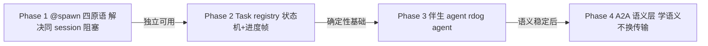
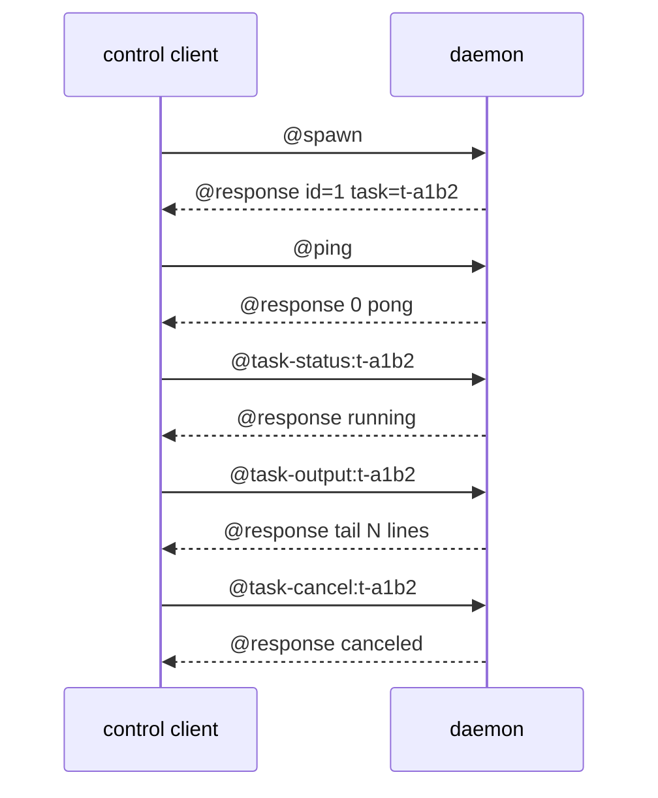
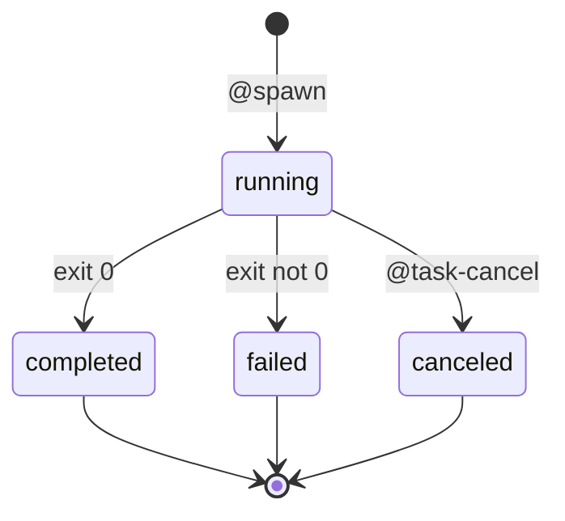

# rdog Task/Spawn 控制方案

## 1. 背景

这份文档处理的不是某个单点 GUI 能力。
它处理的是 daemon 的**任务执行模型**: 从"在线阻塞执行"演进为"提交即返回 + 可查询的后台任务"。

三个真实驱动:

1. **同 session 阻塞体验问题**。当前一条长命令(`@cmd sleep 300`、长 `@flow`)会占住整条
   control lane,同 session 的后续命令全部排队。
2. **伴生 agent 模式的前置条件**。跨主机 agent 协作(见
   `specs/bidirectional-control-plane-plan.md` 与 A2A 语义层调研)需要 daemon 能托管
   长驻 agent 进程,而 agent 是不可能用"同步等终态"的命令模型跑起来的。
3. **A2A 语义层需要确定性 Task 语义**。跨 agent 任务委派/进度/取消的核心对象是 Task,
   这个对象的确定性部分(状态机/序号/查询)属于 daemon 基础设施,智能部分永远在外挂 agent。

## 2. 当前实现的真实边界

### 2.1 并发模型: 三条 lane

- 主 queryable(`src/zenoh_control.rs` 的 `run_router_daemon` 内 `queryable.recv()` loop):
  串行,recv 一条同步执行完才收下一条。
- legacy queryable: 独立 `thread::spawn`,同样串行,与主线程并行。
- session bridge(`src/zenoh_control/daemon_bridge.rs` 的 `open_daemon_session_bridge`):
  每个 control 连接一个线程,内部同 session 帧串行处理
  (`parse_and_execute_control_line` 是同步函数)。

推论:

- **跨连接天然并发**,daemon 不会全局死锁。
- **同一连接内串行**,长命令阻塞该 session 的后续帧。
- `CancelRegistry`(`src/cancellation.rs`)的存在自证了 in-flight 阻塞是真实负载:
  取消信号必须从别的 lane 进来打断。

### 2.2 长进程只有 PTY 一个机制

PTY(`@pty`)是当前唯一"后台跑"的方式: 进程独立执行、输出流式转发、detach 后继续活。
但语义错位:

- PTY 是**终端会话语义**(stdin 交互、resize、备用屏),不是**任务语义**
  (完成状态、退出码、非交互输出捕获)。
- PTY attach 期间 session 变"终端专线",输入直接进 PTY stdin,不再走命令解析。
- 用 PTY 托管 headless agent 进程等于让任务活在终端流里,交互模型完全错。

### 2.3 命令模型是同步等终态

`@cmd` 等 stdout,`@flow` 等脚本终态。没有 "spawn → 立即返回 task id → 事后查询"
的原语。对照 herdr 的形态(`pane run` 提交即返回 + `wait-output`/`read` 分离),
缺口就是异步任务原语。

## 3. 目标

分四个 Phase 演进,每个 Phase 独立可验收:



- Phase 1: `@spawn` / `@task-status` / `@task-output` / `@task-cancel` 四原语。
- Phase 2: Task registry 确定性状态机 + 进度帧。
- Phase 3: 伴生 agent 托管(`rdog agent`)。
- Phase 4: A2A 语义层衔接(远期,只做索引不做设计)。

## 4. 非目标

- **daemon 内嵌 LLM runtime**。智能永远在外挂 agent;daemon 只承担确定性部分。
  LLM 依赖(API key/网络/体积)不进 daemon,高权限进程不因换 model 而动。
- **调度器/队列/自动任务分配**。Task 语义是"托管与查询",不是"分配"。
  分配智能在 orchestrator agent / A2A 语义层。herdr 同样明确不做分配,这不是缺口。
- **交互式终端场景**。PTY 保留该职责,`@spawn` 无 stdin 交互语义。
- **重写 @flow**。`@flow` 保持同步阻塞 RPC;未来可选升级为 spawn 组合,本轮不动。

## 5. Phase 1: `@spawn` 四原语

### 5.1 协议

```text
@spawn:COMMAND...                  # raw shell 文本 spawn (对齐 @cmd raw 先例)
@spawn "COMMAND"                   # quoted 形式
@spawn {command:"...",cwd:"..."}   # 对象形式 (cwd 唯一入口)
@task-status:TASK_ID               # 状态 + 命令 + 退出码(若终态)
@task-output:TASK_ID               # 尾部输出 (默认 80 行)
@task-output {task:"...",lines:N}  # 自定义尾部行数
@task-cancel:TASK_ID               # 请求取消
```

返回遵循现有 `@response` 收口:

```text
@response {"id":N,"task":"t-a1b2c3","ok":true}
@response {"id":N,"task":"t-a1b2c3","state":"running"}
@response {"id":N,"task":"t-a1b2c3","state":"completed","exit_code":0}
```

### 5.2 Phase 1 帧流



核心验收点: `@spawn` 立即返回后,**同一 session 内** `@ping` 等
其他命令不再排队等待任务完成。

### 5.3 语义边界

- **task id 与 request id 分离**。request id(`@cmd#42` → `@response {"id":42}`)
  是协议层关联;task id(`t-` 前缀短 id)是 registry 主键,跨请求存活。
- **与 PTY 的关系**: 复用 PTY 已验证的进程管理内核(spawn/kill/session registry),
  但独立入口。`@spawn` 无 stdin、无 resize、无 attach;需要交互走 PTY。
- **输出捕获**: 进程 stdout/stderr 合流进内存 ring buffer,设硬上限(默认量级 1MB,
  精确值实现 ticket 定)。溢出策略: 保留尾部、头部丢弃、响应里报告 `truncated:true`。
  不做 Phase 1 savefile 落盘(大输出场景后议)。
- **daemon 重启**: task registry **不持久化**。重启后 `@task-status` 对旧 task id
  诚实返回 not_found,不假装存在。进程随 daemon 生命周期(进程组归属 daemon,
  daemon 退出时子进程的处理沿用 PTY 现有策略)。
- **取消**: task registry 内建 kill (实现修订, 2026-08-28): 原计划泛化 `CancelRegistry`,
  实现时发现它以 u64 request seq 为主键, 而 task 生命周期跨请求、id 为字符串, 不适合复用。
  实际机制与 PTY close 同款: `@task-cancel` 同步 kill + 收割 (child 共享句柄单收割方协议,
  waiter 线程 50ms try_wait 轮询), 响应即为 canceled 终态; 对已终态 task 幂等返回现态。
  `@cancel#seq` 语义不变, 仍只管 in-flight 同步命令。
- **命令解析**: `@spawn` 走 shell 行还是裸 argv 由实现 ticket 定;
  关键约束是 COMMAND 部分不能被 compact 参数解析误拆(含空格/引号的命令要完整传递)。

### 5.4 状态机(Phase 1 简化版)



Phase 1 只保证 running 与三个终态;`spawn_failed`(启动即失败,如命令不存在)
直接以 error response 返回,不进 registry。

## 6. Phase 2: Task registry + 进度帧

### 6.1 已落地基线 (Phase 1 提前完成, 2026-08-28)

Phase 1 实现已覆盖本节原定的一部分 registry 职责, Phase 2 只做增量:

- ✅ `task_id -> {command, state, exit_code, finished_at, output, child}` registry
- ✅ 终态保留最近 64 条按 finished_at 回收 (`reap_finished_tasks`)
- ✅ running 上限 64 拒绝新 spawn
- ❌ `seq` 单调计数 (Phase 2 增量, 见 6.2)
- ❌ 进度帧族 (Phase 2 增量, 见 6.3/6.4)

### 6.2 registry 增量: 全局单调 seq

daemon 内维护全局 `task_seq`(每次 spawn 递增),写入条目并随帧携带。
消费方用相邻帧的 seq 检测丢失(帧广播路径上无 request-id 关联, seq 是
唯一丢帧检测手段)。seq 不持久化,daemon 重启归零(与 registry 不持久化一致)。

### 6.3 进度帧族 wire 格式

对齐 PTY 帧族的 `@帧名 {JSON}` 风格(`control_frames.rs` 的 `to_wire_message`),
四个帧走 `ControlFrame` 新变体 + session channel(to-control)分发:

```text
@task-started  {"task":"t-a1b2c3d4","seq":7,"command":"cargo build"}
@task-progress {"task":"t-a1b2c3d4","seq":9,"step":"build","detail":"42/120 crates"}
@task-completed {"task":"t-a1b2c3d4","seq":10,"exit_code":0}
@task-failed    {"task":"t-a1b2c3d4","seq":10,"exit_code":2}
```

- `canceled` 终态不设独立帧: 复用 `@task-failed` 加 `"canceled":true` 字段
  (取消是"非自然结束"的一种, 减少帧种类; `@task-status` 查询仍返回 canceled 态)
- 帧是状态变化事件, 不是输出流: stdout/stderr 永远走 `@task-output` 拉取,
  帧内不携带任务输出(帧小, 天然在响应预算内)

### 6.4 推送语义

- **默认推送, 不设 opt-in**: 与 PTY 帧族一致(session channel 上 PTY 帧就是默认推)。
  帧量极小(见下条), 默认推不给消费方增加负担, agent 正是进度帧的主用户。
- **`@spawn` 任务只发 started + 终态帧, 不发 progress 帧**: 后台 shell 任务中间
  没有语义事件, 输出流不属于帧的职责(6.3)。`TaskProgress` 只属于有步骤概念的
  任务源 —— `@flow` async(6.5)和未来伴生 agent。实现时不得为"看起来有进度"
  而定时推送无信息量的帧。
- **推送 lane 跟随 spawn 请求的来路**: spawn 从 session channel 进来, 帧推回同一
  session 的 to-control; 从 legacy queryable 进来(无 session channel)则静默不推,
  查询靠 `@task-*`。帧丢弃不影响 registry 真相源。

### 6.5 `@flow` async 升级预留 (本轮不实现)

`@flow` 声明 `async:true` 时: 立即返回 task id(flow 进入 task registry),
step 执行以 `@task-progress {step}` 汇报, 终态发 `@task-completed/failed` 帧
+ 一条最终 `@response`(captures JSON)收口 —— 保持"终态一条 @response 收口"
的现有惯例。具体 flow 侧编译/执行语义在 flow spec 扩展, 本 spec 只固定
帧接口不越界。

### 6.6 与 A2A Task 状态机的映射(语义对齐,协议自定)

`running ≈ working`,`completed/failed ≈ 同名`,`canceled ≈ canceled`;
A2A 的 `input-required` 对应未来"任务需要输入"的扩展位,Phase 2 不做。

### 6.7 旁观 channel 与跨主机 Task 委派(Phase 4 范围, 边界重申)

keyexpr 草案(`rdog/<ns>/task/<id>/status` topic + queryable 兜底)已在
A2A 调研支线记录,内部语义稳定后再正式化。**旁观 topic 必须默认关闭、
opt-in 开启,且只发摘要不发原始输出**(认证层落地前的 fail-closed 暴露面控制)。

## 7. Phase 3: 伴生 agent 托管(`rdog agent`)— 已正式化为独立 spec

详细设计见 `specs/rdog-agent-messaging-plan.md` (issue #71), 本节保留为阶段索引。

- **形态**: `rdog agent` 子命令 = 托管 daemon lifecycle + agent loop 注册为 Task +
  消息通道接线。headless loop,不绑定 LLM provider(与评测 runner 的 provider
  抽象一致)。
- **agent loop 职责**: 收任务消息 → 驱动本机 daemon(localhost control)→ 回报进度。
  daemon 侧零新增智能。
- **mailbox 语义**: agent 进程可下线(重启/换 model),daemon 在线期间任务消息不丢,
  agent 重启后补拉。这依赖 Phase 2 registry + 消息通道缓存。
- **lifecycle 参照**: `runner/lib/daemon_manager.py` 已验证 managed daemon 模式,
  Rust 化时不再重新设计。

## 8. Phase 4: A2A 语义层(索引,不设计)

结论已定(详见 A2A 调研支线归档 `archive/branch_contexts/a2a_research/`):

- **学 A2A 的语义模型(AgentCard/Task/Artifact),不照搬其传输绑定(HTTP/JSON-RPC)**。
  执行层保持 Zenoh(多 transport/组播发现/serial 是已验证优势)。
- 对外互操作(A2A gateway)后置,等内部 Task 语义稳定。
- 认证层(跨主机明文 Zenoh)优先级高于任何 agent 语义扩展。

## 9. 验收矩阵

### Phase 1

| 验收项 | 判定 |
|---|---|
| `@spawn` 返回延迟 | 不等待子进程,毫秒级返回 task id |
| 同 session 非阻塞 | spawn 长任务后同 session `@ping` 立即响应 |
| `@task-status` | running/completed/failed/canceled 四态正确,含退出码 |
| `@task-output` | 尾部输出正确,超限截断并标记 truncated |
| `@task-cancel` | running 任务被终止并转 canceled;终态任务幂等返回现态 |
| daemon 重启 | 旧 task id 查询返回 not_found(诚实报告) |
| 错误边界 | spawn_failed(命令不存在等)以 error response 返回,不进 registry |
| 测试 | tests/ 集成测试覆盖以上全部,含跨 lane 并发 |

### Phase 2 / Phase 3

验收矩阵在各自实施 ticket 里展开,核心指标:

- Phase 2: 进度帧有序(seq 单调)、终态帧必达(session channel 语义)、终态 task 回收。
- Phase 3: agent 重启后消息补拉不丢、agent loop 全程以 Task 形式可观测。

## 10. 决策记录

- **`@spawn` 独立原语而不是 `@cmd` 加 async 标志**:
  考虑过 `@cmd#id --bg` 复用现有命令。否,因为返回模型根本不同
  (同步 stdout vs task id),混在一个命令里会让 parser 和响应语义都变含糊;
  独立原语边界清晰,`@cmd` 行为零变化。
- **复用 PTY 进程管理内核而不是新写进程层**:
  考虑过独立实现一套进程 registry。否,PTY 已验证 spawn/kill/session registry,
  泛化它符合"改良胜过新增";新写是重复造轮子。
- **task registry 不持久化(Phase 1)**:
  考虑过落盘恢复。否,持久化引入 crash 一致性和孤儿进程判定复杂度,
  而"daemon 重启后诚实 not_found"已满足诚实报告边界;持久化留给有真实需求时再议。
- **进度帧走 session channel 而不是共享 topic**:
  考虑过 namespace 级 topic 直接广播。否,发起方要求有序不丢的权威流,
  session channel 现有 frame ordering 是现成答案;共享 topic 的安全暴露面
  (stdout 等敏感输出对全网可见)在认证层落地前不可接受。
- **cwd 走对象形式而不是 `@spawn:cwd=X:COMMAND` 前缀** (实现时修订):
  考虑过前缀形式。否, cwd 路径含冒号或命令文本含 `cwd=` 时前缀解析歧义;
  对象形式 `{command,cwd}` 复用既有 object parser 基础设施, 无歧义。
- **不引入 herdr 代码**:
  考虑过集成 herdr(Apache 2.0, Rust)。否,功能与 PTY 重叠、API 未稳定、
  daemon 高权限进程职责膨胀;只借其异步原语形态(run 提交即返回 + wait/read 分离)
  和 blocked 启发式思想。herdr 作为独立进程服务交互式 coding agent 场景可与 rdog 并存。
