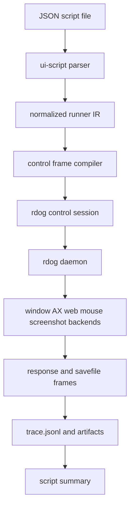
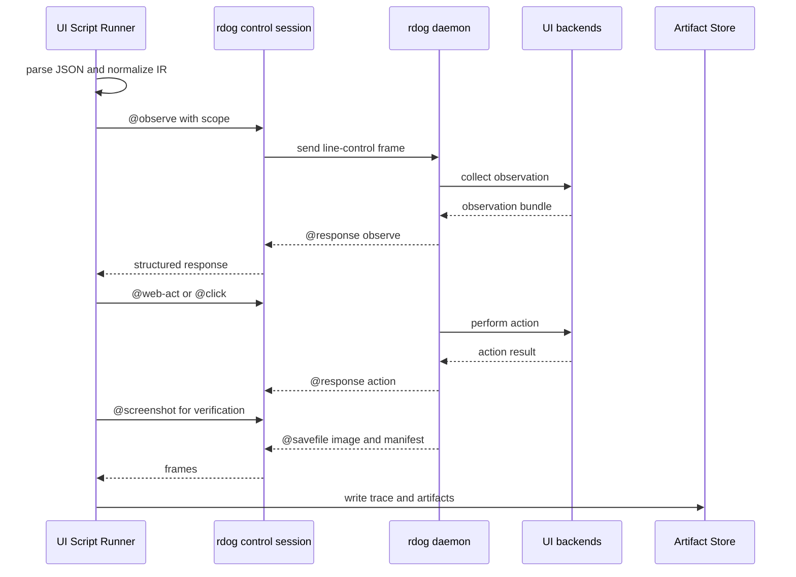

# rdog UI script control plan

## Implementation Status

Planning plus trace-capable minimum runner. 这份文档定义继续完善 `rdog` UI script runner 时应遵守的协议和验证边界。

截至 2026-06-29,仓库已经有 `src/ui_script.rs` 的 parser/compiler dry-run fixture tests。
`@window-resize` control frame 已经接入 parser / executor / macOS AX backend。
UI script dry-run 已经能把 `WindowSize mode:"resize"` 编译到 `@window-resize`。
仓库已经实现 `rdog ui-script run [TARGET] path/to/script.json` 的最小真实 runner。
它复用现有 control transport,支持 `--dry-run`、CLI target、脚本内 `Target` 和本机 local-default daemon。
runner 已经写入 run directory、`trace.jsonl`、`summary.json`、`script.normalized.json` 和 `artifacts/`。
runner 已经实现最小真实 `Expect`: `response_status`、`response_contains`、`control_status`、`window_rect`、`screenshot_exists`。
daemon-side full script `@flow` 已经作为独立协议入口落地,见 `specs/rdog-flow-control-plan.md`。
`rdog control --ui-script`、`--compat iced-emg`、完整 web/AX `Expect` 验证和 GUI-only `@ui-flow` profile 仍是规格计划,不是已落地功能。

## Goal

为 `rdog` 增加类似 iced_emg UI Script 的脚本能力。

核心目标有三点:

- 语法尽量接近 iced_emg: JSON array,每个 step 是 PascalCase single-key object。
- 执行模型适配 rdog: 脚本不是进程内 winit event 注入,而是 control frames 的编排层。
- 保留 rdog 最近已经收敛的 GUI 自动化边界: observation、selector、display scope、semantic action、mouse fallback 和 verification。

## Non-goals

- 不复用 `@script` / `@cmd` 表示 UI flow。它们已经是 shell 执行语义。
- 不在第一版新增第二套 daemon 控制协议。
- 不把 `Exit` 解释为关闭远端应用、关闭 daemon 或退出 `rdog control`。
- 不让 iced_emg 的 `WindowSize` 直接调用平台 API。真实 resize 的唯一执行路径是编译到 `@window-resize`。
- 不让坐标脚本绕过 `os-logical`、display guard、stale guard 和权限检查。
- 不让脚本成功只等价于每条 `@response` 是 ok。脚本必须支持 action 后验证。

## Existing Evidence

### iced_emg script shape

参考文件:

- `/Users/cuiluming/local_doc/l_dev/my/rust/iced_emg/ui_script/for_each_state_push_reverse_push_reverse_push3.json`
- `/Users/cuiluming/local_doc/l_dev/my/rust/iced_emg/docs/ui_script_command.md`

iced_emg 样例是 JSON array,每个 step 是单 key object:

```json
[
  { "SleepMs": 1200 },
  { "Screenshot": { "label": "for_each_state_before_prprppp" } },
  { "Move": { "x": 350.0, "y": 40.0 } },
  { "Click": { "x": 350.0, "y": 40.0, "button": "Left" } },
  { "Screenshot": { "label": "for_each_state_after_push1" } },
  { "Exit": null }
]
```

iced_emg 文档中的稳定性工具包括:

- `WindowSize`: 固定窗口 logical inner size。
- `SleepMs` / `DelayMs`: 控制回放节奏。
- `Move` / `Click` / `MouseDown` / `MouseUp`: 鼠标动作。
- `KeyDown` / `KeyUp` / `KeyPress` / `Text`: 键盘和文本输入。
- `Screenshot`: 输出截图和图结构产物。
- `Barrier`: 等待下一帧或一次自动同步点。
- `Exit`: 让 winit event loop 退出。

这些语法可以复用外形,但不能复用全部语义。iced_emg 是单进程 UI 回放,rdog 是远程桌面和系统控制面。

### rdog control facts

参考文件:

- `specs/control-line-protocol.md`
- `specs/rdog-observation-scoped-refmap-plan.md`
- `specs/rdog-computer-use-density-plan.md`
- `specs/rdog-display-scope-control-plan.md`
- `src/control_protocol.rs`
- `src/control_actions.rs`
- `src/control_core.rs`

当前事实:

- `@script` / `@cmd` 已经解析为 shell 执行请求,不能再拿来表示 UI flow。
- `@observe` 是统一只读 GUI 观察入口。
- `@screenshot` 的 manifest 和鼠标动作统一使用 `coordinate_space:"os-logical"`。
- `@window-find`、`@ax-find`、`@web-find`、`@web-act`、`@click`、`@drag`、`@wheel` 已经能接 display scope 或 guard。
- observation ref 和 selector 已经把语义定位、stale ref、semantic re-find、mouse fallback 放在同一条演进线上。
- `@savefile` 和 `ControlExecutionOutcome` 已经给截图、manifest、trace 这类外部产物提供了 frame 模型。

## Design Principles

1. UI script 是 control frames 的编排层。
   runner 负责把 JSON step 编译成现有 `@observe`、`@screenshot`、`@click`、`@key`、AX/window/web/display scope 等请求。

2. v1 先跑在 CLI 侧。
   本地 runner 读取本地 JSON,维持一条 control session,逐步发送 frames,收集响应和产物。

3. 语义动作优先。
   能用 `@web-act`、`@ax-action`、`@ax-set-value`、`@type-text`、`@window-resize` 或备用 `@window-activate` 时,不要默认退化成坐标点击。

4. 坐标必须说清楚。
   rdog 坐标统一是 `os-logical`。兼容 iced_emg 的坐标 step 时,也必须在脚本策略或 step 中明确坐标语义。

5. Verification 是脚本的一等能力。
   每个 side-effect step 都可以声明 `Expect` 或内联 `expect`,runner 需要把验证证据写入 trace。

6. 兼容入口可以宽,canonical IR 必须窄。
   parser 可以接受 iced_emg 风格别名,但内部 IR 应收敛到少量明确的动作类型和 control frame 编译规则。

## Recommended v1: CLI-side runner

推荐第一版新增 CLI 入口:

```bash
rdog ui-script run [TARGET] path/to/script.json
rdog control TARGET --ui-script path/to/script.json
```

入口语义:

- `TARGET` 可以省略;省略时走本机 local-default daemon。
- 脚本内 `Target` 可以提供 `name` 和 `namespace`。
- CLI `TARGET` 和脚本内 `Target` 同时存在时,必须一致;最小 runner 暂不支持 override。
- runner 在本机读取 JSON,解析为 IR,打开一条 `rdog control` session。
- 每个 step 编译为 0 条、1 条或多条 line-control requests。
- `SleepMs` / `DelayMs` / `Barrier` 这类 step 在 runner 本地执行。
- `Screenshot`、mouse、key、AX、window、web 动作通过现有 control frames 发给 daemon。
- 每步写 trace。截图、manifest 和其它 `@savefile` 产物落在同一个 run 目录。

推荐产物目录:

```text
rdog_script_runs/<run_id>/
  script.normalized.json
  trace.jsonl
  artifacts/
    before.jpg
    before.manifest.json
    after_click.jpg
    after_click.manifest.json
```

## Architecture





## JSON DSL

### Top-level shape

Top-level must remain an array:

```json
[
  { "Target": { "name": "self" } },
  { "Scope": { "display": { "id": "d2" } } },
  { "Observe": { "mode": "hybrid", "include_screenshot": true, "include_ax": true } },
  { "Screenshot": { "label": "before" } },
  {
    "Click": {
      "x": 350.0,
      "y": 40.0,
      "button": "Left",
      "coordinate_space": "os-logical",
      "guard": { "display": { "id": "d2" } }
    }
  },
  { "Expect": { "kind": "response_status", "status": "ok" } },
  { "Screenshot": { "label": "after_click" } },
  { "Exit": null }
]
```

每个 step 必须是 single-key object。这样可以保持 iced_emg 的视觉形态,也方便 serde enum 解析。

### Optional header steps

`Dialect` 用于声明兼容模式:

```json
{ "Dialect": { "source": "iced_emg", "coordinate_space": "os-logical" } }
```

`Target` 用于选择 rdog target:

```json
{ "Target": { "name": "self", "namespace": "lab" } }
```

`Policy` 用于脚本级安全策略:

```json
{
  "Policy": {
    "semantic_first": true,
    "coordinate_fallback": "explicit",
    "default_coordinate_space": "os-logical",
    "require_verification_after_action": true
  }
}
```

`Scope` 用于设置后续 step 的默认 observation scope 和 action guard:

```json
{ "Scope": { "display": { "name_contains": "DELL" } } }
```

`Scope` 不是即时动作。它更新 runner 的当前执行上下文,后续 `Observe`、query 和 mouse fallback 会继承它。

### Compatibility with iced_emg

直接兼容的 step 名:

- `SleepMs`
- `DelayMs`
- `Move`
- `Click`
- `MouseDown`
- `MouseUp`
- `KeyDown`
- `KeyUp`
- `KeyPress`
- `Text`
- `Screenshot`
- `Barrier`
- `Exit`

需要改语义的 step:

- `WindowSize`
  - iced_emg 中表示请求窗口 resize。
  - rdog v1 不执行 resize。
  - canonical 用法是 `WindowSize` 作为 precondition 或 metadata。
- `Exit`
  - iced_emg 中退出应用 event loop。
  - rdog 中只结束脚本执行。
- `Move` / `Click`
  - iced_emg 中是单窗口 logical px。
  - rdog 中必须收敛到 `os-logical` 桌面坐标,或走 ref / selector target。
- `Screenshot`
  - iced_emg 中产物通常是 app 内渲染截图和 graph。
  - rdog 中产物来自远端 screenshot bundle,包括 image 和 manifest。

## Step Semantics

### SleepMs / DelayMs

本地 runner sleep,不发送 control frame。

```json
{ "SleepMs": 240 }
```

### Barrier

v1 语义是等待前一 control request 完整收口。

可选增强:

```json
{ "Barrier": { "observe": true, "timeout_ms": 2000 } }
```

如果 `observe:true`,runner 发送一次只读 `@observe` 并等待完成。

### Observe

编译为 `@observe#id:{...}`。

如果当前上下文里有 `Scope`,runner 默认注入 `scope:{...}`。

```json
{ "Observe": { "mode": "hybrid", "include_screenshot": true, "include_ax": true } }
```

### Screenshot

编译为 `@screenshot#id:{...}` 或 `@observe include_screenshot:true`。

v1 推荐先直接编译为 `@screenshot`,因为截图 bundle 和 `@savefile` 行为已经稳定。

```json
{ "Screenshot": { "label": "before", "include_ax": true } }
```

runner 需要把 label 映射到产物文件名,并在 trace 里记录原始 `@savefile` 路径和复制后的 artifact 路径。

### Move

编译为 `@mouse-move#id:{...}`。

canonical:

```json
{
  "Move": {
    "x": 1200.0,
    "y": 540.0,
    "coordinate_space": "os-logical",
    "guard": { "display": { "id": "d2" } }
  }
}
```

兼容 iced_emg 时,如果 `coordinate_space` 缺失,runner 只在满足以下条件之一时接受:

- 脚本显式声明 `Dialect.coordinate_space:"os-logical"`。
- CLI 显式传入 `--coordinate-space os-logical`。
- 脚本级 `Policy.default_coordinate_space` 已设置。

否则应返回 parse error,不要猜测坐标语义。

### Click

优先支持 ref / selector target:

```json
{
  "Click": {
    "target": { "ref": "@e4", "observation_id": "obs-..." },
    "button": "Left",
    "count": 1
  }
}
```

坐标兼容写法:

```json
{
  "Click": {
    "x": 350.0,
    "y": 40.0,
    "button": "Left",
    "coordinate_space": "os-logical",
    "guard": { "display": { "id": "d2" } }
  }
}
```

编译为 `@click#id:{...}`。

runner 必须在 trace 里保留 `target_resolution.source`。如果响应是 `coordinate_fallback`,报告中也要显示,不能把它当成语义 action。

### MouseDown / MouseUp

编译为 `@mouse-button#id:{button,mode}`。

注意: `@mouse-button` 没有坐标 target,因此不支持 display guard。需要坐标约束时用 `Click`、`Drag` 或 `Move`。

### KeyPress / KeyDown / KeyUp

编译为 `@key#id:{key,mode,hold_ms}`。

```json
{ "KeyPress": { "key": "Cmd+R", "hold_ms": 80 } }
```

建议 canonical key 名沿 rdog `@key` 现有命名,不要直接照搬 winit `KeyCode` 全量枚举。

### Text

优先编译为语义文本输入:

- 有 AX target 时: `@type-text` 或 `@ax-set-value`。
- 没有 target 且用户显式允许焦点输入时: 后续可考虑 clipboard / paste。

v1 不应默认把 `Text` 转成全局键盘逐字输入。那会依赖远端当前焦点,风险比 iced_emg 进程内文本事件高得多。

推荐写法:

```json
{
  "Text": {
    "target": { "ref": "@e8", "observation_id": "obs-..." },
    "text": "hello",
    "mode": "replace"
  }
}
```

### Action

rdog-specific generic semantic action。

它用于表达 web / AX / window 这类非鼠标动作,避免脚本只能靠坐标。

```json
{
  "Action": {
    "kind": "web-act",
    "payload": {
      "target": { "window_ref": "@e1", "observation_id": "obs-..." },
      "match": { "text": "首页" },
      "action": "press",
      "verify": true
    }
  }
}
```

映射:

- `kind:"web-find"` -> `@web-find`
- `kind:"web-act"` -> `@web-act`
- `kind:"ax-action"` -> `@ax-action`
- `kind:"ax-set-value"` -> `@ax-set-value`
- `kind:"type-text"` -> `@type-text`
- `kind:"window-find"` -> `@window-find`
- `kind:"window-activate"` -> `@window-activate`

实现时可以再给常用动作增加 `WebAct`、`AxAction` 等 alias,但 IR 层建议仍收敛到 `Action`.

### ControlLine

高级 escape hatch。

```json
{ "ControlLine": "@ping#1" }
```

默认不建议普通脚本使用。runner 应在 trace 中标记 `escape_hatch:true`,并在安全模式下允许禁用。

`ControlLine` 不允许是裸 shell 行。它只能是显式 line-control request,且不能是 `@script` / `@cmd`,除非 CLI 显式传入 `--allow-shell-control-line`。

### Expect

`Expect` 用于验证前一个 step 或当前 UI 状态。

```json
{ "Expect": { "kind": "response_status", "status": "ok" } }
{ "Expect": { "kind": "web-find", "match": { "text": "首页" }, "count": 1 } }
{ "Expect": { "kind": "screenshot_changed", "from": "before", "to": "after_click" } }
```

当前最小 runner 已支持:

- `response_status`
- `response_contains`
- `control_status`
- `window_rect`
- `screenshot_exists`

仍待完整化:

- `response_field`
- `web-find`
- `ax-find`
- `window-find`

视觉 diff 可以作为后续能力。第一版不要在没有图像比较实现时声称支持 `screenshot_changed`。

### WindowSize

当前 dry-run 内核支持两种模式。

`precondition` 只记录本地检查意图:

```json
{ "WindowSize": { "width": 1200.0, "height": 800.0, "mode": "precondition" } }
```

runner 可以在下一次 `Observe` / `WindowFind` 后检查目标窗口尺寸是否接近预期。

`resize` 编译为 `@window-resize` control line:

```json
{
  "WindowSize": {
    "target": { "ref": "@e1", "observation_id": "obs-..." },
    "width": 1200.0,
    "height": 800.0,
    "mode": "resize",
    "box": "outer",
    "verify": true
  }
}
```

`mode:"resize"` 必须提供 `target`,因为 `@window-resize` 的 canonical payload 使用 `target:{...}`。
如果当前脚本上下文里已有 `Scope`,并且 `WindowSize` 自己没有写 `guard`,dry-run compiler 会把该 `Scope` 注入为 `guard`。

它应编译为:

```text
@window-resize#id:{target:{ref:"@e1",observation_id:"obs-..."},size:{width:1200,height:800,unit:"os-logical",box:"outer"},origin:"keep",verify:true}
```

`WindowSize` 的 `resize` 模式不会自行调用平台 API。
唯一执行路径是 `@window-resize`。
`@window-resize` 默认负责恢复/激活目标窗口,所以脚本里不需要在 `WindowSize` 前额外插入 `Action kind:"window-activate"`。
如果脚本只想恢复窗口但不改变大小,才使用 `window-activate` action。

### Exit

结束脚本执行,不发送 control frame。

```json
{ "Exit": null }
```

如果未来需要关闭 app,应新增明确 step,例如 `WindowClose` 或 `Action kind:"window-close"`。不要让 `Exit` 偷偷承担副作用。

## Execution Model

runner 维护一个执行上下文:

```json
{
  "target": { "name": "self", "namespace": "lab" },
  "scope": { "display": { "id": "d2" } },
  "policy": {
    "semantic_first": true,
    "coordinate_fallback": "explicit",
    "default_coordinate_space": "os-logical"
  },
  "last_observation_id": "obs-...",
  "last_response": {}
}
```

每个 step 的执行过程:

1. 解析原始 JSON step。
2. 转为 normalized IR。
3. 合并当前 `Target` / `Scope` / `Policy`。
4. 生成 control line 或本地 runner action。
5. 执行并等待收口。
6. 写入 trace。
7. 如果 step 有 `expect`,或脚本策略要求 action 后验证,执行验证。
8. 更新上下文。

错误处理:

- parse error: 脚本不执行任何远端动作。
- permission denied: 立即停止,返回 blocked,不要跳过。
- unsupported backend: 立即停止,除非 step 明确设置 `optional:true`。
- ambiguous selector: 停止,输出候选和恢复建议。
- stale ref: 可按 step policy 触发一次 re-observe / re-find,但不能静默换目标。
- action succeeded but verification failed: 脚本整体失败。

## Trace and Artifacts

`trace.jsonl` 每行一个对象:

```json
{
  "schema": "rdog.ui-script.trace-step.v1",
  "run_id": "uiscript-20260626-160251",
  "step_index": 4,
  "step_kind": "Click",
  "source": { "line": 12 },
  "control_lines": ["@click#4:{...}"],
  "started_at_unix_ms": 1782451371000,
  "finished_at_unix_ms": 1782451371240,
  "status": "complete",
  "response": {
    "kind": "mouse",
    "status": "ok",
    "target_resolution": { "source": "coordinate_fallback" }
  },
  "artifacts": []
}
```

run summary:

```json
{
  "schema": "rdog.ui-script.run.v1",
  "status": "failed",
  "step_count": 12,
  "completed_step_count": 8,
  "failed_step_index": 8,
  "backend_request_count": 7,
  "semantic_action_count": 2,
  "mouse_fallback_count": 1,
  "verification_passed": false
}
```

这些字段和 `specs/rdog-computer-use-density-plan.md` 中的 density metrics 保持同一口径,方便后续把 script run 纳入 bench。

## Safety Policy

默认策略:

- semantic action 优先。
- 坐标 fallback 必须显式。
- `coordinate_space` 必须明确为 `os-logical`,或由 `Dialect` / `Policy` 提供默认。
- 如果存在 display scope,mouse action 自动继承 `guard:{display:{...}}`。
- `WindowSize mode:"precondition"` 不执行 resize。
- `WindowSize mode:"resize"` 编译到 `@window-resize`,由 control plane 执行真实 resize。
- `Text` 不默认全局逐字输入。
- `ControlLine` 不允许 shell 请求。
- 权限错误是 hard blocker。
- action 后验证失败会让脚本失败。

推荐 CLI flags:

```bash
rdog ui-script run self script.json
rdog ui-script run self script.json --dry-run
rdog ui-script run self script.json --compat iced-emg
rdog ui-script run self script.json --allow-coordinate-fallback
rdog ui-script run self script.json --allow-control-line
rdog ui-script run self script.json --trace-dir rdog_script_runs/demo
```

`--dry-run` 必须输出 normalized IR 和将要发送的 control lines,不连接 daemon,不执行动作。

## Relation to daemon-side `@flow`

daemon-side full script runtime 已经使用 `@flow` 作为主入口,见 `specs/rdog-flow-control-plan.md`。

`@flow` 可以包含 shell、control、expect、artifact 和 trace。
它运行在 daemon 所在机器。
它的 cwd、env 和文件路径都是 daemon-local。

UI script runner 仍然是 controller-side orchestration。
它读取 controller 本机 JSON 文件,再通过 rdog control transport 驱动 target daemon。

## Future daemon-side `@ui-flow`

后续可以新增 daemon-side GUI-only profile:

```text
@ui-flow#9:{schema:"rdog.ui-flow.v1",steps:[...]}
```

但它必须满足这些条件:

- 复用同一套 JSON parser / IR / validation。
- 不复用 `@script` / `@cmd` 命名。
- 不绕过 line-control response 和 `@savefile` frame。
- 不把 shell 执行能力混入 UI flow。
- 不替代 `@flow` 的 full script runtime 语义。
- v1 CLI runner 已经用 fixture tests 和 live smoke 证明模型稳定后再做。

daemon-side `@ui-flow` 的价值是减少高延迟链路上的 request round-trip。
它不是 full script runtime 的主入口。

## Implementation Phases

### Phase 0: 规格与 fixtures

- 落地本文档。
- 准备最小 fixture:
  - iced-compatible `SleepMs/Move/Click/Screenshot/Exit`。
  - rdog-specific `Target/Scope/Observe/Expect`。
  - negative `WindowSize` resize。
  - negative missing coordinate space。

### Phase 1: parser and normalized IR

- 新增 parser 模块。
- JSON array + single-key object 解析。
- PascalCase aliases 收敛到 IR。
- `--dry-run` 输出 normalized IR。
- 单测覆盖兼容语法和 negative cases。

### Phase 2: frame compiler

- 将 IR 编译为 control lines。
- 先用 fake transport 测试,不连真实 daemon。
- 验证 `Scope` 注入、request id 生成、artifact labels 和 `Expect` 编排。

### Phase 3: CLI runner and artifacts

- `rdog ui-script run` 最小 runner 已落地。
- `rdog control --ui-script` 仍未接入。
- 真实 control session 已可发送编译出的 line-control requests。
- 已写 `trace.jsonl`、`summary.json`、`script.normalized.json` 和 `artifacts/`。
- 已实现最小真实 `Expect`。
- 已支持 `--dry-run`。
- 已支持 `--trace-dir`。
- `--compat iced-emg` 仍待实现。

### Phase 4: focused live smoke

- 本机 `self` target 跑 read-only 脚本。
- 跑一个安全 mouse fallback smoke,只操作明确 guard 的无破坏位置。
- 跑一个 semantic action smoke,优先使用 local fixture app 或可控网页,不依赖公开网站。

### Phase 5: optional daemon-side `@ui-flow`

- 在 CLI-side runner 稳定后再评估。
- 用同一 IR 下沉到 daemon。
- 只优化 round-trip,不改变脚本语义。

## Acceptance Criteria

- parser 接受 JSON array + PascalCase single-key object。
- parser 接受 iced-compatible `SleepMs/Move/Click/Screenshot/Exit`。
- parser 接受 rdog-specific `Target/Scope/Observe/Expect/Policy/Dialect`。
- parser 拒绝多 key step。
- parser 拒绝未知 step,除非启用显式 experimental allowlist。
- `Move` / `Click` 缺少 `coordinate_space` 时,只有在 `Dialect`、`Policy` 或 CLI 提供默认坐标语义时才接受。
- `WindowSize` 缺少 `mode:"precondition"` 时明确失败。
- `Exit` 只结束 runner,不发 `@cmd`、不关 app、不关 daemon。
- `ControlLine` 默认只能发送显式 line-control request,不能发送裸 shell 行。
- `ControlLine @script` / `@cmd` 默认被拒绝。
- `Scope.display` 能自动注入 `@observe` payload 和 mouse guard。
- `Screenshot.label` 能稳定映射到 artifact 文件。
- action step 能记录 `backend_request_count`、`semantic_action_count`、`mouse_fallback_count`。
- 最小 `Expect` 验证失败时脚本整体失败。
- `--dry-run` 不连接 daemon,但能输出 normalized IR 和 control lines。
- Mermaid 图通过 `beautiful-mermaid-rs` 验证。

## Verification Plan

文档阶段:

```bash
beautiful-mermaid-rs --ascii < /tmp/rdog-ui-script-flow.mmd
beautiful-mermaid-rs --ascii < /tmp/rdog-ui-script-sequence.mmd
git diff --check
```

实现阶段建议测试:

```bash
cargo test --package rustdog --bin rdog -- ui_script::parser::tests
cargo test --package rustdog --bin rdog -- ui_script::compiler::tests
cargo test --package rustdog --bin rdog -- ui_script::runner::tests
cargo test --package rustdog --test zenoh_unixpipe_fast_path -- --test-threads=1
cargo fmt -- --check
git diff --check
```

如果新增 Markdown Mermaid 图,必须从 stdin 传给 `beautiful-mermaid-rs`。不要把 markdown 文件路径直接当参数传给 CLI。

## Risks and Mitigations

### Risk 1: UI script 变成第二套控制协议

缓解:

- v1 只做 CLI-side runner。
- 所有 side-effect 都编译成现有 line-control frames。
- daemon-side `@ui-flow` 必须复用同一 IR。

### Risk 2: 坐标兼容让脚本绕开 semantic model

缓解:

- 默认 semantic action 优先。
- 坐标必须明确 `os-logical`。
- display scope 自动转成 mouse guard。
- trace 必须暴露 `coordinate_fallback`。

### Risk 3: `Exit` 语义误读造成 destructive side effect

缓解:

- 文档和 parser 都明确 `Exit` 只结束 runner。
- 关闭窗口必须使用明确的 `Action kind:"window-close"` 或未来专门 step。

### Risk 4: `WindowSize` 被误当 resize

缓解:

- v1 只接受 `mode:"precondition"`。
- 真正 resize 需要先新增 window resize control 协议。

### Risk 5: `ControlLine` escape hatch 滥用 shell

缓解:

- 默认拒绝裸 shell 行、`@script` 和 `@cmd`。
- 只有显式 CLI flag 才允许。
- trace 标记 `escape_hatch:true`。

## ADR

### Decision

第一版采用 CLI-side UI script runner。

脚本外形保留 iced_emg 的 JSON array + PascalCase single-key object。
内部语义收敛到 rdog control frame 编排。
未来可以新增 daemon-side `@ui-flow`,但不能复用 `@script` / `@cmd`。

### Drivers

- 用户已有 iced_emg UI Script 样例,迁移成本应低。
- rdog 已经有较完整的 line-control、observation、display scope、mouse、AX、window、web 能力。
- 第一版最需要验证的是 DSL 到 control frames 的编译规则,不是 daemon 执行引擎。
- `@script` / `@cmd` 的 shell 语义已经稳定,不能重载。

### Alternatives considered

- 直接新增 daemon-side `@script` UI mode: 拒绝。会和 shell 脚本语义冲突。
- 直接新增 daemon-side `@ui-flow` v1: 延后。容易过早扩大控制协议和 transport 测试矩阵。
- 只支持坐标回放: 拒绝。会绕开 rdog 的 observation、selector 和 semantic action。
- 完全不兼容 iced_emg 外形: 拒绝。用户已有脚本和文档,没有必要让迁移成本变高。

### Consequences

- 需要新增 parser / IR / compiler / runner 几层,但每层职责清楚。
- CLI runner 能先用 fake transport 和 dry-run 做大部分测试。
- 实现前必须补 fixture tests,避免把 DSL 行为和 live GUI 状态绑死。
- 后续如果做 `@ui-flow`,必须保证 CLI-side 和 daemon-side 共用同一套 IR。

### Follow-ups

- 后续补完整 web/AX/window find `Expect`,并让验证失败报告包含更细的候选恢复建议。
- 将 UI script runner 的 trace metrics 和 `@gui-bench` density metrics 对齐,方便后续 benchmark。
