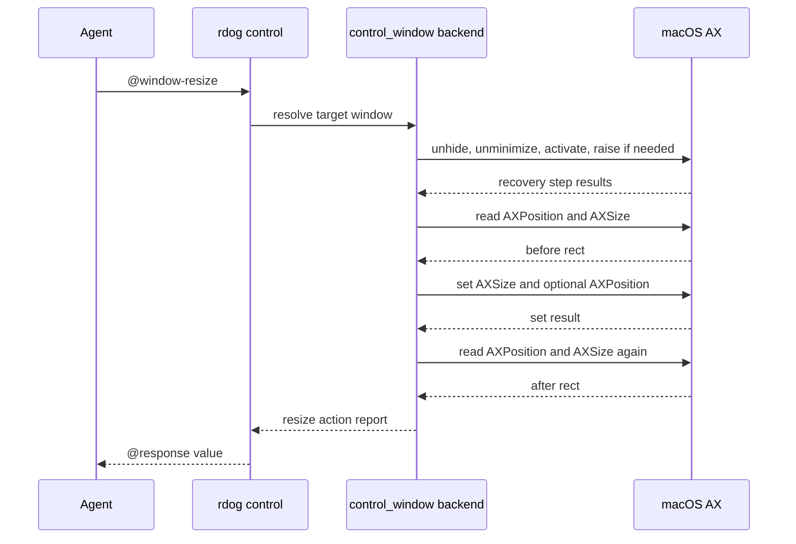
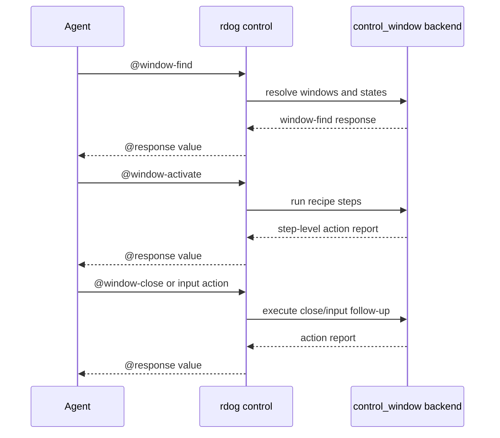

# rdog Window Control Plan

## Goal

让 agent 在截图看不到目标窗口时,仍然能先发现窗口状态,再显式决定是否激活、交互或关闭。

当前 agent-facing 主协议是:

```text
@window-find -> @click / @key / @ax-press / @window-close
@window-find -> @window-resize -> @click / @key / @ax-press / @window-close
```

普通 `@click` / `@key` 在 Phase 1 不得隐式切桌面、unhide app 或 raise window。
需要固定窗口尺寸时,`@window-resize` 默认负责恢复/激活目标窗口,再调整尺寸并验证。
这样 agent 不需要先显式发送 `@window-activate`。

`WindowSize` 属于 UI script 的下一段接入能力。
它应编译到显式 `@window-resize`,不要直接绕开 control plane。
不要让 UI script 直接绕开 window control backend。

## Scope

当前包含 4 个控制命令:

- `@window-find`
- `@window-activate`
- `@window-close`
- `@window-resize`

Phase 1 平台边界:

- macOS: 完整实现
- Windows/Linux: 返回显式 `unsupported` 或 `limited`

Phase 1 状态边界:

- 支持被遮挡窗口
- 支持最小化窗口
- 支持 hidden app 窗口
- schema 中保留 current-space / fullscreen-space 语义
- 当跨 Space / fullscreen automation 无法可靠证明时,必须诚实返回 `limited`

## Protocol

### `@window-find`

查询字段支持:

- `app`
- `app_contains`
- `bundle_id`
- `pid`
- `title`
- `title_contains`

返回要点:

- `kind:"window-find"`
- `schema:"rdog.window.v1"`
- `snapshot_id`
- `observed_at_unix_ms`
- `matches[]`
- `matches[].state`
- `matches[].recipes`

窗口 id 形态:

```text
pid:<pid>/window:<index>
```

这是 short-lived locator,不能当成长久主键。

### `@window-activate`

备用的显式窗口恢复命令。

当 agent 只想恢复/激活窗口,但不需要 resize 时,使用 `@window-activate`。
当 agent 要固定窗口尺寸时,直接用 `@window-resize`。
`@window-resize` 默认内置同一套恢复步骤,因为 resize 后通常马上要在该窗口内工作。

普通 `@click` / `@key` 仍然不允许隐式改变桌面状态。

默认 recipe:

- `unhide_app`
- `unminimize_window`
- `activate_app`
- `raise_window`
- `switch_to_window_space`

返回 `window-action` step report,用于告诉 agent:

- 实际执行了哪些步骤
- 哪一步失败
- 当前是 `ok` 还是 `limited`

### `@window-close`

默认策略是温和关闭:

```text
@window-close:{window_id:"pid:123/window:0"}
```

显式升级策略:

```text
@window-close:{window_id:"pid:123/window:0",strategy:"terminate"}
@window-close:{window_id:"pid:123/window:0",strategy:"kill"}
```

约束:

- `terminate` / `kill` 必须显式指定
- `terminate` / `kill` 不允许基于歧义 query 自动挑一个窗口
- graceful close 可在显式 `allow_ambiguous:true` + `select` 时使用 query 目标

### `@window-resize`

显式调整一个窗口的外框尺寸。

推荐 canonical payload:

```text
@window-resize#7:{target:{ref:"@e1",observation_id:"obs-..."},size:{width:1200,height:800,unit:"os-logical",box:"outer"},origin:"keep",verify:true}
@window-resize#8:{target:{window_id:"pid:123/window:0"},size:{width:1200,height:800,unit:"os-logical",box:"outer"},origin:{x:100,y:100},verify:true}
@window-resize#9:{target:{query:{app_contains:"Chrome",title_contains:"Docs"}},size:{width:1200,height:800,unit:"os-logical",box:"outer"},origin:"keep",verify:true}
@window-resize#10:{target:{window_id:"pid:123/window:0"},size:{width:1200,height:800,unit:"os-logical",box:"outer"},origin:"keep",guard:{display:{id:"d2"}},verify:{tolerance_px:2}}
```

字段语义:

- `target`: 统一目标入口。支持 `target:{window_id:"..."}`、`target:{ref:"...",observation_id:"..."}` 和 `target:{query:{...}}`。
- `target.query`: 必须唯一命中。多命中默认失败为 `WINDOW_AMBIGUOUS`,不自动选第一个。
- `size.width` / `size.height`: 必填,正整数 logical px。
- `size.unit`: 第一版只支持 `"os-logical"`。
- `size.box`: 第一版只支持 `"outer"`。这是 OS window frame,不是 app content inner size。
- `origin`: 默认 `"keep"`。也可传 `{x,y}` 同时移动窗口左上角。
- `guard.display`: 可选。只有请求显式带 display guard 时,才要求 `after_rect` 满足该 display guard。
- `verify`: 默认 `true`。执行后必须重新读取窗口 rect,确认尺寸落入容差。
- `verify.tolerance_px`: 默认 `2` logical px。`verify:true` 等价于 `{tolerance_px:2}`。

默认恢复/激活语义:

- 请求里不需要写 `activate:true`。
- `@window-resize` 默认允许执行 `unhide_app`、`unminimize_window`、`activate_app`、`raise_window` 和必要的 `switch_to_window_space`。
- 这些恢复步骤必须写入 `steps[]`,让 trace 清楚说明 resize 前实际改变了什么。
- 如果恢复步骤失败或平台只能给出 `limited`,则 resize 不应假成功,而应返回 blocked / limited report。
- 如果未来需要"不激活只尝试 resize",再单独设计显式 opt-out 字段,不要让默认路径变复杂。

错误边界:

- 找不到目标: `WINDOW_NOT_FOUND`。
- query 命中多个窗口: `WINDOW_AMBIGUOUS`。
- 平台不支持: `WINDOW_RESIZE_UNSUPPORTED`。
- 权限不足: code `77` / `WINDOW_RESIZE_PERMISSION_DENIED`。
- AX / 平台后端可读窗口尺寸但不能写入: `WINDOW_RESIZE_NOT_SETTABLE`。
- 恢复/激活步骤失败或状态受限: `WINDOW_RESIZE_RECOVERY_FAILED`。
- app / system 接受请求但把尺寸 clamp 到自身约束: `WINDOW_RESIZE_CLAMPED`。
- 显式 `guard.display` 不满足: `WINDOW_RESIZE_GUARD_FAILED`。
- 后验 rect 不匹配: `WINDOW_RESIZE_VERIFY_FAILED`。

后验验证语义:

- 请求 `1200x800`,实际 `1199x802`,在默认 `2` logical px 容差内,返回 `verify.status:"ok_with_delta"`。
- 精确命中时返回 `verify.status:"ok"`。
- 如果 app 最小尺寸、Dock、屏幕边界或系统约束导致尺寸被 clamp,返回 `WINDOW_RESIZE_CLAMPED`,并在 report 里给出 `requested_size`、`after_rect`、`delta` 和 `clamp_reason`。
- 如果尺寸偏差超过容差,且没有可识别的 clamp 证据,返回 `WINDOW_RESIZE_VERIFY_FAILED`。
- 默认允许 resize 后窗口跨 display。只有显式传入 `guard:{display:{...}}` 时,才检查 `after_rect` 是否仍满足 display guard。

响应仍复用 `window-action` report,但 `action:"resize"`。
report 至少包含:

- `window_id`
- `before_rect`
- `requested_rect` 或 `requested_size`
- `after_rect`
- `delta`
- `verify.status`
- `verify.tolerance_px`
- `steps[]`

macOS 后端建议:

- 先复用现有 window target resolver 找到 AXWindow。
- 默认执行窗口恢复 recipe,并把每一步写入 report。
- 读取当前 `kAXPositionAttribute` / `kAXSizeAttribute`。
- 写入前检查 size / position attribute 是否可写。可读但不可写时返回 `WINDOW_RESIZE_NOT_SETTABLE`。
- 设置 `kAXSizeAttribute`;如果提供 `origin:{x,y}`,再设置 `kAXPositionAttribute`。
- 写入使用 `AXUIElementSetAttributeValue`。
- 这些 API 来自 Apple ApplicationServices Accessibility。Apple 文档说明 `kAXSizeAttribute` 表示 accessibility object 的尺寸,`kAXPositionAttribute` 表示左上角全局屏幕坐标,`AXUIElementSetAttributeValue` 用于设置 attribute value。

参考:

- <https://developer.apple.com/documentation/applicationservices/kaxsizeattribute>
- <https://developer.apple.com/documentation/applicationservices/kaxpositionattribute>
- <https://developer.apple.com/documentation/applicationservices/1460434-axuielementsetattributevalue>

## Window State Semantics

`matches[].state` 当前包含:

- `occluded`
- `minimized`
- `app_hidden`
- `current_space`
- `fullscreen_space`
- `interactable`
- `confidence`

`interactable` 的 Phase 1 含义:

- 只有窗口未 hidden
- 未 minimized
- 在当前 Space
- 且未被判定为 occluded

才视为 `true`。

## Agent Decision Recipe

```mermaid
flowchart TD
    Start[Need to operate a window] --> Find[@window-find]
    Find --> Decision{Window directly interactable?}
    Decision -->|Yes| Act[@click / @key / @ax-press / @window-close]
    Decision -->|No| Activate[@window-activate]
    Activate --> Recheck[@window-find]
    Recheck --> Limit{status ok?}
    Limit -->|Yes| Act
    Limit -->|No| Report[Report limited status or request user decision]
```

## Resize Decision Recipe

```mermaid
flowchart TD
    Start[Need fixed window size] --> Find[@window-find]
    Find --> Unique{Unique target}
    Unique -->|No| Block[Return blocked]
    Unique -->|Yes| Resize[@window-resize]
    Resize --> Recover[Internal recover and activate]
    Recover --> Verify[@window-find verify rect]
    Verify --> Done[Return resize report]
```





## macOS Backend Notes

macOS Phase 1 依赖:

- Accessibility APIs 读取 `AXWindows`、`AXMinimized`、`AXCloseButton` 等属性
- JXA / `osascript -l JavaScript` 做 app activate / unhide
- `kill -TERM` / `kill -KILL` 做显式强制关闭

权限语义:

- 没有 Accessibility 权限时,返回 code `77`
- 这是第一等错误,不能假成功

## Skill Guidance

`rdog-control` skill 需要教 agent 优先使用:

1. `@window-find` 发现窗口
2. 如果需要固定窗口尺寸,直接用 `@window-resize`;它默认恢复/激活目标窗口
3. 如果只需要恢复窗口但不 resize,再使用备用 `@window-activate`
4. 再执行 `@click` / `@key` / `@ax-press`
5. 默认 `@window-close` 使用 graceful
6. 只有用户明确要求时才使用 `strategy:"terminate"` 或 `strategy:"kill"`

## Verification

静态验证:

```bash
cargo fmt -- --check
cargo test --package rustdog --bin rdog -- control_protocol::tests --nocapture
cargo test --package rustdog --bin rdog -- control_window::tests --nocapture
cargo test --package rustdog --bin rdog -- control_actions::tests --nocapture
cargo test --package rustdog --bin rdog -- control_core::tests --nocapture
cargo test --package rustdog --test control_window_e2e --no-run
cargo test --tests --no-run
cargo build --package rustdog --bin rdog
git diff --check
```

resize 增量测试:

```bash
cargo test --package rustdog --bin rdog -- control_protocol::tests::parse_should_support_window_resize --exact
cargo test --package rustdog --bin rdog -- control_window::tests::parse_window_resize_should_accept_size_and_target --exact
cargo test --package rustdog --bin rdog -- control_window::tests::parse_window_resize_should_accept_guard_and_verify_tolerance --exact
cargo test --package rustdog --bin rdog -- control_window::tests::window_resize_verify_should_accept_ok_with_delta --exact
cargo test --package rustdog --bin rdog -- control_window::tests::window_resize_should_report_ambiguous_query --exact
cargo test --package rustdog --bin rdog -- control_window::tests::window_resize_should_report_not_settable --exact
cargo test --package rustdog --bin rdog -- control_window::tests::window_resize_should_report_clamped_size --exact
cargo test --package rustdog --bin rdog -- control_window::tests::window_resize_should_report_display_guard_failure --exact
cargo test --package rustdog --test control_window_e2e -- window_resize --ignored --nocapture
```

live ignored E2E:

```bash
RDOG_LIVE_WINDOW_E2E=1 \
RDOG_LIVE_WINDOW_E2E_VIA_TERMINAL=1 \
RDOG_LIVE_WINDOW_E2E_BINARY=/Users/cuiluming/.cargo/bin/rdog \
cargo test --package rustdog --test control_window_e2e -- --ignored --nocapture
```

live E2E 必须证明:

1. `@window-find` 能看见 hidden / minimized / occluded 的真实窗口
2. `@window-resize` 默认执行恢复/激活步骤,并返回 step-level resize report
3. resize 后二次观察能证明窗口恢复为 interactable 且 rect 接近请求尺寸,或返回显式 `limited`
4. 备用 `@window-activate` 仍可单独返回 step-level report,用于只恢复窗口但不改尺寸的场景
5. 至少有一个真实 follow-up action 成功,例如 graceful `@window-close`
