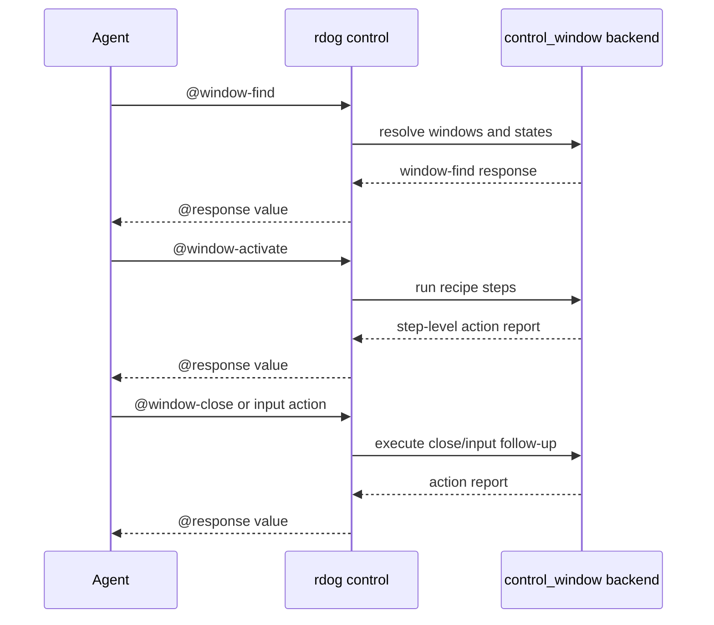

# rdog Window Control Plan

## Goal

让 agent 在截图看不到目标窗口时,仍然能先发现窗口状态,再显式决定是否激活、交互或关闭。

Phase 1 的 agent-facing 主协议是:

```text
@window-find -> @window-activate -> @click / @key / @ax-press / @window-close
```

普通 `@click` / `@key` 在 Phase 1 不得隐式切桌面、unhide app 或 raise window。

## Scope

新增 3 个控制命令:

- `@window-find`
- `@window-activate`
- `@window-close`

Phase 1 平台边界:

- macOS: 完整实现
- Windows/Linux: 返回显式 `unsupported` 或 `limited`

Phase 1 状态边界:

- 支持被遮挡窗口
- 支持最小化窗口
- 支持 hidden app 窗口
- schema 中保留 current-space / fullscreen-space 语义
- 当跨 Space / fullscreen automation 无法可靠证明时,必须诚实返回 `limited`

## Protocol

### `@window-find`

查询字段支持:

- `app`
- `app_contains`
- `bundle_id`
- `pid`
- `title`
- `title_contains`

返回要点:

- `kind:"window-find"`
- `schema:"rdog.window.v1"`
- `snapshot_id`
- `observed_at_unix_ms`
- `matches[]`
- `matches[].state`
- `matches[].recipes`

窗口 id 形态:

```text
pid:<pid>/window:<index>
```

这是 short-lived locator,不能当成长久主键。

### `@window-activate`

只在显式调用时才允许改变桌面状态。

默认 recipe:

- `unhide_app`
- `unminimize_window`
- `activate_app`
- `raise_window`
- `switch_to_window_space`

返回 `window-action` step report,用于告诉 agent:

- 实际执行了哪些步骤
- 哪一步失败
- 当前是 `ok` 还是 `limited`

### `@window-close`

默认策略是温和关闭:

```text
@window-close:{window_id:"pid:123/window:0"}
```

显式升级策略:

```text
@window-close:{window_id:"pid:123/window:0",strategy:"terminate"}
@window-close:{window_id:"pid:123/window:0",strategy:"kill"}
```

约束:

- `terminate` / `kill` 必须显式指定
- `terminate` / `kill` 不允许基于歧义 query 自动挑一个窗口
- graceful close 可在显式 `allow_ambiguous:true` + `select` 时使用 query 目标

## Window State Semantics

`matches[].state` 当前包含:

- `occluded`
- `minimized`
- `app_hidden`
- `current_space`
- `fullscreen_space`
- `interactable`
- `confidence`

`interactable` 的 Phase 1 含义:

- 只有窗口未 hidden
- 未 minimized
- 在当前 Space
- 且未被判定为 occluded

才视为 `true`。

## Agent Decision Recipe

```mermaid
flowchart TD
    Start[Need to operate a window] --> Find[@window-find]
    Find --> Decision{Window directly interactable?}
    Decision -->|Yes| Act[@click / @key / @ax-press / @window-close]
    Decision -->|No| Activate[@window-activate]
    Activate --> Recheck[@window-find]
    Recheck --> Limit{status ok?}
    Limit -->|Yes| Act
    Limit -->|No| Report[Report limited status or request user decision]
```



## macOS Backend Notes

macOS Phase 1 依赖:

- Accessibility APIs 读取 `AXWindows`、`AXMinimized`、`AXCloseButton` 等属性
- JXA / `osascript -l JavaScript` 做 app activate / unhide
- `kill -TERM` / `kill -KILL` 做显式强制关闭

权限语义:

- 没有 Accessibility 权限时,返回 code `77`
- 这是第一等错误,不能假成功

## Skill Guidance

`rdog-control` skill 需要教 agent 优先使用:

1. `@window-find` 发现窗口
2. `@window-activate` 显式恢复窗口
3. 再执行 `@click` / `@key` / `@ax-press`
4. 默认 `@window-close` 使用 graceful
5. 只有用户明确要求时才使用 `strategy:"terminate"` 或 `strategy:"kill"`

## Verification

静态验证:

```bash
cargo fmt -- --check
cargo test --package rustdog --bin rdog -- control_protocol::tests --nocapture
cargo test --package rustdog --bin rdog -- control_window::tests --nocapture
cargo test --package rustdog --bin rdog -- control_actions::tests --nocapture
cargo test --package rustdog --bin rdog -- control_core::tests --nocapture
cargo test --package rustdog --test control_window_e2e --no-run
cargo test --tests --no-run
cargo build --package rustdog --bin rdog
git diff --check
```

live ignored E2E:

```bash
RDOG_LIVE_WINDOW_E2E=1 \
RDOG_LIVE_WINDOW_E2E_VIA_TERMINAL=1 \
RDOG_LIVE_WINDOW_E2E_BINARY=/Users/cuiluming/.cargo/bin/rdog \
cargo test --package rustdog --test control_window_e2e -- --ignored --nocapture
```

live E2E 必须证明:

1. `@window-find` 能看见 hidden / minimized / occluded 的真实窗口
2. `@window-activate` 返回 step-level report
3. 激活后二次观察能证明窗口恢复为 interactable,或返回显式 `limited`
4. 至少有一个真实 follow-up action 成功,例如 graceful `@window-close`
