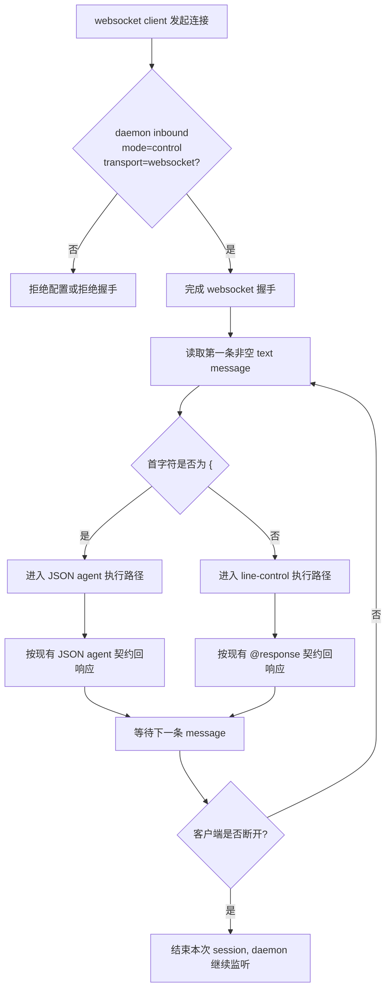
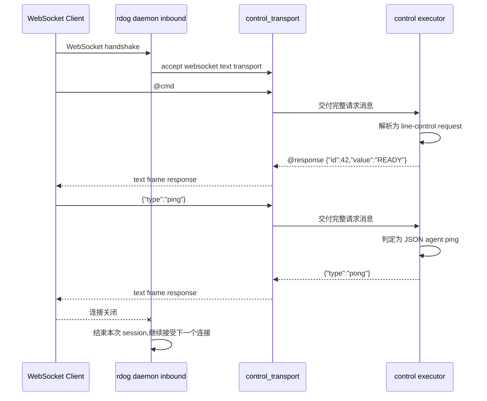

# WebSocket Control Phase 1 规划草案

## 目标

这份草案只描述 phase 1 的落地边界:

- 支持 websocket client 连接 `daemon inbound mode = "control"`
- 保持现有 `line-control` 与 JSON agent 协议语义不变
- 不在 phase 1 扩到 `interactive` / PTY shell
- 不在 phase 1 扩到 `daemon outbound websocket`

## 关键约束

- websocket 只是一种 transport,不是新协议
- `transport = "websocket"` 只允许和 `mode = "control"` 组合
- phase 1 只接受 websocket text message
- 第一条非空 text message 决定会话模式:
  - 以 `{` 开头 -> JSON agent
  - 其他 -> line-control
- line-control 下,一帧只承载一条完整请求

## Flowchart

## Sequence Diagram

## 文件级实施顺序

1. `src/input.rs`
   - 为 `rdog control` 增加 `--url` 入口
   - 让 `--url` 与现有 `host port` 互斥
2. `src/main.rs`
   - 路由新的 `control --url` 入口
3. `src/config.rs`
   - 给 `InboundConfig` 增加 `transport`
   - 校验 `interactive + websocket` 为非法组合
4. `src/control_transport.rs`
   - 收口 TCP 按行消息与 websocket text frame 消息
5. `src/shell.rs`
   - control sender / receiver 改为基于消息 transport
6. `src/daemon.rs`
   - 在 inbound control 路径接入 websocket 握手
7. `tests/control_websocket.rs`
   - 补 phase 1 websocket 回归
8. `README.md` / `cmd.md`
   - 明确 phase 1 的边界与用法

## 验收口径

- `daemon inbound mode=control transport=websocket` 可成功握手
- `@ping` 返回 `@response "pong"`
- `@cmd#42:"printf READY"` 返回带同一 `id` 的成功响应
- JSON agent `{"type":"ping"}` 返回 `{"type":"pong"}`
- TCP control 现有测试不回归
- 非法组合、binary frame、异常断开都有明确失败或恢复测试
