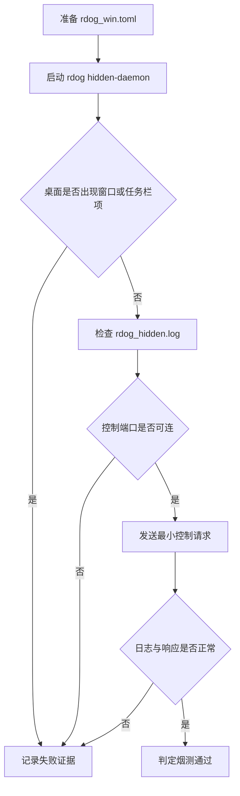
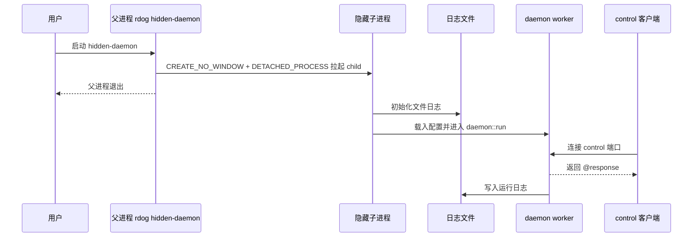

# Windows Hidden Daemon 烟测手册

## 目标

这份手册用于在真实 Windows 10 桌面环境验证 `rdog hidden-daemon` 是否真正满足下面 5 条要求:

- 主进程不显示普通控制台窗口
- 不以普通前台窗口形式出现在任务栏
- 子 shell 不弹窗
- 隐藏常驻后日志文件持续写入
- 控制端口可连, 基本控制链路可用

## 适用前提

- 真实 Windows 10 桌面环境
- 已有可执行的 `rdog.exe`
- 当前目录有 `rdog_win.toml`
- `rdog_win.toml` 里至少启用了一个端点
- 如果要验证控制链路, `inbound.mode = "control"`

## 推荐最小配置

```toml
[hidden]
log_file = "rdog_hidden.log"

[daemon]
retry_seconds = 3

[outbound]
enabled = false

[inbound]
enabled = true
host = "127.0.0.1"
port = 5555
shell = "powershell.exe"
mode = "control"
```

## 验证流程图



## 启动时序图



## Mermaid 验证说明

- 本文件里的两个 Mermaid 图需要通过 `beautiful-mermaid-rs` 校验。
- 校验命令见本页最底部的“维护命令”。

## 实际执行步骤

### 1. 清理旧日志与旧进程

在 PowerShell 里先做一次现场清理:

```powershell
Remove-Item .\rdog_hidden.log -ErrorAction SilentlyContinue
Get-Process rdog -ErrorAction SilentlyContinue | Stop-Process -Force
```

### 2. 启动隐藏常驻模式

```powershell
.\rdog.exe hidden-daemon --config .\rdog_win.toml
```

### 3. 第一观察点: 桌面可见性

启动后立即观察下面 3 件事:

- 有没有新的普通控制台窗口弹出
- 任务栏里有没有 `rdog` 的普通前台窗口项
- `powershell.exe` / `cmd.exe` 有没有肉眼可见窗口

### 4. 第二观察点: 进程是否仍在后台常驻

```powershell
Get-Process rdog -ErrorAction Stop
```

通过标准:

- 命令能找到 `rdog` 进程
- 进程不是启动后瞬间消失

### 5. 第三观察点: 日志是否持续写入

```powershell
Get-Content .\rdog_hidden.log -Tail 30
```

如果要持续观察:

```powershell
Get-Content .\rdog_hidden.log -Wait
```

通过标准:

- 文件存在
- 能看到启动日志
- 能看到 inbound / outbound worker 相关日志

### 6. 第四观察点: 控制端口是否可连

如果 `inbound.mode = "control"`, 在另一个终端运行:

```powershell
.\rdog.exe control 127.0.0.1 5555
```

然后输入:

```text
@ping
@cmd:"echo READY"
```

通过标准:

- `@ping` 返回 `@response "pong"` 或等价成功对象
- `@cmd:"echo READY"` 返回带 `READY` 的成功响应
- 日志文件里能看到对应连接或执行痕迹

### 7. 结束清理

```powershell
Get-Process rdog -ErrorAction SilentlyContinue | Stop-Process -Force
```

## 证据采集矩阵

| 观察项 | 预期 | 证据类型 |
| --- | --- | --- |
| 主进程窗口 | 不出现 | 屏幕观察 / 截图 |
| 任务栏项 | 不出现普通前台窗口项 | 屏幕观察 / 截图 |
| 子 shell 窗口 | 不出现 | 屏幕观察 / 截图 |
| 后台常驻 | 进程仍在 | `Get-Process` 输出 |
| 日志写入 | 文件持续追加 | `Get-Content` 输出 |
| 控制端口 | 可连可回响应 | `rdog control` 终端输出 |

## 失败分流

### 现象 1: 有瞬时闪窗

优先记录:

- 是主进程窗口闪一下, 还是 `powershell.exe` / `cmd.exe` 窗口闪一下
- 是否只在第一次启动时出现
- 日志文件有没有正常生成

### 现象 2: 没窗口, 但日志也没有

优先排查:

- `[hidden].log_file` 路径是否可写
- 父进程是否成功拉起 child
- hidden child 的 `--log-file` 是否与配置一致

### 现象 3: 常驻了, 但控制端口不可连

优先排查:

- `inbound.enabled`
- `inbound.host`
- `inbound.port`
- `inbound.mode`
- 日志中是否出现 bind 失败或 accept 失败

## 通过标准

只有同时满足下面 5 条, 才算这轮 Windows 10 烟测通过:

1. 主进程无可见窗口
2. 任务栏无普通前台窗口项
3. 子 shell 无可见窗口
4. `rdog_hidden.log` 可持续写入
5. `rdog control 127.0.0.1 5555` 可连并能完成最小请求

## 维护命令

### Mermaid 校验: flowchart

```bash
printf 'flowchart TD
    A[准备 rdog_win.toml] --> B[启动 rdog hidden-daemon]
    B --> C{桌面是否出现窗口或任务栏项}
    C -->|是| F[记录失败证据]
    C -->|否| D[检查 rdog_hidden.log]
    D --> E{控制端口是否可连}
    E -->|否| F
    E -->|是| G[发送最小控制请求]
    G --> H{日志与响应是否正常}
    H -->|否| F
    H -->|是| I[判定烟测通过]' | beautiful-mermaid-rs --ascii
```

### Mermaid 校验: sequenceDiagram

```bash
printf 'sequenceDiagram
    participant U as 用户
    participant P as 父进程 rdog hidden-daemon
    participant C as 隐藏子进程
    participant L as 日志文件
    participant D as daemon worker
    participant T as control 客户端

    U->>P: 启动 hidden-daemon
    P->>C: CREATE_NO_WINDOW + DETACHED_PROCESS 拉起 child
    P-->>U: 父进程退出
    C->>L: 初始化文件日志
    C->>D: 载入配置并进入 daemon::run
    T->>D: 连接 control 端口
    D-->>T: 返回 @response
    D->>L: 写入运行日志' | beautiful-mermaid-rs --ascii
```
