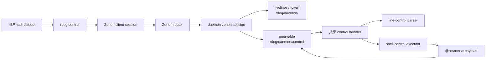
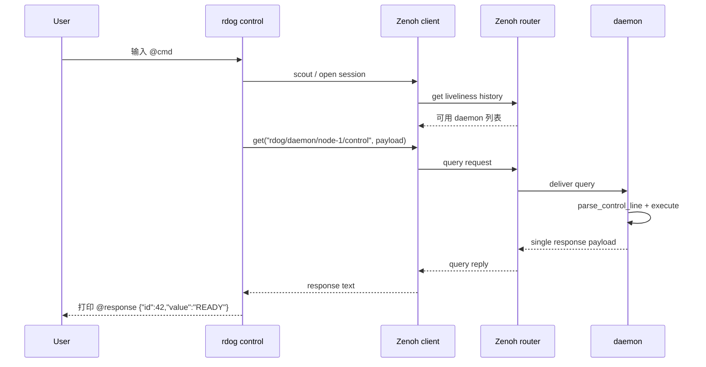

# Zenoh control-plane 规划草案

## 目标

为 `rustdog` 规划一条支持 Eclipse Zenoh 的接入路线。
重点聚焦两件事:

- `rdog control` 如何发现并连接远端 `daemon`
- `daemon` 与 `rdog control` 在引入 Zenoh 后怎样互联最稳

## 当前事实

- 当前 `rustdog` 只有 TCP transport。
- 当前 `daemon inbound mode=control` 通过 line-control 协议执行 `@ping`、`@key`、`@paste`、`@script`、`@cmd#id`。
- 当前 `rdog control` 是 stdio 到 TCP control lane 的桥接器。
- Zenoh 已具备 `scout`、`open(Config)`、`declare_queryable/get`、`liveliness` 这些能力。

## 推荐方向

- 第一阶段只把 Zenoh 引入 control plane。
- interactive shell / PTY data plane 继续保留 TCP。
- daemon 作为命令执行单一真相源。
- control 作为控制意图发起者。
- Zenoh 负责 discovery、寻址、存活感知和 control request-reply。

## 推荐架构图

## 推荐时序图

## 方案边界

### 最佳方案

- 抽象 control transport/session 层。
- TCP control lane 和 Zenoh control lane 共享同一个 control handler。
- daemon 用 liveliness 暴露可发现身份。
- `rdog control` 既可直连 TCP,也可走 Zenoh discovery + query-reply。

### 先可用方案

- 先新增一条独立 Zenoh control 旁路。
- 不动现有 `daemon inbound/outbound` 结构。
- `rdog control --transport zenoh` 与 `daemon --enable-zenoh-control` 先完成 discovery + request-reply。
- 等行为稳定后,再回头抽 transport 层。

## v1 验收标准

- 在单 router + 单 daemon 场景,`rdog control --transport zenoh --discover` 必须在限定时间内列出该 daemon。
- `@ping` 必须返回 `@response "pong"`。
- `@cmd#42:"printf READY"` 必须返回 `@response {"id":42,"value":"READY"}`。
- 在多 daemon 场景,按 `daemon_id` 选择目标时不能误路由到其他实例。
- 现有 TCP control lane 相关集成测试必须继续通过。

## 当前拒绝条件

- 如果首版需要同时重写 interactive shell / PTY data plane,则拒绝当前范围。
- 如果还不能定义稳定的 daemon identity / target keyexpr 规则,则拒绝进入实现阶段。
- 如果 Zenoh 接入会破坏现有 TCP control lane 兼容,则拒绝当前实施顺序。
