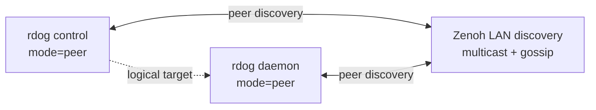
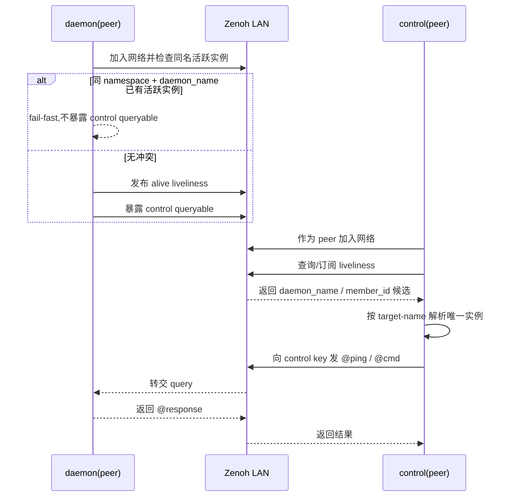

# Zenoh Peer/Peer LAN 控制面历史规格草案

> Historical reference only.
>
> New work should follow `specs/zenoh-control-plane-plan.md`, which is now the canonical router/serial Zenoh spec.

## 1. 目标

这份规格草案定义 `rustdog` 曾经采用的 **同一局域网** Zenoh `peer/peer` 控制面 profile。
它保留给迁移回顾、历史对照和旧行为解释，不是当前实现的主路径。

目标是同时满足 4 件事:

1. `daemon` 作为 Zenoh peer 运行
2. `rdog control` 作为 Zenoh peer 运行
3. `control` **不需要预知 `daemon` 的 IP**
4. `control` 通过一个**人工定义的简洁名称**定位目标 daemon,这个名称的心智应接近“域名 / DDNS 名称”,但它是应用层名字,不是 DNS 解析结果

这份规格只覆盖 **control plane**。
它不覆盖 interactive shell data plane。

---

## 2. 适用范围

### 2.1 适用场景

- `daemon` 与 `control` 通常处于同一个局域网
- 局域网允许 UDP multicast 或其他可用的 peer discovery 机制
- 目标是减少对 `daemon` IP 的预配置依赖
- 目标是用逻辑名称而不是 IP 做人工寻址

### 2.2 不适用场景

- 跨公网、跨多层 NAT、跨受限 VLAN 的默认部署
- 明确要求 `control = client`
- 要求 interactive shell over Zenoh
- 要求 bare shell lines over Zenoh

---

## 3. 术语

- **daemon**: 提供控制执行能力的常驻端
- **control**: 发起控制请求的操作者端
- **namespace**: 逻辑网络命名空间,用于隔离不同环境
- **daemon_name**: 人工定义、简洁、可读的目标名称,用于人工寻址
- **member_id**: HA 兼容层级中的成员标识。当前 static 模式下固定等于 `daemon_name`
- **entry point**: 当 multicast scouting 不可用时,用于加入 Zenoh 网络的已知 peer 或 router 地址

---

## 4. 核心结论

### 4.1 关于“免 IP”

本 profile 的准确口径是:

- `control` **不需要预知目标 daemon 的 IP**
- 但这不等于系统永远不需要任何地址信息
- 只有在 **LAN peer scouting 可用** 时,才成立“零预配置目标地址”
- 如果 multicast scouting 不可用,则至少需要一个 entry point 才能先加入同一 Zenoh 网络

### 4.2 关于目标寻址

`daemon_name` 既是人工输入和显示用的名字,也是当前 profile 的唯一稳定身份。当前 static 模式下 `member_id = daemon_name`。

---

## 5. 身份模型

### 5.1 稳定目标名与当前 static 成员

#### `daemon_name`

- 面向人类
- 可人工定义
- 作为 control 侧的目标名称
- 语义接近域名 / DDNS name
- 在同一 `namespace` 内必须唯一
- 当前 static 模式下,它同时也是 `member_id`


### 5.2 `daemon_name` 语法

`daemon_name` 必须满足以下规则:

- 只允许小写字母、数字、连字符 `-`、点号 `.`
- 推荐采用点分层级风格,例如:
  - `mini-a.lab`
  - `cam-01.office`
  - `build-host.dev`
- 不允许空格
- 不允许斜杠 `/`
- 不允许通配符 `*` 和 `**`
- 每个 label 推荐不超过 63 个字符
- 总长度推荐不超过 128 个字符

### 5.3 命名示例

合法示例:

- `mini-a.lab`
- `ops-mac-01`
- `cam-01.office`

非法示例:

- `Mini A`
- `host/1`
- `daemon*`

---

## 6. 唯一性约束

### 6.1 唯一约束对象

在同一个 `namespace` 内:

- `daemon_name` 必须唯一

### 6.2 daemon 侧约束

daemon 在暴露 control queryable 前,必须先检查:

- 当前 `namespace`
- 当前 `daemon_name`

下是否已经存在其他活跃实例。

如果存在:

- 当前 daemon **必须 fail-fast**
- 当前 daemon **不得暴露** control queryable
- 当前 daemon 必须打印冲突日志,至少包含:
  - `namespace`
  - `daemon_name`

### 6.3 control 侧约束

control 侧仍然要检测重复目标,但这只是诊断层防线。
它**不能替代** daemon 侧 fail-fast。

---

## 7. Keyexpr 规则

### 7.1 liveliness key

```text
rdog/<namespace>/daemon/<daemon_name>/member/<member_id>/alive
```

### 7.2 control queryable key

```text
rdog/<namespace>/daemon/<daemon_name>/member/<member_id>/control
```

### 7.3 元数据 key

如需补充只读元数据,建议使用:

```text
rdog/<namespace>/daemon/<daemon_name>/member/<member_id>/meta
```

元数据建议至少包含:

- `daemon_name`
- `hostname`
- `started_at`
- `rdog_version`

---

## 8. 拓扑与引导

### 8.1 默认拓扑



### 8.2 默认引导方式

默认情况下:

- `daemon` 作为 peer 启动
- `control` 作为 peer 启动
- 双方依赖 LAN peer scouting 自动加入同一 Zenoh 网络

### 8.3 fallback 引导方式

如果 multicast scouting 不可用:

- 允许配置至少一个 `entry point`
- 这个 entry point 可以是:
  - 已知 peer
  - 独立 router
- 这时仍然可以做到“control 不预知 **目标 daemon IP**”
- 但已经不再是“零预配置地址”

---

## 9. 发现与目标解析

### 9.1 发现流程

control 侧启动后:

1. 先作为 peer 加入 Zenoh 网络
2. 订阅或查询 liveliness 前缀:
   - `rdog/<namespace>/daemon/**`
3. 收集当前活跃 daemon 实例
4. 以 `daemon_name` 作为人工输入目标进行匹配
5. 解析出唯一目标实例后,向对应 control key 发 query

### 9.2 目标解析规则

给定 `--target-name <daemon_name>`:

- 0 个活跃实例:
  - 返回 `target not found`
- 1 个活跃实例:
  - 解析成功
- 多个活跃实例:
  - 返回 `conflict`
  - 当前 static 模式下直接视为同名冲突

### 9.3 没有显式目标时

如果未指定 `--target-name`:

- 若当前 namespace 下恰好只有一个活跃 daemon_name,可以自动选择
- 否则必须报错并列出候选

---

## 10. 请求与响应范围

### 10.1 Phase 1 支持范围

Zenoh peer/peer LAN profile 的 Phase 1 当前支持显式控制请求:

- `@ping`
- `@cmd#id`
- `@key`
- 显式错误响应

### 10.2 Phase 1 明确不做

- bare shell lines over Zenoh
- interactive shell over Zenoh
- `@paste`

---

## 11. CLI 草案

### 11.1 daemon

```bash
rdog daemon --transport zenoh-peer --name mini-a.lab
```

### 11.2 control

```bash
rdog control --transport zenoh-peer --target-name mini-a.lab
```

### 11.3 fallback entry point

```bash
rdog control \
  --transport zenoh-peer \
  --target-name mini-a.lab \
  --entry-point tcp/192.168.1.10:7447
```

### 11.4 参数语义

- `--name`
  - daemon 的人工定义名称
  - 映射到 `daemon_name`
- `--target-name`
  - control 侧的人工目标名称
  - 也是按 `daemon_name` 匹配
- `--entry-point`
  - 仅用于加入 Zenoh 网络
  - 不是 target daemon 的逻辑名称

---

## 12. 配置草案

```toml
[zenoh]
enabled = true
mode = "peer"
namespace = "lab"
daemon_name = "mini-a.lab"
scout = true
listen_endpoints = ["tcp/<your-lan-ip>:<free-high-port>"]
connect_endpoints = []
request_timeout_ms = 3000
```

### 字段说明

- `mode = "peer"`
  - 当前 profile 固定为 peer
- `daemon_name`
  - 人工定义、简洁、可读的目标名
  - 内部稳定身份
  - `auto` 表示首次生成并持久化
- `connect_endpoints`
  - 仅在 multicast scouting 不可用时作为 fallback entry point 使用
- `listen_endpoints`
  - 给 peer 提供固定可达入口
  - 适合外部 control 通过 `--entry-point tcp/<daemon-ip>:<free-high-port>` 做 deterministic fallback
  - Windows 上更推荐“具体 LAN IP + 空闲高位端口”,而不是直接写 `0.0.0.0:7447`

---

## 13. 行为时序



---

## 14. 验证矩阵

### 14.1 Unit

- `daemon_name` 语法校验
- keyexpr 生成 / 解析
- 同一显式请求在 TCP / Zenoh 下返回相同语义的 `@response`

### 14.2 Integration

同 LAN 场景至少验证:

- daemon(peer) 与 control(peer) 在 multicast scouting 下自动互见
- `control` 在未知 daemon IP 的前提下,通过 `--target-name` 定位 daemon
- `@ping`
- `@cmd#42:"printf READY"`
- 连续多次请求
- 非法请求错误回传

### 14.3 Failure-path

- duplicate `daemon_name` 启动冲突
- target not found
- 多实例同名 conflict
- query timeout
- liveliness 过期后目标消失
- multicast 不可用时,无 entry point 的失败路径

### 14.4 Observability

daemon 启动日志必须打印:

- `namespace`
- `daemon_name`
- `alive key`
- `control key`

control 侧必须打印:

- 发现到的候选 `daemon_name`
- 实际请求的 control keyexpr

---

## 15. ADR 摘要

### Decision

在同 LAN 场景下,优先采用:

- `daemon = peer`
- `control = peer`

并以 `daemon_name` 作为人工寻址名与当前 profile 的唯一稳定身份。在当前 static 模式下,`member_id = daemon_name`。

### Drivers

- 最接近“免预知 daemon IP”
- 不强依赖独立 router
- 更符合局域网 peer discovery 的天然能力

### Alternatives considered

- `daemon = peer`, `control = client`
  - 需要 router 才稳
- `daemon` 内置 router, `control = client/peer`
  - 能做,但 daemon 职责更重

### Consequences

- LAN multicast / gossip 变成默认成功路径
- 需要为 multicast 不可用场景保留 entry point fallback
- 必须严格执行 `daemon_name` 唯一性约束

---

## 16. 最终口径

本 profile 下:

- `control` 可以不预知 `daemon` 的 IP
- 但 `daemon_name` 只是应用层逻辑寻址名,不是底层 transport 地址
- 只有在双方已经加入同一 Zenoh 网络后,`control` 才能凭 `daemon_name` 定位目标 daemon
