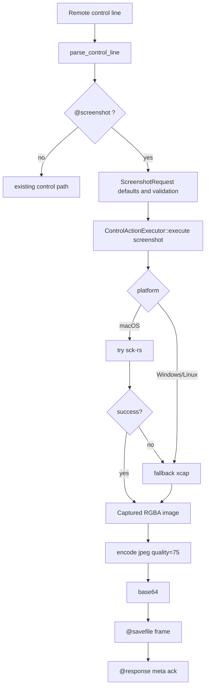
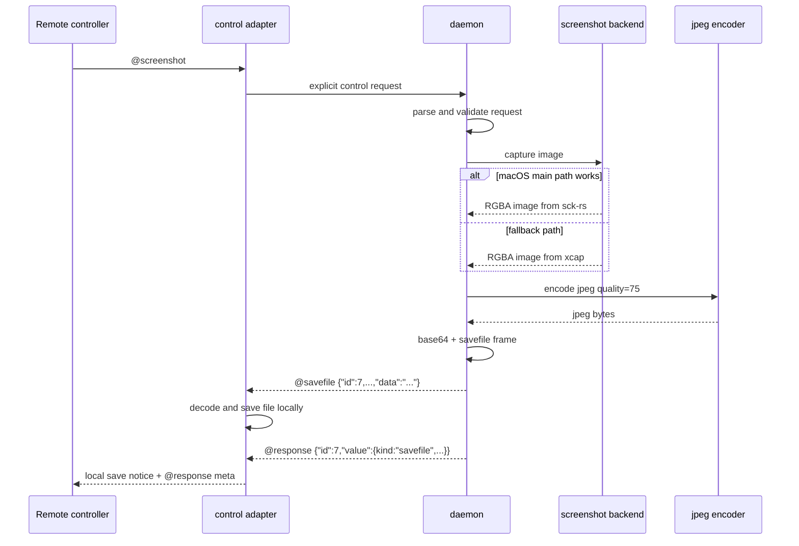

# `@screenshot` 控制面规划

> 注意:
> 这份文档里关于 `@savefile + @response(meta/ack)` 的返回链路,
> 已被后续的 `specs/bidirectional-control-plane-plan.md` 上提为更通用的双向控制面问题。
> 现在实现 screenshot 前,应优先先看双向控制面规划。

## 1. 目标

给 `rustdog` 增加一个“远程请求本地 daemon 截图,再把结果直接回给远程”的能力。

这次规划只覆盖 **单次截图请求**。
不做连续采样。
不做视频流。
不引入第二套控制入口。

本轮固定约束:

- 请求入口: 集成到现有显式控制协议,使用 `@screenshot`
- 返回方式: `@savefile` 承载文件内容,`@response` 只承载状态/元信息
- 默认编码: `image/jpeg`
- 默认压缩质量: `75`
- macOS 主后端: `sck-rs`
- macOS 备用后端: `xcap`
- Windows / Linux 后端: `xcap`

## 2. 结论先行

### 2.1 推荐方案

把截图能力集成到现有 `rdog control` / daemon 的显式控制面里。
也就是扩成新的 `@screenshot` 请求。

请求仍然走:

- TCP line-control
- WebSocket control text message
- Zenoh query/reply

结果仍然走现有控制通道。
但返回帧分成两类:

- `@savefile ...`
- `@response ...`

### 2.2 不推荐方案

不做“新的 bin + 单独 Zenoh 订阅频道作为 screenshot 请求入口”。

原因不是做不到。
而是它会让截图能力脱离现有 control plane,长出第二套请求关联、错误回传、权限语义和目标寻址逻辑。

这和仓库当前已经稳定下来的边界相冲突。

## 3. 现有事实依据

### 3.1 当前 Zenoh 规划是 control-plane only

`specs/zenoh-control-plane-plan.md` 已经明确:

- v1 是 **control-plane only**
- 继续服务现有显式 control plane
- 不做 shell/data-plane 迁移

这意味着“请求本地做一件事并拿结果”这类能力,默认应该继续走显式 control protocol。

### 3.2 当前显式协议正是“远程触发本地动作”的入口

`specs/control-line-protocol.md` 里,显式请求已经承载:

- `@ping`
- `@key`
- `@paste`
- `@script`
- `@cmd`

其中 `@key` 已经是典型的“触发本地副作用动作,成功通常回 `@response 0`”。

截图在语义上和它同类。
只是返回值比 `@key` 更大。

### 3.3 当前仓库已经形成双层分工

当前实现已经有很清晰的分层:

- **请求 / 结果帧**: 走 query/reply 或 line-control
- **动作成功后的附加事件**: 走 pub/sub

现成例子就是 `@key`:

- 请求本身走 control request
- 成功后可选发布 `keyinput` 事件

所以截图能力的自然落点也是:

- 主入口 = `@screenshot`
- 若未来真有旁观订阅需求,再补 screenshot event/result topic

而不是反过来。

## 4. 方案对比

### 4.1 方案 A: 集成进 `@screenshot` 显式控制协议

#### 形态

- `rdog control` 继续作为唯一远程控制入口
- daemon 继续作为统一执行者
- `@screenshot` 由现有 `control_protocol -> control_core -> control_actions` 链路处理
- 结果编码后通过新的 daemon 返回指令 `@savefile` 发回
- `@response` 只补状态和元信息

#### 优点

- 复用现有 request id、错误码、权限错误、日志和测试框架
- 不需要新 bin
- 不需要新 target 解析逻辑
- 不需要再定义 screenshot request topic 的请求关联规则
- 最符合当前 repo 的“单一控制面”方向

#### 代价

- 需要给控制面新增一个返回帧类型
- 单条 `@savefile` 仍然可能很大
- 需要谨慎处理 JPEG 编码和大 payload 的内存占用

### 4.2 方案 B: 新 bin + Zenoh 订阅 screenshot request 频道

#### 形态

- 新增单独 screenshot service/bin
- 它订阅例如 `.../screenshot/request`
- 再向 `.../screenshot/result` 或别的渠道返回结果

#### 优点

- 从表面上看,二进制结果和大 payload 好像更“自然”
- 可以较早为未来流式截图铺路

#### 问题

- 会复制一套控制入口
- 请求关联、错误回传、权限表达都要重新定义
- `rdog control` 会失去“所有远程动作的单一入口”定位
- 需要补新的 CLI、身份、日志、文档和测试矩阵
- 对当前“单次截图”目标来说,明显过重

### 4.3 最终选择

选 **方案 A**。

如果未来出现“高频截图 / 多观察者 / 超大结果 / 连续流式采样”这些需求,再从方案 A 演进出“请求仍走 `@screenshot`,结果分发另走 topic”的第二阶段。

## 5. 请求与响应协议

## 5.1 请求语法

新增显式控制请求:

```text
@screenshot
@screenshot#7
@screenshot:{target:"display"}
@screenshot#7:{target:"display",display:"primary",format:"jpeg",quality:75}
@screenshot#9:{target:"window",window_id:12345,format:"jpeg",quality:75}
```

### 5.2 v1 默认值

- `target = "display"`
- `display = "primary"`
- `format = "jpeg"`
- `quality = 75`

### 5.3 v1 对象字段

建议 v1 只开放下面这些字段:

- `target`
  - `"display"` 或 `"window"`
- `display`
  - `"primary"` 或显示器 id / 名称
- `window_id`
  - 当 `target = "window"` 时使用
- `format`
  - 当前只接受 `"jpeg"`
- `quality`
  - `1..=100`

### 5.4 `@savefile` 返回指令

这轮规划新增 daemon -> client 返回指令:

```text
@savefile {"id":7,"filename":"screenshot-20260501-143700.jpg","mime":"image/jpeg","encoding":"base64","quality":75,"width":1728,"height":1117,"data":"..."}
```

无 request id 时:

```text
@savefile {"filename":"screenshot-20260501-143700.jpg","mime":"image/jpeg","encoding":"base64","quality":75,"width":1728,"height":1117,"data":"..."}
```

语义固定为:

- 这不是“终端应原样展示的一行文本结果”
- 这是一条“接收端应立即落文件”的返回帧
- `data` 当前仍用 base64,这样 TCP / WebSocket / Zenoh 三条控制路径都能复用 UTF-8 文本载荷

#### 5.4.1 接收端职责

收到 `@savefile` 后,接收端应:

1. 解析 JSON 元信息
2. base64 解码 `data`
3. 以 `filename` 为建议文件名写入本地文件
4. 不把 `data` 本体回显到终端

建议接收端额外输出一条本地提示,例如:

```text
saved file: ./rdog_downloads/screenshot-20260501-143700.jpg
```

这条提示是接收端本地 UX。
不是 daemon 回给对端的协议帧。

### 5.5 成功状态响应

`@savefile` 发完之后,daemon 仍然返回一条不含 JPEG 数据的 `@response`。

建议形态如下:

```text
@response {"id":7,"value":{"kind":"savefile","filename":"screenshot-20260501-143700.jpg","mime":"image/jpeg","quality":75,"width":1728,"height":1117}}
```

无 request id 时:

```text
@response {"kind":"savefile","filename":"screenshot-20260501-143700.jpg","mime":"image/jpeg","quality":75,"width":1728,"height":1117}
```

这里的作用不是携带文件内容。
而是保留现有请求完成语义:

- 这次请求成功了
- 返回的是一个需要保存的文件结果
- 终端仍能看到精简元信息

### 5.6 失败响应

继续沿用现有 error object:

```text
@response {"id":7,"code":77,"error":"screen capture permission denied"}
```

推荐错误分类:

- 参数非法: `64`
- 权限不足 / 未授权: `77`
- 平台不支持 / 后端不可用: `78`
- 截图执行失败 / 编码失败: `70`

### 5.7 为什么不直接回原始 bytes

当前 control plane 的稳定契约是:

- UTF-8 文本 payload
- 单行控制返回帧

因此 v1 仍然坚持:

- `@savefile` 也是 UTF-8 文本帧
- 图片数据仍放进 base64

变化只是:

- 以前打算把 base64 放进 `@response`
- 现在改成把 base64 放进 `@savefile`

这样 TCP / WebSocket / Zenoh 三条 control path 仍可复用同一套文本通道。

## 6. 后端设计

### 6.1 统一抽象

新增一个截图抽象层,例如:

```rust
trait ScreenshotBackend {
    fn capture_display(&self, selector: DisplaySelector) -> io::Result<CapturedImage>;
    fn capture_window(&self, selector: WindowSelector) -> io::Result<CapturedImage>;
}
```

`CapturedImage` 建议只承载:

- RGBA 像素
- 宽高
- 来源元信息

不要把 JPEG 编码逻辑散落到后端里。
编码应在统一层做。

### 6.2 macOS

#### 主后端: `sck-rs`

使用 `sck-rs` 作为首选后端。

理由:

- 它直接基于 ScreenCaptureKit
- README 明确说明它是 macOS 14+ 的现代截图路径
- 对 HDR、系统窗口、兼容性更友好

#### 备用后端: `xcap`

在以下场景降级到 `xcap`:

- `sck-rs` 初始化失败
- 运行环境低于 `sck-rs` 需要的版本
- 某些窗口/显示器选择路径在首版实现里还没补齐

这里的“备用”指运行时 fallback。
不是第二套 CLI。

### 6.3 Windows / Linux

统一走 `xcap`。

因为它本来就是这个跨平台层。

### 6.4 JPEG 编码层

无论底层截图来自 `sck-rs` 还是 `xcap`,都在 `rustdog` 自己的统一编码层里:

1. 拿到 RGBA 图像
2. 编码成 JPEG
3. 质量默认 `75`
4. base64
5. 组织成 `@savefile`
6. 再补一条不含图片数据的 `@response`

这样可以保证:

- 默认质量一致
- 三个平台响应结构一致
- 以后如果要支持 `png` 或缩略图,只改上层编码策略

## 7. 模块改动规划

### 7.1 `Cargo.toml`

计划新增:

- macOS target dependency: `sck-rs`
- cross-platform dependency: `xcap`
- JPEG 编码依赖: `image` 或等价编码库

建议形态:

- `sck-rs` 放到 `target.'cfg(target_os = "macos")'.dependencies`
- `xcap` 放到跨平台依赖,或按平台拆 target 依赖

### 7.2 `src/control_protocol.rs`

新增:

- `ControlCommand::Screenshot(ScreenshotRequest)`
- `ScreenshotRequest` 结构体
- `@screenshot` header / payload 解析
- 默认值填充
- 参数校验

### 7.3 `src/control_core.rs`

新增:

- 让 `parse_and_execute_explicit_control_line()` 接受 `@screenshot`
- 让成功响应支持对象 value

注意:

当前 `render_control_response_payload()` 偏向 shell/stdout 语义。
截图不应该硬塞进 `stdout`。
也不应该继续硬塞进单个 `@response`。

建议新增一个更明确的返回抽象,例如:

- `ActionExecutionResult::Text`
- `ActionExecutionResult::JsonValue`
- `ActionExecutionResult::SaveFile`

然后让控制面支持“单次请求可以产出多帧返回”,例如:

- 先 `@savefile`
- 再 `@response`

### 7.4 `src/control_actions.rs`

新增:

- `execute_screenshot()`
- 后端选择逻辑
- 权限 / 不支持 / 编码失败 的错误映射

现有 `ControlActionExecutor` 仍然保留单一入口。

### 7.5 新模块

建议新增:

- `src/screenshot.rs`
  - 请求结构辅助逻辑
  - backend trait
  - backend selector
  - JPEG encode + base64

- `src/screenshot_macos.rs`
  - `sck-rs`
  - `xcap` fallback

- `src/screenshot_xcap.rs`
  - Windows / Linux 主实现
  - macOS legacy fallback 共享实现

### 7.6 `src/zenoh_control.rs`

原则上不需要单独为 screenshot 新开第二条控制链。

只要它继续复用:

- `parse_and_execute_explicit_control_line()`
- query reply

就够了。

### 7.7 文档

需要同步:

- `specs/control-line-protocol.md`
- `README.md`
- `cmd.md`
- `specs/zenoh-sdk-integration-playbook.md`

把 `@screenshot` 加进:

- 当前支持的控制请求
- 请求/响应样例
- Zenoh path 的支持能力表

## 8. 验证计划

### 8.1 单元测试

#### `src/control_protocol.rs`

- `@screenshot` 无 payload 时应落默认值
- `@screenshot#7` 应保留 request id
- 非法 `quality`
- 非法 `target`
- `window` 模式缺少 `window_id`
- 非法 `format`

#### `src/control_core.rs`

- `@screenshot#7` 成功时能返回对象型 `value`
- 参数错误能返回 `code = 64`
- 权限错误能返回 `code = 77`
- 平台不支持能返回 `code = 78`

#### `src/control_actions.rs`

- 成功截图后,会走 JPEG 75 编码
- 编码失败时错误能被上抛
- backend fallback 顺序正确

### 8.2 集成测试

#### TCP control lane

- `daemon inbound.mode=control` 下发送 `@screenshot#7`
- 先收到 `@savefile {"id":7,...}`
- 再收到不含 JPEG 数据的 `@response {"id":7,...}`
- `mime = image/jpeg`
- `quality = 75`
- `data` 非空且可 base64 解码

#### Zenoh router/client

- `rdog control --transport zenoh --target-name ...`
- 发送 `@screenshot#7`
- 收到 `@savefile`
- 收到对象型 `@response`
- 不引入新的 request topic

#### WebSocket control

- 文本消息发送 `@screenshot#7`
- 文本消息先收到 `@savefile ...`
- 文本消息再收到 `@response ...`

### 8.3 平台实测

#### macOS

- 已授权 Screen Recording
- `sck-rs` 正常截图
- 人为制造 `sck-rs` 失败时能 fallback 到 `xcap`
- 未授权时能稳定返回权限错误

#### Windows

- `xcap` 主屏截图
- 返回 JPEG 75

#### Linux

- `xcap` 在当前支持环境截图
- Wayland 特殊限制至少要有清晰错误

## 9. 风险与缓解

### 风险1: 单条 `@savefile` 太大

#### 影响

- 大屏截图 base64 后会膨胀
- 控制通道日志和内存占用会上升
- 接收端在保存文件前会短暂持有大块文本载荷

#### 缓解

- v1 固定“单次静态截图 + JPEG 75”
- 不做 PNG 默认
- 文档明确这是 command-response,不是流式截图
- 后续若超大 payload 成为实问题,再扩成“请求走 `@screenshot`,结果走独立 result keyexpr”

### 风险2: macOS 权限和版本差异

#### 影响

- `sck-rs` 需要 Screen Recording 权限
- README 标注 macOS 14+ 更合适

#### 缓解

- 运行时先明确报权限错误
- macOS fallback 到 `xcap`
- 文档明确主后端 / legacy fallback 的边界

### 风险3: 当前响应抽象偏 shell 文本

#### 影响

- 直接往 `stdout` 语义里硬塞图片对象,容易把 `control_core` 变脆

#### 缓解

- 在这轮里顺手把动作返回抽象升级一下
- 把“文本成功结果”和“结构化成功结果”分开

## 10. 实施步骤

1. 先在 `specs/control-line-protocol.md` 中补 `@screenshot` 语义,锁定默认 `jpeg/75` 和对象型响应形态。
2. 在 `Cargo.toml` 加入 `sck-rs`、`xcap` 和 JPEG 编码依赖,同时按平台拆依赖边界。
3. 新增 `ScreenshotRequest` 与 `ControlCommand::Screenshot`,完成协议解析和参数校验。
4. 新增 `src/screenshot*.rs` 模块,实现:
   - macOS `sck-rs` 主路径
   - macOS `xcap` fallback
   - Windows/Linux `xcap`
   - JPEG 75 编码 + base64
5. 调整 `control_actions` / `control_core` 的返回抽象,让 `@screenshot` 能返回:
   - `@savefile`
   - 不含图片数据的 `@response`
6. 在 `rdog control` / WebSocket client / Zenoh client 侧补 `@savefile` 接收与落盘逻辑。
7. 为 TCP / Zenoh / WebSocket control path 补集成测试。
8. 更新 `README.md`、`cmd.md`、`specs/zenoh-sdk-integration-playbook.md`。

## 11. 验收标准

- 能通过现有 `rdog control` 入口发送 `@screenshot`
- 默认不传参数时,返回 `image/jpeg` + `quality = 75`
- 结果通过 `@savefile` 直接交给接收端落文件
- `@response` 中不包含 JPEG 数据本体
- 结果通过 `@savefile` 直接交给接收端落文件
- `@response` 中不包含 JPEG 数据本体
- macOS 优先用 `sck-rs`
- macOS `sck-rs` 不可用时,可 fallback 到 `xcap`
- Windows / Linux 使用 `xcap`
- TCP / Zenoh / WebSocket 三条 control 路径协议形态一致
- 权限错误、参数错误、平台不支持都有稳定 error code

## 12. 流程图



## 13. 时序图



## 14. 后续建议

如果这份 plan 进入实现阶段,最值得先做的不是平台细节,而是 **先把控制返回抽象从“单条 `@response`”升级成“多帧返回”**。

因为只要这层还强绑定“shell stdout/stderr + 单条 response”,后面不只是 screenshot。
任何文件型返回,都会继续拧巴。
