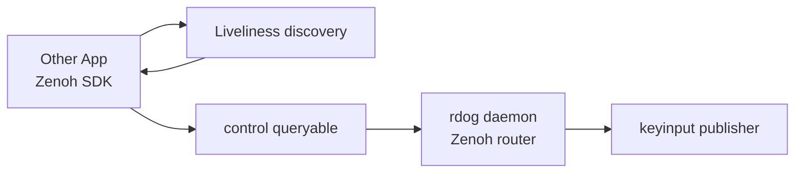
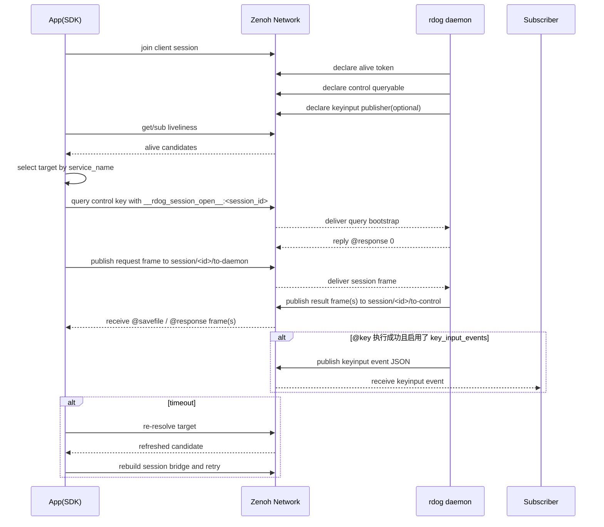

# Zenoh SDK 对接 `rdog` daemon 的操作手册

## 1. 目的

这份文档面向两类读者:

- 其他应用的开发者
- 需要直接编写对接代码的编程智能体

目标是说明:

1. 其他 app 如何通过 Zenoh SDK 接入 `rdog` daemon
2. 当前 `rdog` Zenoh profile 的协议约束是什么
3. 编程智能体应该按什么步骤实现 discovery、target 解析、query/reply 与重试

这份文档描述的是**当前已实现**的对接方案,不是未来 HA 的完整设计。

---

## 2. 当前已实现的对接模型

### 2.1 当前 profile

当前 `rdog` 的 Zenoh control-plane profile 是:

- `daemon = router`
- `control = client`
- `control` 默认通过 autodiscovery 加入同一 Zenoh 网络
- `--entry-point` 只作为 autodiscovery 不可用时的 fallback

### 2.2 当前稳定身份

- `service_name`
  - 当前实现里就是 `daemon_name`
  - 这是用户输入和程序解析时的稳定目标名

### 2.3 当前成员层级

为了未来 HA 兼容,当前 keyexpr 已经提前保留 `member/<member_id>` 层。

但在当前 static 模式下:

- `member_id = service_name`

也就是说,现在并没有多成员负载均衡。

### 2.4 当前支持的控制请求

当前 Zenoh 路径支持:

- `@ping`
- `@cmd#id`
- bare shell lines
- `@key`
- `@paste`
- `@savefile`
- `@screenshot`
- `@pty` / `@pty-close` / `@pty-detach` / `@pty-attach` over session channels
- 显式错误响应
- `@key` 成功后的键盘事件发布

当前 Zenoh 路径明确不支持:

- 不经 `@pty` 的传统 interactive shell over Zenoh
- 把裸 shell 行升级成带 cwd 状态保持的长期 shell

---

## 3. 当前 keyexpr 合约

### 3.1 liveliness key

```text
rdog/<namespace>/daemon/<service_name>/member/<member_id>/alive
```

### 3.2 control queryable key

```text
rdog/<namespace>/daemon/<service_name>/member/<member_id>/control
```

说明:

- 这个 key 现在仍然存在。
- 但它的职责已经不再只是“单条 query -> 单条 reply”。
- 当前实现里,它主要承担:
  - session bootstrap
  - legacy / compatibility path
  - target 解析后的初始控制入口

### 3.3 key input event key

当 daemon 成功执行 `@key` 时,如果 `[zenoh.key_input_events].enabled = true`,还会向一个普通 publish/subscribe keyexpr 发出键盘事件:

```text
rdog/<namespace>/daemon/<service_name>/member/<member_id>/keyinput
```

### 3.4 session channel key

当前实现已经开始引入 session channel:

```text
rdog/<namespace>/session/<session_id>/to-daemon
rdog/<namespace>/session/<session_id>/to-control
```

语义:

- `to-daemon`
  - control peer 主动下发控制请求
  - PTY session 中也承载 `@pty`、`@pty-stdin`、`@pty-close`、`@pty-detach`、`@pty-attach`
- `to-control`
  - daemon 回传结果 frame
  - PTY session 中也承载 `@pty-ready`、`@pty-output`、`@pty-exit`、`@pty-closed`、`@pty-detached`、`@pty-attached`

### 3.5 session bootstrap payload

当前 bootstrap 仍走 control queryable。

open:

```text
__rdog_session_open__:<session_id>
```

close:

```text
__rdog_session_close__:<session_id>
```

当前 close 行为:

- control peer 通过既有 session 的 `to-daemon` publisher 发送 close payload
- daemon bridge 返回一条 `@response 0` 作为 close ack
- 之后该 session 可以重新 open 并继续收发

### 3.6 static 模式下的实际例子

若:

- `namespace = lab`
- `service_name = mini-a.lab`
- `member_id = mini-a.lab`

则当前实际 keyexpr 为:

```text
rdog/lab/daemon/mini-a.lab/member/mini-a.lab/alive
rdog/lab/daemon/mini-a.lab/member/mini-a.lab/control
rdog/lab/daemon/mini-a.lab/member/mini-a.lab/keyinput
rdog/lab/session/sess-42/to-daemon
rdog/lab/session/sess-42/to-control
```

---

## 4. 其他 app 的接入方式

### 4.1 推荐: app = client,加入 daemon 内嵌 router

当前推荐的对接方式是:

- app = client
- `rdog daemon` = router
- 默认先尝试 autodiscovery
- 若环境里 autodiscovery 不稳定或不可用,再显式提供 router entrypoint

原因:

- 与当前 `rdog control` 的实现模型一致
- 不要求 app 自己跑 peer
- 仍可保持“通常不需要手填 daemon IP”的使用体验

---

## 5. 编程智能体应遵循的对接流程

### 5.1 总体流程图



### 5.2 当前实现时序



---

## 6. 协议级请求/响应约束

### 6.1 请求载荷格式

当前 `rdog` daemon 的 bootstrap query 接收的是:

- **UTF-8 文本 payload**
- 内容是一整行控制文本

例如:

```text
__rdog_session_open__:sess-42
```

### 6.2 响应载荷格式

当前 daemon 对 bootstrap query 回复的通常是:

- **UTF-8 文本 payload**
- 内容是一整行 `@response ...`

例如:

```text
@response 0
```

真正的控制结果 frame 则通过 `to-control` channel 回传。

例如:

```text
@response "pong"
@response {"id":42,"value":"READY"}
@savefile {"id":7,"filename":"screenshot-...-virtual-desktop.jpg","mime":"image/jpeg","encoding":"base64","data":"..."}
@savefile {"id":7,"filename":"screenshot-...-manifest.json","mime":"application/json","encoding":"base64","data":"..."}
@response {"id":7,"value":{"kind":"screenshot-bundle","layout":"composite","coordinate_space":"os-logical","image":"screenshot-...-virtual-desktop.jpg","manifest":"screenshot-...-manifest.json","display_count":2}}
```

### 6.3 当前不要假设的事情

对接方不要假设:

- payload 是 JSON 对象
- query 请求可以发送多行脚本
- bare shell line 会保留 cwd 或 PTY 状态
- `@paste` 一定能绕过系统输入权限
- queryable 永远只负责“单条请求 -> 单条最终结果”

### 6.4 key input 事件 payload

当前 `keyinput` 发布的是 UTF-8 JSON 文本。

最小字段集合:

```json
{
  "event": "key_input",
  "namespace": "lab",
  "daemon_name": "mini-a.lab",
  "member_id": "mini-a.lab",
  "key": "F11",
  "hold_ms": 200,
  "mode": "press_release",
  "executed_at_ms": 1713931200000
}
```

语义说明:

- 这是“`@key` 已成功执行”的事件,不是“请求已接收”的确认。
- 如果 `@key` 执行失败,不应该把它当作成功事件。

---

## 7. target 解析策略

### 7.1 当前 static 模式策略

当前 static 模式下:

- `service_name = daemon_name`
- `member_id = daemon_name`

因此 app 侧解析时:

1. 先按 namespace 找所有 alive token
2. 过滤出 `service_name == target-name`
3. 验证 `member_id == service_name`
4. 组合出对应 control key
5. 如需复用会话,自行生成 `session_id`,再建立 `to-daemon` / `to-control` channel

### 7.2 当前冲突策略

当前 profile 还不支持同一个 `service_name` 的多个不同 member 在线。

所以如果发现:

- 同一 `service_name` 下出现多个不同 member

应直接视为冲突,而不是尝试做客户端负载均衡。

---

## 8. 推荐的重试策略

### 8.1 当前 `rdog control` 已实现的策略

当前官方对接逻辑建议是:

- **会话启动时先 resolve 一次 target**
- 如果 query timeout:
  - 再 resolve 一次
  - retry 一次

### 8.2 其他 app 的推荐实现

如果你用 Zenoh SDK 直接写 client,建议复制这个策略:

1. 会话启动时先 `resolve target`
2. 后续请求默认先用当前缓存 target
3. 如果 query 成功,直接返回结果
4. 如果 timeout:
   - 重新 resolve target
   - retry 一次
5. 如果 retry 后仍失败,正式报错

### 8.3 不建议的实现

当前不建议:

- 只在进程启动时 resolve 一次 target 后永久不刷新 control key

因为 daemon 重启后,alive/queryable 的传播窗口可能会变化。

---

## 9. Rust SDK 参考骨架

下面这段不是直接可复制生产代码,但足够指导编程智能体实现当前对接。

```rust
use std::time::Duration;
use zenoh::{Config, Wait};

fn build_alive_key(namespace: &str, service_name: &str) -> String {
    format!(
        "rdog/{namespace}/daemon/{service_name}/member/{service_name}/alive"
    )
}

fn build_control_key(namespace: &str, service_name: &str) -> String {
    format!(
        "rdog/{namespace}/daemon/{service_name}/member/{service_name}/control"
    )
}

fn main() -> Result<(), Box<dyn std::error::Error>> {
    let mut config = Config::default();
    config.insert_json5("mode", "\"peer\"")?;

    let session = zenoh::open(config).wait()?;

    let service_name = "mini-a.lab";
    let namespace = "lab";
    let alive_key = build_alive_key(namespace, service_name);
    let control_key = build_control_key(namespace, service_name);

    // 最小发现: 先确认 alive token 存在
    let replies = session
        .liveliness()
        .get(&alive_key)
        .timeout(Duration::from_secs(3))
        .wait()?;

    let mut alive = false;
    while let Ok(reply) = replies.recv() {
        if reply.result().is_ok() {
            alive = true;
            break;
        }
    }

    if !alive {
        anyhow::bail!("target service not found");
    }

    // 发 query
    let replies = session
        .get(&control_key)
        .payload("@ping")
        .timeout(Duration::from_secs(3))
        .wait()?;

    while let Ok(reply) = replies.recv() {
        match reply.result() {
            Ok(sample) => {
                let payload = sample.payload().try_to_string()?;
                println!("reply = {payload}");
                break;
            }
            Err(err) => {
                let payload = err.payload().try_to_string()?;
                anyhow::bail!("error reply = {payload}");
            }
        }
    }

    Ok(())
}
```

---

## 10. 其他 SDK / 其他语言的最小要求

不管你用的是哪种 Zenoh SDK,编程智能体都应满足下面这几点:

1. 能以 peer 或 client+router 方式加入同一 Zenoh 网络
2. 能声明/读取 UTF-8 payload
3. 能查询 liveliness token
4. 能向 control key 发 query
5. 能把 reply payload 当作整行 `@response ...` 文本处理
6. 能在 timeout 后做一次 re-resolve + retry

---

## 11. 编程智能体实现 checklist

实现对接前,编程智能体至少要完成这些动作:

- [ ] 确认 namespace
- [ ] 确认 service_name(即当前 `daemon_name`)
- [ ] 选择 peer 还是 client+router
- [ ] 实现 alive token 查询
- [ ] 实现 control key 生成
- [ ] 实现 UTF-8 payload query
- [ ] 实现 `@response ...` 文本解析
- [ ] 实现 timeout 后 re-resolve + retry
- [ ] 明确拒绝当前未开放能力:
  - 不经 `@pty` 的传统 interactive shell over Zenoh
  - 把裸 shell 行升级成带 cwd 状态保持的长期 shell

---

## 12. 当前最容易踩的坑

### 坑 1: 把 service_name 当作 transport locator

不是。当前 `daemon_name` / `service_name` 是应用层目标名,不是 IP 或 socket locator。

### 坑 2: 把 payload 当 JSON

不是。当前 query payload 和 reply payload 都是**整行字符串**。

### 坑 3: 只 resolve 一次 target

不稳。daemon 重启后,需要重新 resolve。

### 坑 4: 期待 `@paste` 可以绕过系统权限

当前 `@paste` 已开放,但仍然走本机输入模拟 backend。
如果系统没有给 daemon 进程输入模拟权限,它会按协议返回权限错误,不会绕过 OS 安全边界。

### 坑 5: 把 `--entry-point` 当成唯一主路径

当前主路径应是:

- `control/app = client`
- 默认走 autodiscovery
- `--entry-point` 只是 fallback

只有在 autodiscovery 不可用时,才应该强制转成显式 entrypoint。

---

## 13. 当前推荐的对接结论

### 当前推荐

- app = client
- `rdog daemon` = router
- 默认先 autodiscovery
- 必要时用 `--entry-point` fallback

---

## 14. 一句话给编程智能体

当前版本里,把 `rdog daemon` 当成一个通过 Zenoh router 暴露的 **service_name = daemon_name** 的单成员服务。client 会话启动后先找 `alive` 并解析一次 target,后续请求默认复用当前 target; 若 timeout,再 re-resolve 并 retry 一次。默认优先 autodiscovery, `--entry-point` 只是 fallback。
