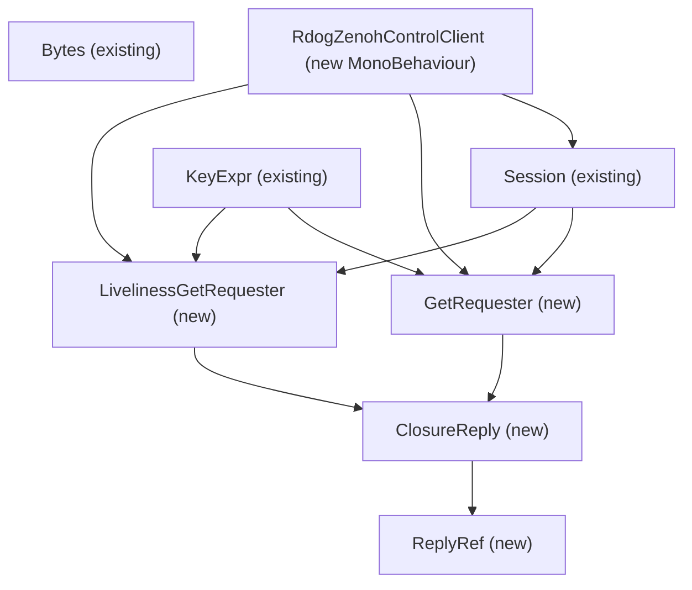
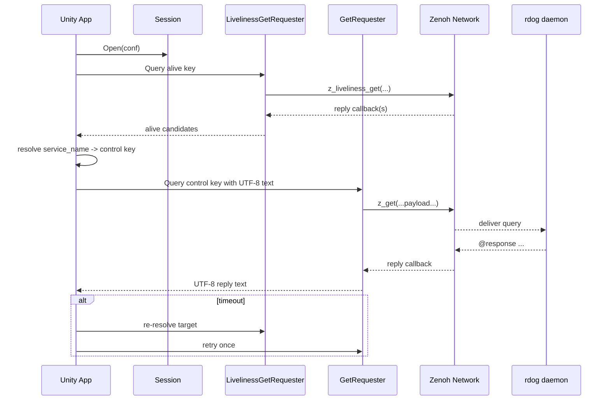

# Unity 最小 Query/Reply Wrapper 设计草图

## 1. 目的

这份文档专门回答一个现实问题:

> 用 `mhama/zenoh-unity-plugin` 对接 `rdog` daemon 时,当前高层 wrapper 不够覆盖 query/reply,那最小应该再包哪几层?

目标不是把整个 Zenoh C API 都重新包一遍。
目标是给编程智能体一个**最小可落地**的 Unity 设计草图,让它能实现:

- 查询 `alive` token
- 向 `control` key 发 query
- 收到 UTF-8 文本 reply
- timeout 时 re-resolve + retry 一次

---

## 2. 已确认事实

基于 `mhama/zenoh-unity-plugin` 仓库当前代码:

### 2.1 已有高层 wrapper

- `Session`
- `Publisher`
- `Subscriber`
- `KeyExpr`
- `Bytes`
- `Encoding`

### 2.2 README 和 sample 已覆盖的能力

- `SimplePubSubTest.cs`
  - 演示 `Session.Open(conf)`
  - 演示 `Publisher.Declare(...)`
  - 演示 `Publisher.Put(...)`
  - 演示 `Subscriber.CreateSubscriber(...)`

### 2.3 当前缺的高层能力

当前仓库里还没有现成的高层 wrapper 去做:

- session-level `get`
- liveliness `get`
- querier / `z_querier_get`
- reply callback 的高层封装

### 2.4 已存在的低层 native binding

在 `ZenohNative.g.cs` 中已经存在:

- `z_get`
- `z_liveliness_get`
- `z_declare_querier`
- `z_querier_get`
- `z_closure_reply`
- `z_fifo_channel_reply_new`
- `z_ring_channel_reply_new`

这意味着:

- **底层能力已经在**
- 缺的是“最小可用高层封装”

---

## 3. 设计结论

### 3.1 当前最小实现不建议先包完整 Querier 类

虽然 `z_declare_querier` / `z_querier_get` 存在,但对当前 `rdog` 对接来说,更轻量的起点是:

- 先包 **session-level `GetRequester`**
- 再包 **liveliness `GetRequester`**

原因:

- 当前目标只是发文本 query,不是做复杂 querier 生命周期管理
- `rdog` 当前对接策略也不是高频复杂查询,而是:
  - 解析 target
  - 发 query
  - timeout 再 resolve + retry
- 对 Unity 这类上层应用来说,越少的 unsafe wrapper 越稳

### 3.2 推荐的最小 wrapper 组合

#### 已复用
- `Session`
- `KeyExpr`
- `Bytes`
- `Encoding`

#### 新增最小 wrapper
- `ReplyRef`
- `ClosureReply`
- `GetRequester`
- `LivelinessGetRequester`

### 3.3 为什么不先做完整 Querier

因为当前最小路径只需要:

- `z_get`
- `z_liveliness_get`
- reply callback

这已经足够对接 `rdog` daemon。
未来如果要做更复杂的 query 生命周期,再补 `Querier` wrapper 更合适。

---

## 4. 推荐类结构



---

## 5. 推荐调用链



---

## 6. 最小 wrapper 的职责

### 6.1 `ReplyRef`

职责:

- 把 native `z_loaned_reply_t*` 封装成 Unity 可读对象
- 提供最少这些能力:
  - `IsOk`
  - `GetPayloadAsUtf8()`
  - `GetKeyExprAsString()`

当前 `rdog` 场景里最重要的是 payload 文本,所以不要一开始就过度包装全部 reply 元数据。

### 6.2 `ClosureReply`

职责:

- 对 `z_closure_reply` 做 C# 侧 callback 封装
- 管理:
  - native callback delegate
  - GCHandle
  - context pointer
  - drop / dispose

这一层的写法可以参考当前仓库里的:

- `ClosureSample`
- `Subscriber`

### 6.3 `GetRequester`

职责:

- 基于 `z_get(...)` 发普通 query
- 入参:
  - `Session`
  - `KeyExpr`
  - `Bytes payload`
  - timeout / options
  - `Action<ReplyRef>` callback
- 出参:
  - `ZResult`

### 6.4 `LivelinessGetRequester`

职责:

- 基于 `z_liveliness_get(...)` 查当前 alive token
- 输入:
  - `Session`
  - `KeyExpr`
  - `Action<ReplyRef>` callback
- 输出:
  - `ZResult`

### 6.5 `RdogZenohControlClient`

职责:

- 只做上层 orchestration
- 按当前 `rdog` 协议实现:
  - build alive key
  - query alive
  - select target
  - query control key
  - timeout 后 re-resolve + retry once

不要把 native 细节写进 MonoBehaviour 本体。

---

## 7. 当前最小应包的 native API

### 7.1 session-level query

- `z_get`
- `z_get_options_t`
- `z_get_options_default`

### 7.2 liveliness query

- `z_liveliness_get`
- `z_liveliness_get_options_t`
- `z_liveliness_get_options_default`

### 7.3 reply callback

- `z_closure_reply`
- `z_closure_reply_call_delegate`
- `z_closure_reply_drop_delegate`
- `z_closure_reply_drop`

### 7.4 bytes / keyexpr

已存在高层 wrapper,优先复用:

- `Bytes`
- `KeyExpr`

---

## 8. 当前不建议包的东西

为了保持最小实现,当前不建议第一步就包:

- 完整 `Querier`
- 完整 `Queryable`
- Matching listener
- 全部 `Reply` 元数据字段
- 所有 `z_get_options` 的高级选项
- 不经 `@pty` 的传统 interactive shell / cwd 状态保持
- `@pty` session channel 的完整 TTY wrapper
- `@key` / `@paste` 以外的扩展输入 DSL

---

## 9. 智能体实现顺序建议

### Step 1
先新增:

- `ReplyRef.cs`
- `ClosureReply.cs`

### Step 2
再新增:

- `GetRequester.cs`
- `LivelinessGetRequester.cs`

### Step 3
最后新增:

- `RdogZenohControlClient.cs`

### Step 4
先只做:

- `@ping`
- `@cmd#id`

### Step 5
再接:

- `@key`

这样最稳。

---

## 10. 给 Unity 智能体的额外限制

在让智能体实现时,建议额外加上这些限制:

```text
- 优先复用现有 wrapper: Session / KeyExpr / Bytes / Encoding
- 只为当前 control query/reply 封装最小 wrapper
- 不要重写完整 Zenoh C# API
- 当前只支持 UTF-8 文本 query/reply
- 当前支持 `@ping` / `@cmd#id` / bare shell lines / `@key` / `@paste`
- timeout 时只 retry 一次
```

---

## 11. 推荐结论

### 当前最快落地路径

- Rust 对接可以直接按已有高层 API + 当前对接手册实现
- Unity 对接最稳的路不是先包完整 Querier,而是:
  - 先包 session-level `z_get` / `z_liveliness_get`
  - 再做 `RdogZenohControlClient`

### 为什么

因为这条路:

- 最少 unsafe 面积
- 最少 wrapper 数量
- 最适合当前 `rdog` 的文本 control 协议
- 最容易让编程智能体一步一步落地
