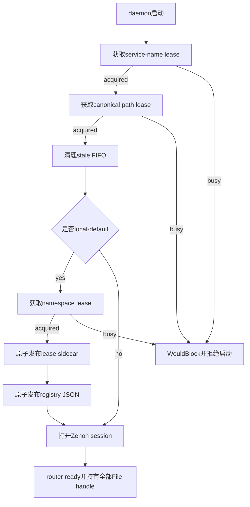
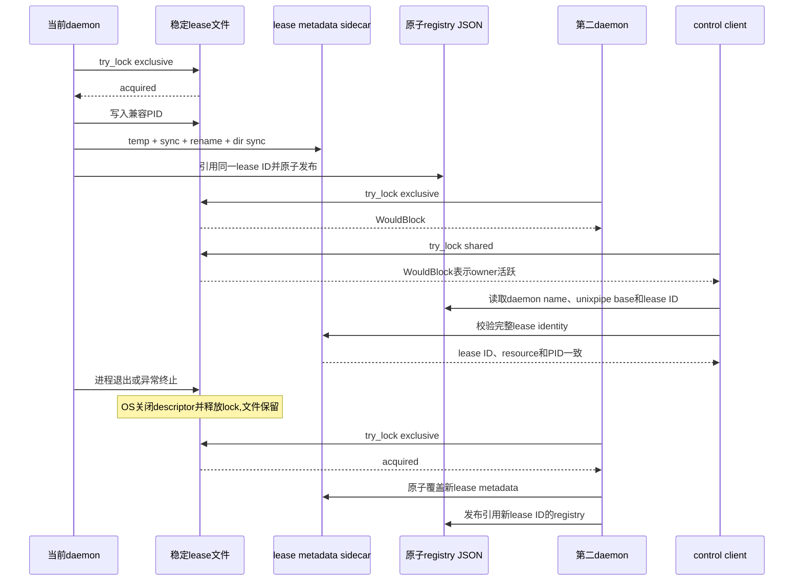
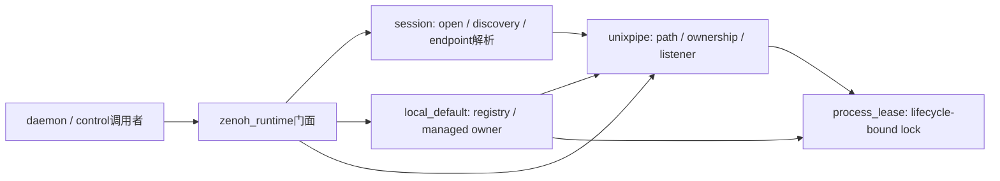

# Zenoh Unixpipe 本地 Fast Path 规划

> 这是 `rustdog` 控制面在 macOS / Linux 上启用 Zenoh `transport_unixpipe` 的本机 fast path 规划。
> 该文件是设计契约的长期入口;实施细节(代码、测试、性能数据)沉淀在 `.omx/plans/zenoh-unixpipe-fast-path.md` 和后续 `WORKLOG.md` 里。

## 1. 背景与动机

`rdog control <target-name>` 当前默认走 Zenoh client session + UDP scout + UDP query/reply。即使 daemon 和 control 都在同一台 macOS 上,一次 `@ping` round-trip 实测 200~500ms,主要原因:

1. Zenoh session open 阶段(每次 `rdog control` 冷启都要重开一次,除非 user 主动用 persistent client)
2. UDP scout 找 router 阶段
3. UDP loopback 上的 Zenoh link 层协议开销
4. query/reply 路由 + serialization 收口

agent 高频跑 `@web-find` / `@screenshot` / `@click` 时,这段延迟会肉眼可见地拉低体感。

## 2. 目标

让同机 daemon + control 把 Zenoh link 层从 UDP 换成 Zenoh unixpipe(FIFO),目标 round-trip 提速 2~5x。远端 / 跨主机行为完全不变,client 自动 fallback 到原 scout 路径。

**不在本轮范围**:
- 不实现"绕过 Zenoh 的独立 UDS 控制面"(那是后续方向 B)
- 不动 line-control 协议本身
- 不重命名任何 CLI 入口

## 3. 设计契约

### 3.1 路径推导

- FIFO base 路径: `{tmpdir}/rdog-{namespace}-{daemon_name}.pipe`
  - `tmpdir` 解析优先级: `$TMPDIR` 环境变量 > `/tmp`
  - macOS 上 `$TMPDIR` 是 per-user(例如 `/var/folders/xx/yy/T/`),自然提供权限隔离
  - Linux 上 `$TMPDIR` 不一定存在,直接 `/tmp` 兜底
- 路径总长必须 ≤ 95 字节(macOS `sun_path` 限制 104,Zenoh 派生 `_downlink` 需要 9 字节),超过时 daemon 启动 fail-fast。
- 默认路径由 `(namespace, daemon_name)` 稳定推导。若配置显式 unixpipe listen endpoint,
  该 endpoint 的 base path 是 listener、cleanup、registry 与 ownership guard 的唯一真相源。

### 3.2 daemon 端行为

- `Cargo.toml` 启用 `transport_unixpipe` feature。
- `ZenohConfig` 新增 `unixpipe: UnixpipeConfig` 子结构,默认 unix 平台 `enabled = true`,Windows `enabled = false`。
- `UnixpipeConfig` 包含 `local_default`。默认 false,模板可显式打开。
- daemon 启动时:
  1. 统一解析最终 endpoint 列表和 unixpipe base;显式 listen endpoint 优先,与 `socket_path` 同时存在时必须一致
  2. 如果 unixpipe enabled 且没有显式 unixpipe endpoint,把 `unixpipe/{socket_path 或推导路径}` 注入到 `listen_endpoints` 最前
  3. 先获取 `(namespace, daemon_name)` 的 service-name process lease;同名活跃 daemon 存在时直接退出,不得触碰现有 FIFO
  4. 再获取 canonical base path 的 process lease;不同 daemon name 共用显式 path 时,后启动者直接退出
  5. 两把 ownership lease 都成功后,才 `unlink` 旧 FIFO 文件(stale cleanup)
  6. 如果 `local_default = true`,获取namespace process lease并原子发布本机 local-default registry
  7. 把最终 FIFO base 路径通过启动日志打出来,便于排错

### 3.3 client 端行为

- `resolve_client_connect_endpoints` 之前(本轮采用纯存在性检查,**不**主动 open FIFO 探活):
  - 如果 `target_name.is_some()` 且 unixpipe feature 编译期开启,先按 (namespace, target_name) 推导 base 路径
  - 检查 `<base>_uplink` FIFO 文件是否存在(`std::path::Path::exists`)
  - 存在 → 把 `unixpipe/{base}` 作为唯一 connect endpoint 传给 `zenoh::open`
  - 不存在 → 走原来的 `autodiscover_router_endpoints` 路径
- **不主动 open FIFO 探活的原因**: Zenoh 1.8.0 的 `transport_unixpipe` 用 named pipe (FIFO) 实现,
  request channel `<base>_uplink` 是单 reader 复用机制。如果探测时主动 open 写端再立即关闭,
  daemon 端 `Invitation::receive` 会看到 EOF,导致后续 client 无法再 connect。纯存在性检查
  既能快速识别本机 daemon 在不在,又不影响 daemon 的 listener loop。
- 启动日志: `unixpipe endpoint detected, taking fast path (path: ...)`
- 显式 `--entry-point unixpipe/<path>` 时,直接走 unixpipe,不再 fallback。
- **`self` / 空 target 入口**(2026-06-21 加):
  - `rdog control self @<line>` = 显式本机 fast path,可加可不加 `--namespace`
  - `rdog control --namespace <ns> @<line>`(空 target)= 隐式本机 fast path
  - 客户端通过 `find_local_daemon_name(namespace)` 读取 local-default registry
  - registry必须包含完整lease identity,并与sidecar metadata和active OS lock一致
  - 有且只有一个active managed daemon → 使用registry中的daemon_name
  - 多个active managed daemon → `AlreadyExists`,提示用`--namespace`或显式target消除歧义
  - 纯v1 PID记录、部分managed记录、identity不匹配、lease已释放或FIFO超出启动宽限仍不存在 → 忽略,但client不得删除稳定lease/registry状态
  - 没有active managed registry → 扫描`$TMPDIR/rdog-{ns}-*.pipe_uplink`生成诊断,不把FIFO当作owner身份
  - FIFO 0个 → `NotFound`,提示启用`local_default = true`并启动daemon,或显式指定target
  - FIFO 1个或多个 → `NotFound`,列出候选并说明自动选择已退役;升级期可显式指定target
  - PTY 不支持,one-shot 多 line 支持(复用单 session 串行发)
  - 关键实现: Zenoh 1.8.0 实际只创建 `<base>_uplink` 和 `<base>_downlink` 两个 FIFO,
    `<base>` 本身不一定存在,所以扫描必须按 `*.pipe_uplink` 而不是 `*.pipe`

### 3.4 错误处理契约

- FIFO base 路径超过 95 字节: daemon 启动 fail-fast,明确报错让用户改短 namespace / daemon_name。
- 多个显式 unixpipe endpoint,或显式 endpoint 与 `socket_path` 不一致:daemon 启动 fail-fast,避免 cleanup/registry 操作错误路径。
- canonical base path 的process lease已被活跃owner持有:daemon启动失败,不得unlink现有FIFO。
- stale FIFO 文件存在: daemon 启动时 unlink 掉,不报 `Address already in use`。
- 同机 unixpipe 不可达: client 自动 fallback 到 UDP scout,行为完全透明,远端场景不受影响。
- 显式 `--entry-point` 给 `unixpipe/<path>` 但路径不存在: 当前实现应 fail-fast,不 fallback(避免静默走错路径)。

### 3.5 原子 process lease 契约

PID只用于诊断和旧版本兼容,不能继续作为新版本的liveness真相源。新版本使用
`std::fs::File::try_lock` 的非阻塞exclusive lock声明owner,使用shared lock probe判断owner是否仍活跃。

三类资源保持独立冲突域,但共享同一个lease实现:

- service-name:`(namespace, daemon_name)`.
- unixpipe path:canonical FIFO base path.
- local-default:namespace.

稳定lock file规则:

1. lock绑定inode,因此lock file一旦创建就永久保留;Drop、stale recovery和client cleanup都禁止unlink.
2. daemon持有 `File` handle覆盖router生命周期;正常退出或异常终止时由OS关闭descriptor并释放lock.
3. lock file内容保持单行PID,让旧版daemon仍能识别活跃新版本进程;新版本不以该PID判断受管lease是否活跃.
4. service/path/local-default lease metadata使用guard旁的`.lease.json` sidecar;local-default业务registry继续使用namespace JSON,并引用同一个lease ID.
5. 所有JSON使用同目录临时文件 + file sync + rename + parent directory sync原子发布.
6. metadata包含 `lease_schema`、`lease_id`、`lease_resource_kind`、`lease_resource_key`、PID和创建时间.
7. local-default继续输出旧版可解析的 `rdog.local-default.v1`字段,新增lease字段必须是可选扩展.
8. lease metadata发布失败时,owner必须在仍持exclusive lock期间恢复获取前的lock内容;禁止留下当前进程PID伪装成legacy owner.

迁移规则:

- 新版本拿到lock后,若metadata含匹配lease字段,即使旧PID被复用也按"前一受管owner已释放"处理.
- metadata没有lease字段时视为legacy状态;PID仍活跃则拒绝接管,PID失效才迁移.
- 新版本owner持锁时保留PID内容,旧版本daemon会继续拒绝同资源重复启动.
- 新client先比对registry与sidecar的完整lease identity,再验证lease lock;纯v1记录不再作为正常owner来源.
- legacy PID只在新daemon获取lease时作为fail-closed升级门:PID仍活跃则拒绝接管,失效后在原inode上迁移.
- 新client不得删除稳定lock file;无owner时允许忽略stale metadata,由下一owner原子覆盖.
- 已发布过新lease metadata的失败启动可以安全重试;发布前的普通I/O失败会恢复旧lock内容.
- 旧二进制仍会删除它认为stale的PID文件,因此"旧版与新版同时争抢stale资源"无法建立跨版本原子互锁.升级切换必须先停止旧daemon,确认退出后再启动新版;任一版本已经写入存活PID后,另一版本会按兼容PID拒绝重复启动.

### 3.6 runtime模块职责

`src/zenoh_runtime.rs`只保留稳定门面.实现按真实职责放入同名目录,调用者继续使用原`crate::zenoh_runtime::<symbol>`路径.

- `session`只依赖unixpipe路径、存活检查和locator,不持有registry状态.
- `local_default`依赖unixpipe组件校验和FIFO存活检查,同时校验process lease identity.
- `unixpipe`负责canonical path、FIFO cleanup、path lease和listener composition.
- 测试跟随各实现模块;共享`TMPDIR`的测试通过test-only mutex串行,避免进程级环境变量竞争.

## 4. 验收标准

### 功能性

- `cargo check` 在 macOS / Linux 上通过。
- `cargo build` 通过,无新增 warning。
- `cargo test --lib` 所有新增单测通过。
- `cargo test --test zenoh_unixpipe_fast_path` e2e 集成测试通过(显式target同机成功、managed self/空target、unmanaged FIFO拒绝、stale清理、重复identity、共享显式path)。
- 已有的 `cargo test --test zenoh_router_client` 不回归。

### 性能(目标)

- 同机 `rdog control mac.lab @ping` p50 round-trip < 50ms。
- 对比基线(改前 200~500ms):改后 30~80ms,2~5x 提速。
- 验证方法: `for i in {1..20}; do /usr/bin/time -p rdog control mac.lab @ping >/dev/null; done`,取 best/median/worst。

### 错误处理

- FIFO base 路径超过 95 字节时,daemon 启动 fail-fast,错误信息明确。
- stale FIFO 文件存在时,daemon 启动时 unlink 掉,不报 `Address already in use`。
- 同机 unixpipe 不可达,client 自动 fallback 到 UDP scout,行为完全透明。

## 5. 范围外 / 留给后续 plan

- **方向 B(直接 UDS 控制面)**:绕过 Zenoh 的 UDS 控制面,理论 10~50x 提速,代码量 200~300 行,作为本轮的潜在 follow-up。
- **Windows 平台 native pipe**:Windows 走 `\\.\pipe\<name>` 与 Unix FIFO 完全不同,不在本轮范围。
- **共享内存 IPC**:完全 in-memory,但要自己实现 query/reply/序列化,工作量大,作为远期选项。
- **Zenoh 1.9+ 升级**:新版本 zenoh 在 unixpipe 上有更稳定的行为,等上游稳定再统一升级。

## 6. 文档同步

- `rdog_macos.toml` / `rdog_linux.toml` 模板:在 `[zenoh]` 段增加 `unixpipe` 配置示例和注释。
- `specs/zenoh-control-plane-plan.md`:在"Canonical control-plane behavior"之后增加"Local fast path: unixpipe"节,固定本机 fast path + 远端 fallback 的契约。
- `AGENTS.md`:`specs/` 索引里加本文件条目。
- `EXPERIENCE.md`:沉淀 2 条经验
- "Zenoh 本机 fast path 优先用 unixpipe transport 而不是新增独立 UDS 控制面:保留 Zenoh 协议层语义,只是 link 层换本机 FIFO"
- "同机 IPC 路径用 `$TMPDIR/rdog-{ns}-{name}.pipe` 而不是 `/var/run/...`:macOS 的 $TMPDIR 已经 per-user,自然有权限隔离"
- "空target/self只接受active managed local-default registry;`$TMPDIR`中的FIFO只提供升级诊断,不能成为owner身份"
- `.codex/skills/rdog-control/SKILL.md`:troubleshooting 段加入"同机 ping 慢? 确认 unixpipe 是否 enabled"的诊断路径。

## 7. ADR(摘要)

- **Decision**: 启用 Zenoh `transport_unixpipe` transport,本机 daemon + control 自动走 FIFO fast path,失败透明 fallback。
- **Why chosen**: 2~5x 提速 + 不引入新 IPC 抽象 + Zenoh 官方 feature 风险最低;后续升级到方向 B(直接 UDS 控制面)可以叠加而不是替换。
- **Alternatives rejected**:
  - 方向 B(直接 UDS 控制面): 工作量 3~5x,引入两套控制面长期维护负担。
  - 共享内存 IPC: 工作量和方向 B 接近且更复杂。
  - 纯 UDP tuning: 只是常数级改善,无法突破协议层开销。
